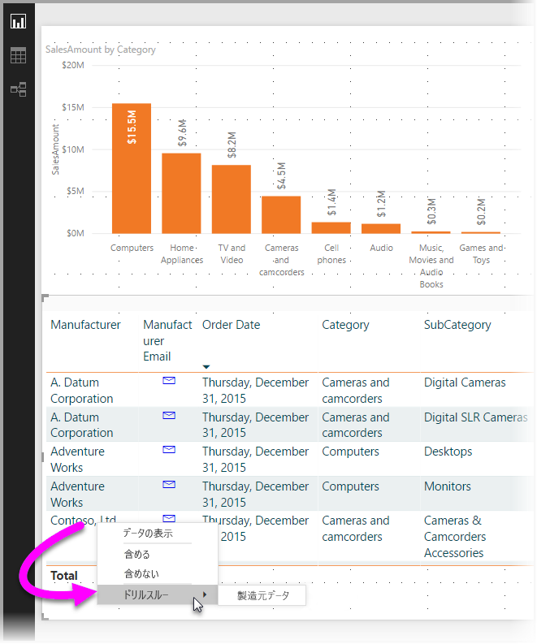
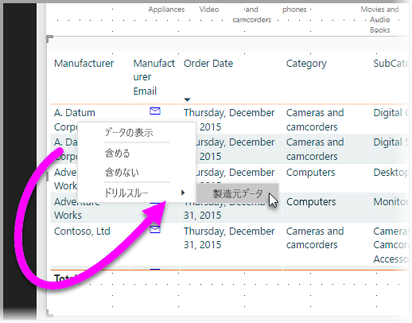
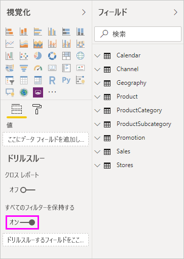

# Power BI Desktop でドリルスルーを使用する
Power BI Desktop の "*ドリルスルー*" を利用すると、サプライヤー、顧客、メーカーなど、特定のエンティティに焦点を置くページをレポートに作成できます。 ドリルスルーを使用するには、他のレポート ページでデータ ポイントを右クリックしてドリルスルーを選択してから、フォーカスされたページまでドリルスルーし、そのコンテキストでフィルター処理された詳細を取得します。

## ドリルスルーを利用する
1. ドリルスルーを使用するには、ドリルスルーを提供するエンティティの種類用のビジュアルを含むレポート ページを作成します。 

    たとえば、製造元にドリルスルーを提供するものとします。 この場合は、売上合計、合計出荷単位、カテゴリ別の売上、地域別の売上などを表示するビジュアルを含むドリルスルー ページを作成します。 そのページにドリルスルーすると、選択した製造元に固有のビジュアルが表示されます。

2. その後、そのドリルスルー ページの **[視覚化]** ウィンドウの **[フィールド]** セクションで、ドリルスルー対象のフィールドを**ドリルスルー フィルター**までドラッグします。

    

    **[ドリルスルー フィルター]** ウェルにフィールドを追加すると、Power BI Desktop によって "*戻る*" ボタン ビジュアルが自動的に作成されます。 そのビジュアルは、発行されたレポートではボタンになります。 Power BI サービスでレポートを表示するユーザーは、このボタンを使用して、元のレポート ページに戻ります。

    

> [!IMPORTANT]
> 同じレポート内のページへのドリルスルーを構成して実行することはできますが、別のレポートのページにドリルスルーすることはできません。  

## [戻る] ボタンに独自の画像を使用する    
 戻るボタンは画像なので、そのビジュアルの画像を任意の画像に置き換えることができます。 置き換えても、レポート ユーザーが元のページに戻ることができる戻るボタンとして機能します。 

戻るボタンに独自の画像を使用するには、次の手順のようにします。

1. **[ホーム]** タブで **[イメージ]** を選択します。 その後、画像を探してドリルスルー ページ上に配置します。

2. ドリルスルー ページで、新しい画像を選択します。 **[形式のイメージ]** ペインで、 **[アクション]** スライダーを **[オン]** に設定し、 **[種類]** を **[戻る]** に設定します。 これで、その画像が [戻る] ボタンとして機能します。

    ![イメージを読み込んで [種類] を [戻る] に設定する](media/desktop-drillthrough/drillthrough_05.png)

    
     ユーザーはレポート内のデータ ポイントを右クリックし、そのページへのドリルスルーをサポートするコンテキスト メニューを表示できるようになります。 

    

    レポート利用者がドリルスルーを選択すると、ページが絞り込まれ、右クリックしたデータ ポイントに関する情報が表示されます。 たとえば、Contoso (製造元) に関するデータ ポイントを右クリックし、ドリルスルーを選択したものとします。 移動先のドリルスルー ページは、Contoso でフィルター処理されます。

## ドリルスルーですべてのフィルターを渡す

適用されているフィルターをすべてドリルスルー ウィンドウに渡すことができます。 たとえば、製品の特定のカテゴリのみを選択し、ビジュアルをそのカテゴリでフィルター処理した状態で、ドリルスルーを選択できます。 すべてのフィルターを適用してドリルスルーを表示できます。

適用されたすべてのフィルターを維持するには、 **[視覚化]** ペインの **[ドリルスルー]** セクションで、 **[すべてのフィルターを保持する]** を **[オン]** に設定します。 

その状態でビジュアルにドリルスルーすると、ソース ビジュアルに一時的なフィルターが適用された結果として、適用されたフィルターを確認できます。 **[視覚化]** ペインの **[ドリルスルー]** セクションでは、これらの一時的なフィルターは斜体で表示されます。 

ツールヒント ページでこれを行うこともできますが、ツールヒントが正常に機能しないため、悪い影響があります。 そのため、ツールヒントで行うことはお勧めしません。

## ドリルスルーにメジャーを追加する

ドリルスルー ウィンドウにすべてのフィルターを渡すだけでなく、ドリルスルー領域にメジャーまたは集計済みの数値列を追加することもできます。 適用するには、ドリルスルー フィールドを **[ドリルスルー]** カードにドラッグします。 

メジャー (または集計済みの数値列) を追加するときに、フィールドがビジュアルの "*値*" 領域で使用されていると、そのページをドリルスルーすることができます。

レポートでドリルスルーを使用する方法は以上です。 ドリルスルー フィルターに選択したエンティティ情報で表示を拡張する優れた方法です。

## 次の手順

次の記事にも興味をもたれるかもしれません。

* [Power BI Desktop でレポート間のドリルスルーを使用する](desktop-cross-report-drill-through.md)
* [Power BI Desktop でスライサーを使用する](visuals/power-bi-visualization-slicers.md)

