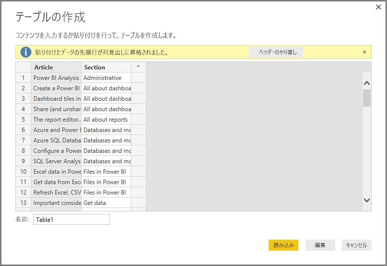
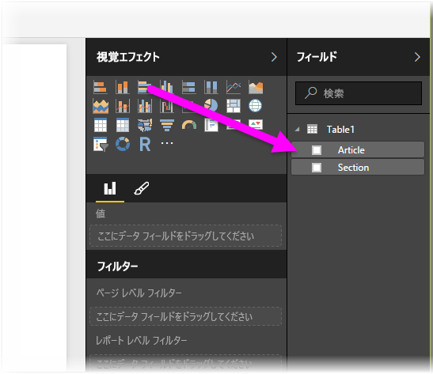

# Power BI Desktop にデータを直接入力する

Power BI Desktop では、データを直接入力して、レポートや表示でそのデータを使用できます。 たとえば、ブックや Web ページの一部をコピーし、Power BI Desktop に貼り付けることができます。

新しいテーブルの形式で Power BI Desktop に直接データを入力するには、 **[ホーム]** リボンの **[データの入力]** を選択します。

![[ホーム] で [データの入力] を選択する](media/desktop-enter-data-directly-into-desktop/enter-data-directly_1.png)

ソースからデータを読み込むときと同じように、必要であれば Power BI Desktop によってデータの小さな変換が行われます。 たとえば、次のケースでは、最初の行がヘッダーに変換されます。

入力または貼り付けたデータを整形する場合は、 **[編集]** を選択して**クエリ エディター**を開きます。 Power BI Desktop で使用する前に、データを整形および変換できます。 表示されているとおりにデータをインポートするには、 **[読み込み]** を選択します。

**[読み込み]** を選択すると、データから新しいテーブルが作成されて、 **[フィールド]** ウィンドウで使用できるようになります。 次の図の Power BI Desktop では、*Table1* という名前の新しいテーブルと、その中に作成された 2 つのフィールドが示されています。

これで完了です。 このように、Power BI Desktop に簡単にデータを入力できます。

これで、Power BI Desktop でデータを使用する準備ができました。 ビジュアルやレポートを作成したり、Excel ブック、データベース、または他のデータ ソースなど、接続してインポートする必要がある他の任意のデータを操作したりできます。

## 次の手順

Power BI Desktop を使用して接続できるデータの種類は他にもあります。 データ ソースの詳細については、次のリソースを参照してください。

* [Power BI Desktop とは何ですか?](desktop-what-is-desktop.md)
* [Power BI Desktop のデータ ソース](desktop-data-sources.md)
* [Power BI Desktop でのデータの整形と結合](desktop-shape-and-combine-data.md)
* [Power BI Desktop で Excel ブックに接続する](desktop-connect-excel.md)
* [Power BI Desktop で CSV ファイルに接続する](desktop-connect-csv.md)
