# Power BI Desktop でのクエリの概要
他のユーザーは、その成果を足場としてビジネス インテリジェンスの成果を拡大することができます。

Power BI Desktop には 3 つのビューがあります。

* **[レポート]** ビュー – ここでは、作成したクエリを使用して説得力のある視覚化を作成し、これを思いどおりに複数のページに配置したり、他のユーザーと共有したりすることができます。
* **[データ]** ビュー – データ モデル形式のレポートにデータを表示します。ここでは、メジャーの追加、新しい列の作成、リレーションシップの管理ができます。
* **[リレーションシップ]** ビュー – データ モデルに確立されたリレーションシップをグラフィカルに表現し、必要に応じて管理または変更できます。

これらのビューにアクセスするには、Power BI Desktop の左側にある 3 つのアイコンのいずれかを選択します。 次の図では、 **[レポート]** ビューが選択されており、これはアイコンの横の黄色の帯によって示されています。  

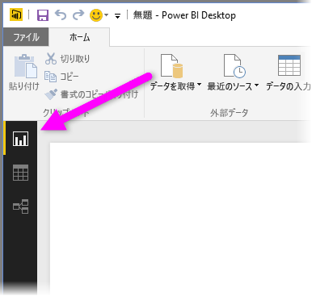

Power BI Desktop には Power Query エディターも付属しています。 Power Query エディターを使用して、1 つまたは多数のデータ ソースに接続し、ニーズを満たすためにデータの整形と変換を行ってから、そのモデルを Power BI Desktop に読み込みます。

このドキュメントでは、Power Query エディターでのデータ操作の概要を説明しますが、さらに学ぶことがあります。 このドキュメントの最後には、サポートされるデータ型に関する詳細なガイダンスへのリンクがあります。 また、データへの接続、データの整形、リレーションシップの作成、および作業の開始方法に関するガイダンスもあります。

しかし、まずは、Power Query エディターに親しむことから始めましょう。

## Power Query エディター
Power Query エディターにアクセスするには、Power BI Desktop の **[ホーム]** タブから **[クエリを編集]** を選びます。  

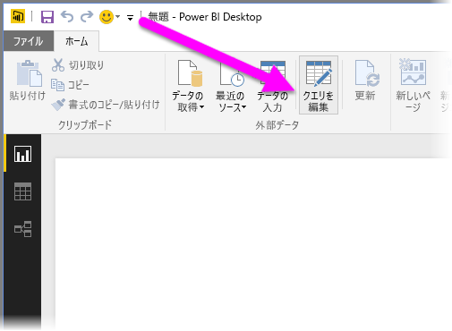

データ接続がない場合、Power Query エディターは空のペインとして、データの準備ができている状態で表示されます。  

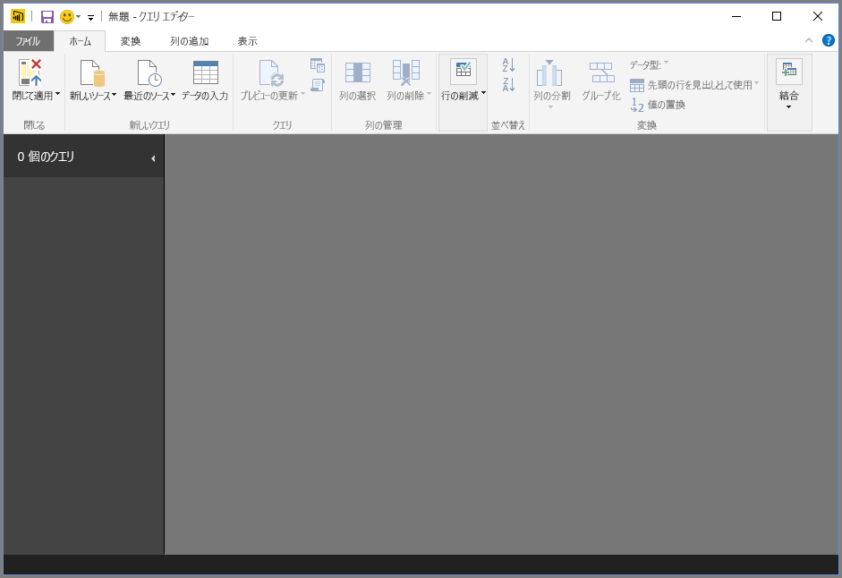

クエリが読み込まれると、Power Query エディター ビューはさらに興味深いものになります。 次の Web データ ソースに接続すると、Power Query エディターでは、データに関する情報が読み込まれ、その整形を開始することができます。

[*https://www.bankrate.com/retirement/best-and-worst-states-for-retirement/*](https://www.bankrate.com/retirement/best-and-worst-states-for-retirement/)

データ接続が確立されると、Power Query エディターがどのように表示されるかを以下に示します。

1. リボンでは、多くのボタンがアクティブになり、クエリ内のデータを操作できるようになりました。
2. 左側のペインでは、クエリが一覧表示され、選択、表示、および整形に使用できます。
3. 中央のペインでは、選択されたクエリのデータが表示され、整形に使用できます。
4. **[クエリの設定]** ペインが表示され、クエリのプロパティと適用される手順が一覧表示されます。  
   
   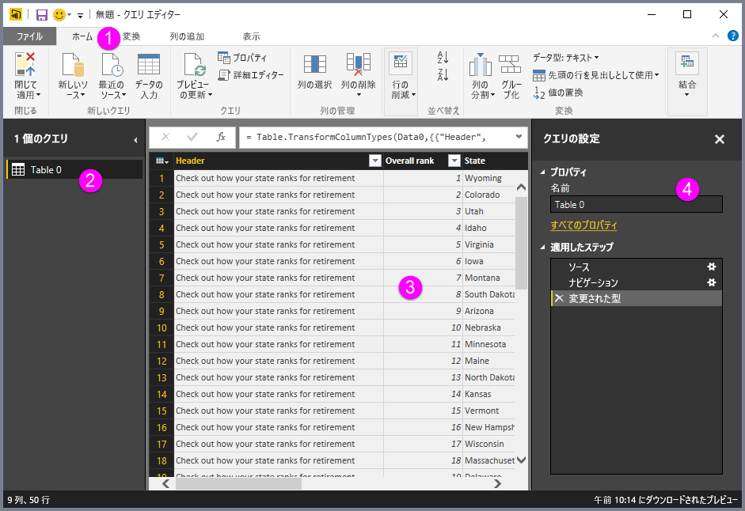

ここでは、これら 4 つの領域 (リボン、[クエリ] ペイン、[データ] ビュー、および [クエリの設定] ペイン) のそれぞれについて見ていきます。

## [クエリ] リボン
Power Query エディターのリボンは、次の 4 つのタブで構成されています: **ホーム**、**変換**、**列の追加**、**表示**。

**[ホーム]** タブには、一般的なクエリ タスクが含まれています。

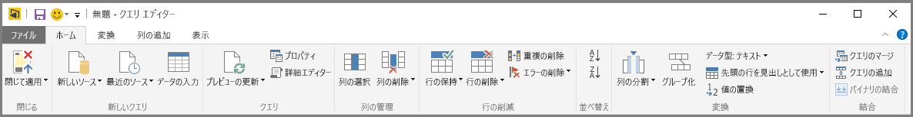

データに接続し、クエリの作成プロセスを開始するには、 **[新しいソース]** を選択します。 最も一般的なデータ ソースが用意されたメニューが表示されます。  

使用できるデータ ソースについて詳しくは、「 **データ ソース**」をご覧ください。 例と手順を含む、データへの接続に関する情報については、「 **データへの接続**」をご覧ください。

**[変換]** タブでは、次のような一般的なデータ変換タスクにアクセスできます。

* 列の追加または削除
* データ型の変更 
* 列の分割 
* その他のデータ ドリブン タスク

例を含む、データの変換の詳細については、「[チュートリアル: Power BI Desktop でのデータの整形と結合](https://docs.microsoft.com/power-bi/desktop-shape-and-combine-data)」を参照してください。

**[列の追加]** タブでは、列の追加、列のデータの書式設定、カスタムの列の追加に関連するその他のタスクが用意されています。 次の図は、 **[列の追加]** タブを示しています。  

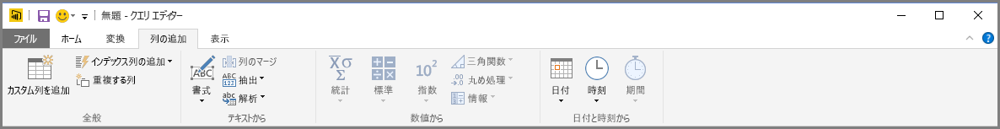

リボンの **[表示]** タブは、特定のペインまたはウィンドウに表示を切り替えるために使用します。 また、詳細設定エディターの表示にも使用します。 次の図は、 **[表示]** タブを示しています。  

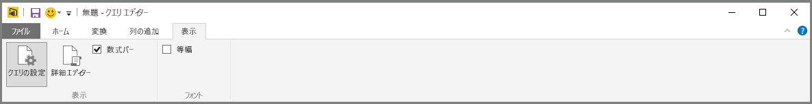

リボンから使用可能なタスクの多くは、中央のウィンドウで列またはその他のデータを右クリックしても使用できることを知っておくと便利です。

## 左側の (クエリ) ペイン
左側のペイン、つまり、 **[クエリ]** ペインには、アクティブなクエリの数とクエリの名前が表示されます。 左側のペインからクエリを選択すると、データが中央のウィンドウに表示されます。ここではニーズに合わせてデータを整形および変換できます。 次の図は、クエリを含む左側のペインを示しています。  

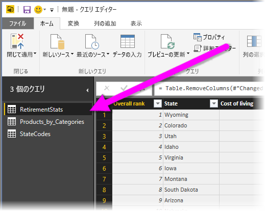

## 中央の (データ) ペイン
中央のペイン、つまり、 **[データ]** ペインには、選択されたクエリのデータが表示されます。 このペインで、 **[クエリ]** ビューの作業の多くが行われます。

次の図には、以前に確立された Web データ接続が示されています。 **Product** 列が選択され、そのヘッダーが右クリックされて使用可能なメニュー項目が表示されています。 なお、右クリックで表示されるこれらのメニューの多くは、[リボン] タブのボタンと同じです。  

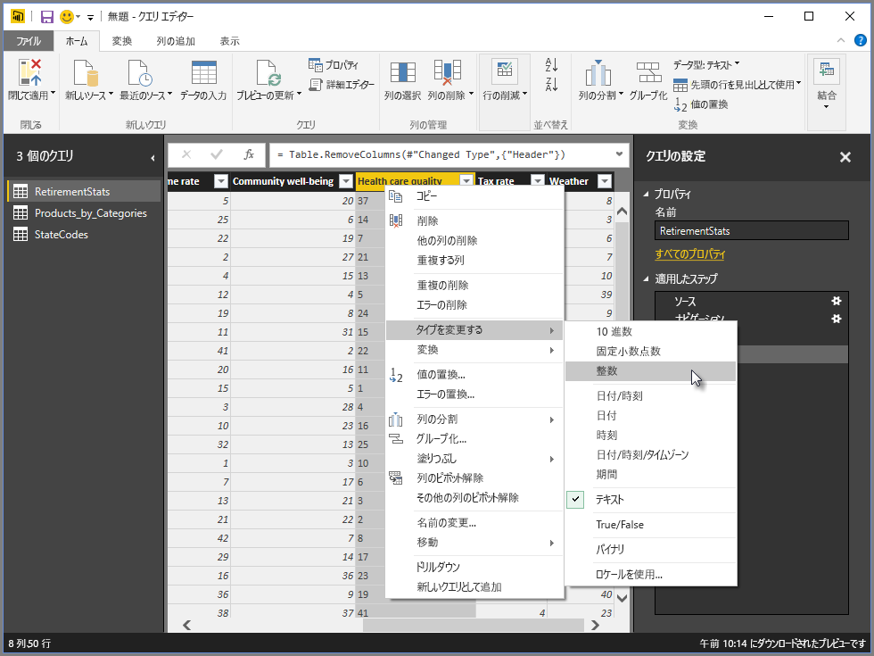

右クリックで表示されるメニュー項目 (またはリボンのボタン) を選択すると、クエリでデータに手順が適用されます。 また、クエリ自体の一部として手順が保存されます。 次のセクションで説明するように、手順は **[クエリの設定]** ウィンドウに順番に記録されます。  

## 右側の (クエリの設定) ペイン
右側のペイン、つまり、 **[クエリの設定]** ペインには、クエリに関連付けられているすべての手順が表示されます。 たとえば、次の図では、 **[クエリの設定]** ウィンドウの **[適用される手順]** セクションで、 **[総得点]** 列の型を変更したことが反映されています。

その他の整形手順は、クエリに適用される際に、 **[適用される手順]** セクションにキャプチャされます。

基になるデータは変更されて "*いない*" ことを理解しておくことが重要です。 つまり、Power Query エディターでは、データのビューを調整および整形します。 また、そのデータの Power Query エディターの整形および変更されたビューに基づいて発生する、基になるデータの操作のビューを整形および調整します。

**[クエリの設定]** ウィンドウで、手順の名前の変更、手順の削除、または手順の順序の変更を適宜行うことができます。 これを行うには、 **[手順の適用]** セクションで手順を右クリックし、表示されるメニューから選びます。 クエリの手順はすべて、 **[手順の適用]** ウィンドウの表示順に実行されます。

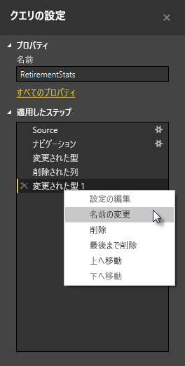

## 詳細エディター
**[詳細エディター]** では、各手順で Power Query エディターによって作成されるコードを確認できます。 また、独自の整形コードを作成することもできます。 詳細設定エディターを起動するには、リボンから **[表示]** をクリックした後、 **[詳細設定エディター]** をクリックします。 既存のクエリのコードを示すウィンドウが表示されます。  

**[詳細設定エディター]** ウィンドウでは直接コードを編集できます。 ウィンドウを閉じるには、 **[完了]** ボタンまたは **[キャンセル]** ボタンを選びます。  

## 作業を保存する
クエリが必要な場所にある場合は、Power Query エディターの **[ファイル]** メニューから **[閉じて適用]** を選択します。 この操作により、変更が適用され、エディターが閉じます。  
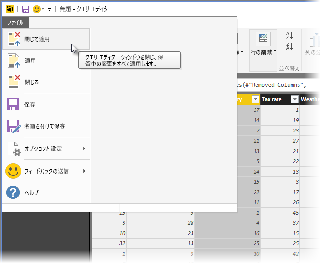

処理が進む間、Power BI Desktop には、その状態を表示するダイアログが開きます。  

準備ができたら、Power BI Desktop で作業内容を *.pbix* ファイル形式で保存できます。

作業内容を保存するには、次の図に示すように、 **[ファイル]** \> **[保存]** (または **[ファイル]** \> **[名前を付けて保存]** ) の順に選択します。  
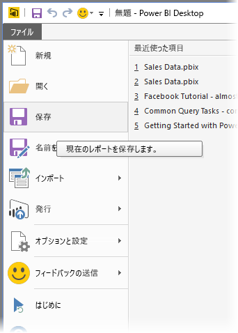

## 次の手順
Power BI Desktop を使用すると、さまざまなことを行えます。 そのような機能について詳しくは、次のリソースをご覧ください。

* [Power BI Desktop とは何ですか?](desktop-what-is-desktop.md)
* [Power BI Desktop のデータ ソース](desktop-data-sources.md)
* [Power BI Desktop でデータに接続する](desktop-connect-to-data.md)
* [チュートリアル: Power BI Desktop でのデータの整形と結合](desktop-shape-and-combine-data.md)
* [Power BI Desktop で一般的なクエリ タスクを実行する](desktop-common-query-tasks.md)   

