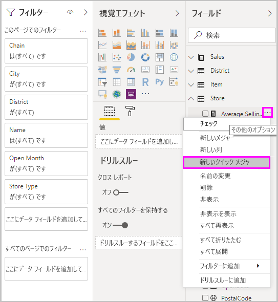
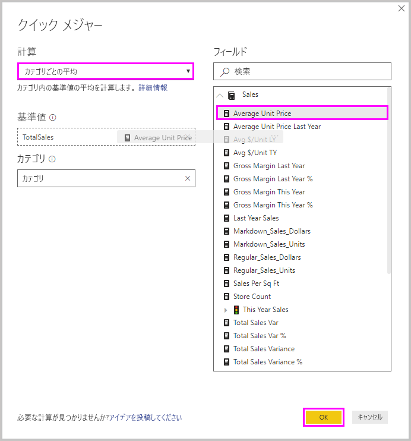
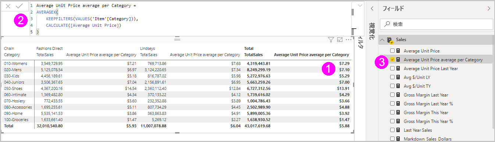
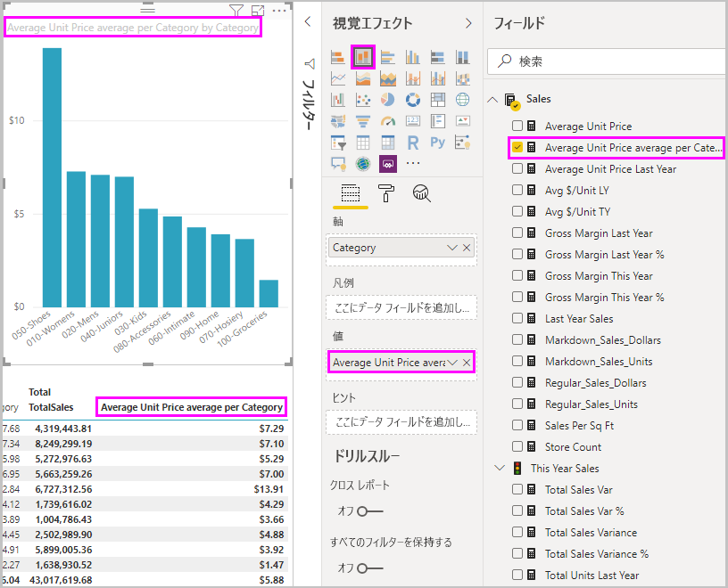

# クイック メジャーを使用して一般的な計算を実行する
*クイック メジャー*を使用し、一般的で強力な計算を簡単に実行できます。 クイック メジャーでは、一連の Data Analysis Expressions (DAX) コマンドがバックグラウンドで実行され、レポートで使用できるように結果が提供されます。 DAX を記述する必要はありません。ダイアログ ボックスで指定した入力に基づいて自動的に作成されます。 計算のカテゴリ、およびニーズに合わせた各計算の変更方法が、数多くあります。 一番の利点はおそらく、クイック メジャーで実行された DAX を参照することで DAX がすぐに始められること、DAX に関する自分の知識を広められることです。

## クイック メジャーを作成する

Power BI Desktop でクイック メジャーを作成するには、 **[フィールド]** ウィンドウの項目の横にある省略記号 **[...]** を右クリックするか選択し、表示されたメニューから **[新しいクイック メジャー]** を選択します。 

既存のビジュアルの **[値]** ウェルに含まれる値の横にあるドロップダウン矢印を右クリックするか選択し、メニューから **[新しいクイック メジャー]** を選択する方法もあります。 

**[新しいクイック メジャー]** を選択すると、 **[クイック メジャー]** ウィンドウが表示され、必要な計算や計算の実行対象にするフィールドを選択できます。 

**[計算を選択してください]** フィールドを選択すると、利用できるクイック メジャーのリスト (長) が表示されます。 

クイックメジャーの 5 種類の計算方法とそれで計算できる内容をまとめると以下のようになります。

* **カテゴリごとの集計**
  * カテゴリごとの平均
  * カテゴリごとの差異
  * カテゴリごとの最大値
  * カテゴリごとの最小値
  * カテゴリごとの加重平均
* **フィルター**
  * フィルターされた値
  * フィルターされた値との差異
  * フィルターされた値に対する差異の比率
  * 初めての顧客からの売上高
* **タイム インテリジェンス**
  * 年度累計
  * 四半期累計
  * 月度累計
  * 前年比の変化
  * 四半期ごとの変化
  * 月ごとの変化
  * 移動平均
* **合計**
  * 累積値
  * カテゴリの合計 (フィルター適用)
  * カテゴリの合計 (フィルター非適用)
* **数学演算**
  * 加算
  * 減算
  * 乗算
  * 除算
  * 差の割合
  * 相関係数
* **テキスト**
  * 星評価
  * 値の連結リスト

今後採用して欲しい新しいクイック メジャーに関するアイデア、土台にする DAX 数式、クイック メジャーに関して検討して欲しいその他のアイデアを投稿する方法については、本記事の最後のセクションをご覧ください。

> [!NOTE]
> SQL Server Analysis Services (SSAS) ライブ接続を使っているときは、一部のクイック メジャーを利用できます。 Power BI Desktop には、接続先の SSAS のバージョンでサポートされているクイック メジャーのみが表示されます。 SSAS ライブ データ ソースに接続しているとき、特定のクイック メジャーが一覧に表示されない場合、それは、そのクイックメジャーの実装に使用される DAX コマンドが、接続先の SSAS のバージョンでサポートされていないことが原因です。

クイック メジャーに使用する計算とフィールドを選択したら、 **[OK]** を選択します。 新しいクイック メジャーが **[フィールド]** ウィンドウに表示され、土台となる DAX 数式が数式バーに表示されます。 

## クイック メジャーの例
実際のクイック メジャーを見てみましょう。

次のマトリックス ビジュアルは、さまざまな製品の売上表です。 各カテゴリの売上合計を含む基本的なテーブルです。

マトリックス ビジュアルが選択されている状態で、 **[値]** ウェルの **[売上合計]** の横にあるドロップダウン矢印を選択し、 **[新しいクイック メジャー]** を選択します。 

**[クイック メジャー]** ウィンドウの **[計算]** の下で **[カテゴリごとの集計]** を選択します。 

**[フィールド]** ウィンドウから **[基準値]** フィールドに **[平均単価]** をドラッグします。 **[カテゴリ]** フィールドは **[カテゴリ]** のままにして **[OK]** を選択します。 

**[OK]** を選択すると、興味深いことがいくつか起こります。

1. マトリックス ビジュアルに、**カテゴリ別に平均単価**を計算する新しい列が与えられます。
   
2. 新しいクイック メジャーの DAX 数式が数式バーに表示されます。 DAX 数式の詳細については、[次のセクション](#learn-dax-by-using-quick-measures)を参照してください。
   
3. **[フィールド]** ウィンドウで新しいクイック メジャーが選択され、強調表示されます。 

新しいクイック メジャーは、それを作成したビジュアルだけでなく、レポート内のすべてのビジュアルで使用できます。 次の画像では、新しいクイック メジャー フィールドを使用して作成された列グラフのクイック ビジュアルを確認できます。

## クイック メジャーを使用して DAX を学習する
クイック メジャーの優れた利点は、メジャーを実装する DAX 数式が表示されることです。 **[フィールド]** ウィンドウでクイック メジャーを選択すると、**数式バー**が表示され、メジャーを実装するために Power BI により作成された DAX 式が示されます。

数式バーでは、メジャーの背後に数式が表示されるだけでなく、おそらくはもっと重要なことですが、DAX 数式の土台となるクイック メジャーの作成方法を確認できます。

年度ごとの計算を行う必要があっても、DAX 式の構成方法がわからない場合を想像してみてください (または、何から手を付ければよいのかわからない場合)。 机に頭を打ちつける代わりに、 **[年度ごとの変化]** 計算を使用してクイック メジャーを作成し、それがビジュアルでどのように表示されるか確認してください。DAX 数式のしくみがわかります。 その後、DAX 数式を直接変更したり、ニーズを満たす同じようなメジャーを作成したりしてみてください。 そばに教師がいるかのように、「これをしたらどうなる?」という質問に対して数クリックで答えが得られます。 

不要なクイック メジャーはモデルからいつでも削除できます。 削除はとても簡単で、メジャーの横にある **[...]** を右クリックするか選択し、 **[削除]** を選択するだけです。 クイック メジャーは名前を変更することもできます。メニューから **[名前の変更]** を選択します。 

## 制限事項と考慮事項
注意すべきいくつかの制限事項と考慮事項があります。

- **[フィールド]** ウィンドウに追加されているクイック メジャーは、レポートのあらゆるビジュアルで使用できます。
- **[フィールド]** リストでメジャーを選択し、数式バーの式を見ることにより、クイック メジャーに関連付けられている DAX をいつでも確認できます。
- クイック メジャーは、モデルを修正できる場合にのみ利用できます。 一部のライブ接続の使用時は利用できません。 SSAS Tabular ライブ接続は前述のようにサポートされています。
- DirectQuery モードで作業しているときは、タイム インテリジェンス クイック メジャーを作成することはできません。 これらのクイック メジャーで使用される DAX 関数では、データ ソースに送信される T-SQL ステートメントに変換されるときに、パフォーマンスに影響があります。

> [!IMPORTANT]
> クイック メジャーの DAX ステートメントでは、引数の区切り記号としてコンマのみ使用されます。 お使いのバージョンの Power BI Desktop の言語でコンマが小数点記号として使用されていると、クイック メジャーは正しく動作しません。

### タイム インテリジェンスとクイック メジャー
タイム インテリジェンス クイック メジャーで独自の日付テーブルを使用できます。 外部の表形式モデルを使用している場合は、[タイムインテリジェンスで使用する目的で [日付テーブルとしてマーク] を指定する](https://docs.microsoft.com/sql/analysis-services/tabular-models/specify-mark-as-date-table-for-use-with-time-intelligence-ssas-tabular)方法に関するページで説明されているように、モデルを作成するときに、そのテーブルのプライマリ日付列が日付テーブルとしてマークされたことを確認します。 独自の日付テーブルをインポートしている場合は、「[Power BI Desktop で日付テーブルを設定し、使用する](desktop-date-tables.md)」で説明されているように、日付テーブルとしてマークします。

### その他の情報と例
まだ提供されていないクイック メジャーについてのアイデアがありますか。 成功しました。 [Power BI Ideas](https://go.microsoft.com/fwlink/?linkid=842906) ページを見て、Power BI Desktop にあれば便利だと思うクイック メジャーに関するあなたのアイデアや DAX 数式を投稿してください。 Microsoft は、今後のリリースでクイック メジャー リストに追加するか検討します。

