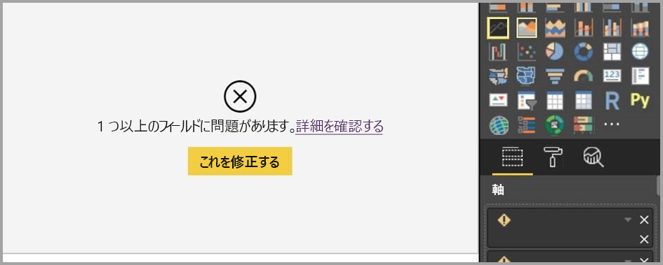

# Power BI Desktop でレポート ビューを操作する

Power BI を操作したことがあるユーザーは、レポートを作成して動的なパースペクティブと情報をデータに与えることがいかに簡単であるかをご存知でしょう。 Power BI では、Power BI Desktop にさらに多くの高度な機能を備えています。 Power BI Desktop を使用すると、高度なクエリの作成、複数のソースからのデータのマッシュアップ、テーブル間のリレーションシップの作成などを行えます。

Power BI Desktop には、視覚化を含む任意の数のレポート ページを作成できる*レポート ビュー*があります。 Power BI Desktop のレポート ビューには、*Power BI サービス*のレポートの編集ビューと同様のデザイン エクスペリエンスが用意されています。 視覚化の移動、コピーと貼り付け、マージなどを行うことができます。

これらの相違点は、Power BI Desktop を使用すると、データのクエリとモデルを操作して、レポートでの最適な分析を支えるデータが確実に得られるようになることです。 その後、Power BI Desktop のファイルは、ローカルのドライブまたはクラウドに関係なく、お好みの場所に保存することができます。

## では、見てみましょう。

最初にデータを Power BI Desktop に読み込むと、キャンバスが空白のレポート ビューが表示されます。

左側のナビゲーション ペインでアイコンを選択すると、**レポート**、**データ**、**リレーションシップ** ビューを切り替えることができます。

一部のデータを追加すると、キャンバスの新しい視覚化にフィールドを追加できます。

視覚化の種類を変更するには、キャンバスで選択し、 **[視覚化]** で新しい種類を選択します。

> [!TIP]
> 必ず複数の視覚化の種類をお試しください。 データの情報を明確に伝える視覚化を使用することが重要です。

レポートは、1 つ以上の空白ページから開始します。 ページは、キャンバスの左側にある [ナビゲーター] ウィンドウに表示されます。 あらゆる種類の視覚化をページに追加できますが、過剰にならないように注意します。 ページに視覚化が多すぎると、込み入った表示になり、適切な情報を見つけにくくなります。 レポートには新しいページを追加することができます。 リボンの **[新しいページ]** をクリックするだけです。

ページを削除するには、レポート ビューの下部にあるページのタブで、 **[X]** をクリックします。

> [!NOTE]
> レポートと視覚化は、Power BI Desktop からダッシュボードにピン留めすることはできません。 そのためには、Power BI サイトに発行する必要があります。 詳細については、「[Power BI Desktop からデータセットとレポートを発行する](desktop-upload-desktop-files.md)」を参照してください。

## レポートのコピーと貼り付け

1 つの Power BI Desktop レポートからビジュアルを取得して、別のレポートに簡単に貼り付けることができます。 Ctrl + C のキーボード ショートカットを使用するだけで、レポートのビジュアルをコピーできます。 他の Power BI Desktop レポートで Ctrl+V キーを使用すると、他のレポートにビジュアルを貼り付けられます。 一度に 1 つのビジュアルを選択するか、またはページ上のすべてのビジュアルを選択してコピーし、コピー先の Power BI Desktop レポートに貼り付けられます。

複数のレポートを頻繁に構築したり更新したりするユーザーにとっては、ビジュアルのコピーと貼り付け機能が便利です。 ファイル間でコピーする場合、書式設定ウィンドウで明示的に設定した設定と書式は持ち越されますが、テーマや既定の設定に依存するビジュアル要素はコピー先レポートのテーマと一致するように自動的に更新されます。 そのため、ビジュアルの書式や外観をうまく設定できたら、うまくいった書式設定をすべて保持したまま、そのビジュアルをコピーして新しいレポートに張り付けることができます。

モデル内のフィールドが異なる場合、ビジュアルに関するエラーと、存在しないフィールドに関する警告が表示されます。 このエラーは、ビジュアルが使用しているモデル内のフィールドを削除するときに表示されるエクスペリエンスに似ています。

エラーを修正するには、ビジュアルを貼り付けたレポート内のモデルの使用したいフィールドで、壊れたフィールドを単純に置き換えます。 カスタム ビジュアルを使用している場合は、コピー先のレポートにもそのカスタム ビジュアルをインポートする必要があります。

## レポート ページを非表示にする

レポートを作成するとき、レポートからページを非表示にすることもできます。 この方法は、レポートで基になるデータやビジュアルを作成する必要があるが、そのページを他のユーザーに見せたくない場合に便利です。他のレポート ページで使用されているテーブルや補助ビジュアルを作成するときなどです。 その他にも、制作上のさまざまな理由から、レポート ページを作成しても、公開するレポートではそれを非表示にすることがあります。

レポート ページは簡単に非表示にできます。 レポート ページ タブを右クリックし、表示されたメニューから **[非表示]** を選択するだけです。

レポート ページを非表示にするとき、注意すべきことがいくつかあります。

* ページのタイトルが淡色表示になっていても、Power BI Desktop の使用中、非表示レポート ページを見ることができます。次の画像ではページ 4 が非表示です。

    

* Power BI サービスでレポートを表示するとき、非表示レポート ページを表示することは "*できません*"。

* レポート ページを非表示にすることは、セキュリティ対策では*ありません*。 ユーザーはこの非表示ページにアクセスできます。ドリルスルーやその他の手段でページのコンテンツにアクセスできます。

* ページが非表示のときは、表示モードでも表示モード ナビゲーションの矢印が表示されません。
