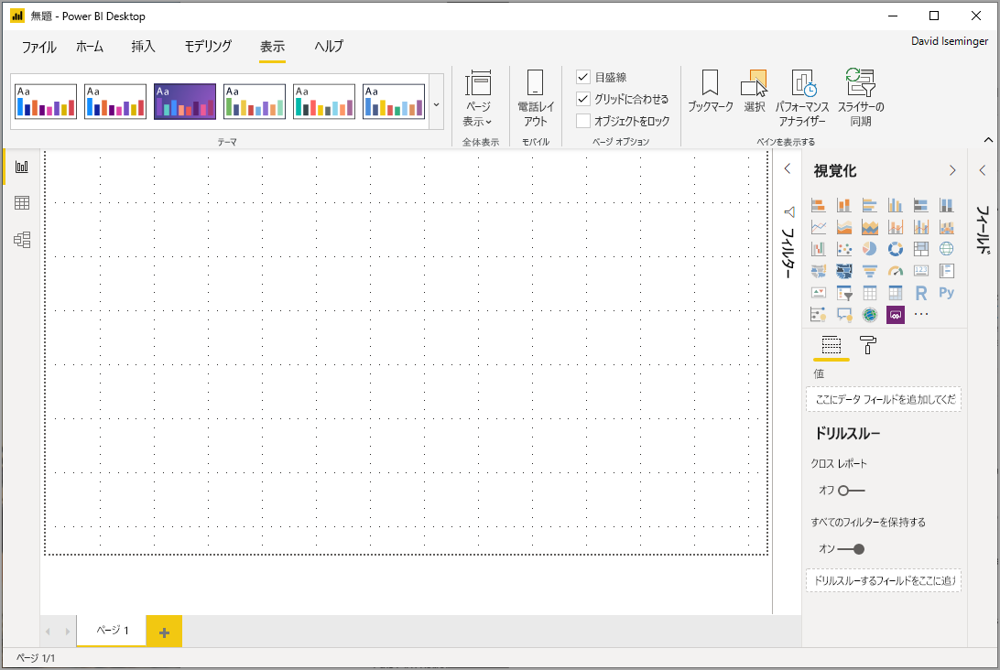
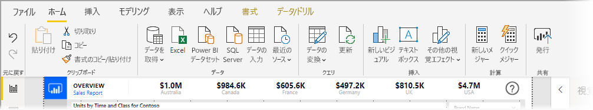
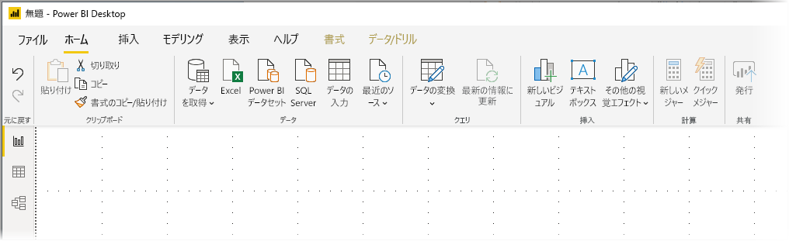
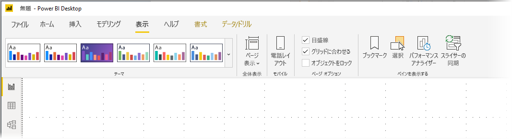

# Power BI Desktop で更新されたリボンを使用する

2020 年 3 月の更新プログラム以降、Power BI Desktop のリボンは、Microsoft Office などの他の Microsoft 製品と外観およびエクスペリエンスを合わせるように改良されています。 更新されたリボンは、2019 年 11 月以降の月次更新でプレビュー機能として表示され、2020 年 3 月の更新プログラム以降、新しいリボンが既定のエクスペリエンスになります。

## 更新されたリボンを有効にする方法

2020 年 3 月の更新プログラム以降、更新されたリボンは既定でオンになっています。 それより前のバージョンの Power BI Desktop (2019 年 11 月の更新プログラム以降) では、Power BI の更新されたリボンはプレビュー機能であり、有効にする必要があります。 こうした以前の更新プログラムでこの機能を有効にするには、 **[ファイル]、[オプションと設定]、[オプション]** の順に選択し、左側の列から **[プレビュー機能]** を選択します。 右ペインに、 **[更新されたリボン]** 選択項目が表示されます。 **[更新されたリボン]** の横にあるチェックボックスをオンにして、プレビュー機能を有効にします。 プレビュー機能の変更を有効にするには、Power BI Desktop を再起動する必要があります。

![Power BI Desktop の [更新されたリボン] オプション](media/desktop-ribbon/desktop-ribbon-01.png)

> [!NOTE]
> 2020 年 3 月以降のバージョンの Power BI Desktop では、更新されたリボンを有効にする必要はありません。これは、2020 年 3 月以降、新しいリボンが既定のエクスペリエンスになったためです。

## 新しいリボンの機能

リボンの更新の利点は、Power BI Desktop のエクスペリエンスをその他の Microsoft 製品と同じように簡単で使いやすくするこを目的としています。 

これらの利点は、次のカテゴリに分類できます。

* **外観、操作感、および編成の向上** - Power BI Desktop の更新されたリボンのアイコンと機能は、Office アプリケーションのリボン項目の外観、操作感、および編成に合わせています。

    

* **直感的なテーマ ギャラリー** - **[ビュー]**  リボンにあるテーマ ギャラリーは、使い慣れた PowerPoint のテーマ ギャラリーの外観になっています。 そのため、リボン内の画像は、テーマがレポートに適用された場合に、色の組み合わせやフォントがどのように変化するかを示しています。 

    

* **ビューに基づく動的なリボンのコンテンツ** - Power BI Desktop の既存のリボンでは、使用できないアイコンまたはコマンドはグレー表示されるだけであり、最適のエクスペリエンスではありませんでした。 更新されたリボンでは、アイコンの表示と配置は動的に実行されるため、コンテキストで使用可能なオプションを常に知ることができます。

* **折りたたむと単一行になるリボンによるスペースの節約** - 更新されたリボンの別の利点は、リボン自体を単一行に折りたたんで、コンテキストに基づいてリボン項目を動的に表示できることです。 

    

* **Keytip でのボタンの移動および選択** - **Alt + Windows キー**を押すと、Keytip をアクティブにしてリボン内を移動することができます。 アクティブになったら、表示されているキーをお使いのキーボードで押して移動できます。

    

* **カスタム書式設定文字列** - カスタム書式設定文字列は、 *[プロパティ]* ペインで設定するだけでなく、リボンで設定することもできます。 カスタマイズするメジャーまたは列を選択すると、ご自分の選択に応じて **[メジャー ツール]** または **[列ツール]** コンテキスト タブが表示されます。 そのタブの [書式設定] セクションのドロップダウン ボックスに、ご自分のカスタム書式指定文字列を直接入力します。

    

* **アクセシビリティ** - タイトル バー、リボン、およびファイル メニューは完全にアクセスできます。 Ctrl + F6 キーを押して、リボン セクションに移動します。 そこに移動したら、**Tab** キーを使用して上部と下部のバーを移動したり、矢印キーを使用した要素間を移動することができます。

これらの目に見える変更に加えて、更新されたリボンによって、今後、以下のような Power BI Desktop とリボンに対する更新を行うことができます。

* ビジュアル ギャラリーなど、より柔軟で直感的なコントロールをリボン内に作成する
* Office テーマの *[黒]* と *[濃い灰色]* を Power BI Desktop に追加する
* アクセシビリティの向上

## 次のステップ
Power BI Desktop を使用して接続できるデータの種類は他にもあります。 データ ソースの詳細については、次のリソースを参照してください。

* [Power BI Desktop とは何ですか?](desktop-what-is-desktop.md)
* [Power BI Desktop のデータ ソース](desktop-data-sources.md)
* [Power BI Desktop でのデータの整形と結合](desktop-shape-and-combine-data.md)
* [Power BI Desktop で Excel ブックに接続する](desktop-connect-excel.md)   
* [Power BI Desktop にデータを直接入力する](desktop-enter-data-directly-into-desktop.md)   

