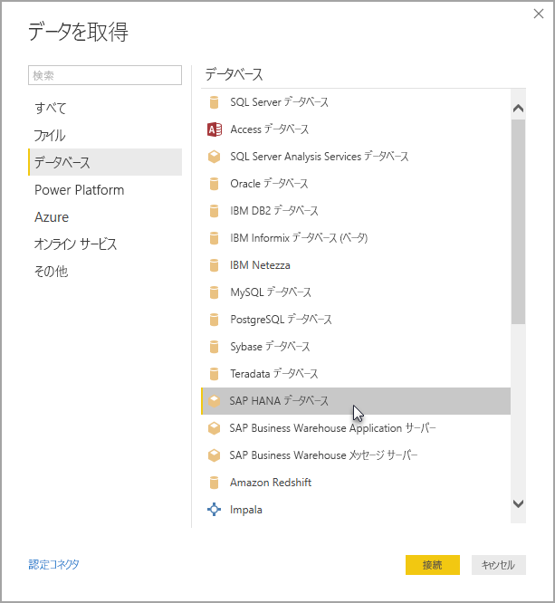

# Power BI Desktop で SAP HANA を使用する
Power BI Desktop を利用し、 **SAP HANA** データベースにアクセスできるようになりました。 **SAP HANA**を使用するには、Power BI Desktop **SAP HANA** データ接続が機能するように、SAP HANA ODBC ドライバーをローカルのクライアント コンピューターにインストールする必要があります。 SAP HANA ODBC ドライバーは、[SAP Software Download Center](https://support.sap.com/swdc) からダウンロードできます。 SAP Software Download Center で、Windows コンピューター用の SAP HANA CLIENT を検索します。 **SAP Software Download Center** は構成が頻繁に変更されるので、サイトのナビゲーションに関する具体的なガイダンスはありません。

**SAP HANA** データベースに接続するには、次の画像のように、 **[データの取得]、[データベース]、[SAP HANA データベース]** の順に選択します。

SAP HANA データベースに接続する場合は、サーバー名を指定します。 次に、ドロップ ダウンと入力ボックスで、ポートを指定します。

このリリースで、[DirectQuery](desktop-directquery-sap-hana.md) モードの **SAP HANA** が Power BI Desktop と Power BI サービスでサポートされるようになりました。DirectQuery モードの **SAP HANA** を使用するレポートを Power BI サービスに公開したり、アップロードしたりできます。 DirectQuery モードで **SAP HANA** を使用しないときも、Power BI サービスにレポートを公開したり、アップロードしたりできます。

## SAP HANA でサポートされる機能
このリリースでは、次の一覧に示すように **SAP HANA**向けに多くの機能が用意されています。

* **SAP HANA** 向け Power BI コネクタでは SAP ODBC ドライバーを使用し、最適なユーザー エクスペリエンスを提供
* **SAP HANA** では DirectQuery およびインポート オプションの両方をサポート
* Power BI では HANA 情報モデル (分析ビューや計算ビューなど) をサポートし、ナビゲーションを最適化
* **SAP HANA** では、ダイレクト SQL 機能を使用して行および列テーブルへの接続も可能
* HANA モデル向けに最適化されたナビゲーションを採用
* Power BI は、 **SAP HANA** の変数および入力パラメーターをサポート
* HDI コンテナー ベースの計算ビュー
  * Power BI Desktop の 2019 年 8 月のリリースでは、HDI コンテナー ベースの計算ビューのサポートは、パブリック プレビュー段階にあります。 Power BI で HDI コンテナー ベースの計算ビューにアクセスするには、Power BI で使用する HANA データベース ユーザーが、アクセスするビューを格納する HDI ランタイム コンテナーにアクセスするアクセス許可を確実に持っているようにします。 このアクセス権を付与するには、ご利用の HDI コンテナーへのアクセスを許可するロールを作成し、Power BI で使用する HANA データベースユーザーにそのロールを割り当てる必要があります (このユーザーには、通常どおり \_SYS\_BI スキーマのシステム テーブルから読み取るためのアクセス許可も必要です)。 データベース ロールを作成して割り当てる方法の詳細な手順については、SAP の公式ドキュメントを参照してください。 [この SAP のブログ記事](https://nam06.safelinks.protection.outlook.com/?url=https%3A%2F%2Fblogs.sap.com%2F2018%2F01%2F24%2Fthe-easy-way-to-make-your-hdi-container-accessible-to-a-classic-database-user%2F&data=02%7C01%7Cv-adbold%40microsoft.com%7Cf7e0a405fe334598ba0608d7096ef5b4%7C72f988bf86f141af91ab2d7cd011db47%7C1%7C0%7C636988244476739316&sdata=PuRu61GPRYp34mLuGbQk6gdbRikdgbxfqo8q1RBQtm0%3D&reserved=0)から始めることも可能です。
  * 現在、HDI ベースの計算ビューに関連付けられている HANA 変数には、いくつかの制限があることに注意してください。 これらの制限は、HANA 側でのエラーによるものであり、SAP HANA の今後のリリースで対処される予定です。 最初に、HDI コンテナー ベースの計算ビューの共有列に HANA 変数を適用することはできません。 この制限は、HANA 2 バージョン 37.02 以降または HANA 2 バージョン 42 以降にアップグレードすることで解決できます。 2 つ目に、現在、変数およびパラメーターに対する複数エントリの既定値は、Power BI UI に表示されません。 これも、SAP HANA のエラーが原因ですが、SAP ではまだ修正が発表されていません。

## SAP HANA の制限
**SAP HANA**を使用する場合、次に示すいくつかの制限があります。

* NVARCHAR 文字列は最大 4,000 文字の Unicode 文字に切り捨てられる
* SMALLDECIMAL はサポートされていない
* VARBINARY はサポートされていない
* 有効な日付は 1899/12/30 から 9999/12/31 まで

## 次の手順
DirectQuery と SAP HANA の詳細については、次のリソースをご覧ください。

* [DirectQuery と SAP HANA](desktop-directquery-sap-hana.md)
* [Power BI の DirectQuery](desktop-directquery-about.md)
* [DirectQuery でサポートされるデータ ソース](desktop-directquery-data-sources.md)
* [SAP HANA の暗号化を有効にする](desktop-sap-hana-encryption.md)

