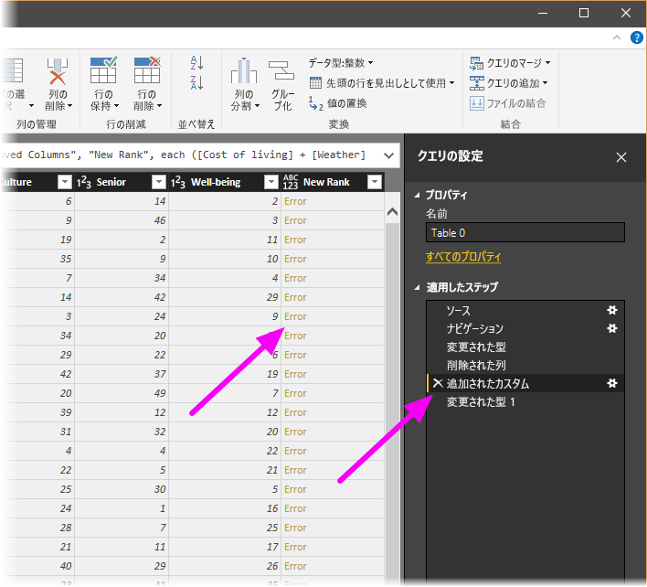
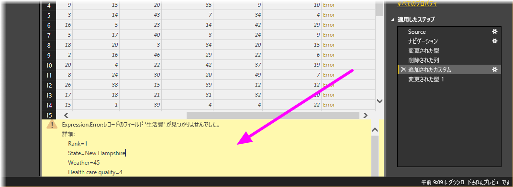
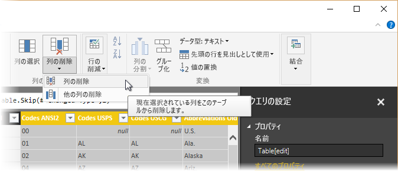
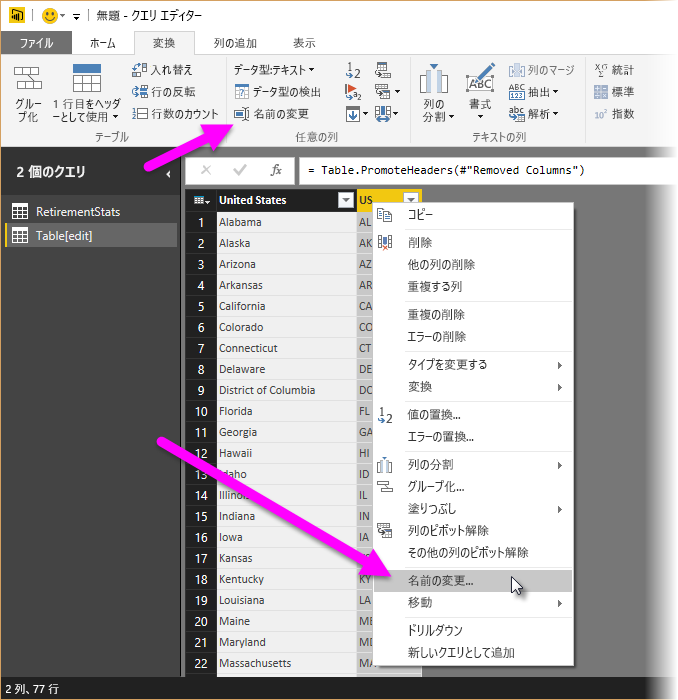

# <a name="tutorial-shape-and-combine-data-in-power-bi-desktop"></a>チュートリアル:Power BI Desktop でのデータの整形と結合

Power BI Desktop を使用すると、さまざまな種類のデータ ソースに接続し、ニーズに合わせてデータを整形し、他のユーザーと共有できるビジュアル レポートを作成できます。 データの "*整形*" とは、データを変換することです。たとえば、列やテーブルの名前を変更したり、テキストを数値に変更したり、行を削除したり、最初の行をヘッダーとして設定したりします。 データの "*結合*" とは、複数のデータ ソースに接続して、必要に応じてそれらを整形してから、便利なクエリに統合することを意味します。

このチュートリアルで学習する内容は次のとおりです。

* クエリ エディターを使用してデータを整形します。
* さまざまなデータ ソースに接続します。
* これらのデータ ソースを結合し、レポートで使用するデータ モデルを作成します。

このチュートリアルでは、最も一般的なタスクに注目しながら、Power BI Desktop を使用したクエリの整形方法を示します。 ここで使用するクエリは、クエリを最初から作成する方法も含めて、「[Power BI Desktop の概要](desktop-getting-started.md)」でより詳しく説明しています。

Power BI Desktop のクエリ エディターでは、右クリック メニューと共に **[変換]** リボンも広く使用します。 そのリボンで選択できるほとんどの項目は、項目 (列など) を右クリックし、表示されるメニューからクリックして使用することもできます。

## <a name="shape-data"></a>データの整形
クエリ エディターでデータを整形するときは、データを読み込んで表示するときにクエリ エディターで行う調整の手順を指示します。 元のデータ ソースが影響を受けることはありません。この特定のデータ表示のみが調整つまり "*整形*" されます。

指定した手順 (テーブル名の変更、データ型の変換、列の削除など) は、クエリ エディターによって記録されます。 このクエリがデータ ソースに接続されるたびに、クエリ エディターによってそれらの手順が実行されて、データは常に指定したとおりに整形されます。 自分がクエリ エディターを使用するたび、または別のユーザーが Power BI サービスなどで共有クエリを使用するときに、このプロセスが実行されます。 これらの手順は、 **[クエリの設定]** ウィンドウの **[適用される手順]** で順番にキャプチャされます。 以下では、これらの各ステップについて説明します。

![[クエリの設定] の [適用したステップ]](media/desktop-shape-and-combine-data/shapecombine_querysettingsfinished2.png)

「[Power BI Desktop の概要](desktop-getting-started.md)」の退職後の生活のデータ (Web データ ソースに接続すると入手できます) を使用して、このデータをニーズに合わせて整形しましょう。 カスタム列を追加して等価の要素であるすべてのデータに基づいてランクを計算し、この列を既存の列 **Rank** と比較します。  

1. **[列の追加]** リボンで、 **[カスタム列]** を選択します。これにより、カスタム列を追加できます。

    ![[カスタム列] を選択する](media/desktop-shape-and-combine-data/shapecombine_customcolumn.png)

1. **[カスタム列]** ウィンドウで、 **[新しい列名]** に「_New Rank_」と入力します。 **[カスタム列の式]** に、次のデータを入力します。

    ```
    ([Cost of living] + [Weather] + [Health care quality] + [Crime] + [Tax] + [Culture] + [Senior] + [#"Well-being"]) / 8
    ```
 
1. ステータス メッセージが "*構文エラーが検出されませんでした*" であることを確認し、 **[OK]** を選択します。

    ![構文エラーのない [カスタム列] ページ](media/desktop-shape-and-combine-data/shapecombine_customcolumndialog.png)

1. 列のデータの一貫性を保つため、新しい列の値を整数に変換します。 変更するには、列ヘッダーを右クリックして、 **[型の変更] \> [整数]** の順に選択します。 

    複数の列を選択する必要がある場合、1 つの列を選択し、**Shift** キーを押したまま追加の隣接する列を選択した後、列ヘッダーを右クリックします。 また、**Ctrl** キーを使用すると、隣接していない列を選ぶこともできます。

    

1. 列のデータ型を "*変換する*" には (現在のデータ型を別のデータ型に変換します)、 **[変換]** リボンから **[データ型: テキスト]** を選択します。 

   ![[データ型: テキスト] を選択する](media/desktop-shape-and-combine-data/queryoverview_transformribbonarrow.png)

1. **[クエリの設定]** の **[適用したステップ]** の一覧に、データに適用したすべての整形手順が反映されます。 整形プロセスからステップを削除するには、ステップの左側にある **[X]** を選択します。 

    次の図では、 **[適用したステップ]** の一覧に、これまでに追加した手順が反映されています。 
     - **[ソース]** : Web サイトへの接続。
     - **[ナビゲーション]** : テーブルの選択。 
     - **[変更された型]** : テキスト ベースの数値列を "*テキスト*" から "*整数*" に変更。 
     - **[追加されたカスタム]** : カスタム列の追加。
     - **[変更された型 1]** : 最後に適用されたステップ。

       ![[適用したステップ] の一覧](media/desktop-shape-and-combine-data/shapecombine_appliedstepsearly2.png)

## <a name="adjust-data"></a>データを調整する

このクエリを処理する前に、データにいくつかの変更を行って調整する必要があります。

   - 列を削除してランキングを調整します。

       **Cost of living** をこの結果の要因にしないことを決定しました。 この列を削除しても、データは変更されないことがわかります。 

   - いくつかのエラーを修正します。

       列を削除したので、**New Rank** 列の計算を再調整する必要があります。式の変更などが必要です。

   - データを並べ替えます。

       **New Rank** 列と **Rank** 列に基づいて、データを並べ替えます。
 
   - データを置き換えます。

       ここでは、特定の値を置き換える方法と、 **[適用したステップ]** を挿入する必要性について特に説明します。

   - テーブル名を変更します。 

       **Table 0** ではテーブルの記述子として不便なので、名前を変更します。

1. **Cost of living** 列を削除するには、列を選択し、リボンの **[ホーム]** タブを選択してから、 **[列の削除]** を選択します。

    ![[列の削除] を選択する](media/desktop-shape-and-combine-data/shapecombine_removecolumnscostofliving.png)

   **New Rank** の値が変わっていないことに注意してください。これはステップの順序によるものです。 クエリ エディターでは手順は順番に記録されますが、互いに独立しているため、順番に並んだ各**適用したステップ**を上下に移動することができます。 

1. ステップを右クリックします。 表示されるメニューでは、次のタスクを行うことができます。 
   - **[名前の変更]** : ステップの名前を変更します。
   - **[削除]** : ステップを削除します。
   - **[最後まで** **削除]** : 現在のステップとそれ以降のすべてのステップを削除します。
   - **[上へ移動]** : 一覧のステップを上に移動します。
   - **[下へ移動]** : 一覧のステップを下に移動します。

1. 最後のステップ **[削除された列]** を **[追加されたカスタム]** ステップのすぐ上に移動します。

   ![[適用したステップ] でステップを上に移動する](media/desktop-shape-and-combine-data/shapecombine_movestep.png)

1. **[追加されたカスタム]** ステップを選択します。 

   データに "_エラー_" が表示されていることに注意してください。これに対処する必要があるます。

   

   各エラーに関する詳細を取得する方法はいくつかあります。 "*エラー*" という語をクリックせずにセルを選択すると、クエリ エディターによってエラー情報がウィンドウの下部に表示されます。

   

   "*エラー*" という単語を選択すると、クエリ エディターによって **[クエリの設定]** ウィンドウに**適用したステップ**が作成され、エラーに関する情報が表示されます。 

1. エラーに関する情報を表示する必要はないため、 **[キャンセル]** を選択ます。

1. エラーを修正するには、**New Rank** 列を選択し、 **[表示]** タブで **[数式バー]** チェック ボックスをオンにして、列のデータ数式を表示します。 

   ![[数式バー] を選択する](media/desktop-shape-and-combine-data/shapecombine_formulabar.png)

1. _Cost of living_ パラメーターを削除し、数式を次のように変更して除数を減らします。 
   ```
    Table.AddColumn(#"Removed Columns", "New Rank", each ([Weather] + [Health care quality] + [Crime] + [Tax] + [Culture] + [Senior] + [#"Well-being"]) / 7)
   ```

1. 数式ボックスの左側にある緑色のチェックマークをオンにするか、**Enter** キーを押します。

  クエリ エディターによってデータが変更された値に置き換えられ、 **[追加されたカスタム]** ステップのエラーがなくなります。

   > [!NOTE]
   > リボンまたは右クリック メニューを使用して **[エラーの削除]** を選択し、エラーのある行を削除することもできます。 ただし、このチュートリアルでは、データをテーブルに保持することにしたため、この操作を行う必要はありませんでした。

1. **New Rank** 列を基にして、データを並べ替えます。 まず、最後に適用されたステップ **[変更された型 1]** を選択して、最新のデータを表示します。 次に、**New Rank** 列見出しの横にあるドロップダウンを選択し、 **[昇順で並べ替え]** を選択します。

   

   データが、**New Rank** に従って並べ替えられます。 ただし、**Rank** 列を見ると、**New Rank** の値が同順の場合にデータが正しく並べ替えられていないことがわかります。 次のステップで修正します。

1. データの並べ替えの問題を修正するには、**New Rank** 列を選択し、**数式バー**の数式を次のように変更します。

   ```
    = Table.Sort(#"Changed Type1",{{"New Rank", Order.Ascending},{"Rank", Order.Ascending}})
   ```

1. 数式ボックスの左側にある緑色のチェックマークをオンにするか、**Enter** キーを押します。 

   行が、**New Rank** と **Rank** の両方に従って並べ替えられました。 さらに、 **[適用される手順]** 一覧のどの位置にある手順でも選択でき、順番のその地点からデータの整形を続行できます。 新しいステップは、現在選択されている**適用したステップ**の直後に自動的に挿入されます。 

1. **[適用したステップ]** で、カスタム列の前のステップを選択します。これは **[削除された列]** ステップです。 ここでは、アリゾナ州の **Weather** ランキングの値を置き換えます。 アリゾナ州の **Weather** ランキングが含まれる適切なセルを右クリックし、 **[値の置換]** を選択します。 現在選択されている**適用したステップ**を確認します。

   ![列の [値の置換] を選択する](media/desktop-shape-and-combine-data/shapecombine_replacevalues2.png)

1. **[挿入]** を選択します。

    ステップを挿入しているので、以降の手順によってクエリが中断する危険があることを示す警告が表示されます。 

    

1. データ値を _51_ に変更します。 

   クエリ エディターにより、アリゾナのデータが置き換えられます。 新しい**適用したステップ**を作成すると、クエリ エディターにより操作に基づいて名前が付けられます (このケースでは **[置き換えられた値]** )。 クエリに同じ名前のステップが複数存在する場合、クエリ エディターでは、それらを区別するために、後続の各**適用したステップ**に対して (順番に) 番号が追加されます。

1. 最後の**適用したステップ**である **[並べ替えられた行]** を選択します。 

   アリゾナ州の新しいランク付けに関するデータが変更されていることに注意してください。 このように変更されるのは、 **[置き換えられた値]** ステップを適切な位置 ( **[追加されたカスタム]** ステップの前) に挿入したためです。

1. 最後に、このテーブルの名前を分かりやすい名前に変更したいと思います。 **[クエリの設定]** ペインの **[プロパティ]** の下にテーブルの新しい名前を入力し、**Enter** キーを押します。 このテーブルには *RetirementStats* という名前を付けます。

   ![[クエリの設定] でテーブルの名前を変更する](media/desktop-shape-and-combine-data/shapecombine_renametable2.png)

   レポートの作成を始めるときは、分かりやすいテーブル名を付けると役立ちます。特に、複数のデータ ソースに接続し、 **[レポート]** ビューの **[フィールド]** ペインにそれらがすべて一覧表示される場合に役立ちます。

   これで、データを必要な範囲で整形できました。 次に、別のデータ ソースに接続し、データを結合しましょう。

## <a name="combine-data"></a>データの結合
さまざまな州に関するこのデータは興味深く、追加の分析作業とクエリの構築に役立ちます。 ただし、1 つ問題があります。ここにあるほとんどのデータでは、州コードの 2 文字の省略形を使用し、州の完全名を使用していません。 何らかの方法により、州名をその省略形に関連付ける必要があります。

幸運にも、ぴったりな別の公共データ ソースがあります。しかし、この退職者テーブルに接続する前に、いくらかの整形を行う必要があります。 データを整形するには、次の手順のようにします。

1. クエリ エディターの **[ホーム]** リボンで、 **[新しいソース] \> [Web]** を選択します。 

2. 州の略称の Web サイトのアドレス *https://en.wikipedia.org/wiki/List_of_U.S._state_abbreviations* を入力し、 **[接続]** を選択します。

   [ナビゲーター] に、Web サイトのコンテンツが表示されます。

    ![[ナビゲーター] ページ](media/desktop-shape-and-combine-data/designer_gsg_usstateabbreviationsnavigator2.png)

1. **Codes and abbreviations** を選択します。 

   > [!TIP]
   > このテーブルのデータを必要に応じて整形するには、かなりの時間がかかります。 次の手順を、より迅速にまたはより簡単に実行する方法はありますか? はい。2 つのテーブル間に *リレーションシップ* を作成し、そのリレーションシップに基づいてデータを整形するという方法があります。 次の手順は、テーブルの操作について学習するのに適しています。ただし、リレーションシップにより、複数のテーブルからのデータをすばやく使用できるようになることを理解してください。
> 
> 

データ整形するには、次の手順のようにします。

1. 先頭の行を削除します。 それは Web ページのテーブルを作成した方法のために作成されたものであり、不要です。 **[ホーム]** リボンで、 **[行の削減] \> [行の削除] \> [上位行の削除]** を選びます。

    ![[上位の行の削除] を選択する](media/desktop-shape-and-combine-data/shapecombine_removetoprows.png)

    **[上位行の削除]** ウィンドウが表示され、削除する行数を指定できます。

    > [!NOTE]
    > Power BI で誤ってテーブル ヘッダーがデータ テーブルの行としてインポートされた場合は、 **[ホーム]** タブまたはリボンの **[変換]** タブから **[先頭の行を見出しとして使用]** を選択してテーブルを修正します。

1. 下位の 26 行を削除します。 これらの行は米国の準州であり、含める必要はありません。 **[ホーム]** リボンで、 **[行の削減] \> [行の削除] \> [下位行の削除]** を選びます。

    ![[下位の行の削除] を選択する](media/desktop-shape-and-combine-data/shapecombine_removebottomrows.png)

1. RetirementStats テーブルには Washington DC の情報がないため、一覧からフィルター処理する必要があります。 **Region Status** ドロップダウンを選択し、**Federal district** の隣にあるチェック ボックスをオフにします。

    

1. 必要のない列をいくつか削除します。 各州と公式の 2 文字の省略形のマッピングのみが必要であるため、次の列は削除できます: **Column1**、**Column3**、**Column4**、**Column6** から **Column11**。 まず **Column1** を選択し、**Ctrl** キー を押したまま削除する他の列をクリックします。 リボンの **[ホーム]** タブで、 **[列の削除] \> [列の削除]** を選択します。

   

   > [!NOTE]
   > ここで、クエリ エディターにおいて適用される手順の*順番*は重要であり、データの整形方法に影響を与えることを指摘しておきます。 また、1 つの手順がこれ以降の別の手順にどのような影響を与える可能性があるかを検討することも重要です。適用される手順から手順を削除すると、クエリの手順の順番による影響のため、これ以降のステップは最初に意図したとおりに動作しない可能性があります。

   > [!NOTE]
   > クエリ エディター ウィンドウのサイズを変更して幅を狭くすると、表示スペースを最大限利用するようにリボン項目の一部が小さくなります。 クエリ エディター ウィンドウの幅を広げると、広くなったリボン領域を最大限活用するようにリボン項目が拡大されます。

1. 列とテーブルの名前を変更します。 列の名前を変更するには、いくつかの方法があります。まず、列を選択し、リボンの **[変換]** タブで **[名前の変更]** を選択するか、右クリックして **[名前の変更]** を選択します。 次の図では両方のオプションに矢印が付いていますが、選択するのは一方だけです。

   

1. 列の名前を、*State Name* および *State Code* に変更します。 テーブルの名前を変更するには、 **[クエリの設定]** ペインの **[名前]** に入力します。 このテーブルの名前は *StateCodes* にします。

## <a name="combine-queries"></a>クエリを結合する

StateCodes テーブルを希望どおりに整形したので、これら 2 つのテーブルつまりクエリを 1 つに結合してみましょう。 現在のテーブルはデータに適用したクエリの結果であるため、多くの場合、"*クエリ*" と呼ばれます。

クエリの結合には、"*マージ*" と "*追加*" という主な 2 つの方法があります。

- 別のクエリに追加する 1 つ以上の列がある場合は、クエリを *マージ* します。 
- 既存のクエリに追加するデータの追加の行がある場合は、クエリを *追加* します。

ここではクエリをマージします。 これを行うには、次の手順に従います。
 
1. クエリ エディターの左側のペインで、他のクエリを "*その中に*" マージするクエリを選択します。 この例では **RetirementStats** です。 

1. リボンの **[ホーム]** タブから **[結合] \> [クエリのマージ]** を選択します。

   ![[クエリのマージ] を選択する](media/desktop-shape-and-combine-data/shapecombine_mergequeries.png)

   転送対象外のデータを含めたり転送したりせずにデータを結合するため、プライバシー レベルを設定するように求められます。

   **[マージ]** ウィンドウが表示されます。 選択したテーブルにマージするテーブルの選択と、マージに使用する一致する列の選択を求めるメッセージが表示されます。 

1. RetirementStats テーブルから **State** を選択し、**StateCodes** クエリを選択します。 

   一致する正しい列を選択すると、 **[OK]** ボタンが有効になります。

   ![[マージ] ウィンドウ](media/desktop-shape-and-combine-data/shapecombine_merge2.png)

1. **[OK]** を選択します。

   クエリ エディターで、クエリの末尾に **NewColumn** 列が作成されます。この列には、既存のクエリとマージされたテーブル (クエリ) の内容が格納されます。 マージされたクエリのすべての列が **NewColumn** に凝縮されますが、テーブルを **[展開]** し、必要な列をどれでも含めることができます。

   

1. マージされたテーブルを展開して含める列を選択するには、展開アイコンを選択します ()。 

   **[展開]** ウィンドウが表示されます。

   

1. この例では、**State Code** 列のみが必要です。 その列を選択し、 **[元の列名をプレフィックスとして使用します]** をオフにして、 **[OK]** を選択します。

   **[元の列名をプレフィックスとして使用します]** チェック ボックスをオンのままにした場合は、マージされた列の名前が **NewColumn.State Code** になります。

   > [!NOTE]
   > NewColumn テーブルを取り込む方法を調べてみたいですか。 少し実験してみてください。結果に満足できない場合は、 **[クエリの設定]** ウィンドウの **[適用される手順]** の一覧からその手順を削除してください。クエリは、 **[展開]** の手順を適用する前の状態に戻ります。 展開プロセスが希望どおりになるまで、何回でも好きなだけ実行できます。

   2 つのデータ ソースを結合した 1 つのクエリ (テーブル) ができました。それぞれがニーズに合わせて整形されています。 このクエリは、いずれかの州の住宅費の統計、人口統計、または求人情報など、その他の多くの興味深いデータ接続の基礎となっています。

1. 変更を適用し、クエリ エディターを閉じるには、 **[ホーム]** リボン タブから **[閉じて適用]** を選択します。 

   変換されたデータセットが Power BI Desktop に表示されます。レポートの作成に利用できます。

   ![[閉じて適用] を選択する](media/desktop-shape-and-combine-data/shapecombine_closeandapply.png)

## <a name="next-steps"></a>次の手順
Power BI Desktop とその機能について詳しくは、次のリソースを参照してください。

* [Power BI Desktop とは何ですか?](desktop-what-is-desktop.md)
* [Power BI Desktop でのクエリの概要](desktop-query-overview.md)
* [Power BI Desktop のデータ ソース](desktop-data-sources.md)
* [Power BI Desktop でデータに接続する](desktop-connect-to-data.md)
* [Power BI Desktop での一般的なクエリ タスク](desktop-common-query-tasks.md)   

