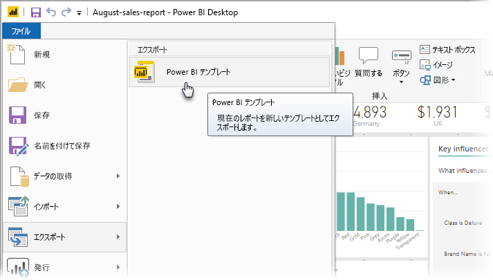
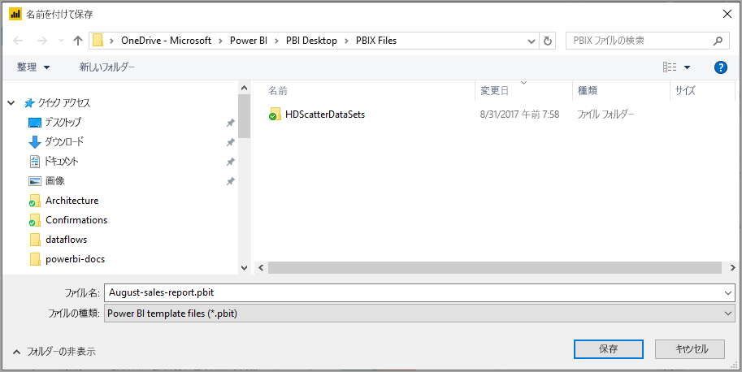
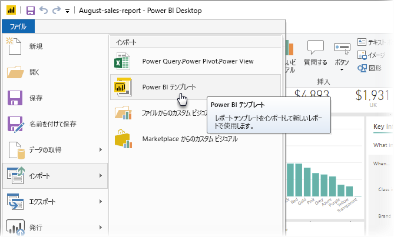

# Power BI Desktop でのテンプレートの使用

**Power BI Desktop** を使用すると、分析情報を組織全体で共有する説得力のあるレポートを作成できます。 Power BI Desktop **テンプレート**を使用すると、既存のテンプレートに基づいてレポート テンプレートを作成することによって作業を効率化することができ、組織内のご自身も他のユーザーもそれを新しいレポートのレイアウト、データ モデル、およびクエリの出発点として使用することができます。 **Power BI Desktop** のテンプレートは、レポートの作成をすぐに開始し、標準化するのに役立ちます。

## テンプレートの作成

Power BI レポート テンプレートには、生成元のレポートからの次の情報が含まれています。

* レポートの**ページ**、ビジュアル、およびその他のビジュアル要素
* スキーマ、リレーションシップ、メジャー、およびその他のモデル定義の成果物を含む、**データ モデル定義**
* クエリ、クエリ パラメーター、その他のクエリ要素など、すべての**クエリ定義**

テンプレートに含まれて "*いない*" ものは、レポートのデータです。 

レポート テンプレートでは、ファイル拡張子 .PBIT が使用されます (これに対して、Power BI Desktop レポートで使用されるファイル拡張子は .PBIX です)。 

レポート テンプレートを作成するには、メニューから **[ファイル] > [エクスポート] > [Power BI テンプレート]** の順に選択します。これにより、次のウィンドウが表示され、テンプレートの説明を入力するように求められます。 この例では、テンプレートの説明は "*毎月の売上レポート テンプレート*" です。

**[OK]** を選択すると、.PBIT テンプレート ファイルを格納するファイルの場所を指定するように求められます。

これで、指定したファイルの場所に、Power BI レポート テンプレートが作成されます。ファイル拡張子は .PBIT です。

> [!NOTE]
> Power BI レポート テンプレート ファイルは、通常、Power BI Desktop レポートよりもかなり小さくなります。これはテンプレートにはデータが含まれず、レポート定義そのものが含まれるだけだからです。 

## テンプレートの使用

Power BI レポート テンプレートを使用するには、Power BI Desktop 内で開いて、使用を開始するだけです。 Power BI レポート テンプレートは、次の 2 つの方法で開くことができます。

* 任意の .PBIT ファイルをダブルクリックすると、自動的に Power BI Desktop が起動され、テンプレートが読み込まれます
* Power BI Desktop 内で **[ファイル] > [インポート] > [Power BI テンプレート]** の順に選択します

レポート テンプレートを開くと、そのテンプレートの基になっているレポート内に定義されているパラメーターの値がダイアログに表示されます。 たとえば、レポートで国または地域に基づいて顧客が分析され、顧客ベースを指定する "*Country*" パラメーターがある場合、パラメーターを定義する際に指定した値の一覧から "*Country*" 値を選択するよう求めるプロンプトが表示されます。 

必須のパラメーターを指定すると、レポートに関連付けられている基になるデータの場所を入力するように求められます。 現在のレポート作成者は、資格情報に基づいてデータに接続できるようになります。

パラメーターとデータを指定すると、このテンプレートの基になっているレポートの一部であったページ、ビジュアル、データ モデルの成果物、およびクエリをすべて含むレポートが作成されます。 

これで完了です。 Power BI Desktop でレポート テンプレートの作成および使用が簡単にできるため、説得力のあるレイアウトやその他のレポートの要素を簡単に再現し、他のユーザーと共有することができます。

## 次の手順
**クエリ パラメーター**の学習についても関心がありますか。
* [Power BI Desktop でクエリ パラメーターを使用する](https://docs.microsoft.com/power-query/power-query-query-parameters)

さらに、Power BI Desktop を使用すると、さまざまなことを行えます。 そのような機能について詳しくは、次のリソースをご覧ください。

* [Power BI Desktop とは何ですか?](desktop-what-is-desktop.md)
* [Power BI Desktop でのクエリの概要](desktop-query-overview.md)
* [Power BI Desktop でのデータ型](desktop-data-types.md)
* [Power BI Desktop でのデータの整形と結合](desktop-shape-and-combine-data.md)
* [Power BI Desktop での一般的なクエリ タスク](desktop-common-query-tasks.md)    
