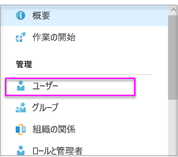
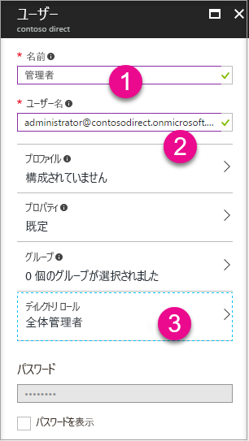

# Power BI で使用する Azure Active Directory テナントを作成する

[Power BI REST API](rest-api-reference.md) を呼び出すカスタム アプリケーション用に新しい Azure Active Directory (Azure AD) テナントを作成する方法を説明します。

テナントは、Azure Active Directory 内の組織を表します。 これは、組織が Azure、Microsoft Intune、Office 365 などの Microsoft のクラウド サービスにサインアップする際に、受け取って所有する Azure AD サービスの専用インスタンスです。 各 Azure AD テナントは独立しており、他の Azure AD テナントとは切り離されています。

Azure AD テナントを作成すると、アプリケーションを定義して、それにアクセス許可を割り当てて、[Power BI REST API](rest-api-reference.md) を呼び出せるようにすることができます。

組織にはアプリケーションに使用できる Azure AD テナントが既にある場合があります。 アプリケーション専用の新しいテナントを作成することもできます。 この記事では、新しいテナントを作成する方法を説明します。

## Azure Active Directory テナントを作成する

カスタム アプリケーションに Power BI を統合するには、Azure AD 内で、Azure AD ディレクトリを必要とするアプリケーションを定義する必要があります。 このディレクトリが、*テナント*です。 組織で Power BI または Office 365 を使用していないためにまだテナントがない場合は、[開発環境を設定する必要があります](https://docs.microsoft.com/azure/active-directory/develop/active-directory-howto-tenant)。 また、アプリケーションを組織のテナントと混在させたくない場合にも、テナントを作成して、分離させる必要があります。 または、テスト目的でテナントを作成することもできます。

新しい Azure AD テナントを作成するには:

1. [Azure Portal](https://portal.azure.com) を参照し、Azure サブスクリプションを持つアカウントを使用してサインインします。

2. **プラスのアイコン (+)** を選択し、**Azure Active Directory** を検索します。

    

3. 検索結果で **Azure Active Directory** を選択します。

    

4. **[作成]** を選択します。

5. **組織の名前**と**初期ドメイン名**を指定します。 **[作成]** を選択します。 ディレクトリが作成されます。

    

   > [!NOTE]
   > 初期ドメインは、onmicrosoft.com の一部になります。 他のドメイン名は、後で追加することができます。 テナントのディレクトリには、複数のドメインを割り当てることができます。

6. ディレクトリの作成が完了したら、新しいディレクトリを管理する情報ボックスを選択します。

次に、テナントのユーザーを追加します。

## Azure Active Directory テナントのユーザーを作成する

ディレクトリができたので、少なくとも 2 人のユーザーを作成してみましょう。 1 人はテナントのグローバル管理者となり、もう 1 人は埋め込み用のマスター ユーザーとなります。 後者はサービス アカウントとして考えることができます。

1. Azure portal で Azure Active Directory のフライアウトが表示されていることを確認します。

    

    そうでない場合は、左側のサービス ナビゲーションから Azure Active Directory アイコンを選択します。

    

2. **[管理]** で、 **[ユーザー]** を選択します。

    

3. **[すべてのユーザー]** 、 **[+ 新しいユーザー]** の順に選択します。

4. テナントのグローバル管理者の **[名前]** と **[ユーザー名]** を指定します。 **[ディレクトリ ロール]** を **[グローバル管理者]** に変更します。 また、一時パスワードを表示することもできます。 完了したら、 **[作成]** を選択します。

    

5. 通常のテナント ユーザーに対して同じ操作を行います。 このアカウントは、マスター埋め込みアカウントに使用できます。 今回は、 **[ディレクトリ ロール]** は **[ユーザー]** のままにします。 パスワードをメモし、 **[作成]** を選択します。

    

6. 手順 5 で作成したユーザー アカウントで Power BI にサインアップします。 [powerbi.com](https://powerbi.microsoft.com/get-started/) に移動し、 **[Power BI - クラウド コラボレーションおよび共有]** の下で **[無料試用版]** を選択します。

    

    サインアップすると、Power BI Pro の 60 日間の無料体験を勧められます。 それを選択して Pro ユーザーになることができます。それにより、[埋め込みソリューションの開発を開始する](embedding-content.md)オプションが表示されます。

   > [!NOTE]
   > ユーザー アカウントの電子メール アドレスでサインアップしてください。

## 次の手順

これで、Azure AD テナントが作成されたので、このテナントを使用して、Power BI 内の項目をテストできます。 また、Power BI ダッシュボードやレポートをアプリケーションに埋め込むこともできます。 詳細については、[Power BI ダッシュボード、レポート、およびタイルを埋め込む方法](embedding-content.md)に関するページを参照してください。

[Azure Active directory とは](https://docs.microsoft.com/azure/active-directory/active-directory-whatis) 
 
[クイック スタート:開発環境の設定](https://docs.microsoft.com/azure/active-directory/develop/active-directory-howto-tenant)  

他にわからないことがある場合は、 [Power BI コミュニティで質問してみてください](http://community.powerbi.com/)。
