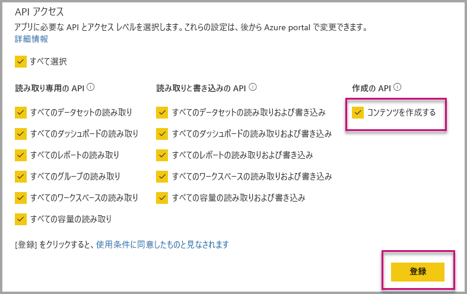

# 組織向けの埋め込みのときに Power BI アプリを自動インストールする

アプリからコンテンツを埋め込むには、埋め込みを行うユーザーが[そのアプリにアクセス](../service-create-distribute-apps.md)できる必要があります。 そのユーザー向けにアプリがインストールされている場合、埋め込みはスムーズに行われます。 詳細については、「[アプリからレポートやダッシュボードを埋め込む](embed-from-apps.md)」を参照してください。 すべてのアプリが[自動的にインストール](https://powerbi.microsoft.com/blog/automatically-install-apps/)されるように PowerBI.com で定義することはできます。 ただし、このアクションはテナント レベルで行われ、すべてのアプリに適用されます。

## 埋め込み時にアプリを自動インストールする

ユーザーがアプリにアクセスできる場合でも、アプリがインストールされていなければ、埋め込みは失敗します。 アプリからの埋め込み時にこのようなエラーを回避するため、埋め込み時にアプリの自動インストールを許可することができます。 このアクションは、ユーザーが埋め込もうとしているアプリがインストールされていない場合、ユーザーに代わって自動的にインストールされるということを意味します。 そのため、必要なコンテンツがすぐに埋め込まれ、ユーザーにスムーズなエクスペリエンスが提供されることになります。

## Power BI ユーザー向けに埋め込む (ユーザーがデータを所有)

ユーザーにアプリの自動インストールを許可するには、[アプリケーションの登録](register-app.md#register-with-the-power-bi-application-registration-tool)時に 'コンテンツの作成' アクセス許可をアプリケーションに付与するか、アプリを登録済みの場合は追加する必要があります。

次に、埋め込み URL にアプリ ID を指定する必要があります。 アプリ ID を指定するには、アプリの作成者はまずアプリをインストールし、サポートされている [Power BI Rest API](https://docs.microsoft.com/rest/api/power-bi/) 呼び出し ([レポートの取得](https://docs.microsoft.com/rest/api/power-bi/reports/getreports)または[ダッシュボードの取得](https://docs.microsoft.com/rest/api/power-bi/dashboards/getdashboards)) のいずれか 1 つを使用する必要があります。 その後アプリの作成者は REST API 応答から埋め込み URL を取得する必要があります。 コンテンツがアプリからのものである場合、アプリ ID は URL 内に含まれています。  埋め込み URL の取得後は、定期的な埋め込みに使用できます。

## 安全な埋め込み

アプリの自動インストールを使用するには、アプリの作成者はまずアプリをインストールし、PowerBI.com 上のそのアプリに移動し、レポートを表示して、通常の方法でリンクを取得する必要があります。 そのリンクを使用可能なアプリにアクセスできる他のすべてのユーザーは、そのレポートを埋め込むことができます。

## 考慮事項と制限事項

* レポートとダッシュボードの埋め込みは、このシナリオでのみ実行できます。

* アプリが所有するデータと SharePoint の埋め込みシナリオでは、この機能は現在サポートされていません。