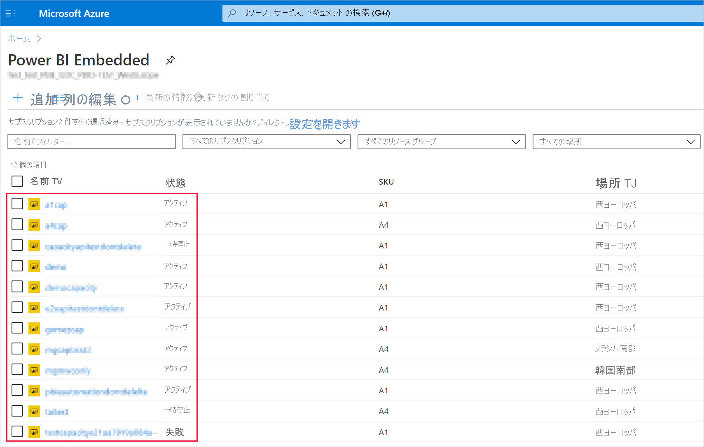
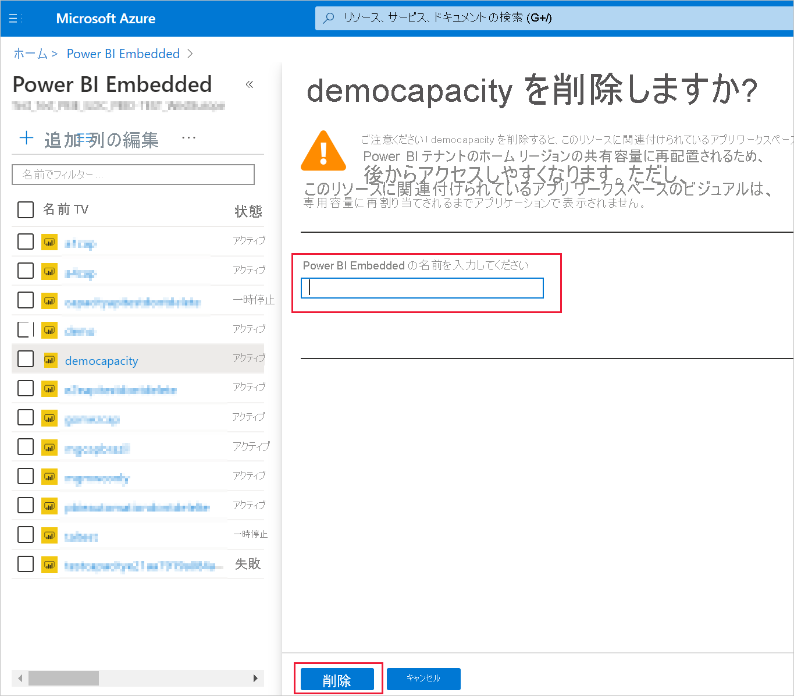

# <a name="create-power-bi-embedded-capacity-in-the-azure-portal"></a>Azure Portal での Power BI Embedded 容量の作成

この記事では、Microsoft Azure で [Power BI Embedded](azure-pbie-what-is-power-bi-embedded.md) の容量を作成する方法について説明します。 Power BI Embedded では Power BI の各種機能がシンプルになりました。目を見張るようなビジュアル、レポート、ダッシュボードをアプリに簡単に追加できます。

## <a name="before-you-begin"></a>始める前に

このクイック スタートを完了するには、以下が必要です。

* **Azure サブスクリプション:** [Azure 無料試用版](https://azure.microsoft.com/free/)にアクセスし、アカウントを作成してください。

* **Azure Active Directory:** お使いのサブスクリプションは Azure Active Directory (Azure AD) テナントに関連付けられている必要があります。 また、***そのテナントのアカウントで Azure にサインインする必要があります***。 Microsoft アカウントはサポートされていません。 詳細については、「[認証とユーザーのアクセス許可](/azure/analysis-services/analysis-services-manage-users)」を参照してください。

* **Power BI テナント:** ご利用の Azure AD テナントの少なくとも 1 つのアカウントを Power BI に登録しておく必要があります。

* **リソース グループ:** 既にあるリソース グループを使用するか、[新しく作成](/azure/azure-resource-manager/resource-group-overview)します。

## <a name="create-a-capacity"></a>容量を作成する

Power BI Embedded 容量を作成する前に、少なくとも一度、Power BI にサインインしてください。

# <a name="portal"></a>[ポータル](#tab/portal)

1. [Azure Portal](https://portal.azure.com/) にサインインします。

2. 検索ボックスで *Power BI Embedded* を検索します。

3. Power BI Embedded 内で **[追加]** を選択します。

4. 必須情報を入力し、 **[確認および作成]** を選択します。

    ![スクリーンショットには、Azure portal で新しい容量を作成するための、Power BI Embedded ページの [基本] タブが示されています。](media/azure-pbie-create-capacity/azure-create-capacity.png)

    * **サブスクリプション** - 容量を作成するサブスクリプション。

    * **リソース グループ** - この新しい容量が含まれるリソース グループ。 既存のリソース グループから選択するか、新しく作成します。 詳細については、「[Azure Resource Manager の概要](/azure/azure-resource-manager/resource-group-overview)」を参照してください。

    * **リソース名** - 容量のリソース名。

    * **場所** - お使いのテナントの Power BI がホストされている場所。 既定の場所はホーム領域ですが、[Multi-Geo オプション](embedded-multi-geo.md)を使用して場所を変更できます。

    * **サイズ** - 必要な [A SKU](../../admin/service-admin-premium-purchase.md#purchase-a-skus-for-testing-and-other-scenarios)。 詳細については、「[SKU のメモリとコンピューティング能力](./embedded-capacity.md)」を参照してください。

    * **Power BI 容量管理者** - 容量の管理者。
        >[!NOTE]
        >* 既定では、容量管理者は容量を作成するユーザーです。
        >* 別のユーザーまたはサービス プリンシパルを容量管理者として選択できます。
        >* 容量管理者は、容量がプロビジョニングされるテナントに属する必要があります。 企業間 (B2B) ユーザーを容量管理者にすることはできません。

# <a name="azure-cli"></a>[Azure CLI](#tab/CLI)

### <a name="use-azure-cloud-shell"></a>Azure Cloud Shell を使用する

Azure では、ブラウザーを介して使用できる対話型のシェル環境、Azure Cloud Shell がホストされています。 Cloud Shell で Bash または PowerShell を使用して、Azure サービスを操作できます。 ローカル環境に何もインストールしなくても、Cloud Shell にプレインストールされているコマンドを使用して、この記事のコードを実行できます。

Azure Cloud Shell を開始するには:

| オプション | 例とリンク |
|-----------------------------------------------|---|
| コード ブロックの右上隅にある **[使ってみる]** を選択します。 **[使ってみる]** を選択しても、コードは Cloud Shell に自動的にコピーされません。 | ![Azure Cloud Shell の [使ってみる] の例](./media/azure-pbie-create-capacity/azure-cli-try-it.png) |
| [https://shell.azure.com](https://shell.azure.com) に移動するか、 **[Cloud Shell を起動する]** ボタンを選択して、ブラウザーで Cloud Shell を開きます。 | [](https://shell.azure.com) |
| [Azure portal](https://portal.azure.com) の右上にあるメニュー バーの **[Cloud Shell]** ボタンを選択します。 | ![Azure Portal の [Cloud Shell] ボタン](./media/azure-pbie-create-capacity/cloud-shell-menu.png) |

Azure Cloud Shell でこの記事のコードを実行するには:

1. Cloud Shell を開始します。

2. **[コピー]** ボタンを選択して、コード ブロックをコードにコピーします。

3. Windows と Linux では **Ctrl**+**Shift**+**V** キーを選択し、macOS では **Cmd**+**Shift**+**V** キーを選択して、コードを Cloud Shell セッションに貼り付けます。

4. **Enter** キーを選択して、コードを実行します。

## <a name="prepare-your-environment"></a>環境を準備する

Power BI Embedded 容量コマンドでは、バージョン 2.3.1 以降の Azure CLI を必要とします。 `az --version` を実行し、インストールされているバージョンおよび依存ライブラリを検索します。 インストールまたはアップグレードする必要には、「[Azure CLI のインストール](/cli/azure/install-azure-cli)」をご覧ください。

1. サインインします。

   CLI のローカル インストールを使用する場合は、[az login](/cli/azure/reference-index#az-login) コマンドを使用してサインインします。

    ```azurecli
    az login
    ```

    ターミナルに表示される手順に従って、認証プロセスを完了します。

2. Azure CLI 拡張機能をインストールします。

    Azure CLI の拡張機能の参照を操作する場合は、最初に拡張機能をインストールする必要があります。  Azure CLI 拡張機能を使用すると、コア CLI の一部としてまだ出荷されていない実験用コマンドおよびプレリリース コマンドにアクセスできます。  更新とアンインストールを含む拡張機能の詳細については、「[Azure CLI で拡張機能を使用する](/cli/azure/azure-cli-extensions-overview)」を参照してください。

    次のコマンドを実行し、Power BI Embedded 容量の拡張機能をインストールします。

    ```azurecli
    az extension add --name powerbidedicated
    ```

### <a name="create-a-capacity-with-azure-cli"></a>Azure CLI で容量を作成する

[az Power BI embedded-capacity create](/cli/azure/ext/powerbidedicated/powerbi/embedded-capacity?view=azure-cli-latest#ext-powerbidedicated-az-powerbi-embedded-capacity-create) コマンドを使用し、容量を作成します。

```azurecli
az powerbi embedded-capacity create --location westeurope
                                    --name
                                    --resource-group
                                    --sku-name "A1"
                                    --sku-tier "PBIE_Azure"
```

### <a name="delete-a-capacity-with-azure-cli"></a>Azure CLI で容量を削除する

Azure CLI を使用して容量を削除するには、[az powerbi embedded-capacity delete](/cli/azure/ext/powerbidedicated/powerbi/embedded-capacity?view=azure-cli-latest#ext-powerbidedicated-az-powerbi-embedded-capacity-delete) コマンドを使用します。

```azurecli
az powerbi embedded-capacity delete --name
                                    --resource-group
```

### <a name="manage-your-capacity-with-azure-cli"></a>Azure CLI で容量を管理する

[az powerbi](/cli/azure/ext/powerbidedicated/powerbi?view=azure-cli-latest) ですべての Power BI Embedded Azure CLI コマンドを表示できます。

# <a name="arm-template"></a>[ARM テンプレート](#tab/ARM-template)

### <a name="use-resource-manager-template"></a>Resource Manager テンプレートの使用

[Resource Manager テンプレート](/azure/azure-resource-manager/templates/overview)は JavaScript Object Notation (JSON) ファイルであり、プロジェクトのインフラストラクチャと構成が定義されています。 このテンプレートでは、デプロイしようとしているものを、それを作成する一連のプログラミング コマンドを記述しなくても記述できる、宣言型の構文を使用しています。 Resource Manager テンプレートの開発に関する詳細を学ぶには、[Resource Manager ドキュメント](/azure/azure-resource-manager/)と[テンプレート リファレンス](/azure/templates/)を参照してください。

Azure サブスクリプションをお持ちでない場合は、開始する前に[無料](https://azure.microsoft.com/free/)アカウントを作成してください。

### <a name="review-the-template"></a>テンプレートを確認する

このクイックスタートで使用されるテンプレートは [Azure クイックスタート テンプレート](https://azure.microsoft.com/resources/templates/101-power-bi-embedded)からのものです。

```json
{
    "$schema": "https://schema.management.azure.com/schemas/2019-04-01/deploymentTemplate.json#",
    "contentVersion": "1.0.0.0",
    "parameters": {
        "name": {
            "type": "string",
            "metadata": {
              "description": "The capacity name, which is displayed in the Azure portal and the Power BI admin portal"
            }
        },
        "location": {
            "type": "string",
            "defaultValue": "[resourceGroup().location]",
            "metadata": {
              "description": "The location where Power BI is hosted for your tenant"
            }
        },
        "sku": {
            "type": "string",
            "allowedValues": [
                "A1",
                "A2",
                "A3",
                "A4",
                "A5",
                "A6"
            ],
            "metadata": {
              "description": "The pricing tier, which determines the v-core count and memory size for the capacity"
            }
        },
        "admin": {
            "type": "string",
            "metadata": {
              "description": "A user within your Power BI tenant, who will serve as an admin for this capacity"
            }
        }
    },
    "resources": [
        {
            "type": "Microsoft.PowerBIDedicated/capacities",
            "apiVersion": "2017-10-01",
            "name": "[parameters('name')]",
            "location": "[parameters('location')]",
            "sku": {
                "name": "[parameters('sku')]"
            },
            "properties": {
                "administration": {
                    "members": [
                        "[parameters('admin')]"
                    ]
                }
            }
        }
    ]
}
```

1 つの Azure リソースがテンプレートで定義されます。[Microsoft.PowerBIDedicated/capacities Az](/azure/templates/microsoft.powerbidedicated/allversions) - Power BI Embedded 容量の作成。

### <a name="deploy-the-template"></a>テンプレートのデプロイ

1. Azure にサインインして、テンプレートを開くには、次のリンクを選択します。 テンプレートによって Power BI Embedded 容量が作成されます。

    [](https://portal.azure.com/#create/Microsoft.Template/uri/https%3a%2f%2fraw.githubusercontent.com%2fAzure%2fazure-quickstart-templates%2fmaster%2f101-power-bi-embedded%2fazuredeploy.json)

2. 必須情報を入力し、 **[確認および作成]** を選択します。

    ![スクリーンショットには、Azure portal で新しい容量を作成するための [Create a Power BI Embedded capacity]\(Power BI Embedded の容量を作成する\) ページの [基本] タブが示されています。](media/azure-pbie-create-capacity/arm-template.png)

    * **サブスクリプション** - 容量を作成するサブスクリプション。

    * **リソース グループ** - この新しい容量が含まれるリソース グループ。 既存のリソース グループから選択するか、新しく作成します。 詳細については、「[Azure Resource Manager の概要](/azure/azure-resource-manager/resource-group-overview)」を参照してください。

    * **リージョン** - 容量が属するリージョン。

    * **名前** - 容量名。

    * **場所** - お使いのテナントの Power BI がホストされている場所。 既定の場所はホーム領域ですが、[Multi-Geo オプション](./embedded-multi-geo.md
)を使用して場所を変更できます。

    * **SKU** - 必要な [A SKU](../../admin/service-admin-premium-purchase.md#purchase-a-skus-for-testing-and-other-scenarios)。 詳細については、「[SKU のメモリとコンピューティング能力](./embedded-capacity.md)」を参照してください。

    * **管理者** - 容量の管理者。
        >[!NOTE]
        >* 既定では、容量管理者は容量を作成するユーザーです。
        >* 別のユーザーまたはサービス プリンシパルを容量管理者として選択できます。
        >* 容量管理者は、容量がプロビジョニングされるテナントに属する必要があります。 企業間 (B2B) ユーザーを容量管理者にすることはできません。

### <a name="validate-the-deployment"></a>デプロイの検証

デプロイを検証するには、次の手順に従います。

1. [Azure Portal ](https://portal.azure.com/)にサインインします。

2. 検索ボックスで *Power BI Embedded* を検索します。

3. Power BI Embedded 容量の一覧を見て、作成した新しい容量が一覧に記載されていることを確認します。

    

### <a name="clean-up-resources"></a>リソースをクリーンアップする

作成した容量を削除するには、次の手順を実行します。

1. [Azure Portal ](https://portal.azure.com/)にサインインします。

2. 検索ボックスで *Power BI Embedded* を検索します。

3. 作成した容量のコンテキスト メニューを開き、 **[削除]** をクリックします。

    

4. 確認ページで、容量の名前を入力し、 **[削除]** をクリックします。

    

---

## <a name="next-steps"></a>次の手順

>[!div class="nextstepaction"]
>[容量の管理](../../admin/service-admin-premium-manage.md)

>[!div class="nextstepaction"]
>[Azure Portal での Power BI Embedded 容量の一時停止と開始](azure-pbie-pause-start.md)

>[!div class="nextstepaction"]
>[顧客向けのアプリケーションに Power BI コンテンツを埋め込む](embed-sample-for-customers.md)

>[!div class="nextstepaction"]
>[他にわからないことがある場合は、Power BI コミュニティで質問してみてください](https://community.powerbi.com/)