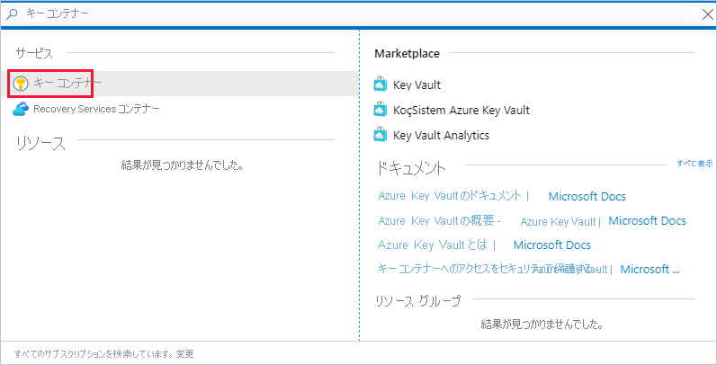
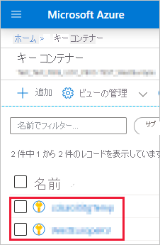
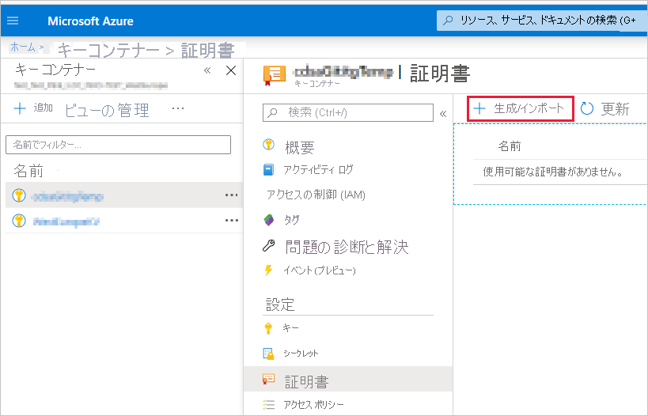
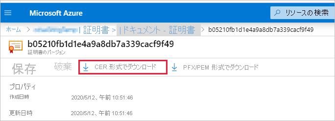
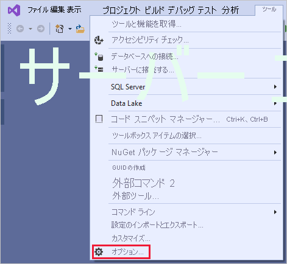
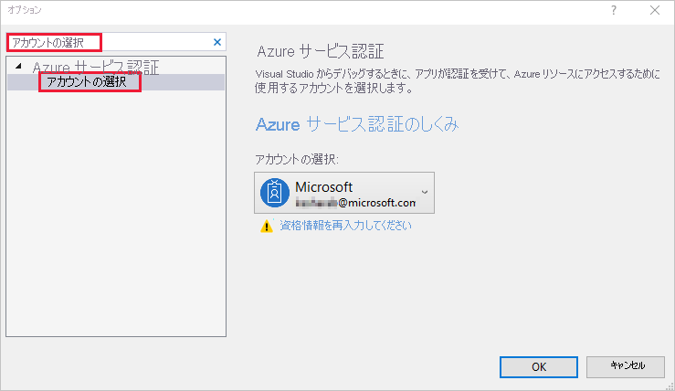

# <a name="embed-power-bi-content-with-service-principal-and-a-certificate"></a>サービス プリンシパルと証明書を使用した Power BI コンテンツの埋め込み

[!INCLUDE[service principal overview](../../includes/service-principal-overview.md)]

>[!NOTE]
>ご利用のバックエンド サービスは、秘密キーではなく、証明書を使用してセキュリティで保護することをお勧めします。 [秘密キーまたは証明書を使用して Azure AD からアクセス トークンを取得する方法の詳細を説明します](https://docs.microsoft.com/azure/architecture/multitenant-identity/client-assertion)。

## <a name="certificate-based-authentication"></a>証明書ベースの認証

証明書ベースの認証では、Windows、Android、または iOS デバイス上のクライアント証明書、または [Azure Key Vault](https://docs.microsoft.com/azure/key-vault/basic-concepts) に保持されているクライアント証明書を、Azure Active Directory (Azure AD) と共に使用して認証することができます。

この認証方法を使用すると、ローテーションまたは失効に対して、証明書を中央の場所から CA を使用して管理できます。

Azure AD での証明書の詳細については「[クライアント資格情報フロー](https://github.com/AzureAD/microsoft-authentication-library-for-dotnet/wiki/Client-credential-flows)」GitHub ページを参照してください。

## <a name="method"></a>メソッド

埋め込み分析でサービス プリンシパルと証明書を使用するには、次の手順を行います。

1. 証明書を作成する。

2. Azure AD アプリケーションを作成する

3. 証明書認証を設定する

4. Azure Key Vault から証明書を取得する

5. サービス プリンシパルと証明書を使用して認証する

## <a name="step-1---create-a-certificate"></a>手順 1 - 証明書を作成する

信頼された "*証明機関*" から証明書を取得することも、証明書を自分で生成することもできます。

このセクションでは、[Azure Key Vault](https://docs.microsoft.com/azure/key-vault/create-certificate) を使用して証明書を作成する方法、および公開キーを含む *.cer* ファイルをダウンロードする方法について説明します。

1. [Microsoft Azure](https://ms.portal.azure.com/#allservices) にログインします。

2. **Key Vaults** を検索し、 **[Key Vaults]** リンクをクリックします。

    

3. 証明書の追加先とするキー コンテナーをクリックします。

    

4. **[証明書]** をクリックします。

    

5. **[生成/インポート]** をクリックします。

    

6. 次のように、 **[証明書フィールドの作成]** を構成します。

    * **[証明書の作成方法]** - 一般的

    * **[証明書名]** - 証明書の名前を入力する

    * **[証明機関 (CA) の種類]** - 自己署名証明書

    * **[件名]** - [X.500](https://wikipedia.org/wiki/X.500) 識別名

    * **[DNS 名]** - 0 個の DNS 名

    * **[有効期間 (月単位)]** - 証明書の有効期間を入力する

    * **[コンテンツの種類]** - PKCS #12

    * **[有効期間のアクション タイプ]** - 有効期間が指定された割合になったら、自動的に更新する

    * **[有効期間の割合]** - 80

    * **[ポリシーの詳細構成]** - 未構成

7. **[作成]** をクリックします。 新しく作成された証明書は、既定では無効にされます。 それは有効になるまで最大 5 分かかることがあります。

8. 作成した証明書を選択します。

9. **[CER 形式でダウンロード]** をクリックします。 ダウンロードしたファイルには、公開キーが含まれています。

    

## <a name="step-2---create-an-azure-ad-application"></a>手順 2 - Azure AD アプリケーションを作成する

[!INCLUDE[service principal create app](../../includes/service-principal-create-app.md)]

## <a name="step-3---set-up-certificate-authentication"></a>手順 3 - 証明書の認証を設定する

1. Azure AD アプリケーションで、 **[証明書とシークレット]** タブをクリックします。

     

2. **[証明書のアップロード]** をクリックし、このチュートリアルの[最初の手順](#step-1---create-a-certificate)で作成およびダウンロードした *.cer* ファイルをアップロードします。 *.cer* ファイルには公開キーが含まれています。

## <a name="step-4---get-the-certificate-from-azure-key-vault"></a>手順 4 - Azure Key Vault から証明書を取得する

マネージド サービス ID (MSI) を使用して Azure Key Vault から証明書を取得します。 このプロセスでは、公開キーと秘密キーの両方を含む *.pfx* 証明書を取得する必要があります。

Azure Key Vault から証明書を読み取る方法については、コード例を参照してください。 Visual Studio を使用する場合は、「[MSI を使用するように Visual Studio を構成する](#configure-visual-studio-to-use-msi)」を参照してください。

```csharp
private X509Certificate2 ReadCertificateFromVault(string certName)
{
    var serviceTokenProvider = new AzureServiceTokenProvider();
    var keyVaultClient = new KeyVaultClient(new KeyVaultClient.AuthenticationCallback(serviceTokenProvider.KeyVaultTokenCallback));
    CertificateBundle certificate = null;
    SecretBundle secret = null;
    try
    {
        certificate = keyVaultClient.GetCertificateAsync($"https://{KeyVaultName}.vault.azure.net/", certName).Result;
        secret = keyVaultClient.GetSecretAsync(certificate.SecretIdentifier.Identifier).Result;
    }
    catch (Exception)
    {
        return null;
    }

    return new X509Certificate2(Convert.FromBase64String(secret.Value));
}
```

## <a name="step-5---authenticate-using-service-principal-and-a-certificate"></a>手順 5 - サービス プリンシパルと証明書を使用して認証する

サービス プリンシパルと、Azure Key Vault に格納されている証明書を使用してご自分のアプリを認証するには、Azure Key Vault に接続します。

Azure Key Vault に接続して証明書を読み取るには、次のコードを参照してください。

>[!NOTE]
>ご自分の組織によって作成された証明書を既にお持ちの場合は、 *.pfx* ファイルを Azure Key Vault にアップロードしてください。

```csharp
// Preparing needed variables
var Scope = "https://analysis.windows.net/powerbi/api/.default"
var ApplicationId = "{YourApplicationId}"
var tenantSpecificURL = "https://login.microsoftonline.com/{YourTenantId}/"
X509Certificate2 certificate = ReadCertificateFromVault(CertificateName);

// Authenticating with a SP and a certificate
public async Task<AuthenticationResult> DoAuthentication(){
    IConfidentialClientApplication clientApp = null;
    clientApp = ConfidentialClientApplicationBuilder.Create(ApplicationId)
                                                    .WithCertificate(certificate)
                                                    .WithAuthority(tenantSpecificURL)
                                                    .Build();
    try
    {
        authenticationResult = await clientApp.AcquireTokenForClient(Scope).ExecuteAsync();
    }
    catch (MsalException)
    {
        throw;
    }
    return authenticationResult
}
```

## <a name="configure-visual-studio-to-use-msi"></a>MSI を使用するように Visual Studio を構成する

埋め込みソリューションを作成する場合は、マネージド サービス ID (MSI) を使用するように Visual Studio を構成すると便利な場合があります。 [MSI](https://docs.microsoft.com/azure/active-directory/managed-identities-azure-resources/overview) は、Azure AD ID を管理できるようにする機能です。 構成が完了すると、Visual Studio は Azure Key Vault に対して認証を行うようになります。

1. Visual Studio でプロジェクトを開きます。

2. **[ツール]**  >  **[オプション]** の順にクリックします。

     

3. **[アカウントの選択]** を検索し、 **[アカウントの選択]** をクリックします。

    

4. ご利用の Azure Key Vault へのアクセス権を持つアカウントを追加します。

[!INCLUDE[service principal limitations](../../includes/service-principal-limitations.md)]

## <a name="next-steps"></a>次の手順

>[!div class="nextstepaction"]
>[アプリを登録する](register-app.md)

>[!div class="nextstepaction"]
>[顧客向けの Power BI Embedded](embed-sample-for-customers.md)

>[!div class="nextstepaction"]
>[Azure Active Directory でのアプリケーション オブジェクトとサービス プリンシパル オブジェクト](https://docs.microsoft.com/azure/active-directory/develop/app-objects-and-service-principals)

>[!div class="nextstepaction"]
>[サービス プリンシパルを使用するオンプレミス データ ゲートウェイを使用した行レベルのセキュリティ](embedded-row-level-security.md#on-premises-data-gateway-with-service-principal)

>[!div class="nextstepaction"]
>[サービス プリンシパルとアプリケーション シークレットを使用した Power BI コンテンツの埋め込み](embed-service-principal.md)