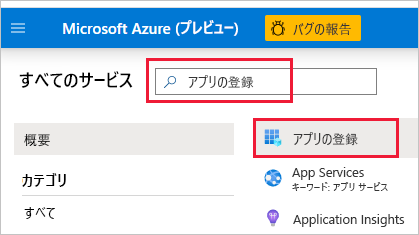
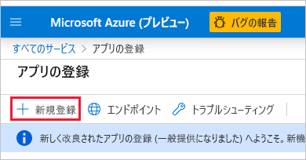
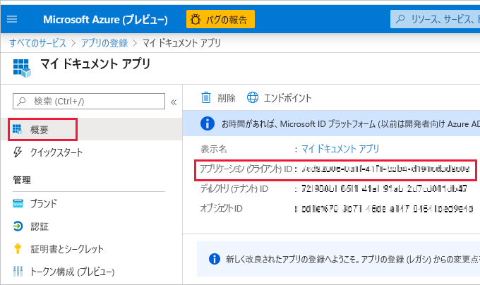
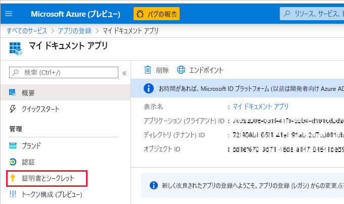
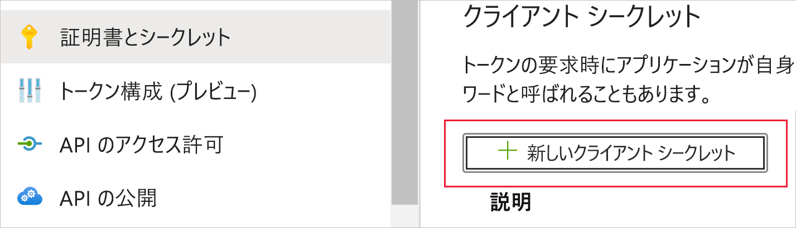
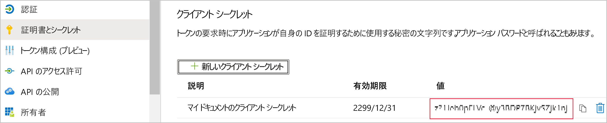
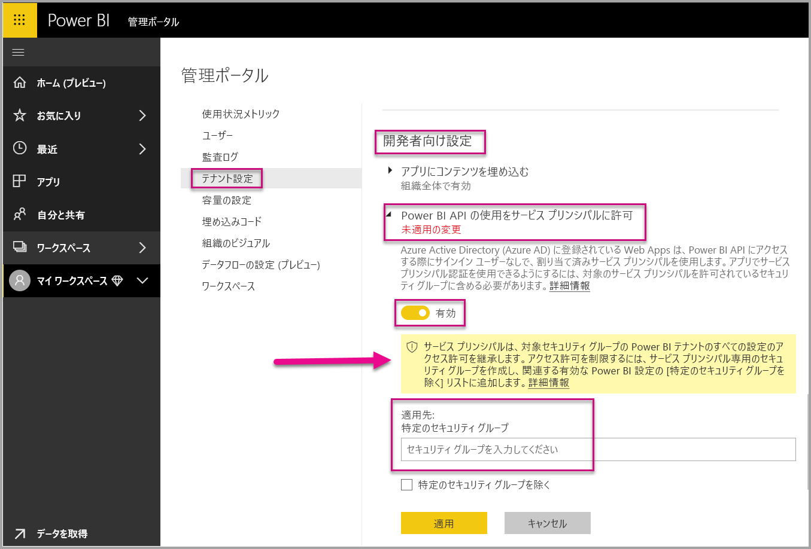
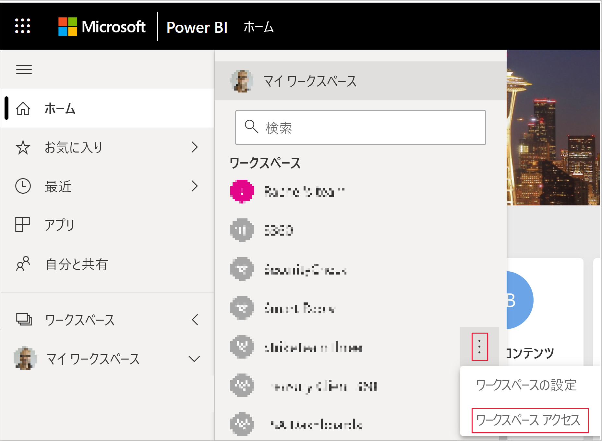
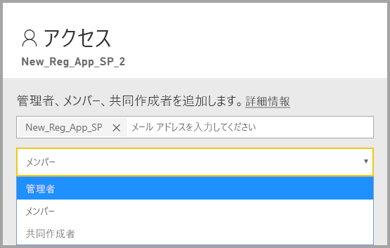

# <a name="embedding-power-bi-content-with-service-principal-and-application-secret"></a>サービス プリンシパルとアプリケーション シークレットを使用した Power BI コンテンツの埋め込み

[!INCLUDE[service principal overview](../../includes/service-principal-overview.md)]

この記事では、"*アプリケーション ID*" と "*アプリケーション シークレット*" を使用したサービス プリンシパル認証について説明します。

## <a name="method"></a>メソッド

埋め込み分析でサービス プリンシパルとアプリケーション ID を使用するには、次の手順を行います。

1. [Azure AD アプリ](https://docs.microsoft.com/azure/active-directory/manage-apps/what-is-application-management)を作成します。

    1. Azure AD アプリのシークレットを作成します。
    
    2. アプリの "*アプリケーション ID*" と "*アプリケーション シークレット*" を取得します。

    >[!NOTE]
    >これらの手順については**手順 1** で説明します。 Azure AD アプリの作成の詳細については、[Azure AD アプリの作成](https://docs.microsoft.com/azure/active-directory/develop/howto-create-service-principal-portal)に関するページを参照してください。

2. Azure AD セキュリティ グループを作成します。

3. Power BI サービス管理者設定を有効にします。

4. サービス プリンシパルを、ご利用のワークスペースに追加します。

5. 自分のコンテンツを埋め込みます。

> [!IMPORTANT]
> Power BI でサービス プリンシパルを使用できるようにすると、アプリケーションの AD アクセス許可は無効になります。 アプリケーションのアクセス許可はその後、Power BI 管理ポータルを介して管理されます。

## <a name="step-1---create-an-azure-ad-app"></a>手順 1 - Azure AD アプリを作成する

次のいずれかの方法を使用して、Azure AD アプリを作成します。
* [Microsoft Azure portal でアプリを作成する](https://portal.azure.com/#allservices)
* [PowerShell](https://docs.microsoft.com/powershell/azure/create-azure-service-principal-azureps?view=azps-3.6.1) を使用してアプリを作成する

### <a name="creating-an-azure-ad-app-in-the-microsoft-azure-portal"></a>Microsoft Azure portal での Azure AD アプリの作成

1. [Microsoft Azure](https://portal.azure.com/#allservices) にログインします。

2. **[アプリの登録]** を検索し、 **[アプリの登録]** リンクをクリックします。

    

3. **[新規登録]** をクリックします。

    

4. 必要な情報を入力します。
    * **名前** - 自分のアプリケーションの名前を入力します
    * **サポートされているアカウントの種類** - 必要な Azure AD アカウントを選択します
    * (省略可能) **リダイレクト URI** - 必要に応じて URI を入力します

5. **[登録]** をクリックします。

6. 登録した後、 **[概要]** タブで "*アプリケーション ID*" を使用できます。後で使用できるように、"*アプリケーション ID*" をコピーして保存します。

    

7. **[証明書とシークレット]** タブをクリックします。

     

8. **[新しいクライアント シークレット]** をクリックします

    

9. *[クライアント シークレットの追加]* ウィンドウで、説明を入力し、クライアント シークレットの有効期限を指定し、 **[追加]** をクリックします。

10. "*クライアント シークレット*" 値をコピーして保存します。

    

    >[!NOTE]
    >このウィンドウから離れると、クライアント シークレットの値は非表示となり、再度表示することもコピーすることもできません。

### <a name="creating-an-azure-ad-app-using-powershell"></a>PowerShell を使用した Azure AD アプリの作成

このセクションには、[PowerShell](https://docs.microsoft.com/powershell/azure/create-azure-service-principal-azureps?view=azps-1.1.0) を使用して新しい Azure AD アプリを作成するためのサンプル スクリプトが含まれています。

```powershell
# The app ID - $app.appid
# The service principal object ID - $sp.objectId
# The app key - $key.value

# Sign in as a user that's allowed to create an app
Connect-AzureAD

# Create a new Azure AD web application
$app = New-AzureADApplication -DisplayName "testApp1" -Homepage "https://localhost:44322" -ReplyUrls "https://localhost:44322"

# Creates a service principal
$sp = New-AzureADServicePrincipal -AppId $app.AppId

# Get the service principal key
$key = New-AzureADServicePrincipalPasswordCredential -ObjectId $sp.ObjectId
```

## <a name="step-2---create-an-azure-ad-security-group"></a>手順 2 - Azure AD セキュリティ グループを作成する

ご利用のサービス プリンシパルには、Power BI コンテンツおよび API のいずれに対してもアクセス権がありません。 サービス プリンシパルにアクセス権を付与するには、Azure AD でセキュリティ グループを作成し、作成済みのサービス プリンシパルをそのセキュリティ グループに追加します。

Azure AD セキュリティ グループを作成するには、次の 2 つの方法があります。
* 手動 (Azure で)
* PowerShell の使用

### <a name="create-a-security-group-manually"></a>セキュリティ グループを手動で作成する

Azure セキュリティ グループを手動で作成するには、「[Azure Active Directory を使用して基本グループを作成してメンバーを追加する](https://docs.microsoft.com/azure/active-directory/fundamentals/active-directory-groups-create-azure-portal)」に記載の手順に従ってください。 

### <a name="create-a-security-group-using-powershell"></a>PowerShell を使用してセキュリティ グループを作成する

新しいセキュリティ グループを作成し、そのセキュリティ グループにアプリを追加するためのサンプル スクリプトを以下に示します。

>[!NOTE]
>組織全体に対してサービス プリンシパル アクセスを有効にする場合、この手順をスキップします。

```powershell
# Required to sign in as a tenant admin
Connect-AzureAD

# Create an Azure AD security group
$group = New-AzureADGroup -DisplayName <Group display name> -SecurityEnabled $true -MailEnabled $false -MailNickName notSet

# Add the service principal to the group
Add-AzureADGroupMember -ObjectId $($group.ObjectId) -RefObjectId $($sp.ObjectId)
```

## <a name="step-3---enable-the-power-bi-service-admin-settings"></a>手順 3 - Power BI サービス管理者設定を有効にする

Azure AD アプリから Power BI コンテンツおよび API にアクセスできるようにするには、Power BI 管理者が Power BI 管理ポータルでサービス プリンシパル アクセスを有効にする必要があります。

Azure AD で作成したセキュリティ グループを、 **[開発者向け設定]** の特定のセキュリティ グループのセクションに追加します。

>[!IMPORTANT]
>サービス プリンシパルには、それが有効にされたテナント設定へのアクセス権があります。 これには、ご利用の管理者設定に応じて、特定のセキュリティ グループまたは組織全体が含まれます。
>
>サービス プリンシパル アクセスを特定のテナント設定に限定するには、特定のセキュリティ グループへのアクセスのみを許可します。 あるいは、サービス プリンシパル専用のセキュリティ グループを作成し、それを目的のテナント設定から除外することもできます。



## <a name="step-4---add-the-service-principal-as-an-admin-to-your-workspace"></a>手順 4 - 管理者としてのサービス プリンシパルをワークスペースに追加する

Power BI サービス内でレポート、ダッシュボード、データセットなどの Azure AD アプリのアクセス成果物を有効にするには、メンバーまたは管理者としてのサービス プリンシパル エンティティをご利用のワークスペースに追加します。

>[!NOTE]
>このセクションでは、UI の手順について説明します。 また、[グループ - グループ ユーザー API の追加](https://docs.microsoft.com/rest/api/power-bi/groups/addgroupuser)に関するページを参照して、サービス プリンシパルをワークスペースに追加することもできます。

1. アクセスを有効にするワークスペースまでスクロールし、 **[その他]** メニューで、 **[ワークスペース アクセス]** を選択します。

    

2. **管理者**または**メンバー**としてのサービス プリンシパルをワークスペースに追加します。

    

## <a name="step-5---embed-your-content"></a>手順 5 - コンテンツを埋め込む

サンプル アプリケーション内にも、独自のアプリケーション内にも使用するコンテンツを埋め込むことができます。

* [サンプル アプリケーションを使用してコンテンツを埋め込む](embed-sample-for-customers.md#embed-content-using-the-sample-application)
* [自分のアプリケーション内にコンテンツを埋め込む](embed-sample-for-customers.md#embed-content-within-your-application)

使用するコンテンツが埋め込まれると、[運用開始](embed-sample-for-customers.md#move-to-production)の準備が整います。

## <a name="considerations-and-limitations"></a>考慮事項と制限事項

* サービス プリンシパルは、[新しいワークスペース](../../collaborate-share/service-create-the-new-workspaces.md)でのみ動作します。
* サービス プリンシパルを使用する場合は、**マイ ワークスペース**はサポートされません。
* 運用環境に移行するときは、専用の容量が必要です。
* サービス プリンシパルを使用して Power BI ポータルにサインインすることはできません。
* Power BI 管理ポータル内の開発者向け設定でサービス プリンシパルを有効にするには、Power BI 管理者権限が必要です。
* サービス プリンシパルを使用して、オンプレミス データ ゲートウェイをインストールまたは管理することはできません。
* [組織のアプリケーションへの埋め込み](embed-sample-for-your-organization.md)では、サービス プリンシパルを使用することはできません。
* [データフロー](../../transform-model/service-dataflows-overview.md)管理はサポートされていません。
* サービス プリンシパルでは現在、管理 API は一切サポートされていません。
* サービス プリンシパルを [Azure Analysis Services](https://docs.microsoft.com/azure/analysis-services/analysis-services-overview) データ ソースと共に使用する場合、サービス プリンシパル自体に Azure Analysis Services インスタンスのアクセス許可が含まれている必要があります。 この目的のためのサービス プリンシパルを含むセキュリティ グループを使用することはできません。

## <a name="next-steps"></a>次の手順

* [顧客向けの Power BI Embedded](embed-sample-for-customers.md)

* [サービス プリンシパルを使用するオンプレミス データ ゲートウェイを使用した行レベルのセキュリティ](embedded-row-level-security.md#on-premises-data-gateway-with-service-principal)