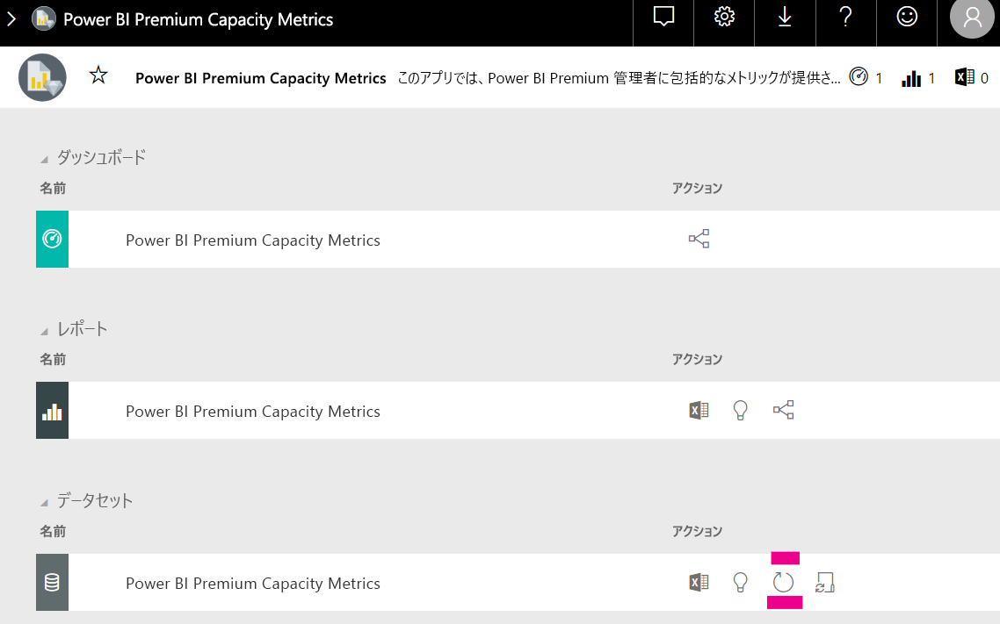

# Power BI 埋め込み分析の容量計画

Power BI 埋め込み分析の展開に必要な容量の種類を計算することは、複雑になることがあります。 これは、この計算が複数のパラメーターに基づいているため、予測が困難になることがあるためです。

容量を計画する際には、次の点を考慮する必要があります。

* 使用しているデータ モデル
* 必要なクエリの数と複雑さ
* アプリケーションの使用量の時間単位の分布
* データの更新間隔
* 予測が困難なその他の使用パターン

この記事は、[Power BI 専用容量負荷の評価ツール](https://github.com/microsoft/PowerBI-Tools-For-Capacities/tree/master/LoadTestingPowerShellTool/)を導入することによって、Power BI 埋め込み分析の容量計画を容易にすることを目的としています。これは、Power BI 埋め込み分析の容量 (*A*、*EM* または *P* の SKU) のロード テストを自動化するために作成されています。

## 計画ツール

 [Power BI 専用容量負荷の評価ツール](https://github.com/microsoft/PowerBI-Tools-For-Capacities/tree/master/LoadTestingPowerShellTool/)を使用すると、ご利用の容量で処理できるユーザー負荷の量を把握できます。 ここでは、PowerShell を使用して容量に対して自動化されたロード テストを作成し、テストするレポートと、シミュレートする同時実行ユーザー数を選択できます。

このツールでは、サービスに対するツールの認証に必要なトークンの有効期限が切れるまで、(レポートのキャッシュによる非現実的なほど優れたパフォーマンスを回避するために) 新しいフィルター値を使用して各レポートを継続的にレンダリングすることにより、容量に対する負荷が生成されます。

### 計画ツールの使用

このツールを実行するときは、容量に対する既存の負荷に注意し、使用率が最も高いときにロード テストを実行しないようにしてください。

ここでは、計画ツールを使用する方法の例をいくつか示します。

* 容量管理者は、容量で特定の期間内に処理できるユーザー数について理解を深めることができます。
* レポート作成者は、Power BI Desktop の[パフォーマンス アナライザー](../../create-reports/desktop-performance-analyzer.md)で測定したユーザーの負荷の結果を理解できます。
* ブラウザーにリアルタイムでレンダリングされていることを確認できます。
* SQL Server Profiler を使用すると、測定対象の容量の [XMLA エンドポイントに接続](https://powerbi.microsoft.com/blog/power-bi-open-platform-connectivity-with-xmla-endpoints-public-preview/)して、実行されているクエリを確認できます。
* ロード テストの結果は、Premium Capacity Metrics アプリの [データセット] ページに表示されます。 容量管理者は、このツールを使用して負荷を生成し、負荷がどのように表示されるかを確認できます。

### テスト結果のレビュー

テストの実行後に、メトリック アプリでロード テストの結果を確認するには、次の手順に従います。 負荷がメトリックに表示されるまで、テストが負荷の生成を開始した時間から最大 15 分の遅延が発生します。

1. [Metrics アプリ](../../admin/service-admin-premium-monitor-capacity.md)のランディングページの **[データセット]** タブを展開します。
2. **[今すぐ更新]** をクリックして、オンデマンド更新を開始ます。 管理者が行う必要があります。

    

## Power BI 容量ツールの GitHub リポジトリ

[Power BI 容量ツールの GitHub リポジトリ](https://github.com/microsoft/PowerBI-Tools-For-Capacities)は、容量計画ツールやその他の今後のツールとユーティリティをホストするために作成されました。

リポジトリはオープン ソースであり、ユーザーは投稿し、Power BI Premium と Embedded の容量に関連するツールを追加して、既存のものを改善することが推奨されます。

## 次の手順

> [!div class="nextstepaction"]
>[Power BI Embedded の分析の容量と SKU](embedded-capacity.md)

> [!div class="nextstepaction"]
>[Power BI Embedded のパフォーマンスのベスト プラクティス](embedded-performance-best-practices.md)