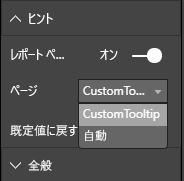

# <a name="tooltips-in-power-bi-visuals"></a>Power BI ビジュアルのヒント

ビジュアルで Power BI のヒントのサポートを利用できるようになりました。 Power BI のヒントでは、次の操作が処理されます。

* ヒントを表示する。
* ヒントを非表示にする。
* ヒントを移動する。

ヒントには、タイトル、特定の色の値、指定された座標セットの不透明度を含むテキスト要素を表示できます。 このデータは API に提供され、Power BI ホストでは、ネイティブ ビジュアルのヒントがレンダリングされるのと同じ方法でそれがレンダリングされます。

次の画像は、サンプルの棒グラフのヒントを示しています。


前のヒントの画像は、1 つのバー カテゴリと値を示しています。 1 つのヒントを拡張して、複数の値を表示できます。

## <a name="manage-tooltips"></a>ヒントの管理

ヒントの管理に使用するインターフェイスは、"ITooltipService" です。 これは、ヒントを表示、削除、または移動する必要があることをホストに通知するために使用されます。

```typescript
    interface ITooltipService {
        enabled(): boolean;
        show(options: TooltipShowOptions): void;
        move(options: TooltipMoveOptions): void;
        hide(options: TooltipHideOptions): void;
    }
```

ご利用のビジュアルでは、ビジュアル内のマウス イベントをリッスンし、`Tooltip****Options` オブジェクトに設定されている適切なコンテンツで必要に応じて、`show()`、`move()`、`hide()` の委任を呼び出す必要があります。
その後、`TooltipShowOptions` と `TooltipHideOptions` で、表示内容とこれらのイベントでの動作方法が定義されます。

これらのメソッドを呼び出すと、マウスの移動やタッチ イベントなどのユーザー イベントが発生するため、これらのイベントのリスナーを作成することをお勧めします。これにより、`TooltipService` メンバーが呼び出されます。
このサンプルでは、`TooltipServiceWrapper` というクラスで集計を行います。

### <a name="the-tooltipservicewrapper-class"></a>TooltipServiceWrapper クラス

このクラスの背後にある基本的な考え方は、`TooltipService` のインスタンスを保持し、関連する要素に対する D3 マウス イベントをリッスンしてから、`show()` と `hide()` を呼び出し、必要に応じて要素を呼び出すことです。

クラスでは、これらのイベントに関連するすべての状態とロジックが保持および管理されます。ほとんどの場合、これは基になる D3 コードとのインターフェイスが対象となります。 D3 インターフェイスと変換は、この記事の範囲外です。

完全なサンプル コードについては、[SampleBarChart ビジュアル リポジトリ](https://github.com/Microsoft/PowerBI-visuals-sampleBarChart/commit/981b021612d7b333adffe9f723ab27783c76fb14)で見つけることができます。

### <a name="create-tooltipservicewrapper"></a>TooltipServiceWrapper の作成

横棒グラフのコンストラクターに `TooltipServiceWrapper` メンバーが含まれるようになりました。これは、ホスト `tooltipService` インスタンスと共にコンストラクターでインスタンス化されます。

```typescript
        private tooltipServiceWrapper: ITooltipServiceWrapper;

        this.tooltipServiceWrapper = createTooltipServiceWrapper(this.host.tooltipService, options.element);
```

`TooltipServiceWrapper` クラスでは、`tooltipService` インスタンスが、ビジュアルおよびタッチ パラメーターのルート D3 要素としても保持されます。

```typescript
    class TooltipServiceWrapper implements ITooltipServiceWrapper {
        private handleTouchTimeoutId: number;
        private visualHostTooltipService: ITooltipService;
        private rootElement: Element;
        private handleTouchDelay: number;

        constructor(tooltipService: ITooltipService, rootElement: Element, handleTouchDelay: number) {
            this.visualHostTooltipService = tooltipService;
            this.handleTouchDelay = handleTouchDelay;
            this.rootElement = rootElement;
        }
        .
        .
        .
    }
```

このクラスでイベント リスナーを登録するための単一のエントリ ポイントは、`addTooltip` メソッドです。

### <a name="the-addtooltip-method"></a>addTooltip メソッド

```typescript
        public addTooltip<T>(
            selection: d3.Selection<Element>,
            getTooltipInfoDelegate: (args: TooltipEventArgs<T>) => VisualTooltipDataItem[],
            getDataPointIdentity: (args: TooltipEventArgs<T>) => ISelectionId,
            reloadTooltipDataOnMouseMove?: boolean): void {

            if (!selection || !this.visualHostTooltipService.enabled()) {
                return;
            }
        ...
        ...
        }
```

* **selection: d3.Selection<Element>** : ヒントが処理される d3 要素。

* **getTooltipInfoDelegate: (args:TooltipEventArgs<T>) => VisualTooltipDataItem[]** : コンテキストごとにヒント コンテンツ (表示内容) を作成するための委任。

* **getDataPointIdentity: (args:TooltipEventArgs<T>) => ISelectionId**: データ ポイント ID を取得するための委任 (このサンプルでは使用されません)。 

* **reloadTooltipDataOnMouseMove? boolean**: MouseMove イベント中にヒント データを更新するかどうかを示すブール値 (このサンプルでは使用されません)。

ご覧のとおり、`tooltipService` が無効になっている場合や、実際の選択がない場合は、アクションなしで `addTooltip` が終了します。

### <a name="call-the-show-method-to-display-a-tooltip"></a>ヒントを表示するための show メソッドを呼び出す

次のコードに示すように、`addTooltip` メソッドでは次に D3 の `mouseover` イベントをリッスンします。

```typescript
        ...
        ...
        selection.on("mouseover.tooltip", () => {
            // Ignore mouseover while handling touch events
            if (!this.canDisplayTooltip(d3.event))
                return;

            let tooltipEventArgs = this.makeTooltipEventArgs<T>(rootNode, true, false);
            if (!tooltipEventArgs)
                return;

            let tooltipInfo = getTooltipInfoDelegate(tooltipEventArgs);
            if (tooltipInfo == null)
                return;

            let selectionId = getDataPointIdentity(tooltipEventArgs);

            this.visualHostTooltipService.show({
                coordinates: tooltipEventArgs.coordinates,
                isTouchEvent: false,
                dataItems: tooltipInfo,
                identities: selectionId ? [selectionId] : [],
            });
        });
```

* **makeTooltipEventArgs**: D3 で選択された要素から tooltipEventArgs にコンテキストが抽出されます。 これにより、座標も計算されます。

* **getTooltipInfoDelegate**: その後、tooltipEventArgs からヒント コンテンツが構築されます。 これはビジュアルのロジックであるため、BarChart クラスへのコールバックです。 これは、ヒントに表示される実際のテキスト コンテンツです。

* **getDataPointIdentity**: このサンプルでは使用されません。

* **this.visualHostTooltipService.show**: ヒントを表示するための呼び出し。  

追加の処理については、`mouseout` および `mousemove` イベントのサンプルを参照してください。

詳細については、[SampleBarChart ビジュアル リポジトリ](https://github.com/Microsoft/PowerBI-visuals-sampleBarChart/commit/981b021612d7b333adffe9f723ab27783c76fb14)に関するページを参照してください。

### <a name="populate-the-tooltip-content-by-the-gettooltipdata-method"></a>getTooltipData メソッドによるヒント コンテンツの設定

BarChart クラスは、データ ポイントの `category`、`value`、`color` を VisualTooltipDataItem[] 要素に抽出するだけの `getTooltipData` メンバーと共に追加されました。

```typescript
        private static getTooltipData(value: any): VisualTooltipDataItem[] {
            return [{
                displayName: value.category,
                value: value.value.toString(),
                color: value.color,
                header: 'ToolTip Title'
            }];
        }
```

前の実装では、`header` メンバーは定数ですが、動的な値を必要とする、より複雑な実装にこれを使用できます。 `VisualTooltipDataItem[]` には複数の要素を設定できます。これにより、複数の行がヒントに追加されます。 これは、ヒントに複数のデータ ポイントのデータが表示される可能性のある積み上げ横棒グラフなどのビジュアルで役に立つ場合があります。

### <a name="call-the-addtooltip-method"></a>addTooltip メソッドを呼び出す

最後の手順では、実際のデータが変更される可能性がある場合に `addTooltip` メソッドを呼び出します。 この呼び出しは `BarChart.update()` メソッドで行われます。 前述のとおり、`BarChart.getTooltipData()` のみを渡すことで、すべての 'bar' 要素の選択を監視するために呼び出しが行われます。

```typescript
        this.tooltipServiceWrapper.addTooltip(this.barContainer.selectAll('.bar'),
            (tooltipEvent: TooltipEventArgs<number>) => BarChart.getTooltipData(tooltipEvent.data),
            (tooltipEvent: TooltipEventArgs<number>) => null);
```

## <a name="add-report-page-tooltips"></a>レポート ページのヒントを追加する

レポート ページのヒントのサポートを追加するために、ほとんどの変更を *capabilities.json* ファイルで見つけることができます。

サンプル スキーマは次のとおりです。

```json
{
    "tooltips": {
        "supportedTypes": {
            "default": true,
            "canvas": true
        },
        "roles": [
            "tooltips"
        ]
    }
}
```

**書式**ウィンドウでは、レポート ページのヒントを定義できます。



* `supportedTypes`:ビジュアルでサポートされるヒントの構成であり、フィールドでも反映されます。 
   * `default`:データ フィールドを介した "自動" ヒント バインドがサポートされるかどうかを示します。 
   * `canvas`:レポート ページのヒントがサポートされるかどうかを示します。

* `roles`:(省略可能) 定義された後、フィールドでも選択されたヒント オプションにバインドされるデータ ロールが指示されます。

詳細については、[レポート ページのヒントの使用に関するガイドライン](https://powerbi.microsoft.com/blog/power-bi-desktop-march-2018-feature-summary/#tooltips)を参照してください。

レポート ページのヒントを表示するには、Power BI ホストで `ITooltipService.Show(options: TooltipShowOptions)` または `ITooltipService.Move(options: TooltipMoveOptions)` を呼び出した後、selectionId (前の `options` 引数の `identities` プロパティ) が使用されます。 ヒントによって取得されるように、SelectionId では、マウスでポイントした項目の選択されたデータ (カテゴリや系列など) を表す必要があります。

次のコードでは、selectionId を送信してヒントを表示するための呼び出し例を示しています。

```typescript
    this.tooltipServiceWrapper.addTooltip(this.barContainer.selectAll('.bar'),
        (tooltipEvent: TooltipEventArgs<number>) => BarChart.getTooltipData(tooltipEvent.data),
        (tooltipEvent: TooltipEventArgs<number>) => tooltipEvent.data.selectionID);
```
