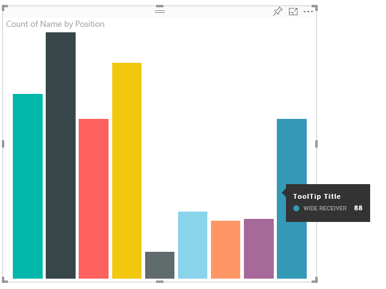
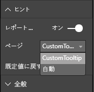

# <a name="power-bi-visuals-tooltips"></a>Power BI ビジュアルのヒント

ビジュアルで Power BI のヒントのサポートを利用できるようになりました。 Power BI のヒントでは、次の操作が処理されます。

ヒントを表示する。
ヒントを非表示にする。
ヒントを移動する。

ヒントには、タイトル、特定の色の値、および指定された座標セットの不透明度を含むテキスト要素を表示できます。 このデータは API に提供されます。 また、Power BI ホストでは、ネイティブ ビジュアルのヒントをレンダリングするのと同じ方法でそれをレンダリングします。

たとえば、サンプル BarChart のヒントです。



上記のヒントは、1 つの棒のカテゴリと値を示しています。 1 つのヒント内で複数の値を表示するように拡張できます。

## <a name="handling-tooltips"></a>ヒントの処理

ヒントの管理に使用するインターフェイスは、'ITooltipService' です。 このインターフェイスは、ヒントを表示、削除、または移動する必要があることをホストに通知するために使用されます。

```typescript
    interface ITooltipService {
        enabled(): boolean;
        show(options: TooltipShowOptions): void;
        move(options: TooltipMoveOptions): void;
        hide(options: TooltipHideOptions): void;
    }
```

ビジュアルでは、ビジュアル内のマウス イベントをリッスンし、`Tooltip****Options` オブジェクトに設定されている適切なコンテンツで必要に応じて、`show()`、`move()` および `hide()` デリゲートを呼び出す必要があります。
その後、`TooltipShowOptions` と `TooltipHideOptions` で、表示内容とこれらのイベントでの動作が定義されます。
これらのメソッドを呼び出すと、マウスの移動やタッチ イベントなどのユーザー イベントが発生するため、これらのイベントのリスナーを作成することをお勧めします。これにより、`TooltipService` メンバーが呼び出されます。
このサンプルでは、`TooltipServiceWrapper` というクラスで集計を行います。

### <a name="tooltipservicewrapper-class"></a>TooltipServiceWrapper クラス

このクラスの背後にある基本的な考え方は、`TooltipService` のインスタンスを保持し、関連する要素に対する D3 マウス イベントをリッスンしてから、`show()` を呼び出し、必要に応じて `hide()` を呼び出すことです。
クラスでは、これらのイベントに関連するすべての状態とロジックが保持および管理されます。ほとんどの場合、基になる D3 コードとのインターフェイスが対象となります。 D3 インターフェイスと変換は、このドキュメントの範囲外です。

完全なサンプル コードについては、[SampleBarChart ビジュアル リポジトリ](https://github.com/Microsoft/PowerBI-visuals-sampleBarChart/commit/981b021612d7b333adffe9f723ab27783c76fb14)に関するページを参照してください

### <a name="creating-tooltipservicewrapper"></a>TooltipServiceWrapper の作成

BarChart コンストラクターに `tooltipServiceWrapper` メンバーが含まれるようになりました。これは、ホスト `tooltipService` インスタンスと共にコンストラクターでインスタンス化されます。

```typescript
        private tooltipServiceWrapper: ITooltipServiceWrapper;

        this.tooltipServiceWrapper = createTooltipServiceWrapper(this.host.tooltipService, options.element);
```

`TooltipServiceWrapper` クラスでは、`tooltipService` インスタンスが、ビジュアルおよびタッチ パラメーターのルート D3 要素としても保持されます。

```typescript
    class TooltipServiceWrapper implements ITooltipServiceWrapper {
        private handleTouchTimeoutId: number;
        private visualHostTooltipService: ITooltipService;
        private rootElement: Element;
        private handleTouchDelay: number;

        constructor(tooltipService: ITooltipService, rootElement: Element, handleTouchDelay: number) {
            this.visualHostTooltipService = tooltipService;
            this.handleTouchDelay = handleTouchDelay;
            this.rootElement = rootElement;
        }
        .
        .
        .
    }
```

このクラスでイベント リスナーを登録するための単一のエントリ ポイントは、`addTooltip` メソッドです。

### <a name="addtooltip-method"></a>addTooltip メソッド

```typescript
        public addTooltip<T>(
            selection: d3.Selection<Element>,
            getTooltipInfoDelegate: (args: TooltipEventArgs<T>) => VisualTooltipDataItem[],
            getDataPointIdentity: (args: TooltipEventArgs<T>) => ISelectionId,
            reloadTooltipDataOnMouseMove?: boolean): void {

            if (!selection || !this.visualHostTooltipService.enabled()) {
                return;
            }
        ...
        ...
        }
```

* **selection: d3.Selection<Element>**
* ヒントが処理される d3 要素
* **getTooltipInfoDelegate: (args:TooltipEventArgs<T>) => VisualTooltipDataItem[]**
* コンテキストごとにヒント コンテンツ (表示内容) を設定するためのデリゲート
* **getDataPointIdentity: (args:TooltipEventArgs<T>) => ISelectionId**
* datapoint ID を取得するためのデリゲート - このサンプルでは使用されません 
* **reloadTooltipDataOnMouseMove?: boolean**
* mouseMove イベント中にヒント データを更新するかどうかを示すブール値 - このサンプルでは使用されません

ご覧のとおり、`tooltipService` が無効になっている場合や、実際の選択がない場合は、アクションなしで `addTooltip` が終了します。

### <a name="call-of-show-method-to-display-a-tooltip"></a>ヒントを表示するための show メソッドの呼び出し

`addTooltip` では次に、D3 `mouseover` イベントをリッスンします。

```typescript
        ...
        ...
        selection.on("mouseover.tooltip", () => {
            // Ignore mouseover while handling touch events
            if (!this.canDisplayTooltip(d3.event))
                return;

            let tooltipEventArgs = this.makeTooltipEventArgs<T>(rootNode, true, false);
            if (!tooltipEventArgs)
                return;

            let tooltipInfo = getTooltipInfoDelegate(tooltipEventArgs);
            if (tooltipInfo == null)
                return;

            let selectionId = getDataPointIdentity(tooltipEventArgs);

            this.visualHostTooltipService.show({
                coordinates: tooltipEventArgs.coordinates,
                isTouchEvent: false,
                dataItems: tooltipInfo,
                identities: selectionId ? [selectionId] : [],
            });
        });
```

* **makeTooltipEventArgs**
* D3 で選択された要素から tooltipEventArgs にコンテキストが抽出されます。 座標も計算されます。
* **getTooltipInfoDelegate**
* その後、tooltipEventArgs からヒント コンテンツが構築されます。 これは、ビジュアルのロジックであるため、BarChart クラスへのコールバックです。 これは、ヒントに表示される実際のテキスト コンテンツです。
* **getDataPointIdentity**
* このサンプルでは使用されません
* **this.visualHostTooltipService.show**
* ヒントを表示するための呼び出し  

追加の処理については、`mouseout` および `mousemove` イベントのサンプルを参照してください。

詳細については、[SampleBarChart ビジュアル リポジトリ](https://github.com/Microsoft/PowerBI-visuals-sampleBarChart/commit/981b021612d7b333adffe9f723ab27783c76fb14)に関するページを参照してください。

### <a name="populating-the-tooltip-content-by-gettooltipdata-method"></a>getTooltipData メソッドによるヒント コンテンツの設定

`BarChart` は、データポイントのカテゴリ、値、および色を VisualTooltipDataItem [] 要素に抽出するだけのメンバー `getTooltipData` と共に追加されました。

```typescript
        private static getTooltipData(value: any): VisualTooltipDataItem[] {
            return [{
                displayName: value.category,
                value: value.value.toString(),
                color: value.color,
                header: 'ToolTip Title'
            }];
        }
```

上記の実装では、`header` メンバーは定数ですが、動的な値を必要とする、より複雑な実装に使用できます。 `VisualTooltipDataItem[]` には複数の要素を設定できます。これにより、複数の行がヒントに追加されます。 これは、ヒントに複数のデータポイントのデータが表示される可能性のある積み上げ横棒グラフなどのビジュアルで役に立つ場合があります。

### <a name="calling-addtooltip-method"></a>addTooltip メソッドの呼び出し

最後の手順では、実際のデータが変更される可能性がある場合に `addTooltip` を呼び出します。 この呼び出しは `BarChart.update()` メソッドで行われます。 したがって、上記のとおり、`BarChart.getTooltipData()` のみを渡すことで、すべての 'bar' 要素の選択を監視するために呼び出しが行われます。

```typescript
        this.tooltipServiceWrapper.addTooltip(this.barContainer.selectAll('.bar'),
            (tooltipEvent: TooltipEventArgs<number>) => BarChart.getTooltipData(tooltipEvent.data),
            (tooltipEvent: TooltipEventArgs<number>) => null);
```

## <a name="adding-report-page-tooltips"></a>レポート ページのヒントの追加

レポート ページ ヒントのサポートを追加するために、ほとんどの変更は capabilities.json に配置されます。

サンプル スキーマは次のとおりです。

```json
{
    "tooltips": {
        "supportedTypes": {
            "default": true,
            "canvas": true
        },
        "roles": [
            "tooltips"
        ]
    }
}
```

レポート ページ ヒントの定義は、書式ウィンドウで行うことができます。



`supportedTypes` は、ビジュアルでサポートされるヒントの構成であり、フィールドでも反映されます。 `default` は、データ フィールドを介した "自動" ヒント バインドがサポートされるかどうかを示します。 canvas は、レポート ページのヒントがサポートされるかどうかを示します。

`roles` は省略可能です。 定義されると、フィールドでも選択されたヒント オプションにバインドされるデータ ロールが指示されます。

詳細については、レポート ページ ヒントの使用に関するガイドラインである[レポート ページのヒント](https://powerbi.microsoft.com/blog/power-bi-desktop-march-2018-feature-summary/#tooltips)についての記述を参照してください

レポート ページのヒントを表示する場合、`ITooltipService.Show(options: TooltipShowOptions)` または `ITooltipService.Move(options: TooltipMoveOptions)` の呼び出し時に、Power BI ホストでは selectionId (上記の `options` 引数の `identities` プロパティ) を使用します。 SelectionId では、ヒントによって取得される、マウスでポイントした項目の選択されたデータ (カテゴリや系列など) を表す必要があります。

selectionId を送信してヒントを表示するための呼び出し例は以下のとおりです。

```typescript
    this.tooltipServiceWrapper.addTooltip(this.barContainer.selectAll('.bar'),
        (tooltipEvent: TooltipEventArgs<number>) => BarChart.getTooltipData(tooltipEvent.data),
        (tooltipEvent: TooltipEventArgs<number>) => tooltipEvent.data.selectionID);
```
