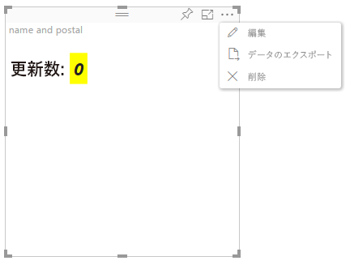

# 高度な編集モード

高度な UI コントロールを必要とするビジュアルでは、高度な編集モードのサポートを宣言できます。
サポートされている場合は、レポートの編集モード時に、ビジュアルのメニューに [編集] ボタンが表示されます。`Edit`
[編集] ボタンがクリックされると、EditMode が `Advanced` に設定されます。`Edit`
ビジュアルでは EditMode フラグを使用して、そのような UI コントロールを表示するかどうかを決定できます。

既定では、ビジュアルで高度な編集モードはサポートされません。
別の動作が必要な場合は、`advancedEditModeSupport` プロパティを設定し、ビジュアルの `capabilities.json` ファイルで明示的に示す必要があります。

使用可能な値は次のとおりです。

- 0 - NotSupported

- 1 - SupportedNoAction

- 2 - SupportedInFocus

## 高度な編集モードの開始

次の場合は、[編集] ボタンが表示されます。`Edit`

 1- capabilities.json で、`advancedEditModeSupport` プロパティが `SupportedInFocus` または `SupportedNoAction` に設定されています。

 2 - ビジュアルがレポート編集モードで表示されています。

`advancedEditModeSupport` プロパティが capabilities.json にない場合、または `NotSupported` に設定されている場合は、[編集] ボタンが非表示になります。

ユーザーが [編集] をクリックすると、ビジュアルでは、EditMode が `Advanced` に設定された update () 呼び出しが取得されます。`Edit`
capabilities で設定されている値に従って、次のアクションが行われます。

* `SupportedNoAction` - ホストではこれ以上アクションは行われません。
* `SupportedInFocus` - ホストでは、ビジュアルがフォーカス設定モードにポップアウトされます。

## 高度な編集モードの終了

次の場合は、[レポートに戻る] ボタンが表示されます。`Back to report`

1- capabilities.json で、`advancedEditModeSupport` プロパティが `SupportedInFocus` に設定されています。
