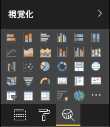

# <a name="analytics-pane-in-power-bi-visuals"></a>Power BI ビジュアルの分析ウィンドウ

**分析ウィンドウ**は、2018 年 11 月に[ネイティブ ビジュアルに導入](https://docs.microsoft.com/power-bi/desktop-analytics-pane)されました。
api (API v2.5.0) を使用するカスタム ビジュアルでは、**分析ウィンドウ**でそれらのプロパティを表示して管理することができます。



これは、ビジュアルの capabilities.json ファイルでオブジェクトを定義することで、[書式ウィンドウでプロパティを管理する](https://docs.microsoft.com/power-bi/developer/custom-visual-develop-tutorial-format-options)場合と同様に処理されます。 

違いは次のとおりです。

1. `object` の定義の下に、値が 2 の `objectCategory` フィールドを追加します。

    > [!NOTE]
    > `objectCategory` フィールドは、API 2.5.0 で導入された省略可能なフィールドです。 オブジェクトによって制御されるビジュアルの側面が定義されます (1 = 書式設定、2 = 分析)。 "書式設定" は、外観、色、軸、ラベルなどに使用されます。"分析" は、予測、近似曲線、参照行、および図形などに使用されます。
    >
    > 省略した場合、`objectCategory` では既定で "書式設定" に設定されます。

2. オブジェクトには、次の 2 つのプロパティが必要です。
    1. ブール型の `show`。既定値は false です。
    2. テキスト データ型の `displayName`。 選択する既定値が、インスタンスの最初の表示名になります。

```json
{
  "objects": {
    "YourAnalyticsPropertiesCard": {
      "displayName": "Your analytics properties card's name",
      "objectCategory": 2,
      "properties": {
        "show": {
          "type": {
            "bool": true
          }
        },
        "displayName": {
          "type": {
            "text": true
          }
        },
      ... //any other properties for your Analytics card
      }
    }
  ...
  }
}
```

その他のプロパティは、書式オブジェクトの場合と同じ方法で定義できます。 オブジェクトの列挙は、**書式ウィンドウ**とまったく同じように行われます。

***既知の制限事項と問題***

  1. 複数インスタンスのサポートはまだありません。 オブジェクトに静的以外の[セレクター](https://microsoft.github.io/PowerBI-visuals/docs/concepts/objects-and-properties/#selector) を含めることはできません (つまり、"selector": null)。また、カスタム ビジュアルでは、ユーザー定義の複数のカード インスタンスを含めることはできません。
  2. `integer` 型のプロパティが正しく表示されません。 回避策として、代わりに `numeric` 型を使用します。

> [!NOTE]
> 分析ウィンドウは、新しい情報を追加するか、表示された情報に新たな光を当てるオブジェクトに対してのみ使用します。 たとえば、重要な傾向を示す動的参照行です。
> ビジュアルの外観 (つまり、書式設定) を制御するすべてのオプションは、書式設定ウィンドウで保持する必要があります。
