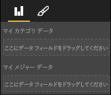

# <a name="capabilities-and-properties-of-power-bi-visuals"></a>Power BI ビジュアルの機能とプロパティ 

機能を使用して、ビジュアルに関する情報をホストに提供します。 機能モデルのプロパティはすべて `optional` です。

ビジュアルの機能のルート オブジェクトは、`dataRoles` や `dataViewMappings` などです。

```json
{
    "dataRoles": [ ... ],
    "dataViewMappings": [ ... ],
    "objects":  { ... },
    "supportsHighlight": true|false,
    "advancedEditModeSupport": 0|1|2,
    "sorting": { ... }
}

```

## <a name="define-the-data-fields-that-your-visual-expects-dataroles"></a>ビジュアルに必要なデータ フィールドを定義する: dataRoles

データにバインドできるフィールドを定義するには、`dataRoles` を使用します。 `dataRoles` では、必要なすべてのプロパティを定義する `DataViewRole` オブジェクトの配列を受け取ります。

### <a name="properties"></a>プロパティ

* **name**:このデータ フィールドの内部名 (一意である必要があります)。
* **kind**: フィールドの種類:
    * `Grouping`:メジャー フィールドをグループ化するために使用されるディスクリート値。
    * `Measure`:数値データ値。
    * `GroupingOrMeasure`:グループ化またはメジャーのいずれかとして使用できる値。
* **displayName**: **プロパティ** ウィンドウでユーザーに表示される名前。
* **description**: フィールドの簡単な説明 (省略可能)。
* **requiredTypes**: このデータ ロールに必要なデータの型。 一致しない値は null に設定されます (省略可能)。
* **preferredTypes**: このデータ ロールで優先されるデータの型 (省略可能)。

### <a name="valid-data-types-in-requiredtypes-and-preferredtypes"></a>requiredTypes と preferredTypes で有効なデータ型

* **bool**: ブール値
* **integer**: 整数値
* **numeric**: 数値
* **text**: テキスト値
* **geography**: 地理データ

### <a name="example"></a>例

```json
"dataRoles": [
    {
        "displayName": "My Category Data",
        "name": "myCategory",
        "kind": "Grouping",
        "requiredTypes": [
            {
                "text": true
            },
            {
                "numeric": true
            },
            {
                "integer": true
            }
        ],
        "preferredTypes": [
            {
                "text": true
            }
        ]
    },
    {
        "displayName": "My Measure Data",
        "name": "myMeasure",
        "kind": "Measure",
        "requiredTypes": [
            {
                "integer": true
            },
            {
                "numeric": true
            }
        ],
        "preferredTypes": [
            {
                "integer": true
            }
        ]
    },
    {
        "displayNameKey": "Visual_Location",
        "name": "Locations",
        "kind": "Measure",
        "displayName": "Locations",
        "requiredTypes": [
            {
                "geography": {
                    "address": true
                }
            },
            {
                "geography": {
                    "city": true
                }
            },
            {
                "geography": {
                    "continent": true
                }
            },
            {
                "geography": {
                    "country": true
                }
            },
            {
                "geography": {
                    "county": true
                }
            },
            {
                "geography": {
                    "place": true
                }
            },
            {
                "geography": {
                    "postalCode": true
                }
            },
            {
                "geography": {
                    "region": true
                }
            },
            {
                "geography": {
                    "stateOrProvince": true
                }
            }
        ]
    }
]
```

前のデータ ロールでは、次の画像に示すフィールドが作成されます。



## <a name="define-how-you-want-the-data-mapped-dataviewmappings"></a>データのマップ方法を定義する: dataViewMappings

DataViewMappings プロパティでは、データ ロールが相互にどのように関連しているかを説明し、それらの条件付き要件を指定することができます。

ほとんどのビジュアルでは 1 つのマッピングが提供されますが、複数の dataViewMapping を指定することができます。 有効なマッピングごとにデータ ビューが生成されます。 

```json
"dataViewMappings": [
    {
        "conditions": [ ... ],
        "categorical": { ... },
        "table": { ... },
        "single": { ... },
        "matrix": { ... }
    }
]
```

詳細については、「[Power BI ビジュアルでのデータ ビューのマッピングについて理解する](dataview-mappings.md)」を参照してください。

## <a name="define-property-pane-options-objects"></a>プロパティ ウィンドウのオプションを定義する: objects

オブジェクトでは、ビジュアルに関連付けられているカスタマイズ可能なプロパティを記述します。 各オブジェクトには複数のプロパティを含めることができ、各プロパティにはそれに関連付けられた型があります。 型は、プロパティの内容を示します。 

```json
"objects": {
    "myCustomObject": {
        "displayName": "My Object Name",
        "properties": { ... }
    }
}
```

詳細については、「[Power BI ビジュアルのオブジェクトとプロパティ](objects-properties.md)」を参照してください。

## <a name="handle-partial-highlighting-supportshighlight"></a>部分的な強調表示を処理する: supportsHighlight

既定では、この値は `false` に設定されています。これは、ページ上の何かが選択されたときに、値が自動的にフィルター処理されることを意味します。 この自動フィルター処理では、選択した値のみを表示するように、ビジュアルが更新されます。 完全なデータを表示するが、選択された項目のみを強調表示したい場合は、*capabilities.json* ファイルで `supportsHighlight` を `true` に設定する必要があります。

詳細については、「[Power BI ビジュアルでデータ ポイントを強調表示する](highlight.md)」を参照してください。

## <a name="handle-advanced-edit-mode-advancededitmodesupport"></a>高度な編集モードを処理する: advancedEditModeSupport

ビジュアルでは、高度な編集モードのサポートを宣言できます。 *capabilities.json* ファイルで特に指定されていない限り、既定では、ビジュアルで高度な編集モードはサポートされません。

詳細については、「[Power BI ビジュアルの高度な編集モード](advanced-edit-mode.md)」を参照してください。

## <a name="data-sorting-options-for-visual-sorting"></a>ビジュアルのデータ並べ替えオプション: sorting

ビジュアルでは、その capabilities を使用して並べ替え動作を定義できます。 *capabilities.json* ファイルに特に明記されていない限り、既定では、ビジュアルで並べ替え順序の変更はサポートされません。

詳細については、「[Power BI ビジュアルの並べ替えオプション](sort-options.md)」を参照してください。
