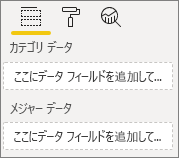
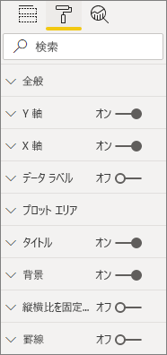
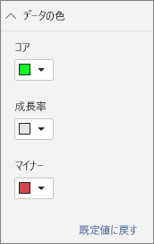

# <a name="build-a-bar-chart"></a>横棒グラフを作成する

この記事は、コードを使用してサンプル Power BI 横棒グラフを作成するためのステップ バイ ステップ ガイドです。 完全なコード例については、[https://github.com/Microsoft/PowerBI-visuals-sampleBarChart](https://github.com/Microsoft/PowerBI-visuals-sampleBarChart) をご覧ください。

## <a name="view-model"></a>モデルの表示
まず、横棒グラフのビュー モデルを定義し、ビルドしながらビジュアルに表示する内容を反復処理することが重要です。

```typescript
/**
 * Interface for BarCharts viewmodel.
 *
 * @interface
 * @property {BarChartDataPoint[]} dataPoints - Set of data points the visual will render.
 * @property {number} dataMax                 - Maximum data value in the set of data points.
 */
interface BarChartViewModel {
    dataPoints: BarChartDataPoint[];
    dataMax: number;
};

/**
 * Interface for BarChart data points.
 *
 * @interface
 * @property {number} value    - Data value for the point.
 * @property {string} category - Corresponding category of the data value.
 */
interface BarChartDataPoint {
    value: number;
    category: string;
};
```

### <a name="use-static-data"></a>静的データの使用

静的データの使用は、データ バインディングなしでビジュアルをテストするための優れた方法です。 後の手順でデータ バインディングを追加した後も、ビュー モデルは変更されません。

```typescript
let testData: BarChartDataPoint[] = [
    {
        value: 10,
        category: 'a'
    },
    {
        value: 20,
        category: 'b'
    },
    {
        value: 1,
        category: 'c'
    },
    {
        value: 100,
        category: 'd'
    },
    {
        value: 500,
        category: 'e'
    }];

let viewModel: BarChartViewModel = {
    dataPoints: testData,
    dataMax: d3.max(testData.map((dataPoint) => dataPoint.value))
};
```

## <a name="data-binding"></a>データ バインディング 
データ バインディングを追加するには、*capabilities.json* でビジュアル機能を定義します。 このサンプルコードには、使用するスキーマが既にあります。

データ バインディングは、Power BI の**フィールド** ウェルに対して機能します。



### <a name="add-data-roles"></a>データ ロールの追加
サンプルコードには既にデータ ロールがありますが、カスタマイズすることができます。

- `displayName` は**フィールド** ウェルに表示される名前です。
- `name` はデータ ロールを参照するために使用される内部名です。
- `kind` は、フィールドの種類を示します。 *Grouping* フィールド (0) には不連続値が含まれます。 *Measure* フィールド (1) には数値データ値が含まれます。

```json
"dataRoles": [
    {
        "displayName": "Category Data",
        "name": "category",
        "kind": 0
    },
    {
        "displayName": "Measure Data",
        "name": "measure",
        "kind": 1
    }
],
```

詳細については、[データ ロール](./capabilities.md#define-the-data-fields-that-your-visual-expects-dataroles)に関するページを参照してください。

### <a name="add-conditions-to-dataviewmapping"></a>DataViewMapping に条件を追加する
`dataViewMappings` 内で条件を定義して、各フィールド ウェルがバインドできるフィールドの数を設定します。 各フィールドを参照するには、データ ロールの内部 `name` を使用します。

```json
    "dataViewMappings": [
        {
            "conditions": [
                {
                    "category": {
                        "max": 1
                    },
                    "measure": {
                        "max": 1
                    }
                }
            ],
        }
    ]
```

詳細については、[データ ビューのマッピング](./dataview-mappings.md)に関する記事を参照してください。

### <a name="define-and-use-visualtransform"></a>visualTransform の定義と使用
`DataView` は、Power BI から視覚化するクエリ データを含むビジュアルに提供される構造です。 ただし、`DataView` は、カテゴリや表形式などのさまざまな形式でデータを提供できます。 `DataView` でカテゴリ別プロパティを使用するだけで、横棒グラフのようなカテゴリ別のビジュアルを作成できます。 `visualTransform` を定義すると、`DataView` をビジュアルで使用するビュー モデルに変換できます。

個々のデータ ポイントを定義するときに色を割り当てて選択するには、`IVisualHost` を使用します。 

```typescript
/**
 * Function that converts queried data into a view model that will be used by the visual
 *
 * @function
 * @param {VisualUpdateOptions} options - Contains references to the size of the container
 *                                        and the dataView which contains all the data
 *                                        the visual had queried.
 * @param {IVisualHost} host            - Contains references to the host which contains services
 */
function visualTransform(options: VisualUpdateOptions, host: IVisualHost): BarChartViewModel {
    /*Convert dataView to your viewModel*/
}

```

## <a name="color"></a>色 
色は、`IVisualHost` で使用できるサービスの 1 つとして公開されています。

### <a name="add-color-to-data-points"></a>データ ポイントへの色の追加
各データ ポイントは、異なる色で表されます。 `BarChartDataPoint` インターフェイスに色を追加します。

```typescript
/**
 * Interface for BarChart data points.
 *
 * @interface
 * @property {number} value    - Data value for the point.
 * @property {string} category - Corresponding category of the data value.
 * @property {string} color    - Color corresponding to the data point.
 */
interface BarChartDataPoint {
    value: number;
    category: string;
    color: string;
};
```

### <a name="the-colorpalette-service"></a>colorPalette サービス
`colorPalette` サービスでは、ビジュアルで使用する色を管理します。 そのインスタンスは `IVisualHost` で使用できます。

### <a name="assign-color-to-data-points"></a>データ ポイントへの色の割り当て
`dataView` を横棒グラフで使用できるビュー モデルに変換するコンストラクトとして、`visualTransform` を定義しています。 データ ポイントは `visualTransform` で反復処理するため、色を割り当てるのに最適な場所でもあります。

```typescript
let colorPalette: IColorPalette = host.colorPalette; // host: IVisualHost
for (let i = 0, len = Math.max(category.values.length, dataValue.values.length); i < len; i++) {
    barChartDataPoints.push({
        category: category.values[i],
        value: dataValue.values[i],
        color: colorPalette.getColor(category.values[i]).value,
    });
}
```

## <a name="selection-and-interactions"></a>選択と相互作用
選択を使用すると、ユーザーはビジュアルやその他のビジュアルを操作できるようになります。 

### <a name="add-selection-to-each-data-point"></a>各データ ポイントに選択を追加する
各データ ポイントは一意であるため、各データ ポイントに選択を追加します。 `BarChartDataPoint` インターフェイスで選択プロパティを追加します。

```typescript
/**
 * Interface for BarChart data points.
 *
 * @interface
 * @property {number} value             - Data value for the point.
 * @property {string} category          - Corresponding category of data value.
 * @property {string} color             - Color corresponding to data point.
 * @property {ISelectionId} selectionId - Id assigned to data point for cross filtering
 *                                        and visual interaction.
 */
interface BarChartDataPoint {
    value: number;
    category: string;
    color: string;
    selectionId: ISelectionId;
};
```

### <a name="assign-selection-ids-to-each-data-point"></a>各データ ポイントに選択 ID を割り当てる
データ ポイントは `visualTransform` で反復処理するため、選択 ID を作成するのに最適な場所でもあります。 ホスト変数は、色や選択ビルダーなど、ビジュアルで使用できるサービスを含む `IVisualHost` です。 

`IVisualHost` で `createSelectionIdBuilder` ファクトリ メソッドを使用して、新しい選択 ID を作成します。 データ ポイントごとに新しい選択ビルダーを作成します。

カテゴリのみに基づいて選択を行うため、`withCategory` の選択のみを定義する必要があります。

```typescript
for (let i = 0, len = Math.max(category.values.length, dataValue.values.length); i < len; i++) {
    barChartDataPoints.push({
        category: category.values[i],
        value: dataValue.values[i],
        color: colorPalette.getColor(category.values[i]).value,
        selectionId: host.createSelectionIdBuilder()
            .withCategory(category, i)
            .createSelectionId()
    });
}
```

詳細については、「[選択ビルダーのインスタンスを作成する](./selection-api.md#create-an-instance-of-the-selection-builder)」を参照してください。

### <a name="interact-with-data-points"></a>データ ポイントの操作
データ ポイントに選択 ID が割り当てられると、横棒グラフの各棒を操作できます。 横棒グラフは `click` イベントをリッスンします。

クロス フィルター処理と選択解除用の選択マネージャーを作成するには、`IVisualHost` の `selectionManager` ファクトリ メソッドを使用します。

```typescript
let selectionManager = this.selectionManager;

//This must be an anonymous function instead of a lambda because
//d3 uses 'this' as the reference to the element that was clicked.
bars.on('click', function(d) {
    selectionManager.select(d.selectionId).then((ids: ISelectionId[]) => {
        bars.attr({
            'fill-opacity': ids.length > 0 ? BarChart.Config.transparentOpacity : BarChart.Config.solidOpacity
        });

        d3.select(this).attr({
            'fill-opacity': BarChart.Config.solidOpacity
        });
    });

    (<Event>d3.event).stopPropagation();
});
```

詳細については、[SelectionManager を使用する方法](./selection-api.md#how-to-use-selectionmanager-to-select-data-points)に関する記事を参照してください。

## <a name="static-objects"></a>静的オブジェクト

オブジェクトを**プロパティ** ウィンドウに追加して、ビジュアルをさらにカスタマイズすることができます。 これらのカスタマイズは、ユーザー インターフェイスの変更、またはクエリされたデータに関連する変更になります。 このサンプルでは、静的オブジェクトを使用して、横棒グラフの X 軸を表示します。

**プロパティ** ウィンドウでは、オブジェクトのオンとオフを切り替えることができます。



### <a name="define-objects-in-capabilities"></a>機能でオブジェクトを定義する
**プロパティ** ウィンドウに表示するオブジェクトについては、*capabilities.json* ファイルで `objects` プロパティを定義します。
- `enableAxis` は、`dataView` が参照する内部名です。 
- `displayName` は、**プロパティ** ウィンドウに表示される名前です。
- `bool` は、通常、テキスト ボックスやスイッチなどの静的オブジェクトと共に使用されるプリミティブ値です。
- `show` はオブジェクトの `show` スイッチを有効にする `properties` の特別なプロパティです。 `show` はスイッチであるため、`bool` として入力されます。


```typescript
"objects": {
    "enableAxis": {
        "displayName": "Enable Axis",
        "properties": {
            "show": {
                "displayName": "Enable Axis",
                "type": { "bool": true }
            }
        }
    }
}
```

詳細については、[オブジェクト](./objects-properties.md)に関する記事を参照してください。

### <a name="define-property-settings"></a>プロパティ設定の定義

以下のセクションでは、プロパティ設定を定義するための基本原則について説明します。 `powerbi-visuals-utils-dataviewutils` パッケージで定義されているユーティリティ クラスを使用して、プロパティ設定を定義することもできます。 詳細については、[DataViewObjectsParser](https://github.com/Microsoft/powerbi-visuals-utils-dataviewutils/blob/master/docs/api/data-view-objects-parser.md) クラスのドキュメントとサンプルを参照してください。


省略可能ですが、簡単に参照できるように、ほとんどの設定を 1 つのオブジェクトにローカライズすることをお勧めします。

```typescript
/**
 * Interface for BarCharts viewmodel.
 *
 * @interface
 * @property {BarChartDataPoint[]} dataPoints - Set of data points the visual will render.
 * @property {number} dataMax                 - Maximum data value in the set of data points.
 * @property {BarChartSettings} settings      - Object property settings
 */
interface BarChartViewModel {
    dataPoints: BarChartDataPoint[];
    dataMax: number;
    settings: BarChartSettings;
};

/**
 * Interface for BarChart settings.
 *
 * @interface
 * @property "show" enableAxis - Object property that allows axis to be enabled.
 */
interface BarChartSettings {
    enableAxis: {
        show: boolean;
    };
}
```

### <a name="define-and-use-objectenumerationutility"></a>ObjectEnumerationUtility を定義して使用する
オブジェクトのプロパティ値は `dataView` ではメタデータとして使用できますが、これらのプロパティを取得するためのサービスはありません。 `ObjectEnumerationUtility` は、`dataView` からオブジェクトの値を取得するため、または他のビジュアル プロジェクトに使用できる一連の静的関数です。 `ObjectEnumerationUtility` は省略可能ですが、オブジェクトのプロパティを取得するために `dataView` を反復処理する場合に適しています。

```typescript
/**
 * Gets property value for a particular object.
 *
 * @function
 * @param {DataViewObjects} objects - Map of defined objects.
 * @param {string} objectName       - Name of desired object.
 * @param {string} propertyName     - Name of desired property.
 * @param {T} defaultValue          - Default value of desired property.
 */
export function getValue<T>(objects: DataViewObjects, objectName: string, propertyName: string, defaultValue: T ): T {
    if(objects) {
        let object = objects[objectName];
        if(object) {
            let property: T = object[propertyName];
            if(property !== undefined) {
                return property;
            }
        }
    }
    return defaultValue;
}
```

ソース コードについては、[objectEnumerationUtility.ts](https://github.com/Microsoft/PowerBI-visuals-sampleBarChart/blob/master/src/objectEnumerationUtility.ts) を参照してください。

### <a name="retrieve-property-values-from-dataview"></a>dataView からプロパティ値を取得する
`visualTransform` は、ビジュアルのビュー モデルを操作するのに最適な場所です。 このパターンを続行するには、`dataView` からオブジェクトのプロパティを取得します。

プロパティの既定の状態を定義し、`getValue` を使用して `dataView` からプロパティを取得します。

```typescript
let defaultSettings: BarChartSettings = {
    enableAxis: {
        show: false,
    }
};

let barChartSettings: BarChartSettings = {
    enableAxis: {
        show: getValue<boolean>(objects, 'enableAxis', 'show', defaultSettings.enableAxis.show),
    }
}
```

### <a name="populate-property-pane-with-enumerateobjectinstances"></a>enumerateObjectInstances を使用してプロパティ ウィンドウを設定する
`IVisual` の省略可能なメソッド `enumerateObjectInstances` は、すべてのオブジェクトを列挙し、**プロパティ** ウィンドウ内にデプロイします。 各オブジェクトは `enumerateObjectInstances` で呼び出されます。 オブジェクトの名前は `EnumerateVisualObjectInstancesOptions` で使用できます。

各オブジェクトについて、現在の状態を使用してプロパティを定義します。

```typescript
/**
 * Enumerates through the objects defined in the capabilities and adds the properties to the format pane
 *
 * @function
 * @param {EnumerateVisualObjectInstancesOptions} options - Map of defined objects
 */
public enumerateObjectInstances(options: EnumerateVisualObjectInstancesOptions): VisualObjectInstanceEnumeration {
    let objectName = options.objectName;
    let objectEnumeration: VisualObjectInstance[] = [];

    switch(objectName) {
        case 'enableAxis':
            objectEnumeration.push({
                objectName: objectName,
                properties: {
                    show: this.barChartSettings.enableAxis.show,
                },
                selector: null
            });
    };

    return objectEnumeration;
}
```

### <a name="control-property-update-logic"></a>コントロール プロパティの更新ロジック
オブジェクトが**プロパティ** ウィンドウに追加されると、各トグルによって更新がトリガーされます。 `if` ブロックに特定のオブジェクト ロジックを追加します。

```typescript
if(settings.enableAxis.show) {
    let margins = BarChart.Config.margins;
    height -= margins.bottom;
}
```

## <a name="databound-objects"></a>データバインド オブジェクト
データバインド オブジェクトは静的オブジェクトに似ていますが、通常はデータの選択を処理します。 たとえば、データ ポイントに関連付けられている色を変更できます。



### <a name="define-object-in-capabilities"></a>機能でのオブジェクトの定義
静的オブジェクトと同様に、*capabilities.json* で別のオブジェクトを定義します。 
- `colorSelector` は、`dataView` が参照する内部名です。
- `displayName` は、**プロパティ** ウィンドウに表示される名前です。
- `fill` は、プリミティブ型に関連付けられていない構造オブジェクトの値です。

```typescript
"colorSelector": {
    "displayName": "Data Colors",
    "properties": {
        "fill": {
            "displayName": "Color",
            "type": {
                "fill": {
                    "solid": {
                        "color": true
                    }
                }
            }
        }
    }
}
```

詳細については、[オブジェクト](./objects-properties.md)に関する記事を参照してください。

### <a name="use-objectenumerationutility"></a>ObjectEnumerationUtility を使用する
静的オブジェクトと同様に、`dataView` からオブジェクトの詳細を取得する必要があります。 ただし、オブジェクトの値はメタデータ内にあるのではなく、各カテゴリに関連付けられています。

```typescript
/**
 * Gets property value for a particular object in a category.
 *
 * @function
 * @param {DataViewCategoryColumn} category - List of category objects.
 * @param {number} index                    - Index of category object.
 * @param {string} objectName               - Name of desired object.
 * @param {string} propertyName             - Name of desired property.
 * @param {T} defaultValue                  - Default value of desired property.
 */
export function getCategoricalObjectValue<T>(category: DataViewCategoryColumn, index: number, objectName: string, propertyName: string, defaultValue: T): T {
    let categoryObjects = category.objects;

    if(categoryObjects) {
        let categoryObject: DataViewObject = categoryObjects[index];
        if(categoryObject) {
            let object = categoryObject[objectName];
            if(object) {
                let property: T = object[propertyName];
                if(property !== undefined) {
                    return property;
                }
            }
        }
    }
    return defaultValue;
}
```

ソース コードについては、[objectEnumerationUtility.ts](https://github.com/Microsoft/PowerBI-visuals-sampleBarChart/blob/master/src/objectEnumerationUtility.ts) を参照してください。

### <a name="define-default-color-and-retrieve-categorical-object-from-dataview"></a>既定の色を定義し、dataView からカテゴリ オブジェクトを取得する
各色は `dataView` 内の各カテゴリに関連付けられています。 各データ ポイントに対応する色を設定できます。

```typescript
for (let i = 0, len = Math.max(category.values.length, dataValue.values.length); i < len; i++) {
    let defaultColor: Fill = {
        solid: {
            color: colorPalette.getColor(category.values[i]).value
        }
    }

    barChartDataPoints.push({
        category: category.values[i],
        value: dataValue.values[i],
        color: getCategoricalObjectValue<Fill>(category, i, 'colorSelector', 'fill', defaultColor).solid.color,
        selectionId: host.createSelectionIdBuilder()
            .withCategory(category, i)
            .createSelectionId()
    });
}
```

### <a name="populate-property-pane-with-enumerateobjectinstances"></a>enumerateObjectInstances を使用してプロパティ ウィンドウを設定する
`enumerateObjectInstances` を使用して、**プロパティ** ウィンドウでオブジェクトを設定します。 

このインスタンスでは、カラー ピッカーを追加して、**プロパティ** ウィンドウに各カテゴリを表示します。 これを行うには、`colorSelector` の `switch` ステートメントに追加のケースを追加し、関連付けられた色を使用して各データ ポイントを反復処理します。 

色をデータ ポイントに関連付けるには、選択が必要になります。

```typescript
/**
 * Enumerates through the objects defined in the capabilities and adds the properties to the format pane
 *
 * @function
 * @param {EnumerateVisualObjectInstancesOptions} options - Map of defined objects
 */
public enumerateObjectInstances(options: EnumerateVisualObjectInstancesOptions): VisualObjectInstanceEnumeration {
    let objectName = options.objectName;
    let objectEnumeration: VisualObjectInstance[] = [];

    switch(objectName) {
        case 'enableAxis':
            objectEnumeration.push({
                objectName: objectName,
                properties: {
                    show: this.barChartSettings.enableAxis.show,
                },
                selector: null
            });
            break;
        case 'colorSelector':
            for(let barDataPoint of this.barDataPoints) {
                objectEnumeration.push({
                    objectName: objectName,
                    displayName: barDataPoint.category,
                    properties: {
                        fill: {
                            solid: {
                                color: barDataPoint.color
                            }
                        }
                    },
                    selector: barDataPoint.selectionId.getSelector()
                });
            }
            break;
    };

    return objectEnumeration;
}
```

各プロパティのセレクターを指定すると、次の `dataView` オブジェクト配列が得られます。


配列 `dataViews[0].categorical.categories[0].objects` の各項目は、データセットの具象カテゴリに対応しています。

関数 `getCategoricalObjectValue` は、カテゴリ インデックスによってプロパティにアクセスする便利な方法を提供します。 *capabilities.json* のオブジェクトとプロパティに一致する `objectName` と `propertyName` を指定する必要があります。

## <a name="other-features"></a>その他の機能 
スライダー コントロールまたはヒントを横棒グラフに追加できます。 追加するコードについては、[透明度を制御するプロパティ ウィンドウ スライダーを追加する](https://github.com/Microsoft/PowerBI-visuals-sampleBarChart/commit/e2e0bc5888d9a3ca305a7a7af5046068645c8b30)方法に関する記事と、[ヒントのサポートを追加する](https://github.com/Microsoft/PowerBI-visuals-sampleBarChart/commit/981b021612d7b333adffe9f723ab27783c76fb14)方法に関する記事のコミットを参照してください。 ヒントの詳細については、「[Power BI ビジュアルのヒント](./add-tooltips.md)」を参照してください。

## <a name="packaging"></a>パッケージ

ビジュアルを [Power BI Desktop](https://powerbi.microsoft.com/desktop/) に読み込む場合、またはビジュアルを [Power BI ビジュアル ギャラリー](https://visuals.powerbi.com/)でコミュニティと共有する場合は、あらかじめパッケージ化する必要があります。 ファイル *.pbiviz* が含まれているビジュアル プロジェクトのルート フォルダーに移動し、次のコマンドを使用して *pbiviz* ファイルを生成します。

```bash
pbiviz package
```
このコマンドは、ビジュアル プロジェクトの *dist/* ディレクトリに *pbiviz* ファイルを作成し、以前のパッケージ操作から *pbiviz* ファイルを上書きします。

## <a name="next-steps"></a>次の手順
ビジュアルには次の機能を追加できます。
* [ビジュアルにコンテキスト メニューを追加する](./context-menu.md)
* [ランディング ページ](./landing-page.md)
* [URL の起動](./launch-url.md)
* [ロケールのサポート](./localization.md)