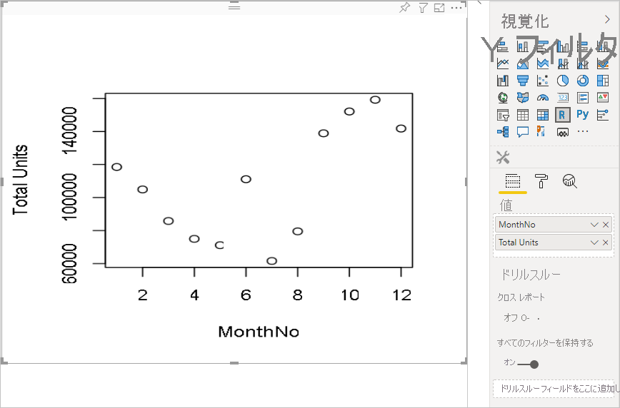
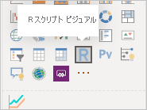
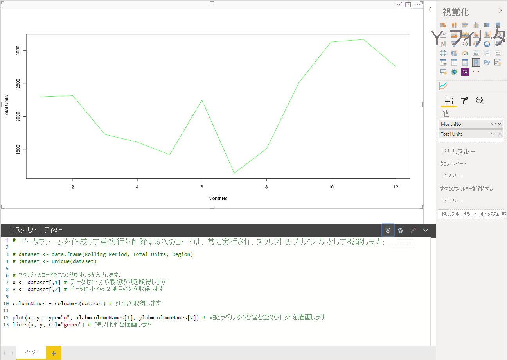
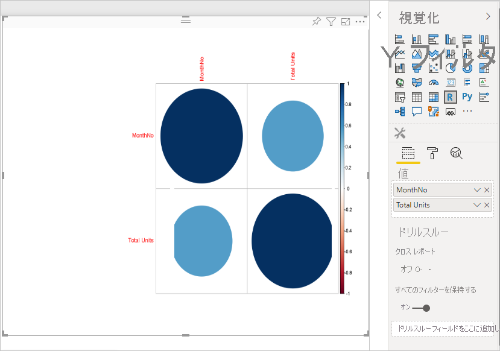
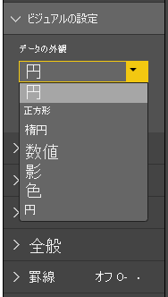
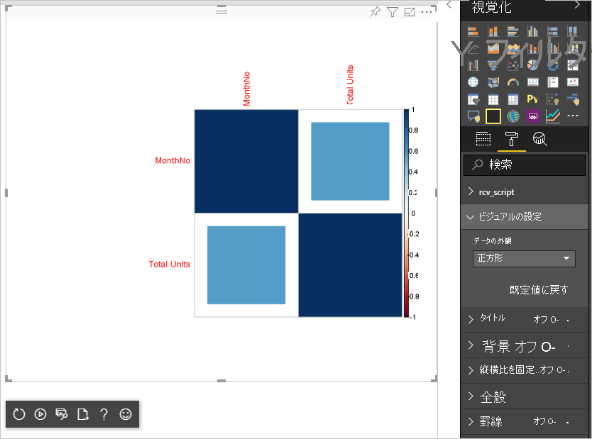

# <a name="tutorial-create-an-r-powered-power-bi-visual"></a>チュートリアル:R を利用した Power BI 視覚エフェクトを作成する

このチュートリアルでは、R を利用した Power BI の視覚エフェクトを作成する方法について説明します。

このチュートリアルで学習する内容は次のとおりです。

> [!div class="checklist"]
>
> * R を利用した視覚エフェクトを作成する
> * Power BI Desktop で R スクリプトを編集する
> * 視覚エフェクトにライブラリを追加する
> * 静的プロパティを追加する

## <a name="prerequisites"></a>前提条件

* **Power BI Pro** アカウント。 開始する前に、[無料試用版にサインアップ](https://powerbi.microsoft.com/pricing/)してください。
* R エンジン。 これはさまざまな場所から無料でダウンロードできます。たとえば、[Revolution Open ダウンロード ページ](https://mran.revolutionanalytics.com/download/)や [CRAN Repository](https://cran.r-project.org/bin/windows/base/) があります。 詳細については、「[R を使用した Power BI ビジュアルの作成](../../desktop-r-visuals.md)」をご覧ください。
* [Power BI Desktop](../../fundamentals/desktop-get-the-desktop.md)。
* Windows ユーザーの場合は [Windows PowerShell](https://docs.microsoft.com/powershell/scripting/install/installing-windows-powershell?view=powershell-6) バージョン 4 以降、OSX ユーザーの場合は[ターミナル](https://macpaw.com/how-to/use-terminal-on-mac)。

## <a name="getting-started"></a>作業の開始

1. 視覚エフェクト用のサンプル データを準備します。 次の値を Excel データベースまたは *.csv* ファイルに保存し、Power BI Desktop にインポートできます。

    | MonthNo | 合計ユニット数 |
    |-----|-----|
    | 1 | 2303 |
    | 2 | 2319 |
    | 3 | 1732 |
    | 4 | 1615 |
    | 5 | 1427 |
    | 6 | 2253 |
    | 7 | 1147 |
    | 8 | 1515 |
    | 9 | 2516 |
    | 10 | 3131 |
    | 11 | 3170 |
    | 12 | 2762 |

1. 視覚エフェクトを作成するには、PowerShell またはターミナルを開き、次のコマンドを実行します。

   ```cmd
   pbiviz new rVisualSample -t rvisual
   ```

   このコマンドを実行すると、`rvisual` テンプレートに基づいて新しいフォルダー構造が作成されます。 このテンプレートには、次の R スクリプトを実行する、基本的かつすぐに実行可能な R を利用した視覚エフェクトが含まれています。

   ```r
   plot(Values)
   ```

   `Values` データ フレームには `Values` データ ロールの列が含まれます。

1. 開発者向け視覚エフェクトにデータを割り当てるには、視覚エフェクトの **Values** に **MonthNo** と**合計ユニット数**を追加します。

   

## <a name="editing-the-r-script"></a>R スクリプトの編集

`pbiviz` を使用して、`rvisual` テンプレートに基づいて R を利用した視覚エフェクトを作成すると、視覚エフェクトのルート フォルダーに *script.r* というファイルが作成されます。 このファイルには、ユーザーに対して画像を生成するために実行される R スクリプトが格納されています。 Power BI Desktop で R スクリプトを作成できます。

1. Power BI Desktop で、 **[R スクリプト ビジュアル]** を選択します。

   

1. 次の R コードを **[R スクリプト エディター]** に貼り付けます。

    ```r
    x <- dataset[,1] # get the first column from dataset
    y <- dataset[,2] # get the second column from dataset

    columnNames = colnames(dataset) # get column names

    plot(x, y, type="n", xlab=columnNames[1], ylab=columnNames[2]) # draw empty plot with axis and labels only
    lines(x, y, col="green") # draw line plot
    ```

1. **[スクリプトの実行]** アイコンを選択して、結果を確認します。

    

1. R スクリプトの準備ができたら、前の手順の 1 つで作成した視覚化プロジェクトの `script.r` ファイルにそれをコピーします。

1. *capabilities.json* 内の `dataRoles` の `name` を `dataRoles` に変更します。 Power BI では、`dataset` データ フレーム オブジェクトとして R スクリプト視覚エフェクトにデータが渡されますが、R 視覚エフェクトでは `dataRoles` の名前に従ってデータ フレーム名が取得されます。

    ```json
    {
      "dataRoles": [
        {
          "displayName": "Values",
          "kind": "GroupingOrMeasure",
          "name": "dataRoles"
        }
      ],
      "dataViewMappings": [
        {
          "scriptResult": {
            "dataInput": {
              "table": {
                "rows": {
                  "select": [
                    {
                      "for": {
                        "in": "dataset"
                      }
                    }
                  ],
                  "dataReductionAlgorithm": {
                    "top": {}
                  }
                }
              }
            },
            ...
          }
        }
      ],
    }
    ```

1. *src/visual.ts* ファイルに、画像のサイズ変更をサポートする次のコードを追加します。

    ```typescript
      public onResizing(finalViewport: IViewport): void {
          this.imageDiv.style.height = finalViewport.height + "px";
          this.imageDiv.style.width = finalViewport.width + "px";
          this.imageElement.style.height = finalViewport.height + "px";
          this.imageElement.style.width = finalViewport.width + "px";
      }
    ```

## <a name="add-libraries-to-visual-package"></a>視覚化パッケージにライブラリを追加する

この手順により、視覚エフェクトで `corrplot` パッケージを使用できるようになります。

1. 視覚エフェクト用のライブラリの依存関係を `dependencies.json` に追加します。 ファイルの内容の例を次に示します。

    ```json
    {
      "cranPackages": [
        {
          "name": "corrplot",
          "displayName": "corrplot",
          "url": "https://cran.r-project.org/web/packages/corrplot/"
        }
      ]
    }
    ```

    `corrplot` パッケージは、相関マトリックスのグラフィカルな表示です。 `corrplot` の詳細については、「[corrplot パッケージの概要](https://cran.r-project.org/web/packages/corrplot/vignettes/corrplot-intro.html)」を参照してください。

1. これらの変更を行った後、`script.r` ファイルでパッケージの使用を開始します。

    ```r
    library(corrplot)
    corr <- cor(dataset)
    corrplot(corr, method="circle", order = "hclust")
    ```

`corrplot` パッケージを使用した結果は、次の例のようになります。



## <a name="adding-a-static-property-to-the-property-pane"></a>プロパティ ペインに静的プロパティを追加する

ユーザーが UI の設定を変更できるようにします。 これを行うには、R スクリプトのユーザー入力に基づく動作を変更するプロパティをプロパティ ペインに追加します。

`corrplot` 関数の `method` 引数を使用して、`corrplot` を構成できます。 既定のスクリプトでは、円が使用されます。 視覚エフェクトを変更して、ユーザーが複数のオプションから選択できるようにします。

1. *capabilities.json* ファイルでオブジェクトとプロパティを定義します。 次に、enumeration メソッドでこのオブジェクト名を使用して、プロパティ ペインからこれらの値を取得します。

    ```json
    {
      "settings": {
      "displayName": "Visual Settings",
      "description": "Settings to control the look and feel of the visual",
      "properties": {
        "method": {
          "displayName": "Data Look",
          "description": "Control the look and feel of the data points in the visual",
          "type": {
            "enumeration": [
              {
                "displayName": "Circle",
                "value": "circle"
              },
              {
                "displayName": "Square",
                "value": "square"
              },
              {
                "displayName": "Ellipse",
                "value": "ellipse"
              },
              {
                "displayName": "Number",
                "value": "number"
              },
              {
                "displayName": "Shade",
                "value": "shade"
              },
              {
                "displayName": "Color",
                "value": "color"
              },
              {
                "displayName": "Pie",
                "value": "pie"
              }
            ]
          }
        }
      }
    }
    ```

1. *src/settings.ts* ファイルを開きます。 パブリック プロパティ `method` を持つ `CorrPlotSettings` クラスを作成します。 型は `string` で、既定値は `circle` です。 既定値を使用して `VisualSettings` クラスに `settings` プロパティを追加します。

    ```typescript
    "use strict";

    import { dataViewObjectsParser } from "powerbi-visuals-utils-dataviewutils";
    import DataViewObjectsParser = dataViewObjectsParser.DataViewObjectsParser;

    export class VisualSettings extends DataViewObjectsParser {
      public rcv_script: rcv_scriptSettings = new rcv_scriptSettings();
      public settings: CorrPlotSettings = new CorrPlotSettings();
    }

    export class CorrPlotSettings {
      public method: string = "circle";
    }

    export class rcv_scriptSettings {
      public provider;
      public source;
    }
    ```

    これらの手順の後、視覚エフェクトのプロパティを変更できます。

   

    最後に、R スクリプトは必ずプロパティによって開始されます。 ユーザーがプロパティを変更しない場合、視覚エフェクトでこのプロパティの値が取得されることはありません。

    プロパティの R ランタイム変数の名前付け規則は `<objectname>_<propertyname>` です。この場合は `settings_method` です。

1. 次のコードに一致するように、視覚エフェクトの R スクリプトを変更します。

    ```r
    library(corrplot)
    corr <- cor(dataset)

    if (!exists("settings_method"))
    {
        settings_method = "circle";
    }

    corrplot(corr, method=settings_method, order = "hclust")
    ```

最終的な視覚エフェクトは、次の例のようになります。



## <a name="next-steps"></a>次の手順

R を利用した視覚エフェクトの詳細については、「[Power BI で R を利用した Power BI ビジュアルを使用する](../../desktop-r-powered-custom-visuals.md)」をご覧ください。

Power BI Desktop での R を利用した視覚エフェクトの詳細については、「[R を使用した Power BI ビジュアルの作成](../../desktop-r-visuals.md)」をご覧ください。
