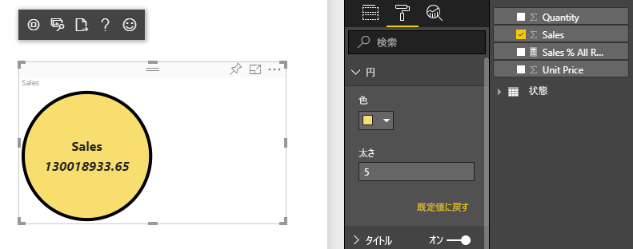
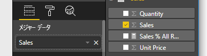

# <a name="tutorial-create-a-react-based-visual"></a>チュートリアル:React ベースのビジュアルを作成する

このチュートリアルでは、[React](https://reactjs.org/) を使用して Power BI のビジュアルを作成する方法を説明します。 ビジュアルでは、円の中に値が表示されます。 ビジュアルには、カスタマイズするためのアダプティブなサイズと設定があります。 この記事の情報を使用すると、React を使用して独自の Power BI ビジュアルを作成できます。



このチュートリアルで学習する内容は次のとおりです。

> [!div class="checklist"]
>
> * 開発環境を設定する
> * React ビジュアルを作成する
> * ビジュアルの機能を構成する
> * Power BI からのデータをレンダリングする
> * ビジュアルのサイズを変更する
> * ビジュアルをカスタマイズ可能にする

## <a name="prerequisites"></a>前提条件

* **Power BI Pro** アカウント。 開始する前に、[無料試用版にサインアップ](https://powerbi.microsoft.com/pricing/)してください。
* [Visual Studio Code](https://www.visualstudio.com/)。
* Windows ユーザーの場合は [Windows PowerShell](https://docs.microsoft.com/powershell/scripting/install/installing-windows-powershell?view=powershell-6) バージョン 4 以降、OSX ユーザーの場合は[ターミナル](https://macpaw.com/how-to/use-terminal-on-mac)。
* 「[開発者環境を設定する](custom-visual-develop-tutorial.md#setting-up-the-developer-environment)」で説明されている環境。

## <a name="getting-started"></a>作業の開始

まず、`pbiviz` を使用して、最小限の Power BI ビジュアルを作成します。 プロジェクトとプロジェクトの構造の詳細については、「[Power BI ビジュアル プロジェクトの構造](visual-project-structure.md)」を参照してください。 このビジュアルの完全なソース コードについては、[Circle Card React ビジュアル](https://github.com/Microsoft/powerbi-visuals-circlecard-react)に関するページを参照してください。

[GitHub](https://github.com/Microsoft/powerbi-visuals-circlecard-react) から、ビジュアルの完全なソース コードをクローンしたりダウンロードしたりできます。

1. PowerShell を開き、次のコマンドを実行します。

   ```powershell
   pbiviz new ReactCircleCard
   ```

   このコマンドにより、*ReactCircleCard* という名前のフォルダーが作成されます。

1. ディレクトリをそのフォルダーに変更し、Visual Studio Code を開きます。

   ```powershell
   cd ./ReactCircleCard
   code .
   ```

1. ビジュアルの開発者サーバーを起動します。

   ```powershell
   pbiviz start
   ```

   

この基本ビジュアルは、更新の数を表します。 次の手順で、Circle Card に変換してみましょう。

## <a name="change-the-visual-to-a-circle-card"></a>ビジュアルを Circle Card に変更する

この基本ビジュアルは、更新の数を表します。 次に、それを Circle Card に変換します。Circle Card は、メジャーとそのタイトルを表します。

1. 次のコマンドを実行して、必要な依存関係をインストールします。

   ```powershell
   npm i react react-dom
   ```

1. 次のコマンドを実行して、React 16 および対応するバージョンの `react-dom` と型指定をインストールします。

   ```powershell
   npm i @types/react @types/react-dom
   ```

1. React コンポーネント クラスを作成します。 Visual Studio Code で、 **[ファイル]**  >  **[新しいファイル]** の順に選択します。 ファイルに次のコードをコピーします。

    ```typescript
    import * as React from "react";

    export class ReactCircleCard extends React.Component<{}>{
        render(){
            return (
                <div className="circleCard">
                    Hello, React!
                </div>
            )
        }
    }

    export default ReactCircleCard;
    ```

1. **[名前を付けて保存]** を選択します。 *src* ディレクトリに移動します。 「*component*」という名前を入力します。 **[ファイルの種類]** には、 **[TypeScript React]** を選択します。

1. *src/visual.ts* を開きます。 現在のコードを次のコードに置き換えます。

    ```typescript
    "use strict";
    import powerbi from "powerbi-visuals-api";

    import DataView = powerbi.DataView;
    import VisualConstructorOptions = powerbi.extensibility.visual.VisualConstructorOptions;
    import VisualUpdateOptions = powerbi.extensibility.visual.VisualUpdateOptions;
    import IVisual = powerbi.extensibility.visual.IVisual;

    import "./../style/visual.less";

    export class Visual implements IVisual {

        constructor(options: VisualConstructorOptions) {

        }

        public update(options: VisualUpdateOptions) {

        }
    }
    ```

1. React 依存関係と先ほど追加したコンポーネントをインポートします。

    ```typescript
    import * as React from "react";
    import * as ReactDOM from "react-dom";
    ...
    import ReactCircleCard from "./component";
    ```

   既定の Power BI TypeScript の設定では、React *tsx* ファイルは受け付けられません。 Visual Studio Code では、`component` がエラーとして強調表示されます。

1. *tsconfig.json* ファイルを開き、`compilerOptions` 項目の先頭に 2 行を追加します。

    ```json
    {
      "compilerOptions": {
        "jsx": "react",
        "types": ["react", "react-dom"],
        //...
      }
    }
    ```

   `component` のエラーが解消されるはずです。

   コンポーネントをレンダリングするには、対象の HTML 要素を追加します。 この要素は、`VisualConstructorOptions` の `HTMLElement` であり、コンストラクターに渡されます。

1. 次のコードのように、`Visual` クラスを変更します。

    ```typescript
      private target: HTMLElement;
      private reactRoot: React.ComponentElement<any, any>;

      constructor(options: VisualConstructorOptions) {
          this.reactRoot = React.createElement(ReactCircleCard, {});
          this.target = options.element;

          ReactDOM.render(this.reactRoot, this.target);
      }
    ```

1. 変更を保存し、次のコマンドを使用して既存のコードを実行します。

    ```bash
    pbiviz start
    ```

   > [!NOTE]
   > 以前に `pbiviz` を実行した場合は、*tsconfig.json* の変更を適用するために再起動する必要があります。

  

## <a name="configure-capabilities"></a>機能を構成する

ビジュアルの機能を構成できます。

1. `capabilities.json` を開きます。 `dataRoles` から `Category Data` オブジェクトを削除します。 `ReactCircleCard` には 1 つの値を表示するため、`Measure Data` だけが必要です。 `dataRoles` キーは、現在、次のようになっています。

    ```json
    "dataRoles": [
        {
            "displayName": "Measure Data",
            "name": "measure",
            "kind": "Measure"
        }
    ],
    ```

1. `objects` キーのすべての内容を削除します。 後で内容を記述します。

    ```json
        "objects": {},
    ```

1. `dataViewMappings` プロパティの次のコードをコピーします。 `max: 1` の値は、1 つのメジャー列だけを送信できることを意味します。

    ```json
        "dataViewMappings": [
            {
                "conditions": [
                    {
                        "measure": {
                            "max": 1
                        }
                    }
                ],
                "single": {
                    "role": "measure"
                }
            }
        ]
    ```

これで、[`Fields`] ペインのデータをビジュアルの設定に取り込むことができるようになりました。



## <a name="receive-properties-from-power-bi"></a>Power BI からプロパティを受け取る

React を使用して、データをレンダリングできます。 コンポーネントでは、独自の状態のデータを表示できます。

1. *src/component.tsx* を変更します。

    ```javascript
    export interface State {
        textLabel: string,
        textValue: string
    }

    export const initialState: State = {
        textLabel: "",
        textValue: ""
    }

    export class ReactCircleCard extends React.Component<{}, State>{
        constructor(props: any){
            super(props);
            this.state = initialState;
        }

        render(){
            const { textLabel, textValue } = this.state;

            return (
                <div className="circleCard">
                    <p>
                        {textLabel}
                        <br/>
                        <em>{textValue}</em>
                    </p>
                </div>
            )
        }
    }
    ```

1. *styles/visual.less* を編集して、新しいマークアップのスタイルを追加します。

    ```css
    .circleCard {
        position: relative;
        box-sizing: border-box;
        border: 1px solid #000;
        border-radius: 50%;
        width: 200px;
        height: 200px;
    }

    p {
        text-align: center;
        line-height: 30px;
        font-size: 20px;
        font-weight: bold;

        position: relative;
        top: -30px;
        margin: 50% 0 0 0;
    }
    ```

1. ビジュアルは、現在のデータを `update` メソッドの引数として受け取ります。 *src/visual.ts* を開いて、`ReactCircleCard.update` にコードを追加します。

    ```typescript
    //...
    import { ReactCircleCard, initialState } from "./component";
    //...

    export class Visual implements IVisual {
        //...
        public update(options: VisualUpdateOptions) {

            if(options.dataViews && options.dataViews[0]){
                const dataView: DataView = options.dataViews[0];

                ReactCircleCard.update({
                    textLabel: dataView.metadata.columns[0].displayName,
                    textValue: dataView.single.value.toString()
                });
            }
            } else {
                this.clear();
            }
        }

        private clear() {
            ReactCircleCard.update(initialState);
        }
    }
    ```

    このコードでは、`DataView` の `textLabel` と `textValue` を選択し、データが存在する場合はコンポーネントの状態を更新します。

1. コンポーネント インスタンスに更新を送信するには、`ReactCircleCard` クラスに次のコードを挿入します。

    ```typescript
        private static updateCallback: (data: object) => void = null;

        public static update(newState: State) {
            if(typeof ReactCircleCard.updateCallback === 'function'){
                ReactCircleCard.updateCallback(newState);
            }
        }

        public state: State = initialState;

        public componentWillMount() {
            ReactCircleCard.updateCallback = (newState: State): void => { this.setState(newState); };
        }

        public componentWillUnmount() {
            ReactCircleCard.updateCallback = null;
        }
    ```

1. ビジュアルをテストします。 `pbiviz start` が実行されたことを確認し、すべてのファイルを保存します。 ビジュアルを更新します。

   

## <a name="make-component-resizable"></a>コンポーネントのサイズを変更できるようにする

このセクションでは、コンポーネントのサイズを変更できるようにします。 現在、コンポーネントの幅と高さは固定されています。

`options` オブジェクトから、ビジュアル ビューポートの現在のサイズを取得します。

1. *src/visual.ts* を開きます。 `IViewport` インターフェイスをインポートし、`viewport` プロパティを `visual` クラスに追加します。

    ```typescript
    import IViewport = powerbi.IViewport;

    //...

    export class Visual implements IVisual {
        private viewport: IViewport;
        //...
    }
    ```

1. `visual` の `update` メソッドに、次のコードを追加します。

    ```typescript
      if (options.dataViews && options.dataViews[0]) {
          const dataView: DataView = options.dataViews[0];

          this.viewport = options.viewport;
          const { width, height } = this.viewport;
          const size = Math.min(width, height);

          ReactCircleCard.update({
              size,
              //...
          });
      }
    ```

1. *src/component.tsx* 内の `State` インターフェイスにプロパティを追加します。

    ```typescript
    export interface State {
        //...
        size: number
    }

    const initialState: State = {
        //...
        size: 200
    }
    ```

1. *src/component.tsx* 内の `render` メソッドを次のように変更します。

    ```typescript
        render() {
            const { textLabel, textValue, size } = this.state;

            const style: React.CSSProperties = { width: size, height: size };

            return (
                <div className="circleCard" style={style}>
                    {/* ... */}
                </div>
            )
        }
    ```

1. *style/visual.less* 内の `width` および `height` ルールを `min-width` および `min-height` に置き換えます。

    ```css
        min-width: 200px;
        min-height: 200px;
    ```

これで、ビューポートのサイズを変更できるようになりました。 円の直径は、幅または高さの最小サイズに対応します。

## <a name="make-your-power-bi-visual-customizable"></a>Power BI ビジュアルをカスタマイズできるようにする

このセクションでは、ビジュアルをカスタマイズできるようにします。

1. *capabilities.json* を開きます。 `objects` プロパティに以下の設定を追加します。

    ```json
    //...
        "objects": {
            "circle": {
                "displayName": "Circle",
                "properties": {
                    "circleColor": {
                        "displayName": "Color",
                        "description": "The fill color of the circle.",
                        "type": {
                            "fill": {
                                "solid": {
                                    "color": true
                                }
                            }
                        }
                    },
                    "circleThickness": {
                        "displayName": "Thickness",
                        "description": "The circle thickness.",
                        "type": {
                            "numeric": true
                        }
                    }
                }
            }
        },
    //...
    ```

1. *src/settings. ts* の既存のコードを次のコードに置き換えます。

    ```typescript
    "use strict";

    import { dataViewObjectsParser } from "powerbi-visuals-utils-dataviewutils";
    import DataViewObjectsParser = dataViewObjectsParser.DataViewObjectsParser;

    export class CircleSettings {
        public circleColor: string = "white";
        public circleThickness: number = 2;
    }

    export class VisualSettings extends DataViewObjectsParser {
        public circle: CircleSettings = new CircleSettings();
    }
    ```

1. 以下の `import` ステートメントを、*src/visual.ts* の先頭に追加します。

    ```typescript
    import VisualObjectInstance = powerbi.VisualObjectInstance;
    import EnumerateVisualObjectInstancesOptions = powerbi.EnumerateVisualObjectInstancesOptions;
    import VisualObjectInstanceEnumerationObject = powerbi.VisualObjectInstanceEnumerationObject;

    import { VisualSettings } from "./settings";

    ```

1. `enumerateObjectInstances` メソッドを *src/visual.ts* に追加します。 このメソッドは、ビジュアルの設定を適用するために使用されます。

    ```typescript
    export class Visual implements IVisual {
        private settings: VisualSettings;

        //...

        public enumerateObjectInstances(
            options: EnumerateVisualObjectInstancesOptions
        ): VisualObjectInstance[] | VisualObjectInstanceEnumerationObject {

            return VisualSettings.enumerateObjectInstances(this.settings || VisualSettings.getDefault(), options);
        }
    }
    ```

1. `dataView` オブジェクトが設定を受け取ることができるように、コードを追加します。

    ```typescript
        public update(options: VisualUpdateOptions) {

            if(options.dataViews && options.dataViews[0]){
                //...
                this.settings = VisualSettings.parse(dataView) as VisualSettings;
                const object = this.settings.circle;

                ReactCircleCard.update({
                    borderWidth: object && object.circleThickness ? object.circleThickness : undefined,
                    background: object && object.circleColor ? object.circleColor : undefined,
                    //...
                });
            }
        }
    }
    ```

1. *src/component. tsx* に、対応する変更を適用します。最初に、以下の値を `State` に追加します。

    ```typescript
    export interface State {
        //...
        background?: string,
        borderWidth?: number
    }
    ```

1. 次に、以下のコードを `render` メソッドに追加します。

    ```typescript
        const { /*...*/ background, borderWidth } = this.state;

        const style: React.CSSProperties = { /*...*/ background, borderWidth };
    ```

    

## <a name="next-steps"></a>次の手順

Power BI 開発の詳細については、「[Power BI ビジュアルのガイドライン](guidelines-powerbi-visuals.md)」および「[Power BI のビジュアル](power-bi-visuals-concept.md)」を参照してください。