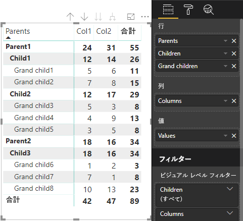

# <a name="understand-data-view-mapping-in-power-bi-visuals"></a>Power BI ビジュアルでのデータ ビューのマッピングについて理解する

この記事ではデータ ビュー マッピングについて説明します。データ ロールが相互にどのように関連しているか、またデータ ロールで、条件付き要件を指定できるようにするにはどうすればよいかについても説明します。 この記事では、`dataMappings` の各種類についても説明します。

有効なマッピングごとにデータ ビューが生成されますが、現在はビジュアルごとに 1 つのクエリを実行することしかサポートされていません。 通常、取得できるデータ ビューは 1 つだけです。 ただし、次のような特定の条件では複数のデータ マッピングを実現できます。

```json
"dataViewMappings": [
    {
        "conditions": [ ... ],
        "categorical": { ... },
        "single": { ... },
        "table": { ... },
        "matrix": { ... }
    }
]
```

Power BI では、`dataViewMappings` に有効なマッピングが指定されている場合にのみ、データ ビューへのマッピングが作成されます。

つまり、`dataViewMappings` に定義されるものも (`categorical`) あれば、定義されないものも (`table` や `single` などの他のマッピング) あります。 例:

```json
"dataViewMappings": [
    {
        "categorical": { ... }
    }
]
```

Power BI では、単一の `categorical` マッピングを使用してデータビューが生成され、`table` およびその他のマッピングは未定義になります。

```javascript
{
    "categorical": {
        "categories": [ ... ],
        "values": [ ... ]
    },
    "metadata": { ... }
}
```

## <a name="conditions"></a>条件

このセクションでは、特定のデータ マッピングに対する条件について説明します。 複数の条件セットを指定できます。記述されている条件セットのいずれかにデータが一致した場合、ビジュアルによってデータが有効なものとして受け入れられます。

現時点では、フィールドごとに最小値と最大値を指定できます。 この値は、そのデータ ロールにバインドできるフィールドの数を表します。 

> [!NOTE]
> 条件でデータ ロールが省略されている場合は、任意の数のフィールドを持つことができます。

### <a name="example-1"></a>例 1

各データ ロールに複数のフィールドをドラッグできます。 この例では、category を 1 つのデータ フィールドに制限し、measure を 2 つのデータ フィールドに制限します。

```json
"conditions": [
    { "category": { "max": 1 }, "y": { "max": 2 } },
]
```

### <a name="example-2"></a>例 2

この例では、次の 2 つの条件のいずれかが必要です。
* 正確に 1 つの category データ フィールドと正確に 2 つの measure
* 正確に 2 つの category と正確に 1 つの measure。

```json
"conditions": [
    { "category": { "min": 1, "max": 1 }, "measure": { "min": 2, "max": 2 } },
    { "category": { "min": 2, "max": 2 }, "measure": { "min": 1, "max": 1 } }
]
```

## <a name="single-data-mapping"></a>単一のデータ マッピング

単一のデータ マッピングは、最も単純な形式のデータ マッピングです。 1 つの measure フィールドを受け取り、合計を返します。 フィールドが数値の場合、合計が返されます。 それ以外の場合は、一意の値の数が返されます。

単一のデータ マッピングを使用するには、マップするデータ ロールの名前を定義する必要があります。 このマッピングは、1 つの measure フィールドに対してのみ機能します。 2 番目のフィールドが割り当てられている場合は、データ ビューは生成されません。そのため、データを 1 つのフィールドに制限する条件を含めることをお勧めします。

> [!NOTE]
> このデータ マッピングは、他のどのデータ マッピングとも組み合わせて使用することはできません。 データを 1 つの数値に減らすことを目的としています。

### <a name="example-3"></a>例 3

```json
"dataViewMappings": {
    "conditions": [
        { "Y": { "max": 1 } }
    ],
    "single": {
        "role": "Y"
    }
}  
```

結果のデータ ビューには引き続き他の種類 (テーブル、カテゴリなど) も含まれますが、各マッピングには single 値しか含まれていません。 single 内の値にのみアクセスすることをお勧めします。

```JSON
{
    "dataView": [
        {
            "metadata": null,
            "categorical": null,
            "matrix": null,
            "table": null,
            "tree": null,
            "single": {
                "value": 94163140.3560001
            }
        }
    ]
}
```

## <a name="categorical-data-mapping"></a>カテゴリ別のデータ マッピング

カテゴリ別のデータ マッピングは、1 つまたは 2 つの独立したデータ グループを取得するために使用されます。

### <a name="example-4"></a>例 4

データ ロールに関する前の例の定義を次に示します。

```json
"dataRole":[
    {
        "displayName": "Category",
        "name": "category",
        "kind": "Grouping"
    },
    {
        "displayName": "Y Axis",
        "name": "measure",
        "kind": "Measure"
    }
]
```

マッピングは次のようになります。

```json
"dataViewMappings": {
    "categorical": {
        "categories": {
            "for": { "in": "category" }
        },
        "values": {
            "select": [
                { "bind": { "to": "measure" } }
            ]
        }
    }
}
```

これはシンプルな例です。 これは次のように読み取れます。"どのフィールドでも `category` にドラッグすると、そのデータが `categorical.categories` にマップされるように、`category` データ ロールをマップします。 また、自分の `measure` データ ロールを `categorical.values` にマップします。"

* **for...in**: このデータ ロール内のすべての項目について、それらをデータ クエリに含めます。
* **bind...to**: *for...in* と同じ結果が生成されますが、それを 1 つのフィールドに制限する条件をデータ ロールが持つことが想定されています。

### <a name="example-5"></a>例 5

この例では、前の例の最初の 2 つのデータ ロールを使用し、さらに `grouping` と `measure2` を定義します。

```json
"dataRole":[
    {
        "displayName": "Category",
        "name": "category",
        "kind": "Grouping"
    },
    {
        "displayName": "Y Axis",
        "name": "measure",
        "kind": "Measure"
    },
    {
        "displayName": "Grouping with",
        "name": "grouping",
        "kind": "Grouping"
    },
    {
        "displayName": "X Axis",
        "name": "measure2",
        "kind": "Grouping"
    }
]
```

マッピングは次のようになります。

```json
"dataViewMappings":{
    "categorical": {
        "categories": {
            "for": { "in": "category" }
        },
        "values": {
            "group": {
                "by": "grouping",
                "select":[
                    { "bind": { "to": "measure" } },
                    { "bind": { "to": "measure2" } }
                ]
            }
        }
    }
}
```

ここでの違いは、categorical.values をどのようにマップするかという点です。 ここでは、「`measure` および `measure2` のデータ ロールを、データ ロール `grouping` によってグループ化されるようにマップします」ということを示しています。

### <a name="example-6"></a>例 6

データ ロールを次に示します。

```json
"dataRoles": [
    {
        "displayName": "Categories",
        "name": "category",
        "kind": "Grouping"
    },
    {
        "displayName": "Measures",
        "name": "measure",
        "kind": "Measure"
    },
    {
        "displayName": "Series",
        "name": "series",
        "kind": "Measure"
    }
]
```

データ ビュー マッピングは次のとおりです。

```json
"dataViewMappings": [
    {
        "categorical": {
            "categories": {
                "for": {
                    "in": "category"
                }
            },
            "values": {
                "group": {
                    "by": "series",
                    "select": [{
                            "for": {
                                "in": "measure"
                            }
                        }
                    ]
                }
            }
        }
    }
]
```

カテゴリ別のデータ ビューは次のように視覚化できます。

| カテゴリ別 |  |  | | | |
|-----|-----|------|------|------|------|
| | 年 | 2013 | 2014 | 2015 | 2016 |
| 国 | | |
| 米国 | | x | x | 125 | 100 |
| カナダ | | x | 50 | 200 | x |
| メキシコ | | 300 | x | x | x |
| 英国 | | x | x | 75 | x |

Power BI では、それがカテゴリ別のデータ ビューとして作成されます。 これはカテゴリのセットです。

```JSON
{
    "categorical": {
        "categories": [
            {
                "source": {...},
                "values": [
                    "Canada",
                    "Mexico",
                    "UK",
                    "USA"
                ],
                "identity": [...],
                "identityFields": [...],
            }
        ]
    }
}
```

各カテゴリは値のセットにもマップされます。 これらの値はそれぞれ系列 (年で表現される) でグループ化されます。

たとえば、2013 年のカナダの売上は null で、2014 年のカナダの売上は 50 です。

```JSON
{
    "values": [
        {
            "source": {...},
            "values": [
                null,
                300,
                null,
                null
            ],
            "identity": [...],
        },
        {
            "source": {...},
            "values": [
                50,
                null,
                150,
                null
            ],
            "identity": [...],
        },
        {
            "source": {...},
            "values": [
                200,
                null,
                null,
                125
            ],
            "identity": [...],
        },
        {
            "source": {...},
            "values": [
                null,
                null,
                null,
                100
            ],
            "identity": [...],
        }
    ]
}
```

## <a name="table-data-mapping"></a>テーブルのデータ マッピング

テーブルのデータ ビューは、単純なデータ マッピングです。 基本的には、これは数値データ ポイントを集計できるデータ ポイントの一覧です。

### <a name="example-7"></a>例 7

特定の機能を指定:

```json
"dataRoles": [
    {
        "displayName": "Values",
        "name": "values",
        "kind": "Measure"
    }
]
```

```json
"dataViewMappings": [
    {
        "table": {
            "rows": {
                "for": {
                    "in": "values"
                }
            }
        }
    }
]
```

テーブルのデータ ビューは、次のように視覚化できます。  

| 国| 年 | 売上 |
|-----|-----|------|
| 米国 | 2016 | 100 |
| 米国 | 2015 | 50 |
| カナダ | 2015 | 200 |
| カナダ | 2015 | 50 |
| メキシコ | 2013 | 300 |
| 英国 | 2014 | 150 |
| 米国 | 2015 | 75 |

Power BI では、ご利用のデータはテーブル データ ビューとして表示されます。 データが順序付けられていると想定しないでください。

```JSON
{
    "table" : {
        "columns": [...],
        "rows": [
            [
                "Canada",
                2014,
                50
            ],
            [
                "Canada",
                2015,
                200
            ],
            [
                "Mexico",
                2013,
                300
            ],
            [
                "UK",
                2014,
                150
            ],
            [
                "USA",
                2015,
                100
            ],
            [
                "USA",
                2015,
                75
            ],
            [
                "USA",
                2016,
                100
            ]
        ]
    }
}
```

目的のフィールドを選択してから、[合計] を選択することで、データを集計できます。  


## <a name="matrix-data-mapping"></a>マトリックスのデータ マッピング

マトリックスのデータ マッピングはテーブルのデータ マッピングに似ていますが、行が階層的に表示されます。 データ ロール値はいずれも列ヘッダー値として使用することができます。

```json
{
    "dataRoles": [
        {
            "name": "Category",
            "displayName": "Category",
            "displayNameKey": "Visual_Category",
            "kind": "Grouping"
        },
        {
            "name": "Column",
            "displayName": "Column",
            "displayNameKey": "Visual_Column",
            "kind": "Grouping"
        },
        {
            "name": "Measure",
            "displayName": "Measure",
            "displayNameKey": "Visual_Values",
            "kind": "Measure"
        }
    ],
    "dataViewMappings": [
        {
            "matrix": {
                "rows": {
                    "for": {
                        "in": "Category"
                    }
                },
                "columns": {
                    "for": {
                        "in": "Column"
                    }
                },
                "values": {
                    "select": [
                        {
                            "for": {
                                "in": "Measure"
                            }
                        }
                    ]
                }
            }
        }
    ]
}
```

Power BI によって階層データ構造が作成されます。 ツリー階層のルートには、`Category` データ ロールの **[親]** 列からのデータと、データ ロール テーブルの **[子]** 列からの子が含まれます。

データセット:

| 親 | 子 | 孫 | 選択 | 値 |
|-----|-----|------|-------|-------|
| Parent1 | Child1 | Grand child1 | Col1 | 5 |
| Parent1 | Child1 | Grand child1 | Col2 | 6 |
| Parent1 | Child1 | Grand child2 | Col1 | 7 |
| Parent1 | Child1 | Grand child2 | Col2 | 8 |
| Parent1 | Child2 | Grand child3 | Col1 | 5 |
| Parent1 | Child2 | Grand child3 | Col2 | 3 |
| Parent1 | Child2 | Grand child4 | Col1 | 4 |
| Parent1 | Child2 | Grand child4 | Col2 | 9 |
| Parent1 | Child2 | Grand child5 | Col1 | 3 |
| Parent1 | Child2 | Grand child5 | Col2 | 5 |
| Parent2 | Child3 | Grand child6 | Col1 | 1 |
| Parent2 | Child3 | Grand child6 | Col2 | 2 |
| Parent2 | Child3 | Grand child7 | Col1 | 7 |
| Parent2 | Child3 | Grand child7 | Col2 | 1 |
| Parent2 | Child3 | Grand child8 | Col1 | 10 |
| Parent2 | Child3 | Grand child8 | Col2 | 13 |

Power BI のコア マトリックス ビジュアルでは、データがテーブルとしてレンダリングされます。



このビジュアルでは、次のコードに記述されているようにそのデータ構造が取得されます (ここでは、最初の 2 つのテーブル行のみを表示しています)。

```json
{
    "metadata": {...},
    "matrix": {
        "rows": {
            "levels": [...],
            "root": {
                "childIdentityFields": [...],
                "children": [
                    {
                        "level": 0,
                        "levelValues": [...],
                        "value": "Parent1",
                        "identity": {...},
                        "childIdentityFields": [...],
                        "children": [
                            {
                                "level": 1,
                                "levelValues": [...],
                                "value": "Child1",
                                "identity": {...},
                                "childIdentityFields": [...],
                                "children": [
                                    {
                                        "level": 2,
                                        "levelValues": [...],
                                        "value": "Grand child1",
                                        "identity": {...},
                                        "values": {
                                            "0": {
                                                "value": 5 // value for Col1
                                            },
                                            "1": {
                                                "value": 6 // value for Col2
                                            }
                                        }
                                    },
                                    ...
                                ]
                            },
                            ...
                        ]
                    },
                    ...
                ]
            }
        },
        "columns": {
            "levels": [...],
            "root": {
                "childIdentityFields": [...],
                "children": [
                    {
                        "level": 0,
                        "levelValues": [...],
                        "value": "Col1",
                        "identity": {...}
                    },
                    {
                        "level": 0,
                        "levelValues": [...],
                        "value": "Col2",
                        "identity": {...}
                    },
                    ...
                ]
            }
        },
        "valueSources": [...]
    }
}
```

## <a name="data-reduction-algorithm"></a>データの削減アルゴリズム

データ ビューで受信するデータの量を制御するには、データの削減アルゴリズムを適用します。

既定では、すべての Power BI ビジュアルには、*count* が 1000 個のデータ ポイントに設定された先頭データ削減アルゴリズムが適用されます。 これは *capabilities.json* ファイル内の次のプロパティを設定することと同じです。

```json
"dataReductionAlgorithm": {
    "top": {
        "count": 1000
    }
}
```

*count* 値は 30000 までの任意の整数値に変更できます。 R ベースの Power BI ビジュアルでは、最大 150000 行をサポートできます。

## <a name="data-reduction-algorithm-types"></a>データの削減アルゴリズムの種類

データの削減アルゴリズムの設定には、次の 4 種類があります。

* `top`: データセットの先頭から取得した値にデータを制限する場合。 先頭から *count* 個の値がデータセットから取得されます。
* `bottom`: データセットの末尾から取得した値にデータを制限する場合。 末尾から "count" 個の値がデータセットから取得されます。
* `sample`: *count* 個の項目に制限されたシンプルなサンプリング アルゴリズムによってデータセットを減らします。 これは、最初と最後の項目と、それらの間にある等間隔の *count* 個の項目が含まれることを意味します。
たとえば、データ セット [0, 1, 2,...100] をお持ちで、*count* が 9 である場合、値 [0, 10, 20...100] を受け取ることになります。
* `window`: *count* 個の要素を含む、ある時点のデータ ポイントの 1 つの *window* を読み込みます。 現時点では、`top` と `window` は同等です。 ウィンドウ設定を完全にサポートするための取り組みを進めています。

## <a name="data-reduction-algorithm-usage"></a>データの削減アルゴリズムの使用

データの削減アルゴリズムは、カテゴリ別、テーブル、またはマトリックスのデータ ビュー マッピングで使用できます。

このアルゴリズムは、`categories` または `values` のグループ セクション (カテゴリ別のデータ マッピングに対して) に設定できます。

### <a name="example-8"></a>例 8

```json
"dataViewMappings": {
    "categorical": {
        "categories": {
            "for": { "in": "category" },
            "dataReductionAlgorithm": {
                "window": {
                    "count": 300
                }
            }  
        },
        "values": {
            "group": {
                "by": "series",
                "select": [{
                        "for": {
                            "in": "measure"
                        }
                    }
                ],
                "dataReductionAlgorithm": {
                    "top": {
                        "count": 100
                    }
                }  
            }
        }
    }
}
```

データの削減アルゴリズムは、データ ビュー マッピング テーブルの `rows` セクションに適用できます。

### <a name="example-9"></a>例 9

```json
"dataViewMappings": [
    {
        "table": {
            "rows": {
                "for": {
                    "in": "values"
                },
                "dataReductionAlgorithm": {
                    "top": {
                        "count": 2000
                    }
                } 
            }
        }
    }
]
```

データの削減アルゴリズムは、データ ビュー マッピング マトリックスの `rows` セクションおよび `columns` セクションに適用できます。
