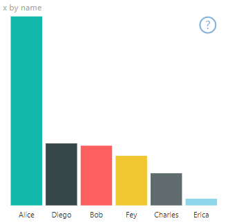
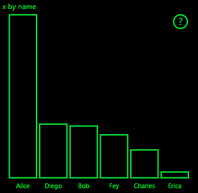
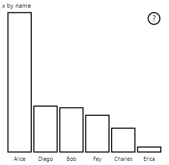

# <a name="high-contrast-mode-support-in-power-bi-visuals"></a>Power BI ビジュアルでのハイコントラスト モードのサポート

Windows の "*ハイコントラスト*" の設定を使用すると、よりはっきりした色で表示することで、テキストとアプリが見やすくなります。 この記事では、ハイコントラスト モードのサポートを Power BI ビジュアルに追加する方法について説明します。 詳細については、[Power BI でのハイコントラストのサポート](https://powerbi.microsoft.com/blog/power-bi-desktop-june-2018-feature-summary/#highContrast)に関するページを参照してください。

ハイコントラストのサポートの実装を確認するには、[PowerBI-visuals-sampleBarChart ビジュアル リポジトリ](https://github.com/Microsoft/PowerBI-visuals-sampleBarChart/commit/61011c82b66ca0d3321868f1d089c65101ca42e6)を参照してください。

## <a name="on-initialization"></a>初期化時

`options.host` の colorPalette メンバーには、ハイコントラスト モード用のいくつかのプロパティがあります。 これらのプロパティを使用して、ハイコントラスト モードがアクティブかどうかを判断し、アクティブの場合は使用する色を指定します。

### <a name="detect-that-power-bi-is-in-high-contrast-mode"></a>Power BI がハイコントラスト モードであることを検出する

`host.colorPalette.isHighContrast` が `true` の場合は、ハイコントラスト モードがアクティブであり、ビジュアルはそれに応じて描画されます。

### <a name="get-high-contrast-colors"></a>ハイコントラストの色を取得する

ハイコントラスト モードの場合、ビジュアルでは以下の設定だけを使用する必要があります。

* **前景**色は、線、アイコン、テキスト、輪郭、または図形の塗りつぶしを描画するために使用されます。
* **背景**色は、背景および線で囲まれた図形の塗りつぶしの色として使用されます。
* **前景に選択された**色は、選択された要素またはアクティブな要素を示すために使用されます。
* **ハイパーリンク**の色は、ハイパーリンク テキストに対してのみ使用されます。

> [!NOTE]
> 2 番目の色が必要な場合は、ある程度の不透明度で前景色を使用できます (Power BI のネイティブ ビジュアルでは 40% の不透明度が使用されます)。 ビジュアルの詳細を見やすくするために、これは控えめに使用してください。

初期化の間に、これらの値を格納できます。

```typescript
private isHighContrast: boolean;

private foregroundColor: string;
private backgroundColor: string;
private foregroundSelectedColor: string;
private hyperlinkColor: string;
//...

constructor(options: VisualConstructorOptions) {
    this.host = options.host;
    let colorPalette: ISandboxExtendedColorPalette = host.colorPalette;
    //...
    this.isHighContrast = colorPalette.isHighContrast;
    if (this.isHighContrast) {
        this.foregroundColor = colorPalette.foreground.value;
        this.backgroundColor = colorPalette.background.value;
        this.foregroundSelectedColor = colorPalette.foregroundSelected.value;
        this.hyperlinkColor = colorPalette.hyperlink.value;
    }
```

または、初期化の間に `host` オブジェクトを格納し、更新の間に関連する `colorPalette` プロパティにアクセスすることもできます。

## <a name="on-update"></a>更新時

ハイコントラスト サポートの具体的な実装はビジュアルに応じて異なり、グラフィック デザインの詳細に依存します。 重要な詳細情報を限られた色で区別しやすくするため、通常、ハイコントラスト モードでは、既定のモードとは若干異なるデザインが必要になります。

Power BI のネイティブ ビジュアルは、次のガイドラインに従っています。

* すべてのデータ ポイントで同じ色 (前景) が使用されます。
* すべてのテキスト、軸、矢印、線などでは、前景色が使用されます。
* 厚みのある図形は、太いストローク (少なくとも 2 ピクセル) と背景色の塗りつぶしを使用して、枠線として描画されます。
* データ ポイントが関連する場合、データ ポイントは異なるマーカー図形によって区別され、データ行は異なる破線によって区別されます。
* あるデータ要素が強調表示されると、他のすべての要素の不透明度が 40% に変わります。
* スライサーの場合、アクティブなフィルター要素では前景に選択された色が使用されます。

たとえば、次のサンプルの棒グラフでは、すべてのバーが太さ 2 ピクセルの前景の枠線および背景の塗りつぶしで描画されています。 既定の色と、2 つのハイコントラスト テーマを使用した場合の外観を比較してください。





次のセクションでは、ハイコントラストをサポートするために変更された `visualTransform` 関数の 1 つの場所を示します。 それは、更新の間にレンダリングの一部として呼び出されます。

### <a name="before"></a>より前

```typescript
for (let i = 0, len = Math.max(category.values.length, dataValue.values.length); i < len; i++) {
    let defaultColor: Fill = {
        solid: {
            color: colorPalette.getColor(category.values[i] + '').value
        }
    };

    barChartDataPoints.push({
        category: category.values[i] + '',
        value: dataValue.values[i],
        color: getCategoricalObjectValue<Fill>(category, i, 'colorSelector', 'fill', defaultColor).solid.color,
        selectionId: host.createSelectionIdBuilder()
            .withCategory(category, i)
            .createSelectionId()
    });
}
```

### <a name="after"></a>後

```typescript
for (let i = 0, len = Math.max(category.values.length, dataValue.values.length); i < len; i++) {
    const color: string = getColumnColorByIndex(category, i, colorPalette);

    const selectionId: ISelectionId = host.createSelectionIdBuilder()
        .withCategory(category, i)
        .createSelectionId();

    barChartDataPoints.push({
        color,
        strokeColor,
        strokeWidth,
        selectionId,
        value: dataValue.values[i],
        category: `${category.values[i]}`,
    });
}

//...

function getColumnColorByIndex(
    category: DataViewCategoryColumn,
    index: number,
    colorPalette: ISandboxExtendedColorPalette,
): string {
    if (colorPalette.isHighContrast) {
        return colorPalette.background.value;
    }

    const defaultColor: Fill = {
        solid: {
            color: colorPalette.getColor(`${category.values[index]}`).value,
        }
    };

    return getCategoricalObjectValue<Fill>(category, index, 'colorSelector', 'fill', defaultColor).solid.color;
}
```
