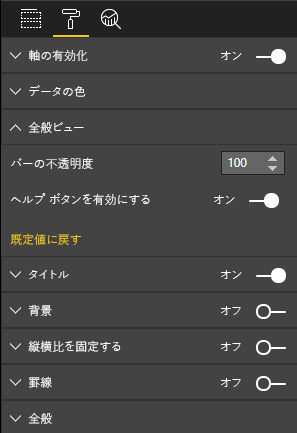

# <a name="create-a-launch-url"></a>起動 URL を作成する

起動 URL を作成することにより、実際の処理を Power BI に任せて、新しいブラウザー タブ (またはウィンドウ) を開くことができます。

## <a name="sample"></a>サンプル

```typescript
   this.host.launchUrl('https://powerbi.microsoft.com');
```

## <a name="usage"></a>Usage

`host.launchUrl()` API 呼び出しを使用して、送信先 URL を文字列引数として渡します。

```typescript
this.host.launchUrl('https://some.link.net');
```

## <a name="restrictions"></a>制限事項

* 絶対パスのみを使用し、相対パスは使用しません。 たとえば、`https://some.link.net/subfolder/page.html` のような絶対パスを使用します。 相対パス `/page.html` を開くことはできません。

* 現在は、*HTTP* および *HTTPS* プロトコルのみがサポートされています。 *FTP* や *MAILTO* などは使用しないでください。

## <a name="best-practices"></a>ベスト プラクティス

* 通常は、ユーザーの明示的なアクションへの応答としてのみリンクを開くことをお勧めします。 リンクまたはボタンをクリックすると新しいタブが開くことを、ユーザーが容易に理解できるようにしてください。ユーザーのアクションがないまま、または別のアクションの副作用として `launchUrl()` 呼び出しをトリガーすると、ユーザーを混乱させたりユーザーに不満を抱かせたりする場合があります。

* ビジュアルが正しく機能するためにリンクが必須ではない場合は、レポートの作成者に、リンクを無効にしたり非表示にしたりする方法を提供することをお勧めします。 この推奨は特に、サードパーティのアプリケーションにレポートを埋め込む場合や、それを Web に公開する場合など、特殊な Power BI のユースケースに関連します。

* `launchUrl()` の呼び出しを、ループ内、ビジュアルの `update` 関数、またはその他の頻繁に繰り返されるコードから、トリガーしないようにします。

## <a name="a-step-by-step-example"></a>ステップバイステップの例

### <a name="add-a-link-launching-element"></a>リンク起動要素を追加する

次の行がビジュアルの `constructor` 関数に追加されました。

```typescript
    this.helpLinkElement = this.createHelpLinkElement();
    options.element.appendChild(this.helpLinkElement);
```

アンカー要素を作成してアタッチするプライベート関数を追加します。

```typescript
private createHelpLinkElement(): Element {
    let linkElement = document.createElement("a");
    linkElement.textContent = "?";
    linkElement.setAttribute("title", "Open documentation");
    linkElement.setAttribute("class", "helpLink");
    linkElement.addEventListener("click", () => {
        this.host.launchUrl("https://docs.microsoft.com/power-bi/developer/visuals/custom-visual-develop-tutorial");
    });
    return linkElement;
};
```

最後に、*visual.less* ファイル内のエントリで、リンク要素のスタイルを定義します。

```less
.helpLink {
    position: absolute;
    top: 0px;
    right: 12px;
    display: block;
    width: 20px;
    height: 20px;
    border: 2px solid #80B0E0;
    border-radius: 20px;
    color: #80B0E0;
    text-align: center;
    font-size: 16px;
    line-height: 20px;
    background-color: #FFFFFF;
    transition: all 900ms ease;

    &:hover {
        background-color: #DDEEFF;
        color: #5080B0;
        border-color: #5080B0;
        transition: all 250ms ease;
    }

    &.hidden {
        display: none;
    }
}
```

### <a name="add-a-toggling-mechanism"></a>切り替えメカニズムを追加する

切り替えメカニズムを追加するには、レポートの作成者がリンク要素の表示を切り替えることができるように、静的なオブジェクトを追加する必要があります。 (既定では "*非表示*" に設定されています。)詳細については、[静的オブジェクトのチュートリアル](https://microsoft.github.io/PowerBI-visuals/docs/concepts/objects-and-properties)に関するページを参照してください。

次のコードに示すように、ブール型の静的オブジェクト `showHelpLink` が、*capabilities.json* ファイルの objects エントリに追加されています。

```typescript
"objects": {
    "generalView": {
            "displayName": "General View",
            "properties":
                "showHelpLink": {
                    "displayName": "Show Help Button",
                    "type": {
                        "bool": true
                    }
                }
            }
        }
    }
```



また、ビジュアルの `update` 関数に次の行が追加されました。

```typescript
if (settings.generalView.showHelpLink) {
    this.helpLinkElement.classList.remove("hidden");
} else {
    this.helpLinkElement.classList.add("hidden");
}
```

要素の表示を制御するために、*hidden* クラスが *visual.less* ファイルで定義されています。
