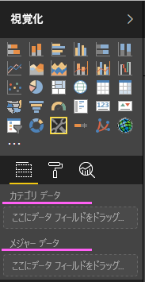
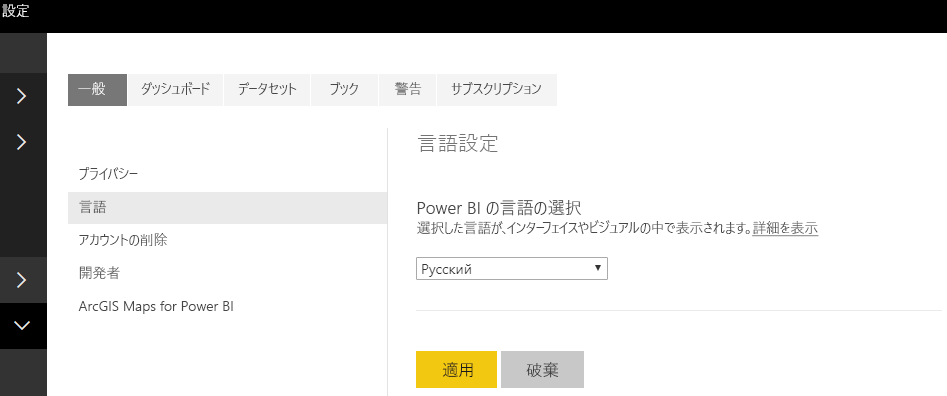

# <a name="add-the-locale-in-power-bi-for-power-bi-visuals"></a>Power BI で Power BI ビジュアルにロケールを追加する

ビジュアルでは、Power BI ロケールを取得して、関連する言語にコンテンツをローカライズできます。

詳細については、[Power BI でサポートされる言語と国または地域](./../../supported-languages-countries-regions.md)に関する記事をご覧ください

たとえば、サンプルの横棒グラフ ビジュアルでロケールを取得するとします。


これらの横棒グラフはそれぞれ異なるロケール (英語、バスク語、ヒンディー語) で作成されており、ツールヒントに表示されます。

> [!NOTE]
> ビジュアルのコードのローカライズ マネージャーは、API 1.10.0 以降でサポートされています。

## <a name="get-the-locale"></a>ロケールを取得する

`locale` は、ビジュアルの初期化時に文字列として渡されます。 Power BI でロケールが変更されると、ビジュアルは新しいロケールで再生成されます。 完全なサンプル コードについては、ロケールを含めた SampleBarChart で見つけることができます

BarChart コンストラクターにロケール メンバーが含まれるようになりました。これは、ホスト ロケール インスタンスと共にコンストラクター内でインスタンス化されます。

```typescript
private locale: string;
...
this.locale = options.host.locale;
```

サポートされているロケール:

ロケール文字列 | 言語
--------------|----------------------
ar-SA | العربية (アラビア語)
bg-BG | български (ブルガリア語)
ca-ES | català (カタルニア語)
cs-CZ | čeština (チェコ語)
da-DK | dansk (デンマーク語)
de-DE | Deutsche (ドイツ語)
el-GR | ελληνικά (ギリシャ語)
en-US | English (英語)
es-ES | español service (スペイン語)
et-EE | eesti (エストニア語)
eU-ES | Euskal (バスク語)
fi FI | suomi (フィンランド語)
fr-FR | français (フランス)
gl-ES | galego (ガリシア語)
he-IL | עברית (ヘブライ語)
hi-IN | हिन्दी (ヒンディー語)
hr-HR | hrvatski (クロアチア語)
hu-HU | magyar (ハンガリー語)
id-ID | Bahasa Indonesia (インドネシア語)
it-IT | italiano (イタリア語)
ja-JP | 日本 (日本語)
kk-KZ | Қазақ (カザフ語)
ko-KR | 한국의 (韓国語)
lt-LT | Lietuvos (リトアニア語)
lv-LV | Latvijas (ラトビア語)
ms-MY | Bahasa Melayu (マレー語)
nb-NO | norsk (ノルウェー語)
nl-NL | Nederlands (オランダ語)
pl-PL | polski (ポーランド語)
pt-BR | português (ポルトガル語)
pt-PT | português (ポルトガル語)
ro-RO | românesc (ルーマニア語)
ru-RU | русский (ロシア語)
sk-SK | slovenský (スロバキア語)
sl-SI | slovenski (スロベニア語)
sr-Cyrl-RS | српски (セルビア語)
sr-Latn-RS | srpski (セルビア語)
sv-SE | svenska (スウェーデン語)
th-TH | ไทย (タイ語)
tr-TR | Türk (トルコ語)
uk-UA | український (ウクライナ語)
vi-VN | tiếng Việt (ベトナム語)
zh-CN | 中国 (簡体中国語)
zh-TW | 中國 (繁体中国語)

> [!NOTE]
> PowerBI Desktop のロケール プロパティには、インストールされている PowerBI Desktop の言語が含まれます。

## <a name="localizing-the-property-pane-for-power-bi-visuals"></a>Power BI ビジュアルのプロパティ ペインのローカライズ

プロパティ ペインのフィールドは、より統合され、一貫したエクスペリエンスを提供するようにローカライズできます。 これにより、カスタム ビジュアルは他の Power BI コア ビジュアルと同様に動作します。

たとえば、`pbiviz new` コマンドを使用して作成したローカライズされていないカスタム ビジュアルでは、プロパティ ペインに次のフィールドが表示されます。



カテゴリ データとメジャー データは両方とも、capabilities.json ファイル内に `displayName` として定義します。

## <a name="how-to-localize-capabilities"></a>機能をローカライズする方法

まず、機能の中でローカライズするすべての表示名に表示名キーを追加します。 この例は次のとおりです。

```json
{
    "dataRoles": [
        {
            "displayName": "Category Data",
            "displayNameKey": "VisualCategoryDataNameKey1",
            "name": "category",
            "kind": "Grouping"
        },
        {
            "displayName": "Measure Data",
            "displayNameKey": "VisualMeasureDataNameKey2",
            "name": "measure",
            "kind": "Measure"
        }
    ]
}
```

次に、stringResources という名前のディレクトリを追加します。 このディレクトリには、ビジュアルでサポートするロケールに基づいて、異なる文字列リソース ファイルを格納します。 このディレクトリの下に、サポートするロケールごとに JSON ファイルを追加する必要があります。 これらのファイルには、ロケール情報と、置換するすべての displayNameKey のローカライズした文字列値を含めます。

この例では、アラビア語とヘブライ語をサポートするとします。 次の方法で 2 つの JSON ファイルを追加する必要があります。


JSON ファイルごとに、1 つのロケールを定義し (このファイルは上記のサポートされているリストのロケールの 1 つである必要があります)、対象の表示名キーの文字列値を含めます。 この例では、ヘブライ語の文字列リソース ファイルは次のようになります。

```json
{
    "locale": "he-IL",
    "values": {
        "VisualCategoryDataNameKey1": "קטגוריה",
        "VisualMeasureDataNameKey2": "יחידות מידה"
    }
}
```

ローカライズ マネージャーを使用するために必要なすべての手順を以下に示します。

> [!NOTE]
> 現時点では、ローカライズは、開発者向けビジュアルのデバッグ用にはサポートされていません

## <a name="setup-environment"></a>環境の設定

### <a name="desktop"></a>デスクトップ

デスクトップの使用方法については、Power BI デスクトップのローカライズ版を https://powerbi.microsoft.com からダウンロードします。

### <a name="web-service"></a>Web サービス

サービスで Web クライアント (ブラウザー) を使用する場合は、[設定] で言語を変更します。



## <a name="resource-file"></a>リソース ファイル

stringResources フォルダー内の使用するロケールの名前を付けたフォルダーに、resources.resjson ファイルを追加します。 この例では、en-US と ru-RU です。


その後、使用するすべてのローカライズ文字列を、前の手順で追加した resources.resjson ファイルに追加します。

```json
{
    ...
    "Role_Legend": "Обозначения",
    "Role_task": "Задача",
    "Role_StartDate": "Дата начала",
    "Role_Duration": "Длительность"
    ...
}
```

次のサンプルは、resources.resjson ファイルの en-US バージョンです。

```json
{
    ...
    "Role_Legend": "Legend",
    "Role_task": "Task",
    "Role_StartDate": "Start date",
    "Role_Duration": "Duration"
    ...
}
```

新しい localizationManager インスタンスでは、次のようにビジュアルのコードで localizationManager のインスタンスを作成します

```typescript
private localizationManager: ILocalizationManager;

constructor(options: VisualConstructorOptions) {
    this.localizationManager = options.host.createLocalizationManager();
}
```

## <a name="localizationmanager-usage-sample"></a>localizationManager の使用例

resources. resjson で定義した文字列キー引数を使用して、ローカライズ マネージャーの getDisplayName 関数を呼び出して、コード内の任意の場所で必要な文字列を取得できるようになりました。

```typescript
let legend: string = this.localization.getDisplayName("Role_Legend");
```

en-US の場合は "Legend"、ru-RU の場合は "Обозначения" が返されます

## <a name="next-steps"></a>次の手順

* [書式設定ユーティリティを使用してローカライズされた形式を指定する方法について説明します](utils-formatting.md)
