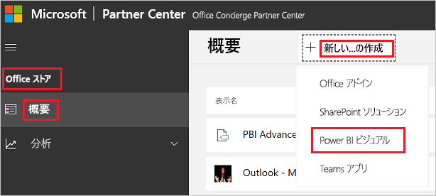

# Power BI ビジュアルをパートナー センターに発行する

Power BI ビジュアルを作成した後、それを AppSource に発行することで、他のユーザーがそれを探して使用できるようにすることができます。 Power BI ビジュアルの作成の詳細については、[Power BI ビジュアルの開発](custom-visual-develop-tutorial.md)に関する記事を参照してください。

## AppSource とは

[AppSource](https://appsource.microsoft.com/marketplace/apps?product=power-bi-visuals) は、Microsoft の製品とサービス向けの SaaS アプリとアドインを見つける場所です。

## Power BI ビジュアルを提出するための準備

Power BI ビジュアルを AppSource に提出する前に、「[Power BI ビジュアルのガイドライン](guidelines-powerbi-visuals.md)」を読んでいること、および[カスタム ビジュアルのテストが終了している](https://github.com/Microsoft/PowerBI-visuals/blob/master/Tutorial/SubmissionTesting.md)ことを確認してください。

Power BI ビジュアルを提出する準備ができたら、ビジュアルが次に示すすべての要件を満たしていることを確認します。

| 項目 | 必須 | 説明 |
| --- | --- | --- |
| Pbiviz パッケージ |はい |Power BI ビジュアルを、必要なすべてのメタデータが含まれている Pbiviz パッケージにパックします。 ビジュアル名 表示名 GUID バージョン 説明 作成者名とメール アドレス |
| サンプルの .pbix レポート ファイル |はい |ビジュアルを紹介するには、ユーザーがビジュアルをよく理解できるようにする必要があります。 ユーザーにとってのビジュアルの価値を強調し、使用例や書式設定オプションを示します。 ヒントと秘訣や避けるべきことを説明した "*ヒント*" ページを最後に追加することもできます。 サンプルの .pbix レポート ファイルは、外部に接続していないオフラインの状態で動作する必要があります。 |
| アイコン |はい |ストアの先頭に表示されるカスタム ビジュアルのロゴを含める必要があります。 使用できる形式は、.png、.jpg、.jpeg、.gif です。 大きさはちょうど 300 (幅) x 300 (高さ) ピクセルにする必要があります。 **重要!** アイコンを提出する前に、[AppSource ストア画像ガイド](https://docs.microsoft.com/office/dev/store/craft-effective-appsource-store-images)をよくお読みください。 |
| スクリーンショット |はい |少なくとも 1 つのスクリーンショットを提供します。 使用できる形式は、.png、.jpg、.jpeg、.gif です。 サイズは、ちょうど 1366 px (幅) × 768 px (高さ) にする必要があります。 ファイルのサイズは、1,024 KB を超えることはできません。 使いやすくするために、各スクリーンショットに重要な機能の価値提案がはっきりわかる吹き出しを追加します。 |
| サポート ダウンロード リンク |はい |顧客向けのサポート URL を提供します。 このリンクはパートナー センター リストの一部として入力され、AppSource 上のビジュアルのリストにアクセスしたユーザーに表示されます。 http:// または https:// を含む URL の形式を使う必要があります。 |
| プライバシーに関するドキュメントへのリンク |はい |ビジュアルのプライバシー ポリシーへのリンクを提供します。 このリンクはパートナー センター リストの一部として入力され、AppSource 上のビジュアルのリストにアクセスしたユーザーに表示されます。 http:// または https:// を含むリンクの形式にする必要があります。 |
| エンド ユーザー使用許諾契約 (EULA) |はい |Power BI ビジュアル用の EULA ファイルを指定する必要があります。 [標準契約](https://go.microsoft.com/fwlink/?linkid=2041178)、[Power BI ビジュアル契約](https://visuals.azureedge.net/app-store/Power%20BI%20-%20Default%20Custom%20Visual%20EULA.pdf)、または独自の EULA を使用できます。 |
| ビデオへのリンク |いいえ |カスタム ビジュアルに対するユーザーの関心を高めるために、ビジュアルに関するビデオへのリンクを提供します。 http:// または https:// を含む URL の形式を使う必要があります。 |
| GitHub リポジトリ |いいえ |Power BI ビジュアルのソースとサンプル データが含まれている [GitHub](https://www.github.com) リポジトリへのパブリック リンクを共有します。 これにより、他の開発者がフィードバックを提供し、コードの改善を提案することができます。 |

## アプリ パッケージ XML の取得

Power BI ビジュアルを提出するには、Power BI チームから提供されるアプリ パッケージ XML が必要です。 アプリ パッケージ XML を取得するには、Power BI ビジュアル送信チーム ([pbivizsubmit@microsoft.com](mailto:pbivizsubmit@microsoft.com)) に電子メールを送信します。

**pbiviz** パッケージを作成する前に、次のフィールドを **pbiviz.json** ファイルに入力する必要があります。
* description
* supportUrl
* author
* name
* 電子メール

メールには、**pbiviz ファイル**と**サンプル レポート pbix ファイル**を添付します。 Power BI チームは、アップロードの説明とアプリ パッケージ XML ファイルを返信します。 Office デベロッパー センターを通じてビジュアルを送信するには、この XML アプリ パッケージが必要です。

> [!NOTE]
> 品質を高め、既存のレポートが壊れていないことを確認するため、既存のビジュアルの更新が運用環境に提供されるには、ストアでの承認後さらに 2 週間かかります。

## AppSource への送信

Power BI ビジュアルを AppSource に提出するには、Power BI チームからアプリ パッケージを取得した後、それをパートナー センターに提出する必要があります。 

### アプリ パッケージの取得

AppSource に提出する前に、**pbiviz** ファイルと **pbix** ファイルをメールで Power BI チームに送信する必要があります。 これにより、Power BI チームはパブリック共有サーバーにファイルをアップロードできるようになります。 それ以外の場合、ストアはファイルを取得できません。 

新しく送信された Power BI ビジュアル、既存の Power BI ビジュアルの更新、および拒否された送信に対する修正が含まれるファイルは、Power BI チームによるチェックを受ける必要があります。

### パートナー センターへの提出

自分の Power BI ビジュアルをパートナー センターに提出するには、パートナー センターに登録されている必要があります。 まだ登録されていない場合は、[パートナー センター内に開発者アカウントを開きます](https://docs.microsoft.com/office/dev/store/open-a-developer-account)。

次の手順に従って、自分の Power BI ビジュアルをパートナー センターに提出します。 提出プロセスの詳細については、「[パートナー センターから AppSource に Office ソリューションを提出する](https://docs.microsoft.com/office/dev/store/use-partner-center-to-submit-to-appsource)」を参照してください。

1. **パートナー センター**にログインします。

2. 左側のペインで、 **[OFFICE ストア]** を選択します。

3. **[概要]** を選択します。

4. **[新規作成]** を選択し、ドロップダウン メニューから **[Power BI ビジュアル]** を選択します。

    

5. **[新しい Power BI ビジュアルの作成]** ウィンドウで、自分の Power BI ビジュアルの名前を入力し、 **[作成]** を選択します。

6. **[パッケージ]** を選択し、自分の Power BI ビジュアルの XML アプリ パッケージをアップロードします。

7. **[プロパティ]** を選択し、必要な情報を入力します。

8. 自分の製品で追加購入が必要な場合は、 **[製品のセットアップ]** を選択し、 **[関連付けられているサービスの購入]** チェック ボックスをオンにします。

9. (省略可能) 自分のビジュアルに対する[認定](power-bi-custom-visuals-certified.md)を取得する場合は、 **[製品のセットアップ]** を選択し、 **[Power BI 認定]** チェック ボックスをオンにします。
    >[!TIP]
    >Power BI 認定プロセスには時間がかかることがあります。 新しい Power BI ビジュアルを作成している場合は、Power BI 認定を要求する前に、パートナー センターを通して Power BI ビジュアルを発行しておくことをお勧めします。 これにより、自分のビジュアルの発行が遅れないようにすることができます。

10. **[製品のセットアップ]** を選択し、 **[レビューと発行]** をクリックします。

## 送信の状態と使用状況の追跡

[検証ポリシー](https://dev.office.com/officestore/docs/validation-policies#13-power-bi-custom-visuals)を確認できます。

送信後は、[アプリ ダッシュボード](https://sellerdashboard.microsoft.com/Application/Summary/)で送信の状態を見ることができます。

## 視覚エフェクトの認定

自分のビジュアルを作成した後、任意でそれに対する[認定](power-bi-custom-visuals-certified.md)を取得できます。

## 次の手順

* [Power BI カスタム ビジュアルの開発](custom-visual-develop-tutorial.md)

* [Power BI での視覚化](../../visuals/power-bi-report-visualizations.md)  

* [Power BI のビジュアル](power-bi-custom-visuals.md)  

* [Power BI ビジュアルの認定を取得する](power-bi-custom-visuals-certified.md)

* 他にわからないことがある場合は、 [Power BI コミュニティで質問してみてください](https://community.powerbi.com/)。
