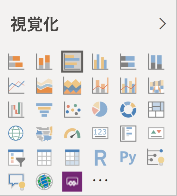

# Power BI のビジュアル

Power BI には、すぐに使用できる Power BI ビジュアルが多数用意されています。 それらのビジュアルは、[Power BI Desktop](https://powerbi.microsoft.com/desktop/) と [Power BI サービス](https://app.powerbi.com)の両方の [視覚化] ペインで使用可能であり、Power BI コンテンツの作成と編集に使用できます。

その他多くの Power BI ビジュアルを Microsoft [AppSource](https://nam06.safelinks.protection.outlook.com/?url=https%3A%2F%2Fappsource.microsoft.com%2Fen-us%2Fmarketplace%2Fapps%3Fpage%3D1%26product%3Dpower-bi-visuals&data=02%7C01%7CKesem.Sharabi%40microsoft.com%7C6d9286afacb3468d4cde08d740b76694%7C72f988bf86f141af91ab2d7cd011db47%7C1%7C0%7C637049028749147718&sdata=igWm0e1vXdgGcbyvngQBrHQVAkahPnxPC1ZhUPntGI8%3D&reserved=0) または Power BI から入手できます。 それらのビジュアルは、Microsoft および Microsoft パートナーによって作成され、AppSource 検証チームによってテストおよび検証されています。

ユーザーが独自の Power BI ビジュアルを開発することもできます。これは、ユーザー、ユーザーの組織、または Power BI コミュニティ全体で使用できます。

## 既定の Power BI ビジュアル

*Power BI Desktop* および *Power BI サービス*の [視覚化] ペインから利用できる、すぐに使用できる Power BI ビジュアルです。

[視覚化] ペインから Power BI ビジュアルのピン留めを外すには、ビジュアルを右クリックし、 **[ピン留めを外す]** を選択します。

[視覚化] ペインで既定の Power BI ビジュアルを復元するには、 **[カスタム ビジュアルのインポート]** をクリックし、 **[既定の視覚化の復元]** を選択します。 

## AppSource の Power BI ビジュアル

Microsoft とコミュニティのメンバーは公共の利益のために Power BI ビジュアルを作成し、[AppSource](https://appsource.microsoft.com/marketplace/apps?product=power-bi-visuals) マーケットプレースに公開しています。 このようなビジュアルをダウンロードして、自身の Power BI レポートに追加することができます。 このような Power BI ビジュアルは Microsoft が機能と品質をテストし、承認しています。

### AppSource とは

[AppSource](https://appsource.microsoft.com/marketplace/apps?product=power-bi-visuals) は Microsoft のソフトウェアのアプリ、アドイン、拡張機能のための場所です。 AppSource は、Office 365、Azure、Dynamics 365、Cortana、Power BI などの製品の何百万人ものユーザーを、これまでより効率よく、洞察力のある方法で仕事をするのに役立つソリューションに結び付けます。

### 認定済み Power BI ビジュアル

認定済み Power BI ビジュアルとは、[AppSource](https://nam06.safelinks.protection.outlook.com/?url=https%3A%2F%2Fappsource.microsoft.com%2Fen-us%2Fmarketplace%2Fapps%3Fpage%3D1%26product%3Dpower-bi-visuals&data=02%7C01%7CKesem.Sharabi%40microsoft.com%7C6d9286afacb3468d4cde08d740b76694%7C72f988bf86f141af91ab2d7cd011db47%7C1%7C0%7C637049028749147718&sdata=igWm0e1vXdgGcbyvngQBrHQVAkahPnxPC1ZhUPntGI8%3D&reserved=0) 上のビジュアルのうち、指定された特定のコード要件を満たし、Microsoft Power BI チームによってテストおよび承認されたものです。 テストは、ビジュアルで外部のサービスやリソースへのアクセスが行われないことを確認するように設計されています。

認定済み Power BI ビジュアルの一覧を表示する場合、または自作のものを送信する場合は、[認定済み Power BI ビジュアル](power-bi-custom-visuals-certified.md)に関する記事を参照してください。

### Power BI ビジュアルのサンプル

AppSource 上の各 Power BI ビジュアルには、ビジュアルの動作を示すデータのサンプルが用意されています。 サンプルをダウンロードするには、[AppSource](https://nam06.safelinks.protection.outlook.com/?url=https%3A%2F%2Fappsource.microsoft.com%2Fen-us%2Fmarketplace%2Fapps%3Fpage%3D1%26product%3Dpower-bi-visuals&data=02%7C01%7CKesem.Sharabi%40microsoft.com%7C6d9286afacb3468d4cde08d740b76694%7C72f988bf86f141af91ab2d7cd011db47%7C1%7C0%7C637049028749147718&sdata=igWm0e1vXdgGcbyvngQBrHQVAkahPnxPC1ZhUPntGI8%3D&reserved=0) で Power BI ビジュアルを選択し、 *[サンプルを試す]* セクションの **[サンプル レポート]** リンクをクリックします。

## 組織のストア

Power BI 管理者は、Power BI ビジュアルを承認して組織に展開します。 これにより、レポート作成者は、これらの Power BI ビジュアルを簡単に検出、更新、使用できます。 管理者は、バージョンの更新、Power BI ビジュアルの無効化と有効化などのアクションを使用して、これらのビジュアルを簡単に管理できます。

組織のストアにアクセスするには、 *[視覚化]* ペインで **[カスタム ビジュアルのインポート]** をクリックし、 **[Marketplace からインポートする]** を選択してから、 *[Power BI ビジュアル]* ウィンドウの上部にある **[自分の所属組織]** タブを選択します。

[組織のビジュアルに関する詳細は、こちらをご覧ください](power-bi-custom-visuals-organization.md)。

## ビジュアル ファイル

Power BI ビジュアルはパッケージであり、特定の目的を果たすデータをレンダリングするためのコードが含まれています。 カスタム ビジュアルは誰でも作成し、単一の `.pbiviz` ファイルとしてパッケージ化できます。このファイルはその後 Power BI レポートにインポートできます。

Power BI ビジュアルをインポートするには、 *[視覚化]* ペインで **[カスタム ビジュアルのインポート]** をクリックし、 **[ファイルからインポートする]** を選択します。

独自のビジュアルを作成して AppSource に追加することに関心がある Web 開発者の方は、[Power BI ビジュアルを開発](custom-visual-develop-tutorial.md)する方法と、[Power BI ビジュアルを AppSource に発行する](office-store.md)方法をご確認ください。

> [!WARNING]
> Power BI ビジュアルには、セキュリティやプライバシーのリスクがあるコードが含まれる場合があります。 レポートにインポートする前に、作成者と Power BI ビジュアルのソースが信頼できることを確認してください。

## 次の手順

* 開発者の方は、「[Power BI のビジュアルを開発する](custom-visual-develop-tutorial.md)」のチュートリアルから開始してください。

* [Power BI ビジュアル プロジェクトの構造](visual-project-structure.md)について学習します。

* [Power BI ビジュアルのガイドライン](guidelines-powerbi-visuals.md)を確認します。

他にわからないことがある場合は、 [Power BI ビジュアルに関してよく寄せられる質問](power-bi-custom-visuals-faq.md)のページまたは [Power BI コミュニティ](https://community.powerbi.com/)で調べてみてください。