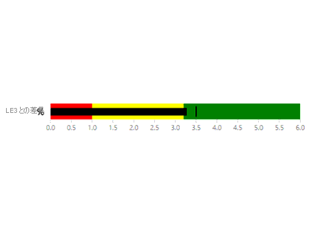
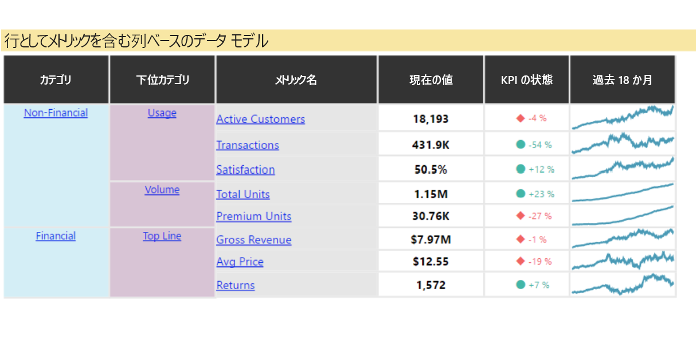
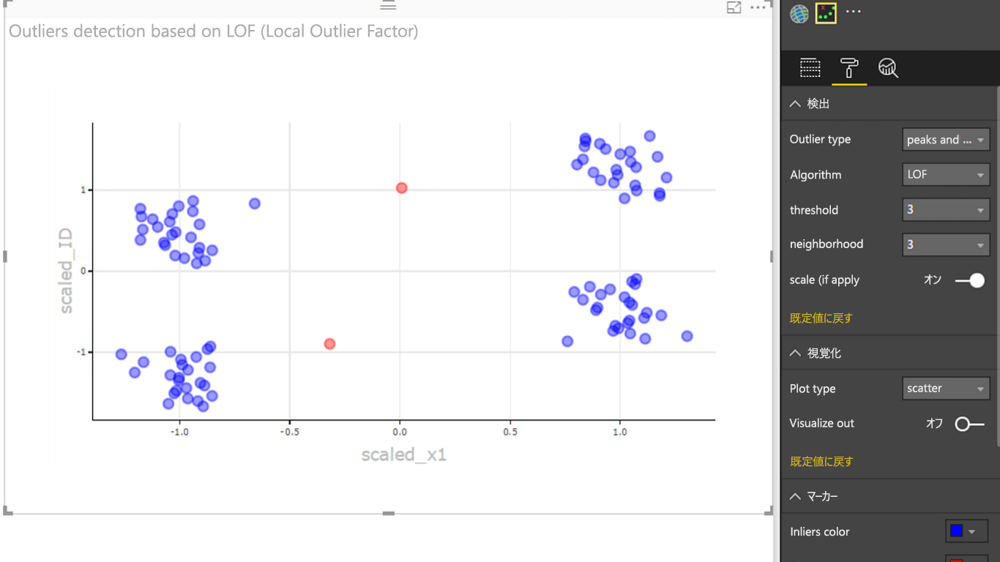

# Power BI ビジュアルのサンプル

これらの Power BI ビジュアルは、GitHub からダウンロードして、使用および変更することができます。 これらのサンプルは、Power BI を使用して開発するときによくある状況を処理する方法を示しています。

## スライサー

スライサーを使用すると、レポートの他の視覚化に表示されるデータの一部を絞り込むことができます。 スライサーは、Power BI に複数用意されているデータのフィルター処理方法の 1 つです。

|   |  | |
| ------------- | ------------- | -------------|
| [Chiclet Slicer (Chiclet スライサー)](https://github.com/Microsoft/powerbi-visuals-chicletslicer/)   その他のビジュアルでキャンバス内フィルターとして動作する画像またはテキストのボタンを表示します | [タイムライン スライサー](https://github.com/Microsoft/powerbi-visuals-timeline/)  日付でフィルター処理するグラフィカル日付範囲セレクター | [スライサーのサンプル](https://github.com/Microsoft/powerbi-visuals-sampleslicer/)  高度なフィルター処理 API の使用方法を示します

## グラフ

横棒グラフ、円グラフ、ワード クラウドなどのギャラリーを参考にしてください。

|   |  | |
| ------------- | ------------- | -------------|
| [アスター プロット](https://github.com/Microsoft/powerbi-visuals-asterplot/)   2 番目の値を使用して掃引角を決める、標準ドーナツ グラフ上のツイスト | [箇条書きグラフ](https://github.com/Microsoft/powerbi-visuals-bulletchart/)  目標の追跡に役立つコンテキストを提供する、追加の視覚要素を持つ横棒グラフ | [弦](https://github.com/Microsoft/powerbi-visuals-chord/)  マトリックスのデータ間の関係を表示するグラフィカル メソッド
|  | |  
| [ドット プロット](https://github.com/Microsoft/powerbi-visuals-dotplot/)  頻度の分布を見栄えよく表現します | [デュアル KPI](https://github.com/Microsoft/powerbi-visuals-dualkpi/)  2 つのメジャーを時系列で効率的に視覚化します。共同タイムライン上にそれらの傾向が表示されます | [強化された散布図](https://github.com/Microsoft/powerbi-visuals-enhancedscatter/)  既存の散布図に対する改善
| | | 
| [フォース グラフ](https://github.com/Microsoft/powerbi-visuals-forcegraph/)  エンティティ間の接続を示すのに便利な、曲線軌道を使用したフォース レイアウト ダイアグラム | [ガント](https://github.com/Microsoft/powerbi-visuals-gantt/)  プロジェクトのタイムラインまたはスケジュールをリソースと共に示す横棒グラフ | [テーブル ヒートマップ](https://github.com/Microsoft/powerbi-visuals-heatmap/)  テーブルで色を使用してデータを簡単かつ直感的に比較します
|  |  |  
| [ヒストグラム グラフ](https://github.com/Microsoft/powerbi-visuals-histogram/)  連続した間隔または特定の期間についてデータの分布を視覚化します | [LineDot グラフ](https://github.com/Microsoft/powerbi-visuals-linedotchart/)  対象ユーザーにデータに対する関心を起こさせる、アニメーション ドットで描かれたアニメーション折れ線グラフ | [Mekko chart](https://github.com/Microsoft/powerbi-visuals-mekkochart/)  100% 積み上げ縦棒グラフと 100% 積み上げ横棒グラフが同時に 1 つのビューに結合されました
|  |  |  
| [Multi KPI](https://github.com/microsoft/PowerBI-visuals-MultiKPI/)   主要な KPI と、サポート データの複数のスパークラインを備えた、強力なマルチ KPI 視覚化 | [Power KPI](https://github.com/microsoft/PowerBI-visuals-PowerKPI/)  複数折れ線グラフとラベルを使用し、現在の日付、値、差異を示す強力な KPI インジケーター | [累乗 KPI マトリックス](https://github.com/microsoft/PowerBI-visuals-PowerKPIMatrix/)  コンパクトで読みやすいリストで、バランスのとれたスコアカードと無制限の数のメトリックと KPI を監視します
| |  |  
| [パルス グラフ](https://github.com/Microsoft/powerbi-visuals-pulsechart/)  重要なイベントの注釈が付けられたこの折れ線グラフは、データでストーリーを伝えるのに最適です| [Radar chart (レーダー チャート)](https://github.com/Microsoft/powerbi-visuals-radarchart/)  カテゴリ軸にプロットされた複数のメジャーを表示します。これは、属性を比較するのに便利です | [Sankey グラフ](https://github.com/Microsoft/powerbi-visuals-sankey/)  系列の幅がフローの量に比例しているフロー ダイアグラム
|  | | 
| [ストリーム グラフ](https://github.com/Microsoft/powerbi-visuals-streamgraph/)  平滑補間法を使用した積み上げ面グラフ。時間の経過と共に値を表示するためによく使用されます | [サンバースト グラフ](https://github.com/Microsoft/powerbi-visuals-sunburst/)  階層データを視覚化するための複数レベルのドーナツ グラフ| [トルネード チャート](https://github.com/Microsoft/powerbi-visuals-tornado/)  2 つのグループ間の変数の相対的重要度を比較します
 | 
 | [ワード クラウド](https://github.com/Microsoft/powerbi-visuals-wordcloud/)  データ内に頻出するテキストからおもしろいビジュアルを作成します

## WebGL

WebGL では、Web コンテンツで OpenGL ES 2.0 に基づく API を使用して、HTML キャンバス内で 2D および 3D レンダリングを実行できます。

| |
| ------------- |
| [Globe Map](https://github.com/Microsoft/powerbi-visuals-globemap/)  インタラクティブな 3D マップ上の場所をプロットします。

## R ビジュアル

これらのサンプルは、R ビジュアルと R スクリプトの分析とビジュアルの機能を活用する方法を示します。

| | | |
|------------- |------------- |------------- |------------- |
| [関連付けルール](https://github.com/Microsoft/powerbi-visuals-assorules/)  if-then ステートメントを使用することで、一見関連がないデータ間のリレーションシップを発見します | [クラスタリング](https://github.com/Microsoft/powerbi-visuals-clustering-kmeans/)  k 平均法アルゴリズムを使用してデータ内の類似グループを見つけます | [外れ値によるクラスタリング](https://github.com/microsoft/PowerBI-visuals-dbscan/)  データの類似グループと外れ値を見つけます
|  |  |  
| [相関プロット](https://github.com/Microsoft/powerbi-visuals-corrplot/)  データ テーブル内で最も相関のある変数を強調表示します | [デシジョン ツリー グラフ](https://github.com/Microsoft/powerbi-visuals-decision-tree/)  再帰的パーティション分割を使用して統計的確率を判断するためのツリー形式の概略図 | [予測 TBATS](https://github.com/Microsoft/powerbi-visuals-forcasting-tbats/)  TBATS モデルを使用した、複数の季節性がある系列の時系列予測
|  |  |  
| [Forecasting with ARIMA (ARIMA による予測)](https://github.com/Microsoft/powerbi-visuals-forcastingarima/)  自己回帰和分移動平均 (ARIMA) を使用して、履歴データに基づいて将来の値を予測します | [じょうごプロット](https://github.com/Microsoft/powerbi-visuals-funnel/)  じょうごプロットを使用して、データ内の外れ値を見つけます | [外れ値の検出](https://github.com/Microsoft/powerbi-visuals-outliers-det/)  最適な方法とプロットを使用してデータ内の外れ値を見つけます
|  |  | 
| [スプライン グラフ](https://github.com/Microsoft/powerbi-visuals-spline/)  ノイズの多いデータを視覚化して把握します | [時系列分解グラフ](https://github.com/Microsoft/powerbi-visuals-timeseriesdecomposition/)  "Loess に基づく STL (Seasonal and Trend) 分解" を使用して時系列の要素を把握します | [時系列予測グラフ](https://github.com/Microsoft/powerbi-visuals-forcasting-exp/)  指数平滑法を使用して、以前の予測値に基づいて将来の値を予測します

## 次の手順

Power BI ビジュアルの作成を試すには、「[チュートリアル: Power BI のビジュアルを開発する](custom-visual-develop-tutorial.md)」。
