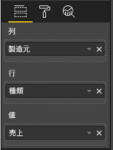

# <a name="add-interactivity-into-visual-by-power-bi-visuals-selections"></a>Power BI ビジュアルの選択によってビジュアルに対話機能を追加する

Power BI には、ビジュアル間の相互作用を実現する 2 つの方法が用意されています。選択とフィルター処理です。 以下のサンプルでは、1 つのビジュアル内の任意の項目を選択し、そのレポート内の他のビジュアルに新しい選択状態について通知する方法を示しています。

`Selection` オブジェクトは、次のインターフェイスに対応しています。

```typescript
export interface ISelectionId {
    equals(other: ISelectionId): boolean;
    includes(other: ISelectionId, ignoreHighlight?: boolean): boolean;
    getKey(): string;
    getSelector(): Selector;
    getSelectorsByColumn(): SelectorsByColumn;
    hasIdentity(): boolean;
}
```

## <a name="how-to-use-selectionmanager-to-select-data-points"></a>SelectionManager を使用してデータ ポイントを選択する方法

ビジュアルのホスト オブジェクトには、選択マネージャーのインスタンスを作成するためのメソッドが用意されています。 選択マネージャーを使用して、選択、選択の解除、コンテキスト メニューの表示、現在の選択の保存、および選択状態の確認を行います。 また、選択マネージャーには、これらのアクションに対応するメソッドがあります。

### <a name="create-instance-of-selection-manager"></a>選択マネージャーのインスタンスを作成する

選択マネージャーを使用するには、選択マネージャーのインスタンスを作成する必要があります。 通常は、ビジュアルによって、そのビジュアル オブジェクトの `constructor` 内で選択マネージャーのインスタンスが作成されます。

```typescript
export class Visual implements IVisual {
    private target: HTMLElement;
    private host: IVisualHost;
    private selectionManager: ISelectionManager;
    // ...
    constructor(options: VisualConstructorOptions) {
        this.host = options.host;
        // ...
        this.selectionManager = this.host.createSelectionManager();
    }
    // ...
}
```

### <a name="create-instance-of-selection-builder"></a>選択ビルダーのインスタンスを作成する

選択マネージャーのインスタンスを作成したら、そのビジュアルのデータ ポイントごとに `selections` を作成する必要があります。 ビジュアルのホスト オブジェクトには、各データ ポイントの選択を生成する `createSelectionIdBuilder` メソッドが用意されています。 このメソッドを使うと、インターフェイス `powerbi.visuals.ISelectionIdBuilder` を持つオブジェクトのインスタンスが返されます。

```typescript
export interface ISelectionIdBuilder {
    withCategory(categoryColumn: DataViewCategoryColumn, index: number): this;
    withSeries(seriesColumn: DataViewValueColumns, valueColumn: DataViewValueColumn | DataViewValueColumnGroup): this;
    withMeasure(measureId: string): this;
    withMatrixNode(matrixNode: DataViewMatrixNode, levels: DataViewHierarchyLevel[]): this;
    withTable(table: DataViewTable, rowIndex: number): this;
    createSelectionId(): ISelectionId;
}
```

このオブジェクトには、さまざまな種類のデータ ビュー マッピングの `selections` を作成するための、対応するメソッドが備わっています。

> [!NOTE]
> メソッド `withTable` と `withMatrixNode` は、Power BI ビジュアルの API 2.5.0 で導入されました。
> テーブルまたはマトリックスのデータ ビュー マッピングに対する選択を使用する必要がある場合は、API バージョンを 2.5.0 以上に更新する必要があります。

### <a name="create-selections-for-categorical-data-view-mapping"></a>カテゴリ別のデータ ビュー マッピングに対する選択を作成する

サンプル データセットのカテゴリ別のデータ ビュー マッピングについて、選択がどのように表されるかを確認しましょう。

| 製造元 | 種類 | 値 |
| - | - | - |
| Chrysler | Domestic Car | 28883 |
| Chrysler | Domestic Truck | 117131 |
| Chrysler | Import Car | 0 |
| Chrysler | Import Truck | 6362 |
| Ford | Domestic Car | 50032 |
| Ford | Domestic Truck | 122446 |
| Ford | Import Car | 0 |
| Ford | Import Truck | 0 |
| GM | Domestic Car | 65426 |
| GM | Domestic Truck | 138122 |
| GM | Import Car | 197 |
| GM | Import Truck | 0 |
| Honda | Domestic Car | 51450 |
| Honda | Domestic Truck | 46115 |
| Honda | Import Car | 2932 |
| Honda | Import Truck | 0 |
| Nissan | Domestic Car | 51476 |
| Nissan | Domestic Truck | 47343 |
| Nissan | Import Car | 5485 |
| Nissan | Import Truck | 1430 |
| Toyota | Domestic Car | 55643 |
| Toyota | Domestic Truck | 61227 |
| Toyota | Import Car | 20799 |
| Toyota | Import Truck | 23614 |

また、ビジュアルでは、次のデータ ビュー マッピングが使用されます。

```json
{
    "dataRoles": [
        {
            "displayName": "Columns",
            "name": "columns",
            "kind": "Grouping"
        },
        {
            "displayName": "Rows",
            "name": "rows",
            "kind": "Grouping"
        },
        {
            "displayName": "Values",
            "name": "values",
            "kind": "Measure"
        }
    ],
    "dataViewMappings": [
        {
            "categorical": {
                "categories": {
                    "for": {
                        "in": "columns"
                    }
                },
                "values": {
                    "group": {
                        "by": "rows",
                        "select": [
                            {
                                "for": {
                                    "in": "values"
                                }
                            }
                        ]
                    }
                }
            }
        }
    ]
}
```

このサンプルでは、`Manafacturer` が `columns` で、`Type` が `rows` です。 `rows` (`Type`) で値をグループ化することによって作成された系列があります。

また、ビジュアルでは、`Manafacturer` と `Type` によってデータをスライスすることもできます。

たとえば、ユーザーが `Manafacturer` で `Chrysler` を選択すると、他のビジュアルには次のデータが表示されます。

| 製造元 | 種類 | 値 |
| - | - | - |
| **Chrysler** | Domestic Car | 28883 |
| **Chrysler** | Domestic Truck | 117131 |
| **Chrysler** | Import Car | 0 |
| **Chrysler** | Import Truck | 6362 |

ユーザーが `Type` で `Import Car` を選択 (系列でデータを選択) すると、他のビジュアルには次のデータが表示されます。

| 製造元 | 種類 | 値 |
| - | - | - |
| Chrysler | **Import Car** | 0 |
| Ford | **Import Car** | 0 |
| GM | **Import Car** | 197 |
| Honda | **Import Car** | 2932 |
| Nissan | **Import Car** | 5485 |
| Toyota | **Import Car** | 20799 |


ビジュアルのデータ バスケットにデータを入力する必要があります。



カテゴリ (列) として `Manafacturer` が、系列 (行) として `Type` が、系列の `Values` として `Value` があります。

> [!NOTE]
> 系列に対して `Values` が必要です。データ ビュー マッピングに応じて、ビジュアルでは `Values` が `Rows` データによってグループ化されることが想定されるためです。

#### <a name="create-selections-for-categories"></a>カテゴリに対する選択を作成する

```typescript
// categories
const categories = dataView.categorical.categories;

// create label for 'Manafacturer' column
const p = document.createElement("p") as HTMLParagraphElement;
p.innerText = categories[0].source.displayName.toString();
this.target.appendChild(p);

// get count of category elements
const categoriesCount = categories[0].values.length;

// iterate all categories to generate selection and create button elements to use selections
for (let categoryIndex = 0; categoryIndex < categoriesCount; categoryIndex++) {
    const categoryValue: powerbi.PrimitiveValue = categories[0].values[categoryIndex];

    const categorySelectionId = this.host.createSelectionIdBuilder()
        .withCategory(categories[0], categoryIndex) // we have only one category (only one `Manafacturer` column)
        .createSelectionId();
    this.dataPoints.push({
        value: categoryValue,
        selection: categorySelectionId
    });
    console.log(categorySelectionId);

    // create button element to apply selection on click
    const button = document.createElement("button") as HTMLButtonElement;
    button.value = categoryValue.toString();
    button.innerText = categoryValue.toString();
    button.addEventListener("click", () => {
        // handle click event to apply correspond selection
        this.selectionManager.select(categorySelectionId);
    });
    this.target.appendChild(button);
}
```

このサンプル コードでは、すべてのカテゴリが反復処理されていることがわかります。 それぞれの反復では、`createSelectionIdBuilder` を呼び出し、その選択ビルダーの `withCategory` メソッドを呼び出すことで各カテゴリに対する次の選択を作成しています。 `createSelectionId` メソッドは、生成された `selection` オブジェクトを返すための最後のメソッドとして使用されています。

`withCategory` メソッドには、`category` の列 (このサンプルでは `Manafacturer`) と、カテゴリ要素のインデックスを渡します。

#### <a name="create-selections-for-series"></a>系列に対する選択を作成する

```typescript
// get groupped values for series
const series: powerbi.DataViewValueColumnGroup[] = dataView.categorical.values.grouped();

// create label for 'Type' column
const p2 = document.createElement("p") as HTMLParagraphElement;
p2.innerText = dataView.categorical.values.source.displayName;
this.target.appendChild(p2);

// iterate all series to generate selection and create button elements to use selections
series.forEach( (ser: powerbi.DataViewValueColumnGroup) => {
    // create selection id for series
    const seriesSelectionId = this.host.createSelectionIdBuilder()
        .withSeries(dataView.categorical.values, ser)
        .createSelectionId();

    this.dataPoints.push({
        value: ser.name,
        selection: seriesSelectionId
    });

    // create button element to apply selection on click
    const button = document.createElement("button") as HTMLButtonElement;
    button.value =ser.name.toString();
    button.innerText = ser.name.toString();
    button.addEventListener("click", () => {
        // handle click event to apply correspond selection
        this.selectionManager.select(seriesSelectionId);
    });
    this.target.appendChild(button);
});
```

### <a name="create-selections-for-table-data-view-mapping"></a>テーブルのデータ ビュー マッピングに対する選択を作成する

テーブルのデータ ビュー マッピングのサンプル

```json
{
    "dataRoles": [
        {
            "displayName": "Values",
            "name": "values",
            "kind": "GroupingOrMeasure"
        }
    ],
    "dataViewMappings": [
        {
            "table": {
                "rows": {
                    "for": {
                        "in": "values"
                    }
                }
            }
        }
    ]
}
```

テーブルのデータ ビュー マッピングの各行に対する選択を作成するには、選択ビルダーの `withTable` メソッドを呼び出す必要があります。

```typescript
public update(options: VisualUpdateOptions) {
    const dataView = options.dataViews[0];
    dataView.table.rows.forEach((row: DataViewTableRow, rowIndex: number) => {
        this.target.appendChild(rowDiv);
        const selection: ISelectionId = this.host.createSelectionIdBuilder()
            .withTable(dataView.table, rowIndex)
            .createSelectionId();
    }
}
```

ビジュアルのコードでは、テーブルの行が反復処理され、各行で `withTable` テーブル メソッドが呼び出されます。 `withTable` メソッドのパラメーターは、`table` オブジェクトと、テーブル行のインデックスです。

### <a name="create-selections-for-matrix-data-view-mapping"></a>マトリックスのデータ ビュー マッピングに対する選択を作成する

```typescript
public update(options: VisualUpdateOptions) {
    const host = this.host;
    const rowLevels: powerbi.DataViewHierarchyLevel[] = dataView.matrix.rows.levels;
    const columnLevels: powerbi.DataViewHierarchyLevel[] = dataView.matrix.rows.levels;

    // iterate rows hierarchy
    nodeWalker(dataView.matrix.rows.root, rowLevels);
    // iterate columns hierarchy
    nodeWalker(dataView.matrix.columns.root, columnLevels);

    function nodeWalker(node: powerbi.DataViewMatrixNode, levels: powerbi.DataViewHierarchyLevel[]) {
        const nodeSelection = host.createSelectionIdBuilder().withMatrixNode(node, levels);

        if (node.children && node.children.length) {
            node.children.forEach(child => {
                nodeWalker(child, levels);
            });
        }
    }
}
```

このサンプルでは、各ノードと子ノードに対して `nodeWalker` が再帰的に呼び出されています。

`nodeWalker` を呼び出すごとに、`nodeSelection` オブジェクトが作成されます。 各 `nodeSelection` は、対応するノードの `selection` を表します。

## <a name="select-datapoints-to-slice-other-visuals"></a>データ ポイントを選択して他のビジュアルをスライスする

カテゴリ別のデータ ビュー マッピングに対する選択のサンプル コードでは、ボタン要素のクリックに対するハンドラーを作成しました。 このハンドラーでは、選択マネージャーの `select` メソッドが呼び出されて選択オブジェクトが渡されます。

```typescript
button.addEventListener("click", () => {
    // handle click event to apply correspond selection
    this.selectionManager.select(categorySelectionId);
});
```

`select` メソッドのインターフェイスは次のとおりです。

```typescript
interface ISelectionManager {
    // ...
    select(selectionId: ISelectionId | ISelectionId[], multiSelect?: boolean): IPromise<ISelectionId[]>;
    // ...
}
```

`select` には選択の配列を指定できることがわかります。 これは、ビジュアルで複数のデータ ポイントを選択できることを意味します。 2 番目のパラメーター `multiSelect` によって、複数選択が行われます。 この値が true の場合、Power BI では、前の選択状態がクリアされず、現在の選択が適用されます。それ以外の場合は前の選択がリセットされます。

`multiSelect` を使用する典型的なシナリオは、クリック イベントで CTRL ボタンの状態を処理する場合です。

```typescript
button.addEventListener("click", (mouseEvent) => {
    const multiSelect = (mouseEvent as MouseEvent).ctrlKey;
    this.selectionManager.select(seriesSelectionId, multiSelect);
});
```

## <a name="next-steps"></a>次の手順

* [データ ポイントに対してビジュアル プロパティをバインドするために選択を使用する方法を確認する](objects-properties.md#objects-selector)

* [ブックマークの切り替えで選択を処理する方法を確認する](bookmarks-support.md#visuals-with-selection)

* [ビジュアルのデータ ポイントのコンテキスト メニューを追加する方法を確認する](context-menu.md)

* [InteractivityUtils を使用して Power BI ビジュアルに選択を追加する方法を確認する](utils-interactivity-selections.md)
