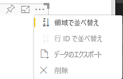

# <a name="sorting-options-for-power-bi-visuals"></a>Power BI ビジュアルの並べ替えオプション

この記事では、"*並べ替え*" オプションで Power BI ビジュアルの並べ替え動作を指定する方法について説明します。 

並べ替え機能を利用するには、次のいずれかのパラメーターが必要です。

## <a name="default-sorting"></a>既定の並べ替え

`default` オプションは最も単純な形式です。 "DataMappings" セクションに表示されるデータを並べ替えることができます。 そのオプションにより、ユーザーによるデータ マッピングの並べ替えができるようになり、並べ替えの方向を指定できます。

```json
    "sorting": {
        "default": {   }
    }
```



## <a name="implicit-sorting"></a>暗黙的な並べ替え

暗黙的な並べ替えは、各データ ロールの並べ替えが記述されている配列パラメーター `clauses` による並べ替えです。 `implicit` は、ビジュアルのユーザーが並べ替え順序を変更できないことを意味します。 Power BI のビジュアルのメニューには、並べ替えオプションは表示されません。 ただし、Power BI では、指定された設定に従ってデータが並べ替えられます。

`clauses` パラメーターには、次の 2 つのパラメーターを持つ複数のオブジェクトを含めることができます。

- `role`:並べ替える `DataMapping` を決定します
- `direction`:並べ替えの方向を決定します (1 = 昇順、2 = 降順)

```json
    "sorting": {
        "implicit": {
            "clauses": [
                {
                    "role": "category",
                    "direction": 1
                },
                {
                    "role": "measure",
                    "direction": 2
                }
            ]
        }
    }
```

## <a name="custom-sorting"></a>カスタム並べ替え

カスタム並べ替えとは、開発者がビジュアルのコードで並べ替えを管理することを意味します。
