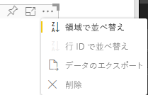

# <a name="sorting-options"></a>並べ替えオプション

`Sorting` により、Power BI ビジュアルの既定の並べ替え動作が指定されます。
機能には、以下で説明するパラメーターのいずれかが必要になります。

## <a name="default-sorting"></a>既定の並べ替え

`default` オプションは最も単純な形式です。 "DataMappings" セクションに表示されるデータを並べ替えることができます。
このオプションにより、ユーザーによる "DataMappings" の並べ替えが可能になり、並べ替えの方向を指定できます。

```json
    "sorting": {
        "default": {   }
    }
```



## <a name="implicit-sorting"></a>暗黙的な並べ替え

`implicit` は、データ ロール別の並べ替えを表わす配列パラメーター `clauses` による並べ替えです。
`implicit` は、ビジュアルのユーザーが並べ替え順序を変更できないことを意味します。
Power BI では、ビジュアルのメニューに並べ替えオプションが表示されません。 ただし、Power BI では、指定された設定に従ってデータが並べ替えられます。

`clauses` パラメーターには、いくつかのオブジェクトと 2 つのパラメーターを含めることができます。

- `role` - 並べ替えの `DataMapping` を決定します。

- `direction` - 並べ替えの方向を決定します (1 = 昇順、2 = 降順)。

```json
    "sorting": {
        "implicit": {
            "clauses": [
                {
                    "role": "category",
                    "direction": 1
                },
                {
                    "role": "measure",
                    "direction": 2
                }
            ]
        }
    }
```

## <a name="custom-sorting"></a>カスタム並べ替え

`custom` は、並べ替えがビジュアルのコードで開発者により管理されることを意味します。
