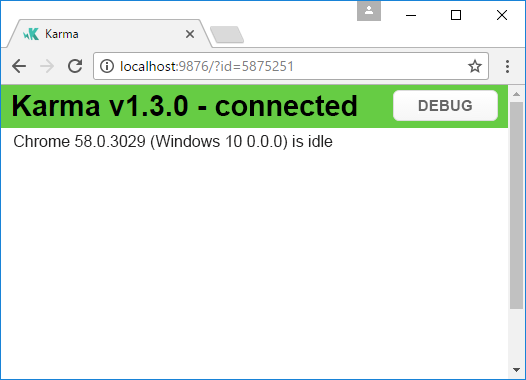
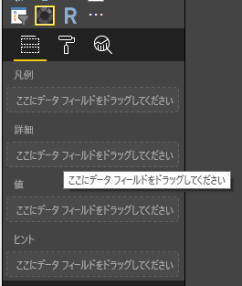

# <a name="tutorial-add-unit-tests-for-power-bi-visual-projects"></a>チュートリアル:Power BI のビジュアル プロジェクトの単体テストを追加する

この記事では、以下のことを行う方法など、Power BI のビジュアルに関する単体テストを作成するときの基本事項について説明します。

* Karma JavaScript テスト ランナー テスト フレームワークである Jasmine を設定します。
* powerbi-visuals-utils-testutils パッケージを使用します。
* モックとフェイクを使用して Power BI のビジュアルの単体テストを簡略化します。

## <a name="prerequisites"></a>前提条件

* Power BI のビジュアル プロジェクトがインストールされている
* Node.js 環境が構成されている

## <a name="install-and-configure-the-karma-javascript-test-runner-and-jasmine"></a>Karma JavaScript テスト ランナーと Jasmine をインストールして構成する

必要なライブラリを *package.json* ファイルの `devDependencies` セクションに追加します。

```json
"@babel/polyfill": "^7.2.5",
"@types/d3": "5.5.0",
"@types/jasmine": "2.5.37",
"@types/jasmine-jquery": "1.5.28",
"@types/jquery": "2.0.41",
"@types/karma": "3.0.0",
"@types/lodash-es": "4.17.1",
"coveralls": "3.0.2",
"istanbul-instrumenter-loader": "^3.0.1",
"jasmine": "2.5.2",
"jasmine-core": "2.5.2",
"jasmine-jquery": "2.1.1",
"jquery": "3.1.1",
"karma": "3.1.1",
"karma-chrome-launcher": "2.2.0",
"karma-coverage": "1.1.2",
"karma-coverage-istanbul-reporter": "^2.0.4",
"karma-jasmine": "2.0.1",
"karma-junit-reporter": "^1.2.0",
"karma-sourcemap-loader": "^0.3.7",
"karma-typescript": "^3.0.13",
"karma-typescript-preprocessor": "0.4.0",
"karma-webpack": "3.0.5",
"puppeteer": "1.17.0",
"style-loader": "0.23.1",
"ts-loader": "5.3.0",
"ts-node": "7.0.1",
"tslint": "^5.12.0",
"webpack": "4.26.0"
```

*package.json* の詳細については、[npm-package.json](https://docs.npmjs.com/files/package.json) の説明を参照してください。

*package.json* ファイルを保存し、その `package.json` の場所で次のコマンドを実行します。

```cmd
npm install
```

パッケージ マネージャーによって、*package.json* に追加されるすべての新しいパッケージがインストールされます。

単体テストを実行するには、テスト ランナー `webpack` の構成を構成します。

次のコードは、*test.webpack.config.js* ファイルのサンプルです。

```typescript
const path = require('path');
const webpack = require("webpack");

module.exports = {
    devtool: 'source-map',
    mode: 'development',
    optimization : {
        concatenateModules: false,
        minimize: false
    },
    module: {
        rules: [
            {
                test: /\.tsx?$/,
                use: 'ts-loader',
                exclude: /node_modules/
            },
            {
                test: /\.json$/,
                loader: 'json-loader'
            },
            {
                test: /\.tsx?$/i,
                enforce: 'post',
                include: /(src)/,
                exclude: /(node_modules|resources\/js\/vendor)/,
                loader: 'istanbul-instrumenter-loader',
                options: { esModules: true }
            },
            {
                test: /\.less$/,
                use: [
                    {
                        loader: 'style-loader'
                    },
                    {
                        loader: 'css-loader'
                    },
                    {
                        loader: 'less-loader',
                        options: {
                            paths: [path.resolve(__dirname, 'node_modules')]
                        }
                    }
                ]
            }
        ]
    },
    externals: {
        "powerbi-visuals-api": '{}'
    },
    resolve: {
        extensions: ['.tsx', '.ts', '.js', '.css']
    },
    output: {
        path: path.resolve(__dirname, ".tmp/test")
    },
    plugins: [
        new webpack.ProvidePlugin({
            'powerbi-visuals-api': null
        })
    ]
};
```

次のコードは、*karma.conf.ts* ファイルのサンプルです。

```typescript
"use strict";

const webpackConfig = require("./test.webpack.config.js");
const tsconfig = require("./test.tsconfig.json");
const path = require("path");

const testRecursivePath = "test/visualTest.ts";
const srcOriginalRecursivePath = "src/**/*.ts";
const coverageFolder = "coverage";

process.env.CHROME_BIN = require("puppeteer").executablePath();

import { Config, ConfigOptions } from "karma";

module.exports = (config: Config) => {
    config.set(<ConfigOptions>{
        mode: "development",
        browserNoActivityTimeout: 100000,
        browsers: ["ChromeHeadless"], // or Chrome to use locally installed Chrome browser
        colors: true,
        frameworks: ["jasmine"],
        reporters: [
            "progress",
            "junit",
            "coverage-istanbul"
        ],
        junitReporter: {
            outputDir: path.join(__dirname, coverageFolder),
            outputFile: "TESTS-report.xml",
            useBrowserName: false
        },
        singleRun: true,
        plugins: [
            "karma-coverage",
            "karma-typescript",
            "karma-webpack",
            "karma-jasmine",
            "karma-sourcemap-loader",
            "karma-chrome-launcher",
            "karma-junit-reporter",
            "karma-coverage-istanbul-reporter"
        ],
        files: [
            "node_modules/jquery/dist/jquery.min.js",
            "node_modules/jasmine-jquery/lib/jasmine-jquery.js",
            {
                pattern: './capabilities.json',
                watched: false,
                served: true,
                included: false
            },
            testRecursivePath,
            {
                pattern: srcOriginalRecursivePath,
                included: false,
                served: true
            }
        ],
        preprocessors: {
            [testRecursivePath]: ["webpack", "coverage"]
        },
        typescriptPreprocessor: {
            options: tsconfig.compilerOptions
        },
        coverageIstanbulReporter: {
            reports: ["html", "lcovonly", "text-summary", "cobertura"],
            dir: path.join(__dirname, coverageFolder),
            'report-config': {
                html: {
                    subdir: 'html-report'
                }
            },
            combineBrowserReports: true,
            fixWebpackSourcePaths: true,
            verbose: false
        },
        coverageReporter: {
            dir: path.join(__dirname, coverageFolder),
            reporters: [
                // reporters not supporting the `file` property
                { type: 'html', subdir: 'html-report' },
                { type: 'lcov', subdir: 'lcov' },
                // reporters supporting the `file` property, use `subdir` to directly
                // output them in the `dir` directory
                { type: 'cobertura', subdir: '.', file: 'cobertura-coverage.xml' },
                { type: 'lcovonly', subdir: '.', file: 'report-lcovonly.txt' },
                { type: 'text-summary', subdir: '.', file: 'text-summary.txt' },
            ]
        },
        mime: {
            "text/x-typescript": ["ts", "tsx"]
        },
        webpack: webpackConfig,
        webpackMiddleware: {
            stats: "errors-only"
        }
    });
};
```

この構成は、必要に応じて変更できます。

*karma.conf.js* のコードには、次の変数が含まれています。

* `recursivePathToTests`:テスト コードの場所を示します

* `srcRecursivePath`:コンパイル後に出力される JavaScript コードの場所を示します

* `srcCssRecursivePath`:スタイル情報が含まれる less ファイルのコンパイル後に出力される CSS の場所を示します

* `srcOriginalRecursivePath`:ビジュアルのソース コードの場所を示します

* `coverageFolder`:カバレッジ レポートが作成される場所を決定します

構成ファイルには、次のプロパティが含まれます。

* `singleRun: true`:テストは、継続的インテグレーション (CI) システムで実行するか、または 1 回実行することができます。 テストをデバッグする場合は、この設定を *false* に変更できます。 Karma では、デバッグにコンソールを使用できるように、ブラウザーは実行されたままになります。

* `files: [...]`:この配列では、ブラウザーに読み込むファイルを指定できます。 通常は、ソース ファイル、テスト ケース、ライブラリ (jasmine、テスト ユーティリティ) があります。 必要に応じて、リストにファイルを追加できます。

* `preprocessors`:このセクションでは、単体テストを実行する前に実行するアクションを構成します。 それらでは、TypeScript が JavaScript にプリコンパイルされ、ソース マップ ファイルが準備されて、コード カバレッジ レポートが生成されます。 テストをデバッグするときは、`coverage` を無効にできます。 カバレッジではテスト カバレッジに対するチェック コード用に追加のコードが生成されるので、テストのデバッグが複雑になります。

すべての Karma 構成の説明については、[Karma 構成ファイル](https://karma-runner.github.io/1.0/config/configuration-file.html)のページを参照してください。

便宜のため、テスト コマンドを `scripts` に追加できます。

```json
{
    "scripts": {
        "pbiviz": "pbiviz",
        "start": "pbiviz start",
        "typings":"node node_modules/typings/dist/bin.js i",
        "lint": "tslint -r \"node_modules/tslint-microsoft-contrib\"  \"+(src|test)/**/*.ts\"",
        "pretest": "pbiviz package --resources --no-minify --no-pbiviz --no-plugin",
        "test": "karma start"
    }
    ...
}
```

これで、単体テストの作成を始める準備ができました。

## <a name="check-the-dom-element-of-the-visual"></a>ビジュアルの DOM 要素を確認する

ビジュアルをテストするには、最初にビジュアルのインスタンスを作成します。

### <a name="create-a-visual-instance-builder"></a>ビジュアル インスタンス ビルダーを作成する

次のコードを使用して、*visualBuilder.ts* ファイルを *test* フォルダーに追加します。

```typescript
import {
    VisualBuilderBase
} from "powerbi-visuals-utils-testutils";

import {
    BarChart as VisualClass
} from "../src/visual";

import  powerbi from "powerbi-visuals-api";
import VisualConstructorOptions = powerbi.extensibility.visual.VisualConstructorOptions;

export class BarChartBuilder extends VisualBuilderBase<VisualClass> {
    constructor(width: number, height: number) {
        super(width, height);
    }

    protected build(options: VisualConstructorOptions) {
        return new VisualClass(options);
    }

    public get mainElement() {
        return this.element.children("svg.barChart");
    }
}
```

`build` メソッドは、ビジュアルのインスタンスを作成するためのものです。 `mainElement` は get メソッドで、ビジュアル内の "ルート" ドキュメント オブジェクト モデル (DOM) 要素のインスタンスを返します。 このゲッターは省略可能ですが、単体テストの作成が容易になります。

これで、ビジュアルのインスタンスのビルドが完成です。 テスト ケースを作成してみましょう。 テスト ケースでは、ビジュアルが表示されるときに作成される SVG 要素がチェックされます。

### <a name="create-a-typescript-file-to-write-test-cases"></a>TypeScript ファイルを作成してテスト ケースを記述する

次のコードを使用して、テスト ケースの *visualTest.ts* ファイルを追加します。

```typescript
import powerbi from "powerbi-visuals-api";

import { BarChartBuilder } from "./VisualBuilder";

import {
    BarChart as VisualClass
} from "../src/visual";

import VisualBuilder = powerbi.extensibility.visual.test.BarChartBuilder;

describe("BarChart", () => {
    let visualBuilder: VisualBuilder;
    let dataView: DataView;

    beforeEach(() => {
        visualBuilder = new VisualBuilder(500, 500);
    });

    it("root DOM element is created", () => {
        expect(visualBuilder.mainElement).toBeInDOM();
    });
});
```

複数のメソッドが呼び出されます。

* [`describe`](https://jasmine.github.io/api/2.6/global.html#describe): テスト ケースが記述されます。 Jasmine フレームワークのコンテキストでは、多くの場合、スペックのスイートまたはグループが記述されます。

* `beforeEach`:[`describe`](https://jasmine.github.io/api/2.6/global.html#beforeEach) メソッドで定義されている `it` メソッドの各呼び出しの前に呼び出されます。

* [`it`](https://jasmine.github.io/api/2.6/global.html#it): 1 つのスペックが定義されます。`it` メソッドには、`expectations` が 1 つ以上含まれている必要があります。

* [`expect`](https://jasmine.github.io/api/2.6/global.html#expect): スペックの要求項目が作成されます。要求項目のすべてに合格すると (不合格の項目が 1 つもなければ) スペックが成功となります。

* `toBeInDOM`:"*matchers*" メソッドの 1 つです。 マッチャーの詳細については、[Jasmine の名前空間 matchers](https://jasmine.github.io/api/2.6/matchers.html) に関するページを参照してください。

Jasmine の詳細については、[Jasmine framework のドキュメント](https://jasmine.github.io/)のページを参照してください。

### <a name="launch-unit-tests"></a>単体テストを開始する

このテストでは、ビジュアルのルートの SVG 要素が作成できているかどうかを検査します。 単体テストを実行するには、コマンドライン ツールで次のコマンドを入力します。

```cmd
npm run test
```

`karma.js` では、Chrome ブラウザーでテスト ケースが実行されます。



> [!NOTE]
> Google Chrome をローカル環境にインストールする必要があります。

コマンドライン ウィンドウに、次の出力が表示されます。

```cmd
> karma start

23 05 2017 12:24:26.842:WARN [watcher]: Pattern "E:/WORKSPACE/PowerBI/PowerBI-visuals-sampleBarChart/data/*.csv" does not match any file.
23 05 2017 12:24:30.836:WARN [karma]: No captured browser, open https://localhost:9876/
23 05 2017 12:24:30.849:INFO [karma]: Karma v1.3.0 server started at https://localhost:9876/
23 05 2017 12:24:30.850:INFO [launcher]: Launching browser Chrome with unlimited concurrency
23 05 2017 12:24:31.059:INFO [launcher]: Starting browser Chrome
23 05 2017 12:24:33.160:INFO [Chrome 58.0.3029 (Windows 10 0.0.0)]: Connected on socket /#2meR6hjXFmsE_fjiAAAA with id 5875251
Chrome 58.0.3029 (Windows 10 0.0.0): Executed 1 of 1 SUCCESS (0.194 secs / 0.011 secs)

=============================== Coverage summary ===============================
Statements   : 27.43% ( 65/237 )
Branches     : 19.84% ( 25/126 )
Functions    : 43.86% ( 25/57 )
Lines        : 20.85% ( 44/211 )
================================================================================
```

### <a name="how-to-add-static-data-for-unit-tests"></a>単体テスト用の静的データを追加する方法

次のコードを使用して、*visualData.ts* ファイルを *test* フォルダーに作成します。

```typescript
import powerbi from "powerbi-visuals-api";
import DataView = powerbi.DataView;

import {
    testDataViewBuilder,
    getRandomNumbers
} from "powerbi-visuals-utils-testutils";

export class SampleBarChartDataBuilder extends TestDataViewBuilder {
    public static CategoryColumn: string = "category";
    public static MeasureColumn: string = "measure";

    public constructor() {
        super();
        ...
    }

    public getDataView(columnNames?: string[]): DataView {
        let dateView: any = this.createCategoricalDataViewBuilder([
            ...
        ],
        [
            ...
        ], columnNames).build();

        // there's client side computed maxValue
        let maxLocal = 0;
        this.valuesMeasure.forEach((item) => {
                if (item > maxLocal) {
                    maxLocal = item;
                }
        });
        (<any>dataView).categorical.values[0].maxLocal = maxLocal;
    }
}
```

`SampleBarChartDataBuilder` クラスでは `TestDataViewBuilder` が拡張され、抽象メソッド `getDataView` が実装されます。

データをデータ フィールド バケットに入れると、Power BI により、そのデータに基づくカテゴリの `dataview` オブジェクトが生成されます。



単体テストでは、データを再生成するための Power BI コア機能はありません。 ただし、静的データをカテゴリの `dataview` にマップする必要があります。 `TestDataViewBuilder` クラスがそれをマップするのに役立ちます。

データ ビュー マッピングの詳細については、「[DataViewMappings](https://github.com/Microsoft/PowerBI-visuals/blob/master/Capabilities/DataViewMappings.md)」を参照してください。

`getDataView` メソッドでは、データを指定して `createCategoricalDataViewBuilder` メソッドを呼び出します。

`sampleBarChart` ビジュアルの [capabilities.json](https://github.com/Microsoft/PowerBI-visuals-sampleBarChart/blob/master/capabilities.json#L2) ファイルには、dataRoles オブジェクトと dataViewMapping オブジェクトがあります。

```json
"dataRoles": [
    {
        "displayName": "Category Data",
        "name": "category",
        "kind": "Grouping"
    },
    {
        "displayName": "Measure Data",
        "name": "measure",
        "kind": "Measure"
    }
],
"dataViewMappings": [
    {
        "conditions": [
            {
                "category": {
                    "max": 1
                },
                "measure": {
                    "max": 1
                }
            }
        ],
        "categorical": {
            "categories": {
                "for": {
                    "in": "category"
                }
            },
            "values": {
                "select": [
                    {
                        "bind": {
                            "to": "measure"
                        }
                    }
                ]
            }
        }
    }
],
```

同じマッピングを生成するには、`createCategoricalDataViewBuilder` メソッドに次のパラメーターを設定する必要があります。

```typescript
([
    {
        source: {
            displayName: "Category",
            queryName: SampleBarChartData.ColumnCategory,
            type: ValueType.fromDescriptor({ text: true }),
            roles: {
                Category: true
            },
        },
        values: this.valuesCategory
    }
],
[
    {
        source: {
            displayName: "Measure",
            isMeasure: true,
            queryName: SampleBarChartData.MeasureColumn,
            type: ValueType.fromDescriptor({ numeric: true }),
            roles: {
                Measure: true
            },
        },
        values: this.valuesMeasure
    },
], columnNames)
```

`this.valuesCategory` は、カテゴリの配列です。

```ts
public valuesCategory: string[] = ["Monday", "Tuesday", "Wednesday", "Thursday", "Friday", "Saturday", "Sunday"];
```

`this.valuesMeasure` は、各カテゴリのメジャーの配列です。

```ts
public valuesMeasure: number[] = [742731.43, 162066.43, 283085.78, 300263.49, 376074.57, 814724.34, 570921.34];
```

これで、単体テストで `SampleBarChartDataBuilder` クラスを使用できるようになりました。

`ValueType` クラスは、powerbi-visuals-utils-testutils パッケージで定義されています。 また、`createCategoricalDataViewBuilder` メソッドには `lodash` ライブラリが必要です。

これらのパッケージを依存関係に追加します。

場所は `package.json` の `devDependencies` セクションです。

```json
"lodash-es": "4.17.1",
"powerbi-visuals-utils-testutils": "2.2.0"
```

次を呼び出します。

```cmd
npm install
```

これで、`lodash-es` ライブラリがインストールされます。

これで、単体テストをもう一度実行できるようになりました。 次の出力を取得する必要があります。

```cmd
> karma start

23 05 2017 16:19:54.318:WARN [watcher]: Pattern "E:/WORKSPACE/PowerBI/PowerBI-visuals-sampleBarChart/data/*.csv" does not match any file.
23 05 2017 16:19:58.333:WARN [karma]: No captured browser, open https://localhost:9876/
23 05 2017 16:19:58.346:INFO [karma]: Karma v1.3.0 server started at https://localhost:9876/
23 05 2017 16:19:58.346:INFO [launcher]: Launching browser Chrome with unlimited concurrency
23 05 2017 16:19:58.394:INFO [launcher]: Starting browser Chrome
23 05 2017 16:19:59.873:INFO [Chrome 58.0.3029 (Windows 10 0.0.0)]: Connected on socket /#NcNTAGH9hWfGMCuEAAAA with id 3551106
Chrome 58.0.3029 (Windows 10 0.0.0): Executed 1 of 1 SUCCESS (1.266 secs / 1.052 secs)

=============================== Coverage summary ===============================
Statements   : 56.72% ( 135/238 )
Branches     : 32.54% ( 41/126 )
Functions    : 66.67% ( 38/57 )
Lines        : 52.83% ( 112/212 )
================================================================================
```

次のように、Chrome ブラウザーでビジュアルが開きます。


概要では、カバレッジが増加したことが示されます。 現在のコード カバレッジに関する詳細を確認するには、`coverage\index.html` を開きます。


または、`src` フォルダーのスコープを確認します。


ファイルのスコープでは、ソース コードを確認できます。 単体テストの間に特定のコードが実行されない場合、`Coverage` ユーティリティではその行が赤で強調表示されます。


> [!IMPORTANT]
> コード カバレッジはビジュアルの機能のカバレッジが十分であることを意味するものではありません。 1 つの簡単な単体テストで、`src\visual.ts` の 96% 以上のカバレッジが提供されています。

## <a name="next-steps"></a>次の手順

ビジュアルの準備ができたら、発行用に送信できます。 詳細については、「[Power BI ビジュアルを AppSource に発行する](office-store.md)」をご覧ください。
