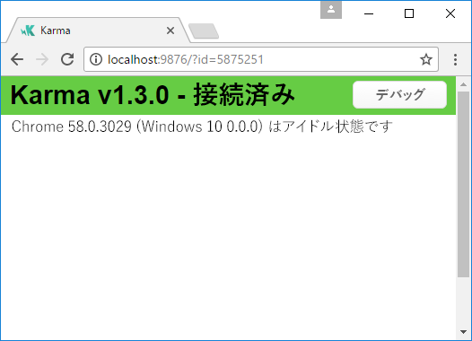
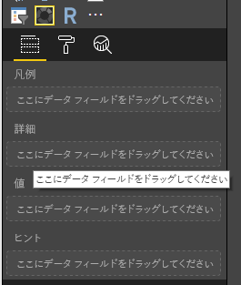
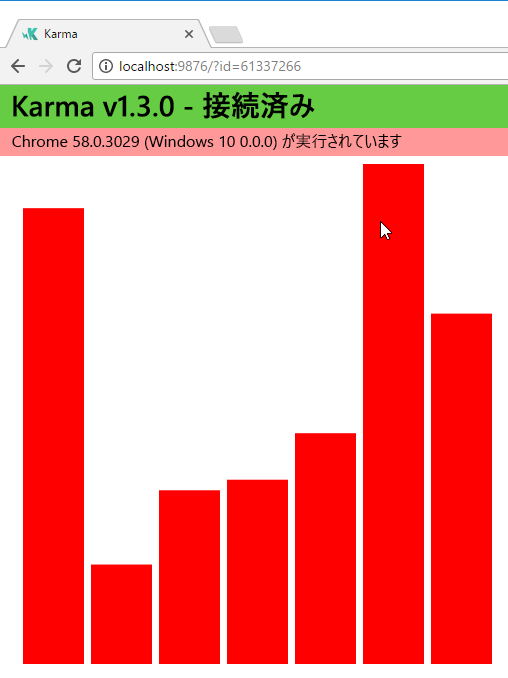
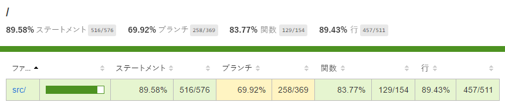
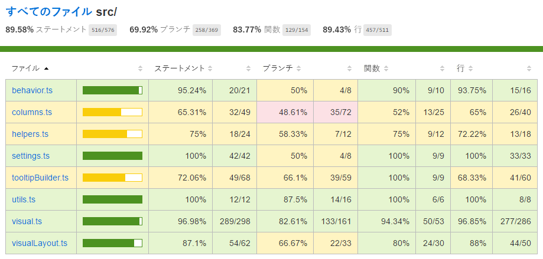

# <a name="tutorial-add-unit-tests-for-power-bi-visual-projects"></a>チュートリアル: Power BI のビジュアル プロジェクトの単体テストを追加する

このチュートリアルでは、Power BI のビジュアルに関する単体テストを作成する際の基本事項について説明します。

このチュートリアルで検討する内容は次のとおりです。

* テスト ランナー karma.js およびテスト フレームワーク jasmine.js の使い方
* powerbi-visuals-utils-testutils パッケージの使い方
* モックとフェイクを使って Power BI のビジュアルを対象とした単体テストを簡略化する方法

## <a name="prerequisites"></a>前提条件

* Power BI のビジュアル プロジェクトがある
* Node.js 環境の構成が済んでいる

## <a name="install-and-configure-karmajs-and-jasmine"></a>karma.js と jasmine のインストールと構成

package.json の `devDependencies` セクションに、必要なライブラリを追加します。

```json
"@babel/polyfill": "^7.2.5",
"@types/d3": "5.5.0",
"@types/jasmine": "2.5.37",
"@types/jasmine-jquery": "1.5.28",
"@types/jquery": "2.0.41",
"@types/karma": "3.0.0",
"@types/lodash-es": "4.17.1",
"coveralls": "3.0.2",
"istanbul-instrumenter-loader": "^3.0.1",
"jasmine": "2.5.2",
"jasmine-core": "2.5.2",
"jasmine-jquery": "2.1.1",
"jquery": "3.1.1",
"karma": "3.1.1",
"karma-chrome-launcher": "2.2.0",
"karma-coverage": "1.1.2",
"karma-coverage-istanbul-reporter": "^2.0.4",
"karma-jasmine": "2.0.1",
"karma-junit-reporter": "^1.2.0",
"karma-sourcemap-loader": "^0.3.7",
"karma-typescript": "^3.0.13",
"karma-typescript-preprocessor": "0.4.0",
"karma-webpack": "3.0.5",
"puppeteer": "1.17.0",
"style-loader": "0.23.1",
"ts-loader": "5.3.0",
"ts-node": "7.0.1",
"tslint": "^5.12.0",
"webpack": "4.26.0"
```

パッケージの詳細については、以下の説明を参照してください。

`package.json` を保存し、`package.json` の場所に移動して、コマンド ラインで次のコマンドを実行します。

```cmd
npm install
```

パッケージ マネージャーにより、`package.json` に追加した新しいパッケージがすべてインストールされます。

単体テストを実行するには、テスト ランナーと `webpack` 構成の構成が必要です。構成のサンプルはここに示したとおりです。

`test.webpack.config.js` のサンプル:

```typescript
const path = require('path');
const webpack = require("webpack");

module.exports = {
    devtool: 'source-map',
    mode: 'development',
    optimization : {
        concatenateModules: false,
        minimize: false
    },
    module: {
        rules: [
            {
                test: /\.tsx?$/,
                use: 'ts-loader',
                exclude: /node_modules/
            },
            {
                test: /\.json$/,
                loader: 'json-loader'
            },
            {
                test: /\.tsx?$/i,
                enforce: 'post',
                include: /(src)/,
                exclude: /(node_modules|resources\/js\/vendor)/,
                loader: 'istanbul-instrumenter-loader',
                options: { esModules: true }
            },
            {
                test: /\.less$/,
                use: [
                    {
                        loader: 'style-loader'
                    },
                    {
                        loader: 'css-loader'
                    },
                    {
                        loader: 'less-loader',
                        options: {
                            paths: [path.resolve(__dirname, 'node_modules')]
                        }
                    }
                ]
            }
        ]
    },
    externals: {
        "powerbi-visuals-api": '{}'
    },
    resolve: {
        extensions: ['.tsx', '.ts', '.js', '.css']
    },
    output: {
        path: path.resolve(__dirname, ".tmp/test")
    },
    plugins: [
        new webpack.ProvidePlugin({
            'powerbi-visuals-api': null
        })
    ]
};
```

`karma.conf.ts` のサンプル

```typescript
"use strict";

const webpackConfig = require("./test.webpack.config.js");
const tsconfig = require("./test.tsconfig.json");
const path = require("path");

const testRecursivePath = "test/visualTest.ts";
const srcOriginalRecursivePath = "src/**/*.ts";
const coverageFolder = "coverage";

process.env.CHROME_BIN = require("puppeteer").executablePath();

import { Config, ConfigOptions } from "karma";

module.exports = (config: Config) => {
    config.set(<ConfigOptions>{
        mode: "development",
        browserNoActivityTimeout: 100000,
        browsers: ["ChromeHeadless"], // or Chrome to use locally installed Chrome browser
        colors: true,
        frameworks: ["jasmine"],
        reporters: [
            "progress",
            "junit",
            "coverage-istanbul"
        ],
        junitReporter: {
            outputDir: path.join(__dirname, coverageFolder),
            outputFile: "TESTS-report.xml",
            useBrowserName: false
        },
        singleRun: true,
        plugins: [
            "karma-coverage",
            "karma-typescript",
            "karma-webpack",
            "karma-jasmine",
            "karma-sourcemap-loader",
            "karma-chrome-launcher",
            "karma-junit-reporter",
            "karma-coverage-istanbul-reporter"
        ],
        files: [
            "node_modules/jquery/dist/jquery.min.js",
            "node_modules/jasmine-jquery/lib/jasmine-jquery.js",
            {
                pattern: './capabilities.json',
                watched: false,
                served: true,
                included: false
            },
            testRecursivePath,
            {
                pattern: srcOriginalRecursivePath,
                included: false,
                served: true
            }
        ],
        preprocessors: {
            [testRecursivePath]: ["webpack", "coverage"]
        },
        typescriptPreprocessor: {
            options: tsconfig.compilerOptions
        },
        coverageIstanbulReporter: {
            reports: ["html", "lcovonly", "text-summary", "cobertura"],
            dir: path.join(__dirname, coverageFolder),
            'report-config': {
                html: {
                    subdir: 'html-report'
                }
            },
            combineBrowserReports: true,
            fixWebpackSourcePaths: true,
            verbose: false
        },
        coverageReporter: {
            dir: path.join(__dirname, coverageFolder),
            reporters: [
                // reporters not supporting the `file` property
                { type: 'html', subdir: 'html-report' },
                { type: 'lcov', subdir: 'lcov' },
                // reporters supporting the `file` property, use `subdir` to directly
                // output them in the `dir` directory
                { type: 'cobertura', subdir: '.', file: 'cobertura-coverage.xml' },
                { type: 'lcovonly', subdir: '.', file: 'report-lcovonly.txt' },
                { type: 'text-summary', subdir: '.', file: 'text-summary.txt' },
            ]
        },
        mime: {
            "text/x-typescript": ["ts", "tsx"]
        },
        webpack: webpackConfig,
        webpackMiddleware: {
            stats: "errors-only"
        }
    });
};
```

この構成は、必要に応じて変更できます。

`karma.conf.js` の設定の一部

* `recursivePathToTests` 変数は、テストのコードの場所を指定するものです。

* `srcRecursivePath` 変数は、コンパイル後に出力される JS コードの場所を指定するものです。

* `srcCssRecursivePath` 変数は、(スタイル情報を格納したファイルを除いた) コンパイル後に出力される CSS の場所を指定するものです。

* `srcOriginalRecursivePath` 変数は、ビジュアルのソース コードの場所を指定するものです。

* `coverageFolder` 変数は、カバレッジのレポートの作成先となる場所を指定するものです。

構成のプロパティの一部

* `singleRun: true` - CI システム上でテストを実行します。 1 回のみで十分です。
テストのデバッグのために `false` に変更することもできます。 Karma によりブラウザーの実行が続き、デバッグ用のコンソールが利用できるようになります。

* `files: [...]` - この配列には、ブラウザーに読み込むファイルを設定できます。
通常は、ソース ファイル、テスト ケース、ライブラリ (jasmine、テスト ユーティリティ) です。 必要に応じて、他のファイルを追加することもできます。

* `preprocessors` - 構成のこのセクションでは、単体テストの実行前に実行するアクションを構成します。 TypeScript を JS にプリコンパイルする処理と、ソース マップ ファイルと生成されるコード カバレッジ レポートを準備する処理があります。 テストのデバッグのために `coverage` を無効にすることもできます。 カバレッジではコードのテスト カバレッジを検査するための追加のコードが生成されるので、テストのデバッグが複雑になります。

**構成はいずれも、karma.js の[ドキュメント](https://karma-runner.github.io/1.0/config/configuration-file.html)で説明を確認できます。**

`scripts` にテスト コマンドを追加すると、利用の際に便利です。

```json
{
    "scripts": {
        "pbiviz": "pbiviz",
        "start": "pbiviz start",
        "typings":"node node_modules/typings/dist/bin.js i",
        "lint": "tslint -r \"node_modules/tslint-microsoft-contrib\"  \"+(src|test)/**/*.ts\"",
        "pretest": "pbiviz package --resources --no-minify --no-pbiviz --no-plugin",
        "test": "karma start"
    }
    ...
}
```

これで、単体テストの作成を始める準備ができました。

## <a name="simple-unit-test-for-check-dom-element-of-the-visual"></a>ビジュアルの DOM 要素を検査するシンプルな単体テスト

ビジュアルのテストのために、ビジュアルのインスタンスを作成する必要があります。

### <a name="creating-visual-instance-builder"></a>ビジュアル インスタンス ビルダーを作成する

`test` フォルダーに、次のコードを記述した `visualBuilder.ts` ファイルを追加します。

```typescript
import {
    VisualBuilderBase
} from "powerbi-visuals-utils-testutils";

import {
    BarChart as VisualClass
} from "../src/visual";

import  powerbi from "powerbi-visuals-api";
import VisualConstructorOptions = powerbi.extensibility.visual.VisualConstructorOptions;

export class BarChartBuilder extends VisualBuilderBase<VisualClass> {
    constructor(width: number, height: number) {
        super(width, height);
    }

    protected build(options: VisualConstructorOptions) {
        return new VisualClass(options);
    }

    public get mainElement() {
        return this.element.children("svg.barChart");
    }
}
```

`build` メソッドは、ビジュアルのインスタンスを作成するためのものです。 `mainElement` は get メソッドの一種で、ビジュアル内の "ルート" の DOM 要素を返します。 このゲッターは省略可能ですが、単体テストの作成が容易になります。

ビジュアルのインスタンスのビルダーが用意できました。 テスト ケースを作成してみましょう。 ビジュアルが表示されるときに作成される SVG 要素を検査するテスト ケースです。

### <a name="creating-typescript-file-to-write-test-cases"></a>TypeScript ファイルを作成してテスト ケースを記述する

次のコードを記述したテスト ケース用の `visualTest.ts` ファイルを追加します。

```typescript
import powerbi from "powerbi-visuals-api";

import { BarChartBuilder } from "./VisualBuilder";

import {
    BarChart as VisualClass
} from "../src/visual";

import VisualBuilder = powerbi.extensibility.visual.test.BarChartBuilder;

describe("BarChart", () => {
    let visualBuilder: VisualBuilder;
    let dataView: DataView;

    beforeEach(() => {
        visualBuilder = new VisualBuilder(500, 500);
    });

    it("root DOM element is created", () => {
        expect(visualBuilder.mainElement).toBeInDOM();
    });
});
```

メソッドの呼び出しがいくつかあります。

* [`describe`](https://jasmine.github.io/api/2.6/global.html#describe) メソッドは、テスト ケースを記述するものです。 jasmine フレームワークの文脈では、よくスイートまたはスペック グループと呼ばれています。

* `beforeEach` メソッドは、[`describe`](https://jasmine.github.io/api/2.6/global.html#beforeEach) メソッドの中で定義されている `it` メソッドを呼び出す前に毎回呼び出されるものです。

* `it` は、単一のスペックを定義するものです。[`it`](https://jasmine.github.io/api/2.6/global.html#it) メソッドには、`expectations` が 1 つ以上含まれている必要があります。

* [`expect`](https://jasmine.github.io/api/2.6/global.html#expect) メソッドは、スペックの要求項目を作成するものです。要求項目のすべてに合格すると (不合格の項目が 1 つもなければ) スペックが成功となります。

* `toBeInDOM` は、マッチャー メソッドの一種です。 exists マッチャーについては、jasmine フレームワークの[ドキュメント](https://jasmine.github.io/api/2.6/matchers.html)を参照してください。

**jasmine フレームワークの詳細については、公式[ドキュメント](https://jasmine.github.io/)を参照してください。**

その後は、コマンドライン ツールでコマンドを入力して、単体テストを実行できます。

このテストでは、ビジュアルのルートの SVG 要素が作成できているかどうかを検査します。

### <a name="launch-unit-tests"></a>単体テストを開始する

単体テストを実行するには、コマンドライン ツールでこのコマンドを入力します。

```cmd
npm run test
```

`karma.js` により Chrome ブラウザーが開き、テスト ケースが実行されます。



> [!NOTE]
> Google Chrome はローカルにインストールする必要があります。

コマンドラインに、次の出力が表示されます。

```cmd
> karma start

23 05 2017 12:24:26.842:WARN [watcher]: Pattern "E:/WORKSPACE/PowerBI/PowerBI-visuals-sampleBarChart/data/*.csv" does not match any file.
23 05 2017 12:24:30.836:WARN [karma]: No captured browser, open http://localhost:9876/
23 05 2017 12:24:30.849:INFO [karma]: Karma v1.3.0 server started at http://localhost:9876/
23 05 2017 12:24:30.850:INFO [launcher]: Launching browser Chrome with unlimited concurrency
23 05 2017 12:24:31.059:INFO [launcher]: Starting browser Chrome
23 05 2017 12:24:33.160:INFO [Chrome 58.0.3029 (Windows 10 0.0.0)]: Connected on socket /#2meR6hjXFmsE_fjiAAAA with id 5875251
Chrome 58.0.3029 (Windows 10 0.0.0): Executed 1 of 1 SUCCESS (0.194 secs / 0.011 secs)

=============================== Coverage summary ===============================
Statements   : 27.43% ( 65/237 )
Branches     : 19.84% ( 25/126 )
Functions    : 43.86% ( 25/57 )
Lines        : 20.85% ( 44/211 )
================================================================================
```

### <a name="how-to-add-static-data-for-unit-tests"></a>単体テスト用の静的データを追加する方法

`test` フォルダーに `visualData.ts` ファイルを作成します。 コードは次のとおりです。

```typescript
import powerbi from "powerbi-visuals-api";
import DataView = powerbi.DataView;

import {
    testDataViewBuilder,
    getRandomNumbers
} from "powerbi-visuals-utils-testutils";

export class SampleBarChartDataBuilder extends TestDataViewBuilder {
    public static CategoryColumn: string = "category";
    public static MeasureColumn: string = "measure";

    public constructor() {
        super();
        ...
    }

    public getDataView(columnNames?: string[]): DataView {
        let dateView: any = this.createCategoricalDataViewBuilder([
            ...
        ],
        [
            ...
        ], columnNames).build();

        // there's client side computed maxValue
        let maxLocal = 0;
        this.valuesMeasure.forEach((item) => {
                if (item > maxLocal) {
                    maxLocal = item;
                }
        });
        (<any>dataView).categorical.values[0].maxLocal = maxLocal;
    }
}
```

`SampleBarChartDataBuilder` クラスは `TestDataViewBuilder` を拡張し、抽象メソッド `getDataView` を実装するものです。

データをデータ フィールド バケットに入れると、そのデータに基づいて Power BI によりカテゴリに応じた `dataview` オブジェクトが生成されます。



単体テストでは、それを再現するための Power BI のコア機能がありません。 しかし、静的データをカテゴリ別の `dataview` にマップする必要があります。 その際には、`TestDataViewBuilder` クラスが役立ちます。

[DataViewMapping の詳細を参照する](https://github.com/Microsoft/PowerBI-visuals/blob/master/Capabilities/DataViewMappings.md)

`getDataView` メソッドでは、データを指定して `createCategoricalDataViewBuilder` メソッドを呼び出しています。

`sampleBarChart` ビジュアルの [capabilities.json](https://github.com/Microsoft/PowerBI-visuals-sampleBarChart/blob/master/capabilities.json#L2) には、dataRoles と dataViewMapping の 2 つのオブジェクトがあります。

```json
"dataRoles": [
    {
        "displayName": "Category Data",
        "name": "category",
        "kind": "Grouping"
    },
    {
        "displayName": "Measure Data",
        "name": "measure",
        "kind": "Measure"
    }
],
"dataViewMappings": [
    {
        "conditions": [
            {
                "category": {
                    "max": 1
                },
                "measure": {
                    "max": 1
                }
            }
        ],
        "categorical": {
            "categories": {
                "for": {
                    "in": "category"
                }
            },
            "values": {
                "select": [
                    {
                        "bind": {
                            "to": "measure"
                        }
                    }
                ]
            }
        }
    }
],
```

同じマッピングを生成するには、`createCategoricalDataViewBuilder` メソッドに次のパラメーターを設定する必要があります。

```typescript
([
    {
        source: {
            displayName: "Category",
            queryName: SampleBarChartData.ColumnCategory,
            type: ValueType.fromDescriptor({ text: true }),
            roles: {
                Category: true
            },
        },
        values: this.valuesCategory
    }
],
[
    {
        source: {
            displayName: "Measure",
            isMeasure: true,
            queryName: SampleBarChartData.MeasureColumn,
            type: ValueType.fromDescriptor({ numeric: true }),
            roles: {
                Measure: true
            },
        },
        values: this.valuesMeasure
    },
], columnNames)
```

`this.valuesCategory` は、カテゴリの配列です。

```ts
public valuesCategory: string[] = ["Monday", "Tuesday", "Wednesday", "Thursday", "Friday", "Saturday", "Sunday"];
```

`this.valuesMeasure` は、各カテゴリのメジャーの配列です。 例:

```ts
public valuesMeasure: number[] = [742731.43, 162066.43, 283085.78, 300263.49, 376074.57, 814724.34, 570921.34];
```

これで、単体テストで `SampleBarChartDataBuilder` クラスを使用できるようになりました。

`ValueType` クラスは、`powerbi-visuals-utils-testutils` パッケージ内で定義されています。 また、`createCategoricalDataViewBuilder` メソッドには `lodash` ライブラリが必要です。

これらのパッケージを依存関係に追加します。

場所は `package.json` の `devDependencies` セクションです。

```json
"lodash-es": "4.17.1",
"powerbi-visuals-utils-testutils": "2.2.0"
```

次を呼び出します。

```cmd
npm install
```

これで、`lodash-es` ライブラリがインストールされます。

これで、単体テストをもう一度実行できるようになりました。 出力はこのようになります。

```cmd
> karma start

23 05 2017 16:19:54.318:WARN [watcher]: Pattern "E:/WORKSPACE/PowerBI/PowerBI-visuals-sampleBarChart/data/*.csv" does not match any file.
23 05 2017 16:19:58.333:WARN [karma]: No captured browser, open http://localhost:9876/
23 05 2017 16:19:58.346:INFO [karma]: Karma v1.3.0 server started at http://localhost:9876/
23 05 2017 16:19:58.346:INFO [launcher]: Launching browser Chrome with unlimited concurrency
23 05 2017 16:19:58.394:INFO [launcher]: Starting browser Chrome
23 05 2017 16:19:59.873:INFO [Chrome 58.0.3029 (Windows 10 0.0.0)]: Connected on socket /#NcNTAGH9hWfGMCuEAAAA with id 3551106
Chrome 58.0.3029 (Windows 10 0.0.0): Executed 1 of 1 SUCCESS (1.266 secs / 1.052 secs)

=============================== Coverage summary ===============================
Statements   : 56.72% ( 135/238 )
Branches     : 32.54% ( 41/126 )
Functions    : 66.67% ( 38/57 )
Lines        : 52.83% ( 112/212 )
================================================================================
```

また、Chrome ブラウザーが起動し、ビジュアルが表示されます。



カバレッジ サマリーが増えていることに注目してください。 現在のコード カバレッジに関する詳細を確認するには、`coverage\index.html` を開きます。



表示範囲を `src` フォルダーにすると、次のようになります。



表示範囲をファイルにすると、ソース コードを確認できます。 単体テストの最中に実行されなかったコードがあれば、`Coverage` ユーティリティにより、その行が赤でマークされます。


> [!IMPORTANT]
> ただし、コード カバレッジはビジュアルの機能のカバレッジが十分であることを意味するものではありません。 `src\visual.ts` では、シンプルな単体テストのカバレッジが 96% を超えていました。

## <a name="next-steps"></a>次の手順

ビジュアルの準備ができたら、ビジュアルをパブリケーションに送信できます。

[ビジュアルを AppSource に公開する方法を読む](../office-store.md)
