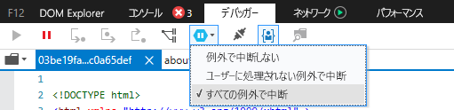
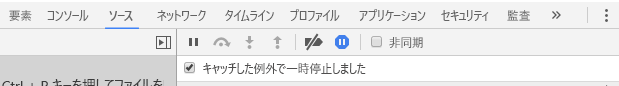

# <a name="how-to-debug-power-bi-visuals"></a>Power BI のビジュアルをデバッグする方法

このページでは、ビジュアル作成時のデバッグに関するヒントをいくつか紹介します。 基本的な手順が含まれており、標準的なフロントエンド アプリケーションと Power BI のビジュアルでのデバッグの違いが示されています。
この記事を読み終えると、ブレークポイントを使用して Power BI ビジュアルをデバッグしたり、例外をログに記録したり、Chrome と Microsoft Edge で例外をキャッチしたりできるようになります。

## <a name="using-breakpoints"></a>ブレークポイントの使用

ビジュアルの JavaScript はビジュアルが更新されるたびに完全に再度読み込まれるため、デバッグ ビジュアルが更新されると、追加したブレークポイントは失われます。 回避策としては、コード内で `debugger` ステートメントを使用します。 コードで `debugger` を使用するときは、自動再読み込みを無効にすることをお勧めします。

```typescript
public update(options: VisualUpdateOptions) {
    console.log('Visual update', options);
    debugger;
    this.target.innerHTML = `<p>Update count: <em>${(this.updateCount</em></p>`;
}
```


## <a name="showing-exceptions"></a>例外の表示

ビジュアルの作業を行っていると、すべてのエラーが Power BI サービスによって "使用" されることがわかります。 これは Power BI の意図的な機能であり、不適切なビジュアルによってアプリ全体が不安定になるのを防ぐことができます。

回避策としては、例外をキャッチしてログに記録するコードを追加するか、キャッチされた例外で中断するようにデバッガーを設定します。


## <a name="log-exceptions"></a>例外のログ記録

Power BI のビジュアルで例外をログに記録するには、次のコードをビジュアルに追加して、例外ログのデコレーターを定義します。

```typescript
export function logExceptions(): MethodDecorator {
    return function (target: Object, propertyKey: string, descriptor: TypedPropertyDescriptor<any>): TypedPropertyDescriptor<any> {
        return {
            value: function () {
                try {
                    return descriptor.value.apply(this, arguments);
                } catch (e) {
                    console.error(e);
                    throw e;
                }
            }
        }
    }
}
```
次に、このデコレーターを任意の関数で使用して、エラー ログを表示できます。

```typescript
@logExceptions()
public update(options: VisualUpdateOptions) {
```

## <a name="break-on-exceptions"></a>例外での中断

例外がキャッチされたら中断するようにブラウザーを設定することもできます。 これにより、エラーが発生した場所でコードの実行が停止され、そこからデバッグできるようになります。

### <a name="edge"></a>Microsoft Edge

1. 開発者ツールを開きます (F12)。
2. **[デバッガー]** タブに移動します。
3. **例外で中断**アイコン (一時停止記号の付いた六角形) をクリックします。
4. **[すべての例外で中断]** を選択します。



## <a name="chrome"></a>Chrome

1. 開発者ツールを開きます (F12)。
2. **[ソース]** タブに移動します。
3. **例外で中断**アイコン (一時停止記号の付いた停止標識) をクリックします。
4. **[Pause On Caught Exceptions]\(キャッチされた例外で一時停止\)** チェック ボックスをオンにします。



## <a name="next-steps"></a>次の手順
* [Power BI ビジュアルのトラブルシューティング](power-bi-custom-visuals-troubleshoot.md)
* 詳細情報と質問の回答については、「[Power BI ビジュアルについてよく寄せられる質問](power-bi-custom-visuals-faq.md#organizational-power-bi-visuals)」を参照してください
