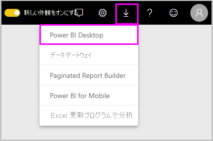
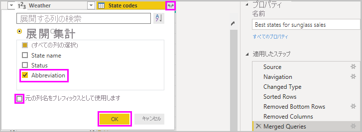
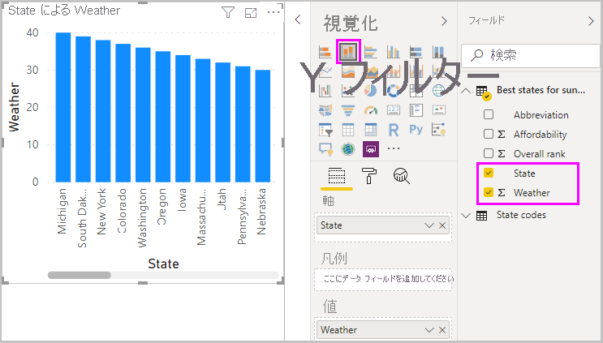
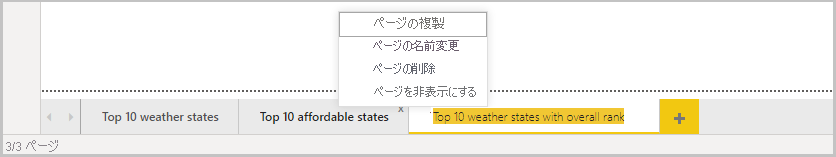
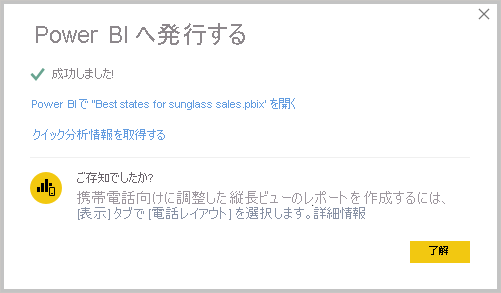

# Power BI Desktop の概要
Power BI Desktop の使用開始ガイドへようこそ。 このツアーでは、Power BI Desktop のしくみ、Power BI Desktop でできること、堅牢なデータ モデルと優れたレポートを作成してビジネス インテリジェンスを強化する方法について説明します。

Power BI Desktop のしくみとその使用方法の概要をすばやく知りたい場合は、このガイドを見ればほんの数分で画面を確認できます。 より詳しく理解したい場合は、各セクションを通して読み、手順を実行し、独自の Power BI Desktop ファイルを作成して [Power BI サービス](https://app.powerbi.com/)に投稿し、他のユーザーと共有することができます。

また、「[Power BI Desktop の概要](https://www.youtube.com/watch?v=Qgam9M8I0xA)」ビデオを視聴したり、[財務サンプル](https://go.microsoft.com/fwlink/?LinkID=521962)の Excel ブックをダウンロードしてビデオを見ながら操作したりすることもできます。

> [!IMPORTANT]
> Power BI Desktop は、お客様のフィードバックと新機能を組み込み、月単位で更新およびリリースされます。 サポート対象の Power BI Desktop は、最新バージョンのみです。お客様が Power BI Desktop に関してサポートに問い合わせた場合、最新バージョンにアップグレードするように求められます。 最新バージョンの Power BI Desktop は、[Windows ストア](https://aka.ms/pbidesktopstore)から入手するか、またはサポートされているすべての言語を含む 1 つの実行可能ファイルとして[ダウンロード](https://www.microsoft.com/download/details.aspx?id=58494)してお使いのコンピューターにインストールできます。

## Power BI Desktop の動作のしくみ
Power BI Desktop では、次のことができます。
1. データに接続します。複数のデータ ソースがあります。
1. 分析情報が詰まった説得力のあるデータ モデルを構築するクエリを使用して、データを整形します。
1. データ モデルを使用して、視覚エフェクトやレポートを作成します。 
1. 他のユーザーが利用、構築、共有できるように、レポート ファイルを共有します。 Power BI Desktop の *.pbix* ファイルは他のファイルと同様に共有できますが、最も有力な方法は、[Power BI サービス](https://preview.powerbi.com/)にアップロードすることです。 

Power BI Desktop は、定評のある Microsoft クエリ エンジン、データ モデリング、および視覚化テクノロジと統合されます。 データ アナリストなどのユーザーは、クエリ、データ接続、モデル、レポートのコレクションを作成し、他のユーザーと簡単に共有することができます。 Power BI Desktop と Power BI サービスを組み合わせることにより、データの世界から得られる新しい分析情報を簡単にモデル化、構築、共有、拡張することができます。

Power BI Desktop により、ビジネス インテリジェンスのリポジトリとレポートの設計と作成は、ばらばらに切り離された困難なプロセスではなく、一元化された、シンプルで効率的なプロセスになります。
では、実際に試してみます。 それでは、始めましょう。

> [!NOTE]
> データやレポートをオンプレミスに保持する必要がある場合は、[Power BI Report Server](../report-server/get-started.md) という Power BI の特殊なバージョンが別にあります。 Power BI Report Server では、Power BI Report Server 向け Power BI Desktop という Power BI Desktop の別の特殊なバージョンが使われます。これは、Report Server バージョンの Power BI でのみ動作します。 この記事では、標準の Power BI Desktop について説明します。

## Power BI Desktop のインストールと実行
Power BI Desktop をダウンロードするには、[Power BI Desktop のダウンロード ページ](https://powerbi.microsoft.com/desktop)にアクセスし、 **[無料ダウンロード]** を選択します。 または、ダウンロードのオプションについては、[ダウンロードまたは言語のオプション](https://www.microsoft.com/download/details.aspx?id=58494)に関するページをご覧ください。 

Power BI サービスから Power BI Desktop をダウンロードすることもできます。 上部のメニュー バーで **[ダウンロード]** アイコンを選択し、 **[Power BI Desktop]** を選択します。

Microsoft Store のページで、 **[ダウンロード]** を選択し、画面の指示に従って Power BI Desktop をコンピューターにインストールします。 Windows **[スタート]** メニューまたは Windows タスク バーのアイコンから、Power BI Desktop を開始します。

Power BI Desktop を初めて起動すると、 **[ようこそ]** 画面が表示されます。

**[ようこそ]** 画面では、**データの取得**、**最近使用したソース**の表示、最近使用したレポートの表示、**他のレポートの表示**、他のリンクの選択を行うことができます。 起動時に **[ようこそ]** 画面を常に表示するかどうかを選択することもできます。 **[ようこそ]** 画面を閉じるには、閉じるアイコンを選択します。

![[ようこそ] 画面を示す Power BI Desktop のスクリーンショット。](media/desktop-getting-started/designer_gsg_startsplashscreen.png)

Power BI Desktop の左側には、次の 3 つの Power BI Desktop ビューのアイコンがあります: 上から下に **[レポート]** 、 **[データ]** 、 **[リレーションシップ]** 。 現在のビューは、左側の黄色のバーで示されます。また、いずれかのアイコンを選択して、ビューを変更できます。 

![[レポート]、[データ]、および [リレーションシップ] のアイコンを示す Power BI Desktop のスクリーンショット。](media/desktop-getting-started/designer_gsg_viewtypes.png)

既定のビューは **[レポート]** ビューです。 

Power BI Desktop には、別のウィンドウで開く **Power Query エディター**も含まれます。 **Power Query エディター**では、クエリを作成してデータを変換した後、調整されたデータ モデルを Power BI Desktop に読み込んで、レポートを作成することができます。

## データに接続する
Power BI Desktop をインストールすると、拡大し続けるデータの世界につながる準備が整います。 使用できる多くの種類のデータ ソースを見るには、Power BI Desktop の **[ホーム]** タブで **[データを取得]**  >  **[その他]** を選択し、 **[データを取得]** ウィンドウで **[すべて]** のデータ ソースの一覧をスクロールします。 このクイック ツアーでは、いくつかの異なる **Web** データ ソースに接続します。

![[データを取得] ツールを示す Power BI Desktop のスクリーンショット。](media/desktop-getting-started/getdataweb.png)

たとえば、ユーザーはサングラスの小売業者向けのデータ アナリストであるものとします。 そのユーザーは、日照時間の最も長い地域を営業のターゲットとするクライアントを支援しています。 Bankrate.com の[退職者にとって最も良い州と悪い州](https://www.bankrate.com/retirement/best-and-worst-states-for-retirement/)に関するページには、これについての興味深いデータがあります。

Power BI Desktop の **[ホーム]** タブで、 **[データを取得]**  >  **[Web]** を選択して、Web データ ソースに接続します。 

![[データを取得] ツールの [Web] オプションを示す、Power BI Desktop のスクリーンショット。](media/desktop-getting-started/gsg_syw_2.png)

**[Web から]** ダイアログ ボックスで、アドレス *https:\//www.bankrate.com/retirement/best-and-worst-states-for-retirement/* を **[URL]** フィールドに貼り付けて、 **[OK]** を選択します。 

![[Web から] ダイアログ ボックスを示す Power BI Desktop のスクリーンショット。](media/desktop-getting-started/gettingstarted_8.png)

メッセージが表示されたら、 **[Access Web コンテンツへのアクセス]** 画面で、 **[接続]** を選択して匿名アクセスを使用します。 

Power BI Desktop のクエリ機能が動作して、Web リソースに接続されます。 **[ナビゲーター]** ウィンドウに、Web ページで見つかった内容が表示されます。この例では、**Ranking of best and worst states for retirement** という名前のテーブルとドキュメントです。 テーブルに関心があるので、それを選択してプレビューを表示します。

この時点で、 **[読み込み]** を選択してテーブルを読み込むか、 **[データの変換]** を選択して、読み込む前にテーブルを変更することができます。

**[データの変換]** を選択すると、Power Query エディターが起動し、テーブルの代表的なビューが表示されます。 **[クエリの設定]** ペインが右側に表示されます。または、Power Query エディターの **[表示]** タブで **[クエリの設定]** を選択することにより、いつでも表示できます。 

![[クエリの設定] が表示された Power Query エディターを示す、Power BI Desktop のスクリーンショット。](media/desktop-getting-started/designer_gsg_editquery.png)

データへの接続について詳しくは、「[Power BI Desktop におけるデータへの接続](../connect-data/desktop-connect-to-data.md)」をご覧ください。

## データの整形
これで、データ ソースに接続したので、ニーズに合わせてデータを調整できます。 データを "*整形*" するには、データを読み込んで表示するときにデータを調整するための詳細な手順を、Power Query エディターに対して示します。 整形によって元のデータ ソースが影響を受けることはありません。この特定のデータのビューのみに反映されます。 

> [!NOTE]
> このガイドで使用するテーブルのデータは、時間が経つと変わる可能性があります。 そのため、従う手順が異なる場合があります。手順や結果をどのように調整するかを考える必要がありますが、それも学習の楽しみです。 

整形とは、列やテーブルの名前の変更、行や列の削除、データ型の変更など、データを "*変換すること*" を意味します。 Power Query エディターでは、 **[クエリの設定]** ペインの **[適用したステップ]** に、これらの手順が順番にキャプチャされます。 このクエリをデータ ソースに接続するたびに、それらの手順が実行されて、データは常に指定したとおりに整形されます。 このプロセスは、作成者が Power BI Desktop でクエリを使用したとき、または他のユーザーが Power BI サービスなどで共有クエリを使用したときに、実行されます。 

**[クエリの設定]** の **[適用したステップ]** には、既にいくつかのステップが含まれていることに注意してください。 各ステップを選択すると、Power Query エディターでその効果を確認できます。 最初に Web ソースを指定し、次に **[ナビゲーター]** ウィンドウでテーブルをプレビューしました。 3 番目のステップの **[変更された型]** では、データをインポートするときに Power BI によって整数データが認識され、元の Web **テキスト** "*データ型*" が**整数**に自動的に変更されました。 

![[クエリの設定] に 3 つの [適用したステップ] が表示されている Power Query エディターを示す、Power BI Desktop のスクリーンショット。](media/desktop-getting-started/designer_gsg_appliedsteps_changedtype.png)

データ型を変更する必要がある場合は、変更する 1 つまたは複数の列を選択します。 隣接する複数の列を選択するには **Shift** キーを押しながら選択し、隣接していない列を選択するには **Ctrl** キーを押しながら選択します。 列ヘッダーを右クリックして **[型の変更]** を選択し、メニューから新しいデータ型を選択するか、 **[ホーム]** タブの **[変換]** グループにある **[データ型]** の隣のリストをドロップダウンして、新しいデータ型を選択します。

> [!NOTE]
> Power BI Desktop の Power Query エディターでは、タスクを使用するにはリボンまたは右クリック メニューを使用します。 リボンの **[ホーム]** タブまたは **[変換]** タブで選択できるほとんどのタスクは、項目を右クリックし、表示されるメニューから選択して使用することもできます。

独自の変更や変換をデータに適用し、 **[適用したステップ]** でそれを確認できます。 

たとえば、サングラスの販売の場合、最も関心があるのは気象ランキングなので、**Overall rank** 列ではなく **Weather** 列でテーブルを並べ替えることにします。 **Weather** ヘッダーの横にある矢印をドロップダウンし、 **[昇順で並べ替え]** を選択します。 気象ランキングで並べ替えられたデータが表示され、 **[適用したステップ]** に **[並べ替えられた行]** が表示されます。 

![[適用したステップ] に [並べ替えられた行] が表示されていることを示す、Power BI Desktop のスクリーンショット。](media/desktop-getting-started/shapecombine-changetype-b.png)

天気の悪い州にサングラスを販売することにはあまり関心がないので、テーブルから削除することにします。 **[ホーム]** タブの **[行の削減]** グループから、 **[行の削除]**  >  **[下位の行の削除]** を選択します。 **[下位の行の削除]** ダイアログ ボックスで「*10*」と入力し、 **[OK]** を選択します。 

![[下位の行の削除] ダイアログ ボックスを示す Power BI Desktop のスクリーンショット。](media/desktop-getting-started/pbi_gsg_getdata3.png)

天気の悪い方から 10 の州がテーブルから削除され、 **[適用したステップ]** に **[削除された下の行]** ステップが表示されます。

テーブルに必要のない追加情報が多すぎると判断し、**Affordability**、**Crime**、**Culture**、**Wellness** の各列を削除することにします。 削除する各列のヘッダーを選択します。 隣接する複数の列を選択するには **Shift** キーを押しながら選択し、隣接していない列を選択するには **Ctrl** キーを押しながら選択します。 

次に、 **[ホーム]** タブの **[列の管理]** グループで、 **[列の削除]** を選択します。 また、選択した列ヘッダーの 1 つを右クリックし、メニューから **[列の削除]** を選択してもかまいません。 選択した列が削除され、 **[適用したステップ]** に **[削除された列]** が表示されます。

![[適用したステップ] に追加された [列の削除] を示す、Power BI Desktop のスクリーンショット。](media/desktop-getting-started/pbi_gsg_getdata3a.png)

再考した結果、**Affordability (買いやすさ)** はサングラスの販売に関係がある可能性があります。 その列を元に戻すことにします。 **[適用したステップ]** ペインでステップの横にある **[X]** 削除アイコンを選択して、最後のステップを簡単に元に戻すことができます。 削除したい列だけを選択して、ステップをやり直します。 柔軟性を高めるには、各列を個別のステップとして削除することもできます。 

**[適用したステップ]** ペインで任意のステップを右クリックし、削除、名前の変更、シーケンス内での上や下への移動、またはそのステップの後のステップの追加または削除を選択できます。 途中のステップでは、変更によって後のステップが影響を受け、クエリが壊れる可能性がある場合、Power BI Desktop により警告が表示されます。  

![[適用したステップ] の変更オプションを示す Power BI Desktop のスクリーンショット。](media/desktop-getting-started/designer_gsg_install.png)

たとえば、**Weather** でテーブルを並べ替える必要がなくなったため、 **[並べ替えられた行]** ステップを削除しようとします。 このステップを削除するとクエリが壊れる可能性があることが Power BI Desktop により警告されます。 気象で並べ替えた後、下位 10 行を削除したので、並べ替えを削除すると、異なる行が削除されます。 また、 **[並べ替えられた行]** ステップを選択し、そのポイントに新しい中間ステップを追加しようとした場合も、警告が表示されます。  

![[ステップの削除] ダイアログ ボックスを示す Power BI Desktop のスクリーンショット。](media/desktop-getting-started/deletestepwarning.png)

最後に、テーブルのタイトルを、退職ではなくサングラスの販売に関するものに変更します。 **[クエリの設定]** ペインの **[プロパティ]** で、古いタイトルを「*サングラスの販売に最適な州*」に置き換えます。

データを整形するためのクエリの完成形は次のようになります。

データの整形について詳しくは、「[Power BI Desktop でのデータの整形と結合](../connect-data/desktop-shape-and-combine-data.md)」をご覧ください。

## データの結合
さまざまな州に関するこのデータは興味深く、追加の分析作業とクエリの構築に役立ちます。 ただし、1 つ問題があります。ここにあるほとんどのデータでは、州の完全名ではなく、州コードの 2 文字の省略形が使用されています。 そのデータを使用するには、何らかの方法で、州名を省略形に関連付ける必要があります。

幸運です。 別のパブリック データ ソースを使用してそれを行うことができますが、サングラス テーブルとそれを "*組み合わせる*" 前に、かなりの整形を行う必要があります。

州の省略形データを Power Query エディターにインポートするには、リボンの **[ホーム]** タブの **[新しいクエリ]** グループから **[新しいソース]**  >  **[Web]** を選択します。 

![Power Query エディターの [新しいソース] からの [Web] の選択を示す、Power BI Desktop のスクリーンショット。](media/desktop-getting-started/pbi_gettingstartedsplash_resized.png)

**[Web から]** ダイアログ ボックスで、州の省略形のサイトの URL (*https:\//en.wikipedia.org/wiki/List_of_U.S._state_abbreviations*) を入力します。

**[ナビゲーター]** ウィンドウで、**Codes and abbreviations for U.S. states, federal district, territories, and other regions** テーブルを選択し、 **[OK]** を選択します。 テーブルが Power Query エディターで開きます。

**Name and status of region**、**Name and status of region2**、**ANSI** を除くすべての列を削除します。 これらの列だけを保持するには、**Ctrl** キーを押しながら列を選択します。 次に、列ヘッダーの 1 つを右クリックして **[他の列の削除]** を選択するか、 **[ホーム]** タブの **[列の管理]** グループから **[他の列の削除]** を選択します。 

**Name and status of region2** 列ヘッダーの横にある矢印をドロップダウンし、 **[フィルター]**  >  **[指定の値に等しい]** を選択します。 **[行のフィルター]** ダイアログ ボックスで、 **[指定の値に等しい]** の横にある **[値の入力または選択]** フィールドをドロップダウンし、**State** を選択します。 

**[または]** を選択し、2 番目の **[指定の値に等しい]** フィールドに対して **State ("Commonwealth")** を選択します。 **[OK]** を選択します。 

![Power Query エディターの [行のフィルター] クエリ ボックスを示す、Power BI Desktop のスクリーンショット。](media/desktop-getting-started/filterrows.png)

**Federal district** や **island** などの余計な値を削除したので、50 の州とその正式な 2 文字の省略形のリストができました。 列ヘッダーを右クリックして **[名前の変更]** を選択し、もっとわかりやすい列の名前に変更できます (たとえば、**州名**、**状態**、**省略形**)。

これらのステップのすべてが、 **[クエリの設定]** ペインの **[適用したステップ]** に記録されていることに注意してください。

整形が済んだテーブルは次のようになります。

![[クエリの設定] ペインに [適用したステップ] が表示されている Power Query エディターを示す、Power BI Desktop のスクリーンショット。](media/desktop-getting-started/statecodes.png)

**[クエリの設定]** の **[プロパティ]** フィールドで、テーブルのタイトルを "*州コード*" に変更します。 

**州コード** テーブルを整形したので、これら 2 つのテーブルを 1 つに "*結合*" することができます。 今あるテーブルはデータに適用したクエリの結果であるため、"*クエリ*" とも呼ばれます。 クエリの結合には、"*マージ*" と "*アペンド*" という主な 2 つの方法があります。 

別のクエリに 1 つ以上の列を追加する場合は、クエリを "*マージ*" します。 既存のクエリにデータ行を追加する場合は、クエリを "*アペンド*" します。

この例では、**州コード** クエリを**サングラスの販売に最適な州**クエリに "*マージ*" します。 クエリをマージするには、Power Query エディターの左側にある **[クエリ]** ペインで**サングラスの販売に最適な州**クエリを選択してそれに切り替えます。 次に、リボンの **[ホーム]** タブで **[結合]** グループの **[クエリのマージ]** を選択します。

**[マージ]** ウィンドウで、フィールドをドロップダウンして、使用可能な他のクエリから**州コード**を選択します。 各テーブルから一致する列を選択します。この例では、**サングラスの販売に最適な州**クエリから **State**を選択し、**州コード** クエリから**州名**を選択します。 

**[プライバシー レベル]** ダイアログ ボックスが表示される場合は、 **[このファイルのプライバシー レベルのチェックを無視します]** を選択して、 **[保存]** を選択します。 **[OK]** を選択します。 

![[クエリのマージ] ウィンドウを示す Power BI Desktop のスクリーンショット。](media/desktop-getting-started/shapecombine_merge.png)

**サングラスの販売に最適な州**テーブルの右側に、**州コード**という名前の新しい列が表示されます。 それには、"サングラスの販売に最適な州" クエリとマージした "州コード" クエリが含まれています。 マージしたテーブルのすべての列が、**州コード**列に圧縮されています。 マージされたテーブルを "*展開*" し、必要な列のみを含めることができます。 

マージされたテーブルを展開して含める列を選択するには、列ヘッダーの**展開**アイコンを選択します。 **展開**ダイアログ ボックスで、**省略形**列のみを選択します。 **[元の列名をプレフィックスとして使用します]** をオフにして、 **[OK]** を選択します。 

> [!NOTE]
> **州コード** テーブルを取り込む方法を試してみることができます。 少し試してみてください。結果に満足できない場合は、 **[クエリの設定]** ペインの **[適用したステップ]** の一覧からそのステップを削除するだけです。 これは、展開プロセスが希望どおりになるまで何回でも好きなだけ実行できる無料のやり直しのようなものです。

データの整形と結合のステップについて詳しくは、「[Power BI Desktop でのデータの整形と結合](../connect-data/desktop-shape-and-combine-data.md)」をご覧ください。

2 つのデータ ソースを結合した 1 つのクエリ テーブルができました。それぞれがニーズに合わせて整形されています。 このクエリは、州の人口統計、富裕度、レクリエーション機会など、その他の多くの興味深いデータ接続の基礎となっています。

これで、興味深いレポートを Power BI Desktop で作成するのに十分なデータが揃いました。 これはマイルストーンであるため、**Power Query エディター**で変更を適用し、リボンの **[ホーム]** タブの **[閉じて適用]** を選択して、Power BI Desktop に読み込みます。 **[適用]** だけを選択し、Power BI Desktop で作業している間、Power Query エディターでクエリを開いたままにすることもできます。 

Power BI Desktop に読み込んだ後でテーブルをさらに変更し、モデルを再び読み込んで、行った変更を適用することができます。 Power BI Desktop から **Power Query エディター**を再度開くには、Power BI Desktop のリボンの **[ホーム]** タブで **[クエリを編集]** を選択します。 

## レポートの作成
Power BI Desktop の **[レポート]** ビューでは、視覚エフェクトとレポートを作成できます。 **[レポート]** ビューには、6 つの主要な領域があります。

![[レポート] ビューを示す Power BI Desktop のスクリーンショット。](media/desktop-getting-started/designer_gsg_reportview.png)

1. 上部のリボン。これにはレポートと視覚エフェクトに関連する一般的なタスクが表示されます。
2. 中央のキャンバス領域。ここに視覚エフェクトが作成されて配置されます。
3. 下部のページ タブ領域。レポートのページを選択または追加できます。
4. **[フィルター]** ペイン。データの視覚化をフィルター処理できます。
5. **[視覚化]** ペイン。視覚エフェクトを追加、変更、カスタマイズしたり、ドリルスルーを適用したりできます。
6. **[フィールド]** ペイン。クエリで使用できるフィールドが表示されます。 これらのフィールドをキャンバス、 **[フィルター]** ペイン、または **[視覚化]** ペインにドラッグして、視覚エフェクトを作成または変更できます。

**[フィルター]** 、 **[視覚化]** 、 **[フィールド]** ペインは、ペインの上部にある矢印を選択して、展開したり折りたたんだりできます。 ペインを折りたたむと、視覚エフェクトを作成するためのキャンバス領域が広くなります。 

![[フィールド] ペインを示す Power BI Desktop のスクリーン ショット。](media/desktop-getting-started/designer_gsg_collapsepanes.png)

単純な視覚エフェクトは、フィールドの一覧でフィールドを選択するか、 **[フィールド]** 一覧からキャンバスにフィールドをドラッグするだけで、作成できます。 たとえば、**State** フィールドを**サングラスの販売に最適な州**からキャンバスにドラッグして、どうなるか確認します。

ご覧ください。 Power BI Desktop により、**State** フィールドに地理的位置情報データが含まれていることが認識されて、地図ベースの視覚エフェクトが自動的に作成されました。 視覚エフェクトには、データ モデルからの 40 州のデータ ポイントが表示されます。 

**[視覚化]** ペインには、視覚エフェクトに関する情報が表示され、それを変更できます。 

![[視覚化] ペインを示す Power BI Desktop のスクリーン ショット。](media/desktop-getting-started/designer_gsg_visualizationtypes.png)

1. アイコンは、作成される視覚化の種類を示します。 別のアイコンを選択して選択した視覚エフェクトの種類を変更したり、既存の視覚エフェクトを選択しないでアイコンを選択して新しい視覚エフェクトを作成したりできます。 
2. **[視覚化]** ペインの **[フィールド]** オプションを使用すると、ペインの **[凡例]** や他のフィールドのウェルにデータ フィールドをドラッグできます。 
3. **[書式]** オプションを使用すると、書式設定やその他のコントロールを視覚エフェクトに適用できます。 

**[フィールド]** および **[書式]** 領域で使用できるオプションは、視覚化とデータの種類によって異なります。

マップ視覚エフェクトに天気がよい上位 10 州のみが表示されるようにします。 上位 10 州のみを表示するには、 **[フィルター]** ペインで **[State (すべて)]** をポイントし、表示される矢印を展開します。 **[フィルターの種類]** ドロップダウンで **[上位 N]** を選択します。数値ランクが低い項目を表示したいので、 **[アイテムの表示]** で **[下]** を選択し、次のフィールドに「*10*」と入力します。

**[フィールド]** ペインから **[値]** フィールドに **Weather** フィールドをドラッグし、 **[フィルターを適用]** を選択します。 

天気の良い上位 10 州だけがマップ視覚エフェクトに表示されるようになります。 

**[視覚化]** ペインの **[書式]** アイコンを選択し、 **[タイトル]** を選択し、 **[タイトル テキスト]** に「*天気の良い上位 10 州*」と入力して、視覚エフェクトのタイトルを変更します。 

![[視覚化] ペインの [タイトルの変更] フィールドを示す、Power BI Desktop のスクリーンショット。](media/desktop-getting-started/designer_gsg_report1.png)

天気の良い上位 10 州の名前とそのランク (1 から 10) を示す視覚エフェクトを追加するには、キャンバスの空白領域を選択し、 **[視覚化]** ペインの **[縦棒グラフ]** アイコンを選択します。 **[フィールド]** ペインで、 **[State]** と **[Weather]** を選択します。 縦棒グラフに、クエリに含まれる 40 の州が、数値ランクが最高から最小の順 (つまり、天気が最も悪い州から最も良い州の順) に表示されます。 

値 1 が最初に表示されるようにランク付けの順序を変更するには、視覚エフェクトの右上にある **[その他のオプション]** 省略記号を選択し、メニューから **[昇順で並べ替え]** を選択します。 

![[昇順で並べ替え] オプションを示す Power BI Desktop のスクリーンショット。](media/desktop-getting-started/shapecombine_mergequeries.png)

テーブルを上位 10 州に制限するには、マップ視覚エフェクトの場合と同じように、下の 10 件のフィルターを適用します。 

マップ視覚エフェクトと同じ方法で、視覚エフェクトのタイトルを変更します。 また、 **[視覚化]** ペインの **[書式]** セクションで、 **[Y 軸]**  >  **[軸のタイトル]** を **Weather** から「*天気ランキング*」に変更して、さらにわかりやすくします。 次に、 **[Y 軸]** セレクターを **[オフ]** にし、 **[データ ラベル]** を **[オン]** に切り替えます。

これで、天気の良い上位 10 州が、数値ランキングと共にランクの順序で表示されるようになります。

**Affordability** や **Overall ranking** フィールドについて同様の視覚エフェクトや他の視覚エフェクトを作成したり、複数のフィールドを 1 つの視覚エフェクトに結合したりできます。 あらゆる種類の興味深いレポートや視覚エフェクトを作成することができます。 これらの**テーブル**視覚化や**折れ線グラフおよび集合縦棒グラフ**視覚化では、天気の良い上位 10 州と共に買いやすさや全体的なランキングが表示されます。

異なるレポート ページにさまざまな視覚化を表示できます。 新しいページを追加するには、ページ バーの既存ページの横にある **[+]** 記号を選択するか、リボンの **[ホーム]** タブにある **[挿入]**  >  **[新しいページ]** を選択します。 ページの名前を変更するには、ページ バーでページ名をダブルクリックするか、右クリックして **[ページの名前変更]** を選択し、新しい名前を入力します。 レポートの別のページに移動するには、ページ バーでページを選択します。 

**[ホーム]** タブの **[挿入]** グループから、レポート ページにテキスト ボックス、イメージ、ボタンを追加できます。視覚エフェクトの書式オプションを設定するには、視覚エフェクトを選択し、 **[視覚化]** ペインの **[書式]** アイコンを選択します。 ページ サイズ、背景、その他のページ情報を構成するには、視覚エフェクトを選択しないで **[書式]** アイコンを選択します。

ページと視覚エフェクトの作成が終わったら、 **[ファイル]**  >  **[保存]** を選択して、レポートを保存します。 

レポートについて詳しくは、「[Power BI Desktop のレポート ビュー](../create-reports/desktop-report-view.md)」をご覧ください。

## 作業の共有
Power BI Desktop レポートを作成したら、他のユーザーと共有することができます。 作業を共有するには、いくつかの方法があります。 他のファイルと同じようにレポートの *.pbix* ファイルを配布したり、Power BI サービスから *.pbix* ファイルをアップロードしたり、Power BI Desktop から Power BI サービスに直接発行したりすることができます。 Power BI サービスにレポートを発行またはアップロードするには、Power BI アカウントが必要です。 

Power BI Desktop から **Power BI** サービスに発行するには、リボンの **[ホーム]** タブで、 **[発行]** を選択します。

![[発行] オプションを示す Power BI Desktop のスクリーンショット。](media/desktop-getting-started/gsg_syw_1.png)

Power BI へのサインインまたは発行先の選択を求めるメッセージが表示される場合があります。

発行プロセスが完了すると、次のダイアログが表示されます。

Power BI でリンクを選択してレポートを開くと、Power BI サイトの **[マイ ワークスペース]**  >  **[レポート]** にレポートが表示されます。 

作業を共有するもう 1 つの方法は、 **Power BI** サービス内から Power BI Desktop ファイルを読み込むことです。 ブラウザーで Power BI を開くには、*https:\//app.powerbi.com* にアクセスします。 Power BI の **[ホーム]** ページで、左下の **[データを取得]** を選択して、Power BI Desktop レポートの読み込みプロセスを開始します。

![[データを取得] オプションを示す Power BI Desktop のスクリーンショット。](media/desktop-getting-started/pbi_gsg_getdata1.png)

次のページで、 **[ファイル]** セクションの **[取得]** を選択します。

![[データを取得] 画面を示す Power BI Desktop のスクリーンショット。](media/desktop-getting-started/pbi_gsg_getdata2.png)

次のページで、 **[ローカル ファイル]** を選択します。 Power BI Desktop の *.pbix* ファイルを参照して選択し、 **[開く]** を選択します。 

ファイルのインポートが済むと、Power BI サービスの左側のペインにある **[マイ ワークスペース]**  >  **[レポート]** の一覧で確認できます。

ファイルを選択すると、レポートの最初のページが表示されます。 レポートの左側にあるタブで別のページを選択できます。 

レポート キャンバスの上部から **[その他のオプション]**  >  **[編集]** を選択すると、**Power BI** サービスでレポートを変更できます。 変更を保存するには、 **[コピーの保存]** を選択します。

**Power BI** サービスでレポートからあらゆる種類の興味深いビジュアルを作成し、それを "*ダッシュボード*" にピン留めすることができます。 **Power BI** サービスのダッシュボードについて詳しくは、「[優れたダッシュボードのデザインに関するヒント](../create-reports/service-dashboards-design-tips.md)」を参照してください。 ダッシュボードの作成、共有、変更について詳しくは、「[ダッシュボードの共有](../collaborate-share/service-share-dashboards.md)」をご覧ください。

レポートまたはダッシュボードを共有するには、開いているレポートまたはダッシュボードのページの上部にある **[共有]** を選択するか、 **[マイ ワークスペース]**  >  **[レポート]** または **[マイ ワークスペース]**  >  **[ダッシュボード]** の一覧でレポートまたはダッシュボードの名前の横にある **[共有]** アイコンを選択します。

**[レポートの共有]** または **[ダッシュボードの共有]** 画面を設定し、電子メールを送信するか、リンクを取得して、レポートまたはダッシュボードを他のユーザーと共有します。 

![[レポートの共有] 画面を示す Power BI Desktop のスクリーンショット。](media/desktop-getting-started/gsg_share6.png)

Power BI Desktop と Power BI サービスにより、データに関連した多くの説得力のあるマッシュ アップや視覚化を行うことができます。 

## 次の手順
Power BI Desktop では、診断ポートへの接続がサポートされています。 診断ポートを使うと、他のツールを接続して、診断のためのトレースを実行できます。 診断ポートを使用しているときは、*モデルの変更はサポートされません。モデルに変更を加えると、破損とデータ損失が発生する可能性があります。*

Power BI Desktop の多くの機能について詳しくは、次のリソースを参照してください。

* [Power BI Desktop でのクエリの概要](../transform-model/desktop-query-overview.md)
* [Power BI Desktop のデータ ソース](../connect-data/desktop-data-sources.md)
* [Power BI Desktop でデータに接続する](../connect-data/desktop-connect-to-data.md)
* [チュートリアル: Power BI Desktop でのデータの整形と結合](../connect-data/desktop-shape-and-combine-data.md)
* [Power BI Desktop での一般的なクエリ タスク](../transform-model/desktop-common-query-tasks.md)   
