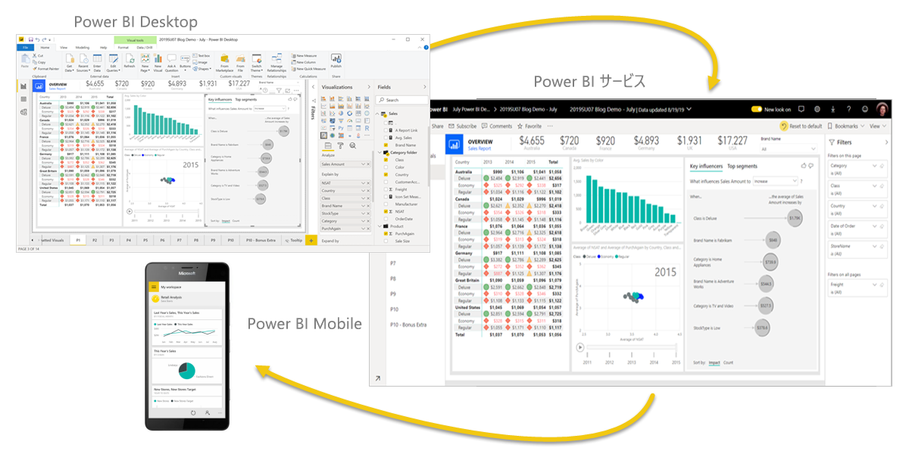
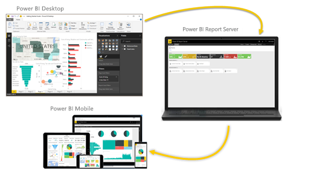

# Power BI とは?
**Power BI** はソフトウェア サービス、アプリ、コネクタのコレクションで、これらを組み合わせることで、関連性のないデータ ソースから、まとまりがあり、実体験的な対話型洞察を得ることができます。 Excel スプレッドシートや、クラウド ベースとオンプレミスのハイブリッド データ ウェアハウスのコレクションなど、さまざまなデータを使えます。 Power BI を使うと、ご利用のデータ ソースへの接続、重要事項の視覚化と検出、必要に応じた任意のユーザーまたはすべてのユーザーとの共有を、簡単に実行できます。

## Power BI の構成要素
Power BI は次のもので構成されます。 
- **Power BI Desktop** と呼ばれる Windows デスクトップ アプリケーション
- **Power BI サービス**と呼ばれるオンラインの SaaS (*サービスとしてのソフトウェア*) サービス 
- Windows、iOS、Android デバイス向けの Power BI **モバイル アプリ**

この 3 つの要素 (Power BI Desktop、サービス、モバイル アプリ) は、ユーザーおよびそのロールに対して最も効果的な方法で、ビジネス上の分析情報を作成、共有、使用できるように設計されています。

4 番目の要素である **Power BI Report Server** を使うと、Power BI Desktop で Power BI レポートを作成した後、それをオンプレミスのレポート サーバーに発行できます。 [Power BI レポート サーバー](#on-premises-reporting-with-power-bi-report-server)の詳細をお読みください。

## Power BI とロールの対応
Power BI の使用方法は、プロジェクトまたはチームにおけるユーザーのロールによって異なる場合があります。 ロールが異なれば Power BI の使用方法も異なる可能性があります。

たとえば、あなたはレポートとダッシュボードを表示するために、**Power BI サービス**を主に使うことができます。 大量の計算を行ってビジネス レポートを作成する同僚は、レポートを作成し、そのレポートをあなたが確認する Power BI サービスに発行するために、**Power BI Desktop** を重点的に使うことができます。 営業担当の別の同僚は、売上ノルマの達成状況の観察や、新しい潜在顧客の詳細を確認するために、**Power BI のスマートフォン アプリ**を主に使うことができます。

開発者であれば、Power BI API を使用してデータをデータセットにプッシュしたり、ダッシュボードとレポートをカスタム アプリケーションに埋め込んだりする可能性があります。 新しいビジュアルのアイデアがあれば、 それを自分で作成して、他のユーザーと共有できます。  

また、作業の目的や、特定のプロジェクトにおけるご自分のロールに応じて、Power BI の各要素をさまざまなタイミングで使い分ける場合もあります。

Power BI の使用方法は、Power BI のどの機能またはサービスがご自分の状況に対して最適なツールとなるかに基づいています。 たとえば、Power BI Desktop を使用して、顧客契約統計に関するレポートを自分のチーム用に作成したり、Power BI サービスのリアルタイム ダッシュボードで在庫や製造の進行状況を確認したりすることができます。 Power BI の各部分を利用できることが、その柔軟性と魅力の理由です。

ご自身のロールに関連するドキュメントについては、次をご覧ください。
- [*デザイナー*](desktop-what-is-desktop.md)向け Power BI Desktop
- [*利用者*](../consumer/end-user-consumer.md)向け Power BI
- [*管理者*](../admin/service-admin-administering-power-bi-in-your-organization.md)向け Power BI
- "*開発者向け*" Power BI
    * [Power BI を使用した埋め込み分析](../developer/embedded/embedding.md)
    * [Azure の Power BI Embedded とは何か](../developer/embedded/azure-pbie-what-is-power-bi-embedded.md)
    * [Power BI のビジュアル](../developer/visuals/power-bi-custom-visuals.md)
    * [Power BI API の開発者向け機能](../developer/automation/overview-of-power-bi-rest-api.md)

## Power BI のワークフロー
Power BI での一般的な作業の流れは、データ ソースに接続し、Power BI Desktop でレポートを作成することから始まります。 次に、そのレポートを Power BI Desktop から Power BI サービスに発行し、それを共有することで、Power BI サービスとモバイル デバイスのエンド ユーザーがレポートを表示して操作できるようにします。
このワークフローは一般的で、Power BI の 3 つの主な要素がお互いを補完するしくみを示しています。

こちらに詳細な [Power BI Desktop と Power BI サービスの比較](../fundamentals/service-service-vs-desktop.md)があります。

## Power BI Report Server を使用したオンプレミスのレポート

しかし、クラウドに移行する準備が整っていないため、企業のファイアウォールの背後にレポートを保持する必要がある場合はどうすればよいでしょうか。  読み続けてください。

Power BI Report Server が提供するすぐに使用できるさまざまなツールとサービスを使用して、Power BI モバイル レポートおよびページ分割されたレポートをオンプレミスで作成、展開、管理できます。

Power BI Report Server は、ファイアウォールの背後に展開するソリューションであり、適切なユーザーにさまざまな方法でレポートを配信します。これは、Web ブラウザーでもモバイル デバイスでも表示でき、電子メールとして送信することもできます。 Power BI Report Server は、クラウドの Power BI に対応するため、準備ができたらクラウドに移行することができます。 

[Power BI レポート サーバー](../report-server/get-started.md)の詳細をお読みください。

## 次の手順
- [クイック スタート:Power BI サービスの使用方法を学ぶ](../service-the-new-power-bi-experience.md)   
- [チュートリアル: Power BI サービスの概要](service-get-started.md)
- [クイック スタート:Power BI Desktop でデータに接続する](../connect-data/desktop-quickstart-connect-to-data.md)
