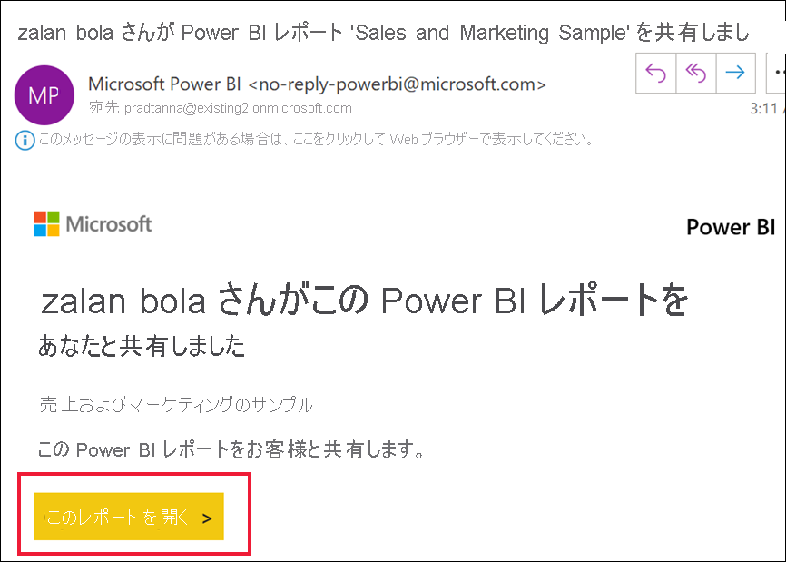
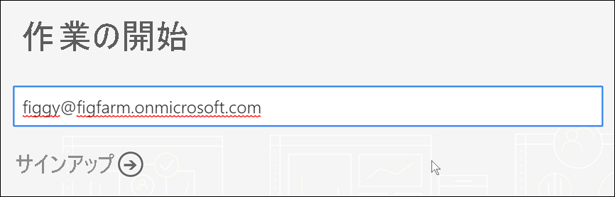
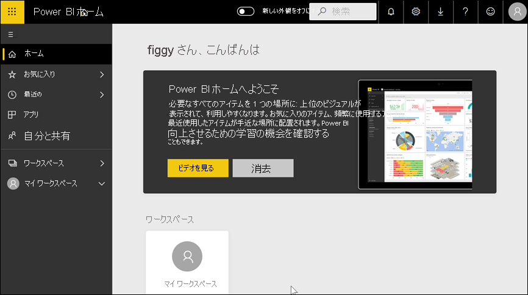
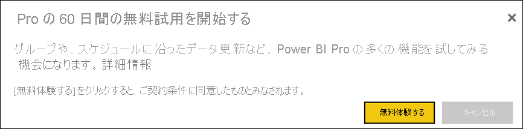

# 個人として Power BI にサインアップする

Power BI は、個人用データ分析および視覚エフェクト ツールのほか、グループ プロジェクト、部門、または会社全体の背後にある分析および意思決定エンジンとしても使用できます。 この記事では、個人として Power BI にサインアップする方法について説明します。 全体管理者または課金管理者である場合は、[組織向けの Power BI ライセンス](../admin/service-admin-licensing-organization.md)に関する記事をご覧ください。

## Power BI とは?
Power BI は、統合されたセルフサービスおよびエンタープライズ ビジネス インテリジェンス プラットフォームであり、直感的なユーザー エクスペリエンスとインテリジェントなデータ視覚化を組み合わせて、データをより深く理解できる分析情報を提供します。 レポートは、Teams、SharePoint、PowerPoint などの Microsoft ツール内、またはその他の生産性向上製品内で共有できます。 これはオンライン SaaS (サービスとしてのソフトウェア) として提供され、2 つのアプリケーションが付属しています。レポートを作成するための Power BI Desktop と呼ばれる Microsoft Windows デスクトップ アプリケーションと、iOS および Android デバイスでレポートを使用するためのネイティブのモバイル BI アプリです。 

これら 3 つの要素 (Descktop、サービス、モバイル アプリ) は、ユーザーが自身、またはそのロールに最適な方法でビジネスの分析情報を作成、共有、および使用できるように設計されています。

## Power BI サービスへのサインアップ
この記事では、個人として **Power BI サービス**にサインアップする手順について説明します。 Power BI Desktop のダウンロードおよびモバイル アプリのインストールに関するヘルプ情報については、次の記事を参照してください。
- [Power BI Desktop (これも完全に無料でダウンロードできます)](desktop-get-the-desktop.md)    
- [Power BI モバイル アプリ (これも完全に無料でダウンロードできます)](../consumer/mobile/mobile-apps-for-mobile-devices.md)

## サポートされているメール アドレス

サインアップ プロセスを開始する前に、Power BI へのサインアップに使用できるメール アドレスの種類を理解しておくことが重要です。

* Power BI では、職場または学校のメール アドレスを使用する必要があります。 コンシューマー メール サービスまたは通信プロバイダーが提供しているメール アドレスではサインアップできません。 これには、outlook.com、hotmail.com、gmail.com などが含まれます。 職場または学校アカウントをお持ちでない場合は、[別のサインアップ方法を参照してください。](../admin/service-admin-signing-up-for-power-bi-with-a-new-office-365-trial.md)

* .gov または .mil のアドレスで Power BI にサインアップすることはできますが、プロセスが異なります。 詳細については、「[Power BI サービスに米国政府組織を登録する](../admin/service-govus-signup.md)」を参照してください。

## Power BI サービスにサインアップする

Power BI アカウントには、以下の手順でサインアップします。 このプロセスが完了すると、Power BI Free ライセンスが与えられます。このライセンスの下で、マイ ワークスペースを使って自分で Power BI サービスを試用したり、Power BI Premium 容量に割り当てられた Power BI ワークスペースのコンテンツを利用したり、Power BI Pro の個人向け試用版を開始したりすることができます。 詳細については、「[Power BI features by license type](service-features-license-type.md)」 (Power BI のライセンスの種類別機能) を参照してください。 

サインアップの正確な手順は、組織や、プロセスを開始するためにクリックする内容によって異なります。 このため、以下に示す画面がすべて表示されるとは限りません。 個人として Power BI サービスにサインアップするにはさまざまな方法があり、この記事の手順は、最も一般的な 2 つのサインアップ方法に適用されます。
- **[無料で試す]** または **[無料で開始する]** ボタン1 を選択します。     
- Power BI ダッシュボード、レポート、またはアプリへのリンクを含む電子メールが送られてきます。 Power BI アカウントにまだサインインしていません。

    1 **[無料で試す]** ボタンは、powerbi.microsoft.com、関連する Microsoft 製品、ドキュメントおよびマーケティング記事で表示されます。

### Step 1

- [powerbi.microsoft.com](https://powerbi.com) で **[無料で開始する]** または **[無料で試す]** を選択します。 ボタンを 2 回選択する必要がある場合があります。

        

- または、Power BI ダッシュボード、レポート、またはアプリへのリンクを含む電子メールを選択します。

    

1. Microsoft 365 があなたを認識し、Microsoft サービスが既にインストールされていることを理解します。 **[サインイン]** をクリックします。

    

1. 次のダイアログ ボックスのいずれかが表示される場合があります。 
    - プロンプトが表示されたら、組織のアカウントを使用してサインインします。

        

    - 次のようなメッセージが表示された場合は、Hotmail、Gmail、Outlook などのコンシューマー アドレスではなく、職場または学校のメール アドレスを使用していることを確認します。 上記の「[サポートされているメール アドレス](#supported-email-addresses)」を参照してください。

       

    - 次のようなメッセージが表示された場合は、使用条件をご確認ください。 同意する場合は、 **[開始]** を選択します。 

        ![[開始] サインイン プロンプトを表示している Power BI サービスのスクリーンショット](media/service-self-service-signup-for-power-bi/power-bi-almost.png)

1. 必要に応じて、参加する同僚を招待します。

   ![[他のユーザーを招待する] 画面を表示している Power BI サービスのスクリーンショット。](media/service-admin-signing-up-for-power-bi-with-a-new-office-365-trial/power-bi-friends.png)    

1. ここで、Microsoft が [新しいテナントをセットアップする](../admin/service-admin-signing-up-for-power-bi-with-a-new-office-365-trial.md)まで待たなければならない場合があります。 それ以外の場合は、ご使用のブラウザーに Power BI サービスが表示されます。

        

## Power BI Pro の個人向け試用版にサインアップする
無事に、最初の Power BI アカウントへのサインインが完了しました。 これで、無料ライセンスを取得できました2。 Power BI サービスの探索を開始すると、Power BI Pro の個人向け試用版にアップグレードするかどうかをたずねるポップアップが表示されます。 [Power BI サービスの一部の機能を使用するには、Pro ライセンスが必要です](../consumer/end-user-license.md)。 60 日間無料の Power BI Pro の個人向け試用版を開始する場合は、 **[無料体験する]** を選択します。  

2一部の組織では、既定の Power BI アカウントが Power BI **Pro** ライセンスである場合があります。 たとえば、Microsoft 365 の一部のバージョンには、Power BI Pro ライセンスが含まれています。 ご使用のユーザー ライセンスを調べる方法については、[使用しているライセンスの確認](../consumer/end-user-license.md)に関するページを参照してください。

## 試用期限

Power BI Pro の無料の個人向け試用版の有効期限が過ぎると、ライセンスは Power BI Free ライセンスに戻ります。 試用期間を延長することはできません。 Power BI Pro ライセンスが必要な機能にアクセスできなくなります。 詳細については、[ライセンス タイプ別機能](service-features-license-type.md)に関する記事を参照してください。

Power BI Free ライセンスで十分な場合、他に何もする必要はありません。 Power BI Pro の機能を利用するには、 **[今すぐ購入]** を選択するか、「[Power BI の価格](https://powerbi.microsoft.com/pricing)」にアクセスして、Pro ライセンスを購入します。

セルフサービス購入を利用できない場合は、Power BI Pro ライセンスの購入について管理者にお問い合わせください。

## サインアップ プロセスのトラブルシューティング

ほとんどの場合、前述のプロセスに従うことで Power BI にサインアップできます。 サインアップの妨げとなる可能性のあるいくつかの問題と、考えられる回避策について、以下に説明します。

**個人の電子メール アドレス** 個人の電子メール アドレス (例: nancy@gmail.com) を使用してサインアップしようとすると、次のようなメッセージが表示されます。 

*You entered a personal email address:Please enter your work email address so we can securely store your company's data.* (個人のメール アドレスが入力されました。会社のデータを安全に保存できるように、仕事用メール アドレスを入力してください。)

または

"*That looks like a personal email address. (個人の電子メール アドレスが指定された可能性があります。)Enter your work address so we can connect you with others in your company. (勤務先の他のユーザーと接続できるよう、勤務先のメール アドレスをご入力ください。)And don't worry. (心配しないでください。)We won't share your address with anyone. (Microsoft では、あなたのアドレスを他のだれかと共有することは一切ありません。)* "

**解決策** Power BI では、コンシューマー向けメール サービスまたは通信プロバイダーが提供しているメール アドレスはサポートされません。 サインアップを完了させるには、勤務先または学校から割り当てられているメール アドレスを使用して、もう一度お試しください。 

それでもサインアップできず、より高度なセットアップ プロセスを実行する場合は、[新しい Microsoft 365 試用版サブスクリプションに登録し、そのメール アドレスを使用してサインアップする](../admin/service-admin-signing-up-for-power-bi-with-a-new-office-365-trial.md)ことができます。 

既存ユーザーに[自分をゲストとして招待](../admin/service-admin-azure-ad-b2b.md)してもらうこともできます。 

[!INCLUDE[self-service-signup](../includes/self-service-signup-help.md)]

**ご利用のメール アドレスが Microsoft 365 ID ではない** サインアップしようとすると、次のようなメッセージが表示されます。

"*We can't find you at contoso.com. (contoso.com であなたを見つけることができません。)Do you use a different ID at work or school? (勤務先または学校の別の ID を使用しますか?)Try signing in with that, and if it doesn't work, contact your IT department. (その ID でサインインしようとして、うまくいかない場合は、IT 部門に問い合わせください。)*

**解決策** お客様の組織では、Microsoft 365 と他の Microsoft サービスにサインインするために (メール アドレスとは異なる) ID を使用しています。  たとえば、メール アドレスが zalan.bola@contoso.com で、ID が zalanb@contoso.com の場合です。

サインアップを完了するには、Microsoft 365 やその他の Microsoft サービスにサインインするために組織が割り当てた ID を使用します。  この ID がわからない場合は、グローバル管理者にお問い合わせください。  

それでもサインアップできず、より高度なセットアップ プロセスを実行する場合は、[新しい Microsoft 365 試用版サブスクリプションに登録し、そのメール アドレスを使用してサインアップする](../admin/service-admin-signing-up-for-power-bi-with-a-new-office-365-trial.md)ことができます。

**Power BI へのサインインで、パスワードが認識されない**

**解決策** 数回試すことが必要な場合があります。 パスワードを数回試してもログインできない場合は、ブラウザーを Incognito (Chrome) モードまたは InPrivate (Edge) モードで実行してみてください。

## 次の手順

[ライセンスの種類別の Power BI 機能](../consumer/end-user-features.md)    
[ヘルプを検索するためのヒント](../fundamentals/service-tips-for-finding-help.md)    

他にわからないことがある場合は、 [Power BI コミュニティで質問してみてください](https://community.powerbi.com/)。
