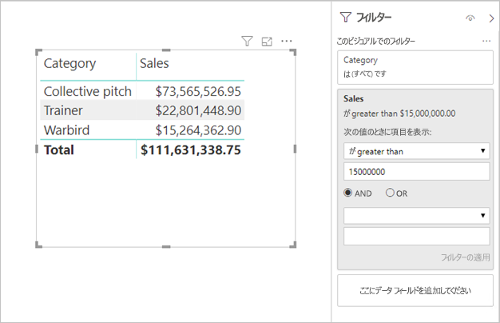

# <a name="directquery-model-guidance-in-power-bi-desktop"></a>Power BI Desktop の DirectQuery モデルのガイダンス

この記事の対象読者は、Power BI DirectQuery モデル (Power BI Desktop または Power BI サービスを使用して開発されるもの) を開発するデータ モデラーです。 DirectQuery のユース ケース、制限事項、およびガイダンスについて説明します。 具体的には、このガイダンスは、DirectQuery がモデルに適したモードであるかどうかを判断し、DirectQuery モデルに基づいてレポートのパフォーマンスを向上させるのに役立つように作られています。 この記事は、Power BI サービスまたは Power BI Report Server でホストされている DirectQuery モデルに適用されます。

この記事は、DirectQuery モデルの設計に関する完全な説明を提供するためのものではありません。 概要については、「[Power BI Desktop での DirectQuery モデル](../connect-data/desktop-directquery-about.md)」をご覧ください。 詳細については、「[SQL Server 2016 Analysis Services での DirectQuery](https://download.microsoft.com/download/F/6/F/F6FBC1FC-F956-49A1-80CD-2941C3B6E417/DirectQuery%20in%20Analysis%20Services%20-%20Whitepaper.pdf)」ホワイトペーパーをご覧ください。 このホワイトペーパーでは、SQL Server Analysis Services での DirectQuery の使用について説明されていることに注意してください。 ただし、内容の多くは、Power BI DirectQuery モデルにも当てはまります。

この記事では、複合モデルに関しては直接説明していません。 複合モデルは、少なくとも 1 つ、場合によってはさらに多くの DirectQuery ソースで構成されます。 この記事で説明されているガイダンスは、少なくとも部分的に、複合モデルの設計に関連しています。 ただし、インポート テーブルと DirectQuery テーブルを組み合わせることによる影響については、この記事では説明されていません。 詳細については、「[Power BI Desktop で複合モデルを使用する](../transform-model/desktop-composite-models.md)」を参照してください。

DirectQuery モデルでは、Power BI 環境 (Power BI サービスまたは Power BI Report Server) および基になるデータ ソースに対して、異なるワークロードが適用されることを理解しておくことが重要です。 DirectQuery が適切な設計方法であると判断した場合は、適切なユーザーをプロジェクトに参加させることをお勧めします。 多くの場合、DirectQuery モデルのデプロイが成功するのは、IT プロフェッショナルのチームが緊密に連携しているためです。 通常、チームは、モデル開発者とソース データベース管理者で構成されます。 また、データ アーキテクトや、データ ウェアハウスおよび ETL の開発者が加わることもあります。 多くの場合、パフォーマンスをよくするには、データソースに最適化を直接適用する必要があります。

## <a name="design-in-power-bi-desktop"></a>Power BI Desktop で設計する

Azure SQL Data Warehouse と Azure HDInsight Spark データ ソースはどちらも、Power BI Desktop を使用する必要なく直接接続できます。 これは、Power BI サービスの [データを取得] で [データベース] タイルを選択することによって行います。 詳しくは、「[Azure SQL Data Warehouse と DirectQuery](../connect-data/service-azure-sql-data-warehouse-with-direct-connect.md)」をご覧ください。

直接接続は便利ですが、この方法を使用することはお勧めしません。 その主な理由は、基になるデータ ソース スキーマが変更された場合にモデル構造を更新できないことです。

Power BI Desktop を使用して、すべての DirectQuery モデルを作成および管理することをお勧めします。 この方法では、階層、計算列、メジャーなどのサポートされている機能の使用など、必要なモデルの定義を完全に制御できます。 また、基になるデータ ソース スキーマが変更された場合に、モデルの設計を変更することもできます。

## <a name="optimize-data-source-performance"></a>データ ソースのパフォーマンスを最適化する

以下で示すように、リレーショナル データベース ソースはいくつかの方法で最適化できます。

> [!NOTE]
> すべてのモデラーが、リレーショナル データベースを最適化するためのアクセス許可またはスキルを持っているわけではないことを理解しています。 DirectQuery モデル用にデータを準備するのが推奨されるレイヤーですが、ソース データベースを変更せず、モデルの設計でいくつかの最適化を実現することもできます。 ただし、多くの場合、ソース データベースに最適化を適用することで、最適化の結果を最善にすることができます。

- **データの整合性が完全であることを確認する:** ディメンション型のテーブルに、ファクト型のテーブルにマップされる一意の値 (ディメンション キー) の列が含まれていることが特に重要です。 また、ファクト型のディメンション列に有効なディメンション キーの値が含まれていることも重要です。 これにより、リレーションシップの両側に一致する値があることを期待できる、より効率的なモデル リレーションシップを構成できます。 ソース データに整合性がない場合は、データを効果的に修復するため、"不明" ディメンション レコードを追加することをお勧めします。 たとえば、**Product** テーブルに不明な製品を表す行を追加し、それに -1 のような範囲外のキーを割り当てることができます。 **Sales** テーブルの行に存在しない製品キーの値が含まれている場合は、-1 に置き換えます。 これにより、**Sales** のすべての製品キー値に対し、**Product** テーブルに対応する行が含まれることが保証されます。
- **インデックスを追加する:** テーブルまたはビューで適切なインデックスを定義し、予想されるレポートのビジュアルのフィルター処理とグループ化に対してデータを効率的に取得できるようにします。 SQL Server、Azure SQL Database、または Azure SQL Data Warehouse ソースの場合、インデックス設計ガイダンスに関する有益な情報については、「[SQL Server のインデックスのアーキテクチャとデザイン ガイド](/sql/relational-databases/sql-server-index-design-guide?view=sql-server-2017)」をご覧ください。 SQL Server または Azure SQL Database の揮発性ソースについては、「[列ストアを使用したリアルタイム運用分析の概要](/sql/relational-databases/indexes/get-started-with-columnstore-for-real-time-operational-analytics?view=sql-server-2017)」をご覧ください。
- **分散テーブルを設計する:** 超並列処理 (MPP) アーキテクチャを利用する Azure SQL Data Warehouse ソースの場合は、大きなファクト型テーブルをハッシュ分散として構成し、ディメンション型テーブルをすべてのコンピューティング ノードにレプリケートするように構成することを検討します。 詳しくは、「[Azure SQL Data Warehouse での分散テーブルの設計に関するガイダンス](/azure/sql-data-warehouse/sql-data-warehouse-tables-distribute#what-is-a-distributed-table)」をご覧ください。
- **必要なデータ変換が具体化されていることを確認する:** SQL Server リレーショナル データベース ソース (およびその他のリレーショナル データベース ソース) では、計算列をテーブルに追加できます。 このような列は式に基づいています (たとえば、**数量**に**単価**を掛ける)。 計算列は永続化 (具体化) することができ、通常の列と同様に、インデックスを作成することもできます。 詳細については、「[計算列のインデックス](/sql/relational-databases/indexes/indexes-on-computed-columns?view=sql-server-2017)」を参照してください。

    ファクト テーブルのデータをより高い粒度で事前集計できるインデックス付きビューについても検討します。 たとえば、**Sales** テーブルに注文明細レベルでデータが格納されている場合は、このデータを集計するビューを作成できます。 日付 (月単位)、顧客、製品で **Sales** テーブルのデータをグループ化し、売上や数量などのメジャー値を集計する SELECT ステートメントを基にして、ビューを作成できます。その後、ビューにインデックスを付けることができます。 SQL Server または Azure SQL Database ソースについては、「[インデックス付きビューの作成](/sql/relational-databases/views/create-indexed-views?view=sql-server-2017)」をご覧ください。
- **日付テーブルを具体化する:** 一般的なモデリング要件には、時間ベースのフィルター処理をサポートするための日付テーブルの追加が含まれます。 組織内の既知の時間ベースのフィルターをサポートするには、ソース データベースにテーブルを作成し、ファクト テーブルの日付を含む日付の範囲で読み込まれるようにします。 また、年、四半期、月、週など、便利な期間の列が含まれるようにします。

## <a name="optimize-model-design"></a>モデルの設計を最適化する

以下の項目で説明するように、DirectQuery モデルはさまざまな方法で最適化できます。

- **複雑な Power Query クエリを避ける:** 効率的なモデル設計を実現するには、すべての変換に対して Power Query クエリを適用する必要がないようにします。 これは、各クエリを 1 つのリレーショナル データベース ソースのテーブルまたはビューにマップすることを意味します。 **[ネイティブ クエリを表示]** オプションを選択することで、Power Query が適用されるステップに対する実際の SQL クエリ ステートメントの表現をプレビューできます。

    ![[適用したステップ] の [ネイティブ クエリを表示] オプションを示す、Power BI Desktop のスクリーンショット。](media/directquery-model-guidance/directquery-model-guidance-query-editor-view-native-query.png)
    
    ![[ネイティブ クエリ] ウィンドウを示す Power BI Desktop のスクリーンショット。 クエリ ステートメントによって、2 つのソース テーブルが結合されます。](media/directquery-model-guidance/directquery-model-guidance-native-query-window.png)

- **計算列とデータ型の変更の使用を調べる:** DirectQuery モデルでは、データ型を変換するための計算と Power Query ステップの追加がサポートされています。 ただし、可能であれば、リレーショナル データベース ソースで変換結果を具体化することにより、多くの場合、パフォーマンスが向上します。
- **Power Query の相対日付フィルター処理を使用しない:** Power Query のクエリでは、相対日付フィルター処理を定義できます。 たとえば、昨年 (今日の日付を基準に) に作成された販売注文を取得するような場合です。 この種のフィルターは、次のように、非効率的なネイティブ クエリに変換されます。

    ```SQL
    …
    from [dbo].[Sales] as [_]
    where [_].[OrderDate] >= convert(datetime2, '2018-01-01 00:00:00') and [_].[OrderDate] < convert(datetime2, '2019-01-01 00:00:00'))  
    ```
    
    もっと優れた設計方法は、日付テーブルに相対時間列を含めることです。 これらの列には、現在の日付に対する相対的なオフセット値を格納します。 たとえば、**RelativeYear** 列の値 0 は現在の年を表し、-1 は前年を表す、といったようになります。可能であれば、**RelativeYear** 列を日付テーブルに具体化します。 効率的ではありませんが、[TODAY](/dax/today-function-dax) と [DATE](/dax/date-function-dax) の DAX 関数を使用する式に基づいて、モデルの計算列として追加することもできます。

- **メジャーを単純に保つ:** 少なくとも最初は、単純な集計にメジャーを制限することをお勧めします。 集計関数には、SUM、COUNT、MIN、MAX、AVERAGE が含まれます。 その後、メジャーの応答性が十分である場合は、より複雑なメジャーを試してもかまいませんが、それぞれのパフォーマンスに注意を払ってください。 [CALCULATE](/dax/calculate-function-dax) DAX 関数を使用して、フィルター コンテキストを操作する高度なメジャー式を生成することはできますが、パフォーマンスがよくない負荷の高いネイティブ クエリが生成される場合があります。
- **計算列ではリレーションシップを使用しない:** モデル リレーションシップでは、1 つのテーブルの 1 つの列を、別のテーブルの 1 つの列に関連付けることだけができます。 ただし、場合によっては、複数の列を使用してテーブルを関連付ける必要があります。 たとえば、**Sales** テーブルと **Geography** テーブルは、次の 2 つの列によって関連付けられています: **Country** と **City**。 テーブル間のリレーションシップを作成するには 1 つの列が必要であり、**Geography** テーブルでは、列に一意の値が含まれている必要があります。 国と市をハイフン区切り記号で連結することにより、この結果を実現できます。

    結合列は、Power Query のカスタム列を使用して、またはモデルで計算列として、作成することができます。 ただし、計算式はソース クエリに埋め込まれるため、これは避ける必要があります。 これは非効率であるだけでなく、通常はインデックスを使用できません。 代わりに、具体化された列をリレーショナル データベース ソースに追加し、インデックスを作成することを検討します。 また、ディメンション型のテーブルに代理キー列を追加することも検討できます。これは、リレーショナル データ ウェアハウスの設計において一般的な方法です。
    
    このガイダンスには例外が 1 つあり、その場合は [COMBINEVALUES](/dax/combinevalues-function-dax) DAX 関数を使用することを考えます。 この関数の目的は、複数列モデルのリレーションシップをサポートすることです。 リレーションシップで使用する式を生成するのではなく、複数列の SQL 結合述語が生成されます。
- **"一意識別子" 列ではリレーションシップを使用しない:** Power BI では、一意識別子 (GUID) データ型はネイティブにはサポートされていません。 この型の列の間でリレーションシップを定義すると、Power BI ではキャストを含む結合を使用するソース クエリが生成されます。 このクエリ時のデータ変換では、一般に、パフォーマンスが低下します。 このケースが最適化されるまでの唯一の回避策は、基になるデータベースで代替データ型の列を具現化することです。
- **リレーションシップの "一" の側の列を非表示にする:** リレーションシップの "一" の側の列は、非表示にする必要があります。 (これは通常、ディメンション型テーブルの主キー列です。)非表示にすると、 **[フィールド]** ペインで使用できなくなるため、ビジュアルの構成に使用できません。 "多" の側の列は、列の値によってレポートをグループ化したりフィルター処理したりするのに役立つ場合は、表示のままにしてかまいません。 たとえば、**Sales** テーブルと **Product** テーブルの間にリレーションシップが存在するモデルについて考えてみます。 リレーションシップ列には、製品の SKU (最小在庫管理単位) の値が含まれます。 製品の SKU をビジュアルに追加する必要がある場合は、**Sales** テーブルでのみ表示される必要があります。 この列を使用してビジュアルのフィルター処理またはグループ化を行うと、Power BI により、**Sales** テーブルと **Product** テーブルを結合するために必要のないクエリが生成されます。
- **整合性が適用されるようにリレーションシップを設定する:** DirectQuery のリレーションシップの **[参照整合性を想定]** プロパティにより、Power BI で外部結合ではなく内部結合を使用するソース クエリが生成されるかどうかが決まります。 一般に、これによりクエリのパフォーマンスが向上しますが、リレーショナル データベース ソースの仕様に依存します。 詳しくは、「[Power BI Desktop で参照整合性設定を想定する](../connect-data/desktop-assume-referential-integrity.md)」の記事をご覧ください。
- **双方向のリレーションシップ フィルター処理を使用しない:** 双方向のリレーションシップ フィルター処理を使用すると、クエリ ステートメントが正常に実行されない可能性があります。 このリレーションシップ機能は、必要な場合にのみ使用してください。通常は、ブリッジ テーブル間で多対多リレーションシップを実装する場合に使用します。 詳細については、「[Power BI Desktop での多対多カーディナリティのリレーションシップ](../transform-model/desktop-many-to-many-relationships.md)」を参照してください。
- **並列クエリを制限する:** 基になる各データ ソースに対して DirectQuery で開かれる最大接続数を設定できます。 これにより、データ ソースに同時に送信されるクエリの数を制御します。

    ![[DirectQuery オプション] ウィンドウを示す Power BI Desktop のスクリーンショット。](media/directquery-model-guidance/directquery-model-guidance-desktop-options-current-file-directquery.png)
    
    この設定は、モデルに DirectQuery ソースが少なくとも 1 つあるときにのみ有効になります。 この値はすべての DirectQuery ソースに適用され、モデルに追加された新しい DirectQuery ソースに適用されます。

    **[データ ソースあたりの最大接続数]** の値を増やすと、基になるデータ ソースに送信できるクエリが増えます (指定された最大数まで)。1 つのページにたくさんのビジュアルがあるとき、たくさんのユーザーが同時にレポートにアクセスするときに便利です。 接続の最大数に到達した後は、接続が利用可能になるまで、後続のクエリは待ち行列に入ります。 この上限を増やすと、結果的に、基になるデータ ソースの負荷が増えます。そのため、全体的なパフォーマンスの向上はこの設定では保証されません。
    
    Power BI にモデルを発行したとき、基になるデータ ソースに同時に送信されるクエリの最大数も、環境によって異なります。 異なる環境 (Power BI、Power BI Premium、Power BI Report Server など) ごとに、異なるスループット制約が適用される可能性があります。 Power BI Premium 容量リソースの制限について詳しくは、「[Power BI Premium 容量のデプロイと管理](https://docs.microsoft.com/power-bi/whitepaper-powerbi-premium-deployment)」をご覧ください。

## <a name="optimize-report-designs"></a>レポートの設計を最適化する

以下の項目で説明するように、DirectQuery データセットに基づくレポートは、さまざまな方法で最適化できます。

- **クエリ削減の手法を有効にする:** Power BI Desktop の [オプションと設定] には [クエリを減らす] ページがあります。 このページには 3 つの便利なオプションがあります。 クロス強調表示とクロス フィルター処理を既定で無効にすることもできますが、これは編集操作によってオーバーライドされる可能性があります。 また、スライサーとフィルターに [適用] ボタンを表示することもできます。 レポート ユーザーがボタンをクリックするまで、スライサーまたはフィルターのオプションは適用されません。 これらのオプションを有効にする場合は、最初にレポートを作成するときに行うことをお勧めします。

    ![[オプション] ウィンドウの [クエリを減らす] フィルターを示す、Power BI Desktop のスクリーンショット。](media/directquery-model-guidance/directquery-model-guidance-desktop-options-current-file-query-reduction.png)
    
- **フィルターを最初に適用する:** 最初にレポートを設計するときは、フィールドをビジュアルのフィールドにマッピングする前に、レポート、ページ、またはビジュアルのレベルで、適用可能なフィルターを適用することをお勧めします。 たとえば、**Country** メジャーと **Sales** メジャーをドラッグしてから、特定の年でフィルター処理するのではなく、先に **Year** フィールドにフィルターを適用します。 これは、視覚エフェクト作成の各ステップでクエリが送信され、最初のクエリが完了する前に別の変更を加えることができるので、基になるデータ ソースに不要な読み込みが配置される可能性があるためです。 最初にフィルターを適用することで、一般にこれらの中間クエリのコストは低下し、処理が速くなります。 また、フィルターを早期に適用しないと、前述のように 100 万行の制限を超えてしまう可能性があります。
- **ページ上の視覚エフェクトの数を制限する:** レポート ページが開かれるときに (およびページ フィルターが適用されるとき)、ページ上のすべてのビジュアルが更新されます。 ただし、前に説明したように、同時に送信できるクエリの数には、Power BI 環境と、 **[データ ソースあたりの最大接続数]** モデル設定によって適用される制限があります。 そのため、ページのビジュアルの数が増えるにつれて、更新が順番に行われる可能性が高くなります。 これにより、ページ全体の更新にかかる時間が長くなります。また、ビジュアルに表示される結果に一貫性がなくなる可能性が高くなります (揮発性のデータ ソースの場合)。 このため、ページのビジュアルの数を制限し、代わりに単純なページを多数作成します。 複数のカード ビジュアルを 1 つの複数行カード ビジュアルに置き換えて、似たページ レイアウトを実現できます。
- **ビジュアル間の相互作用を無効にする:** クロス強調表示とクロス フィルター処理の相互作用では、基になるソースにクエリを送信する必要があります。 ユーザー選択への応答にかかる時間が不当に長くなる場合は、どうしても必要な場合を除き、これらの相互作用をオフにすることをお勧めします。 これらの相互作用はレポート全体に対してオフにするか (前述の「クエリを減らすオプション」を参照してください)、個別にオフにすることができます。 詳細については、「[Power BI のレポート内でビジュアルがどのように相互作用するか](../consumer/end-user-interactions.md)」を参照してください。

これまでに示した最適化の手法に加えて、次の各レポート機能がパフォーマンスの問題に関係する可能性があります。

- **メジャー フィルター:** メジャー (または列の集計) が含まれるビジュアルでは、それらのメジャーにフィルターが適用される場合があります。 たとえば、次のビジュアルでは **Category** 別の **Sales** が示されていますが、売上が 1,500 万ドルを超えるカテゴリのみについてです。

    
    
    
    これにより、基になるソースに 2 つのクエリが送信される可能性があります。
    
    - 最初のクエリでは、条件 (売上 > 1,500 万ドル) を満たすカテゴリが取得されます。
    - 2 番目のクエリでは、ビジュアルに必要なデータが取得されて、WHERE 句の条件を満たすカテゴリが追加されます
    
    一般に、この例のようにカテゴリの数が数百から数千の場合はパフォーマンスに問題はありません。 しかしながら、カテゴリの数が非常に多い場合は、パフォーマンスが低下する可能性があります (実際、条件を満たすカテゴリが 100 万を超えると、上で説明した 100 万行の制限のため、クエリは失敗します)。
- **TopN フィルター:** メジャーによってランク付けされた上位 (または下位) N 個の値のみをフィルター処理する、高度なフィルターを定義することができます。 たとえば、上のビジュアルで上位 5 つのカテゴリのみを表示するような場合です。 メジャー フィルターと同様に、この場合も、基になるデータ ソースに 2 つのクエリが送信されます。 ただし、最初のクエリで基になるソースからすべてのカテゴリが返された後、返された結果に基づいて上位 N 個が決定されます。 関係する列のカーディナリティによっては、パフォーマンスの問題が発生します (または、100 万行の制限によりクエリが失敗します)。
- **中央値:** 一般に、すべての集計 (Sum、Count Distinct など) は基になるソースにプッシュされます。 ただし、中央値の場合、この集計は基になるソースによってサポートされないので、プッシュされません。 このような場合は、詳細データが基になるソースから取得され、返された結果から Power BI により中央値が評価されます。 これは、比較的少数の結果について中央値を計算するときは問題ありませんが、カーディナリティが大きい場合はパフォーマンスの問題が発生します (または、100 万行の制限によりクエリが失敗します)。 たとえば、国の人口の中央値では問題がなくても、販売価格の中央値では問題になることがあります。
- **複数選択スライサー:** スライサーとフィルターで複数選択を許可すると、パフォーマンスの問題が発生する可能性があります。 これは、ユーザーが追加のスライサー項目を選択すると (たとえば、関心のある最大 10 製品を作成する場合)、新しい選択ごとに、新しいクエリが基になるソースに送信されるためです。 ユーザーがクエリが完了する前に次の項目を選択できるので、基になるソースで余分な負荷が発生します。 この状況を回避するには、前にクエリの削減方法で説明したように、[適用] ボタンを表示します。
- **表示部分の合計:** 既定では、テーブルとマトリックスには合計と小計が表示されます。 多くの場合、合計の値を得るには、基になるソースに追加クエリを送信する必要があります。 これは、個別のカウントまたは中央値の集計を使用する場合、および SAP HANA または SAP Business Warehouse で DirectQuery を使用する場合に、常に適用されます。 必要でなければ、このような合計はオフにします ([書式] ペインを使用)。

## <a name="convert-to-a-composite-model"></a>複合モデルに変換する

インポート モデルと DirectQuery モデルの利点を、モデル テーブルのストレージ モードを構成することによって、1 つのモデルに組み合わせることができます。 テーブル ストレージ モードは、インポートか DirectQuery のどちらか、または両方 (デュアルと呼ばれます) にすることができます。 モデルに異なるストレージ モードのテーブルが含まれる場合は、複合モデルと呼ばれます。 詳細については、「[Power BI Desktop で複合モデルを使用する](../transform-model/desktop-composite-models.md)」を参照してください。

DirectQuery モデルを複合モデルに変換することで実現できる機能とパフォーマンスの向上が多数あります。 複合モデルでは、複数の DirectQuery ソースを統合でき、集計を含めることもできます。 集計テーブルを DirectQuery テーブルに追加して、テーブルの要約表現をインポートできます。 それにより、ビジュアルで上位レベルの集計をクエリするときに、パフォーマンスを大幅に向上させることができます。 詳しくは、「[Power BI Desktop での集計](../transform-model/desktop-aggregations.md)」をご覧ください。

## <a name="educate-users"></a>ユーザーを教育する

DirectQuery データセットに基づいてレポートを効率的に操作する方法について、ユーザーを教育することが重要です。 レポート作成者は、「[レポートの設計を最適化する](#optimize-report-designs section)」の内容についての教育を受ける必要があります。

DirectQuery データセットに基づくレポートについて、レポート利用者を教育することをお勧めします。 この記事で説明されている制限事項など、一般的なデータ アーキテクチャについて理解しておくと役立つ場合があります。 更新応答や対話的なフィルター処理は速度が遅くなる場合があることを認識させます。 レポート ユーザーはパフォーマンスが低下する理由を理解していれば、レポートやデータについての信頼を失う可能性が低くなります。

揮発性のデータ ソースに対するレポートを配信する場合は、必ず [最新の情報に更新] ボタンの使用についてレポート ユーザーを教育します。 一貫性のない結果が表示される可能性があること、およびレポートを最新の情報に更新することでレポート ページの不整合が解決される場合があることを、わからせます。

## <a name="next-steps"></a>次の手順

DirectQuery の詳細については、次のリソースを参照してください。

- [Power BI Desktop での DirectQuery モデル](../connect-data/desktop-directquery-about.md)
- [Power BI Desktop で DirectQuery を使用する](../connect-data/desktop-use-directquery.md)
- [Power BI Desktop での DirectQuery モデルのトラブルシューティング](../connect-data/desktop-directquery-troubleshoot.md)
- わからないことがある場合は、 [Power BI コミュニティで質問してみてください](https://community.powerbi.com/)。
