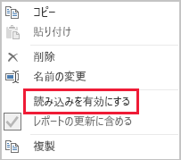

# インポート モデリングのデータ削減手法

この記事では、インポート モデルを開発している Power BI Desktop データ モデラーを対象としています。 インポート モデルに読み込まれるデータを減らすためのさまざまな手法について説明します。

インポート モデルは、VertiPaq ストレージ エンジンによって圧縮および最適化されてからディスクに格納されるデータと共に読み込まれます。 ソース データがメモリに読み込まれると、10 倍の圧縮が見られる可能性があるため、10 GB のソース データが約 1 GB のサイズに圧縮されることを期待できます。 さらに、ディスクに永続化すると、さらに 20% の削減を実現できます。

VertiPaq ストレージ エンジンによって実現される効率性だけでなく、モデルに読み込まれるデータを最小限に抑えるように努力することが重要です。 これは特に、大規模なモデルや、時間の経過と共に大規模になると予測されるモデルに当てはまります。 説得力のある 4 つの理由があります。

- モデル サイズが大きくなるほど、お持ちの容量でサポートできくなる可能性があります。 共有容量では最大 1 GB のモデルをホストできますが、Premium 容量では最大 13 GB のモデルをホストできます。 詳細については、[大規模なデータセットに対する Power BI Premium のサポート](../service-premium-large-datasets.md)に関する記事を参照してください。
- モデル サイズが小さくなるほど、容量リソース (特にメモリ) の競合が減少します。 これにより、より長時間、より多くのモデルを同時に読み込むことができるため、削除率が低くなります。 詳細については、[Power BI Premium のデプロイ](../whitepaper-powerbi-premium-deployment.md) ホワイトペーパーの「[容量の機能](../whitepaper-powerbi-premium-deployment.md#how-capacities-function)」トピックを参照してください。
- モデルが小さいほどデータ更新が高速になるため、レポート作成の待機時間が短くなり、データセットの更新スループットが向上し、ソース システムと容量リソースの負荷が軽減されます。
- テーブルの行数が少ないほど、評価計算が高速になるため、クエリの全体的なパフォーマンスを向上させることができます。

この記事では、7 種類のデータ削減手法について説明します。 次のようなものが含まれます。

- [不要な列を削除する](#remove-unnecessary-columns)
- [不要な行を削除する](#remove-unnecessary-rows)
- [グループ化と集計](#group-by-and-summarize)
- [列のデータ型を最適化する](#optimize-column-data-types)
- [カスタム列の設定](#preference-for-custom-columns)
- [Power Query クエリの読み込みを無効にする](#disable-power-query-query-load)
- [混合モードに切り替える](#switch-to-mixed-mode)

## 不要な列を削除する

モデル テーブルの列には、主に次の 2 つの目的があります。

- **レポート**: フィルター処理、モデル データのグループ化、および集計に使用するレポート設計を実現します
- **モデル構造**: モデルのリレーションシップ、モデルの計算、セキュリティ ロール、さらにはデータの色の書式設定をサポートします

このような目的で使用されない列は、削除される可能性があります。 列の削除は、"_列フィルター選択_" と呼ばれます。

既知のレポート要件に基づいて、正確な数の列を含むモデルを設計することをお勧めします。 もちろん、これらの要件は時間の経過と共に変わる可能性がありますが、後で列を削除するよりも後で列を追加する方が簡単なことを覚えておいてください。 列を削除すると、レポートまたはモデル構造が壊れる可能性があります。

## 不要な行を削除する

モデル テーブルは、できるだけ少ない行数で読み込む必要があります。 これは、2 つの異なる理由 (エンティティごとにフィルター処理するか、時間によってフィルター処理するか) のために、フィルター処理済みの行セットをモデル テーブルに読み込むことで実現できます。 行の削除は、"_水平方向のフィルター処理_" と呼ばれます。

**エンティティによるフィルター処理**では、ソース データのサブセットがモデルに読み込まれます。 たとえば、すべての販売地域の売上ファクトを読み込むのではなく、1 つの地域のファクトのみを読み込みます。 この設計方法では、多数の小さなモデルが生成されるため、行レベルのセキュリティを定義する必要がなくなります (ただし、Power BI サービスで特定のデータセットのアクセス許可を付与し、各データセットに接続する "重複" レポートを作成する必要があります)。 Power Query パラメーターと Power BI テンプレート ファイルを利用して、管理と発行を簡素化することができます。 詳細については、「[クエリ パラメーターと Power BI テンプレートについて詳しく調べる](https://powerbi.microsoft.com/blog/deep-dive-into-query-parameters-and-power-bi-templates/)」のブログ記事をご覧ください。

**時間によるフィルター処理**では、ファクト型のテーブルに読み込まれる "_データ履歴_" の量が制限されます (また、モデルの日付テーブルに読み込まれる日付の行も制限されます)。 使用可能なすべての履歴を自動的に読み込むことは、これが既知のレポート要件である場合を除き、お勧めできません。 時間ベースの Power Query フィルターは、パラメーター化でき、さらには相対的な時間間隔 (たとえば、更新日に対して過去 5 年間など) を使用するように設定できることを理解すると役立ちます。 また、時間フィルターへの遡及的な変更によりレポートが壊れることはありません。これにより、レポートで使用できるデータ履歴が減る (増える) だけです。

## グループ化と集計

モデルのサイズを小さくする最も効果的な方法は、事前に集計されたデータを読み込むことです。 この手法を使用すると、ファクト型テーブルの粒度を上げることができます。 ただし、詳細が失われるという明確なトレードオフがあります。

たとえば、ソースの売上ファクト テーブルには、注文明細行ごとに 1 つの行が格納されています。 すべての売上指標を集計し、日付、顧客、製品別にグループ化することで、データの大幅な削減を実現できます。 次に、"_月レベルで_" 日付をグループ化することで、さらに大幅なデータ削減を実現できることを検討します。 これにより、モデル サイズの 99% 削減を達成できる可能性がありますが、日単位や個別の注文レベルでレポートを作成することは、当然ながらできなくなります。 ファクト型データの集計の決定には、常にトレードオフが伴います。 このトレードオフは、混合モデル設計によって軽減できる可能性があります。これについては、後述の「[混合モードへの切り替え](#switch-to-mixed-mode)」トピックで説明します。

## 列のデータ型を最適化する

VertiPaq ストレージ エンジンでは、列ごとに個別のデータ構造が使用されます。 仕様により、これらのデータ構造は、値のエンコードを使用する数値列データに対して最も高い最適化を実現します。 ただし、テキストやその他の数値以外のデータでは、ハッシュ エンコードが使用されます。 これには、ストレージ エンジンによって、列に格納されている一意のテキスト値ごとに数値識別子が割り当てられる必要があります。 これは数値識別子で、その後、データ構造に格納され、ストレージとクエリの実行中にハッシュ検索が必要になります。

一部の特定のインスタンスでは、ソース テキスト データを数値に変換できます。 たとえば、販売注文番号には、プレフィックスとして常にテキスト値 ("SO123456" など) が付けられる場合があります。 プレフィックスを削除して、注文番号の値を整数に変換することができます。 大規模なテーブルの場合、特に、列に一意または高いカーディナリティ値が含まれている場合は、データが大幅に削減される可能性があります。

この例では、列の [既定の概要] プロパティを [集計しない] に設定することをお勧めします。 これにより、注文番号の値の不適切な集計を最小限に抑えることができます。

## カスタム列の設定

VertiPaq ストレージ エンジンでは、通常の Power Query ソース列と同様に、モデル計算列 (DAX で定義) が格納されます。 ただし、データ構造は若干異なる方法で格納され、通常、圧縮率は低くなります。 また、これらはすべての Power Query テーブルが読み込まれると構築されるため、データ更新時間が長くなる可能性があります。 そのため、テーブル列を_計算_列として追加するのは、Power Query _計算_列 (M で定義) よりも効率性が落ちます。

設定により Power Query のカスタム列が作成されている必要があります。 ソースがデータベースの場合は、2 通りの方法で読み込み効率を高めることができます。 計算は、(プロバイダーのネイティブ クエリ言語を使用して) SQL ステートメントで定義することも、データ ソース内の列として具体化することもできます。

ただし、場合によっては、モデルの計算列の方が適していることもあります。 これには、数式でメジャーを評価する場合や、DAX 関数でのみサポートされる特定のモデリング機能が必要な場合などが考えられます。 このような例の詳細については、「[DAX における親子階層の関数について](/dax/understanding-functions-for-parent-child-hierarchies-in-dax)」を参照してください。

## Power Query クエリの読み込みを無効にする

他のクエリとのデータ統合のサポートを意図した Power Query クエリは、モデルに読み込むことはできません。 クエリがモデルに読み込まれないようにするには、これらのインスタンスでクエリの読み込みを確実に無効にするようにしてください。

## 混合モードに切り替える

Power BI Desktop では、混合モードの設計によって複合モデルが生成されます。 基本的には、_テーブルごとに_ストレージ モードを決定することができます。 そのため、各テーブルでは、[ストレージ モード] プロパティを [インポート] または [DirectQuery] として設定できます ([デュアル] はもう 1 つのオプションです)。

モデル サイズを小さくする効果的な方法は、大規模なファクト型テーブルの [ストレージ モード] プロパティを [DirectQuery] に設定することです。 この設計アプローチは、前述の「[グループ化と集計](#group-by-and-summarize)」トピックと組み合わせて使用することを考慮してください。 たとえば、集計された売上データを使用して、ハイ パフォーマンスの "概要" レポートを作成することができます。 ドリルスルー ページでは、すべてのコンテキスト内の販売注文を表示する、特定の (および絞り込んだ) フィルター コンテキストの詳細な売上を表示できます。 この例では、ドリルスルー ページには、販売注文データを取得するための DirectQuery テーブルに基づくビジュアルが含まれています。

ただし、複合モデルに関連する多くのセキュリティとパフォーマンスへの影響があります。 詳細については、「[Power BI Desktop で複合モデルを使用する](../desktop-composite-models.md)」の記事を参照してください。

## 次の手順

Power BI インポート モデル設計の詳細については、次の記事を参照してください。

- [Power BI Desktop で複合モデルを使用する](../desktop-composite-models.md)
- [Power BI Desktop のストレージ モード](../desktop-storage-mode.md)
