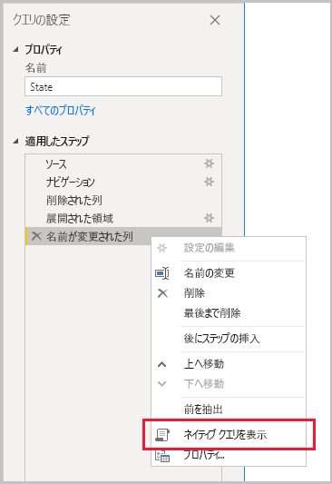
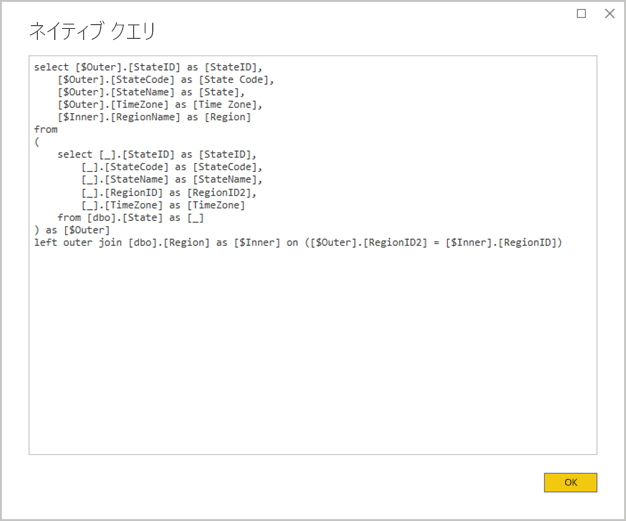
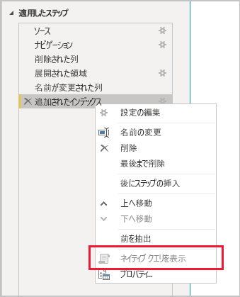

# <a name="the-importance-of-query-folding"></a>クエリ フォールディングの重要性

この記事では、Power BI Desktop でモデルを開発しているデータ モデラーを対象としています。 ここでは、クエリ フォールディングとは何か、およびそれが重要である理由について説明します。 また、クエリ フォールディングを実現できるデータ ソースと変換、および Power Query クエリ (全部または一部) を折りたたむことができるかどうかを判断する方法についても説明します。 最後に、クエリ フォールディングを実現する場合と方法について、ベスト プラクティスのガイダンスを提供します。

## <a name="background"></a>背景

クエリ フォールディングは、ソース データを取得して変換するための単一のクエリ ステートメントを Power Query クエリで生成する機能です。 Power Query のマッシュアップ エンジンは、可能な場合は常にクエリ フォールディングを実現して、基になるデータ ソースに Power BI モデル テーブルを接続するための最も効率的なパスを生成しようとします。

いくつかの理由で、クエリ フォールディングはデータ モデリングの重要なトピックです。

- **インポート モデルのテーブル:** データ更新は、リソース使用率と更新期間の観点から、インポート モデルのテーブルに対して効率的に行われます。
- **DirectQuery テーブルとデュアル ストレージ モードのテーブル:** 各 DirectQuery テーブルとデュアル ストレージ モードのテーブルは、折りたたみ可能な Power Query クエリに基づいている必要があります。
- **増分更新:** リソース使用率と更新期間の観点から、データの増分更新は効率的です。 実際、[増分更新] 構成ウィンドウでは、テーブルのクエリ フォールディングを実現できないと判断した場合、警告が通知されます。 これを実現できなければ、増分更新の目的は無駄になります。 この場合、マッシュアップ エンジンはすべてのソース行を取得し、フィルターを適用して増分変更を決定する必要があります。

クエリ フォールディングは、Power Query クエリ全体、またはそのステップのサブセットに対して発生する可能性があります。 クエリ フォールディング (全部または一部) を実現できない場合、Power BI の Power Query マッシュアップ エンジンは、データ変換自体を処理することで補完する必要があります。 このためには、ソース クエリの結果を取得する必要がありますが、大規模なデータセットの場合、非常に多くのリソースを消費し、処理速度が低下します。

データ モデラーは、可能な場合は常にクエリ フォールディングが発生できるようにして、インポート モデル設計の効率化を図ることをお勧めします。

## <a name="sources-that-support-query-folding"></a>クエリ フォールディングをサポートするソース

クエリ言語の概念に基づく多くのデータ ソースでは、クエリ フォールディングがサポートされます。 これには、リレーショナル データベース、OData フィード (SharePoint リストなど)、Exchange、Active Directory が含まれます。 しかし、フラット ファイル、BLOB、Web などのデータ ソースでは、通常サポートされません。

## <a name="transformations-that-can-achieve-query-folding"></a>クエリ フォールディングが実現可能な変換

クエリ フォールディングが実現可能なリレーショナル データ ソース変換とは、単一の SELECT ステートメントとして記述できる変換です。 SELECT ステートメントは、適切な WHERE 句、GROUP BY 句、および JOIN 句を使用して作成することができます。 また、SQL データベースでサポートされる一般的な組み込み関数を使用する列の式 (計算) を含めることもできます。

次の箇条書きでは、通常クエリ フォールディングが実現可能な変換について説明します。

- 列の削除
- 列の名前の変更 (SELECT 列の別名)
- 静的な値または Power Query パラメーターによる行のフィルター処理 (WHERE 句述語)
- グループ化と集計 (GROUP BY 句)
- 2 つのソース テーブルの結合を実現するためのレコード列 (ソースの外部キー列) の展開 (JOIN 句)
- 同じソースに基づいており、折りたたみ可能なクエリのあいまいではない結合 (JOIN 句)
- 同じソースに基づいており、折りたたみ可能なクエリのアペンド (UNION ALL 演算子)
- _単純なロジック_によるカスタム列の追加 (SELECT 列の式)。 単純なロジックとは、複雑ではない操作を意味します。このような操作としては、数学関数やテキスト操作関数など、SQL データ ソースに同等の関数を持つ M 関数の使用などが考えられます。 たとえば、次の式は、**OrderDate** 列の値の年コンポーネントを返します (数値を返します)。

    ```powerquery-m
    Date.Year([OrderDate])
    ```

- ピボットとピボット解除 (PIVOT 演算子と UNPIVOT 演算子)

## <a name="transformations-that-prevent-query-folding"></a>クエリ フォールディングを阻止する変換

次の箇条書きでは、通常クエリ フォールディングを阻止する変換について説明します。 このリストはすべてを網羅するものではありません。

- 異なるソースに基づいたクエリの結合
- 異なるソースに基づいたクエリのアペンド (結合)
- _複雑なロジック_によるカスタム列の追加。 複雑なロジックとは、データ ソースに同等の関数を持たない M 関数の使用を意味します。 たとえば、次の式は、**OrderDate** 列の値を書式設定します (テキスト値を返します)。

    ```powerquery-m
    Date.ToText([OrderDate], "yyyy")
    ```

- インデックス列の追加
- 列のデータ型の変更

Power Query クエリに複数のデータ ソースが含まれる場合、データ ソースのプライバシー レベルに互換性がないためにクエリ フォールディングを実行できない可能性があります。 詳細については、記事「[Power BI Desktop のプライバシー レベル](../desktop-privacy-levels.md)」を参照してください。

## <a name="determine-when-a-query-can-be-folded"></a>クエリを折りたたむことができるかどうかを判断する

クエリを折りたたむことができるかどうかは、Power Query エディター ウィンドウで判断できます。 **[クエリの設定]** ペインで、最後に適用されたステップを右クリックします。このとき、 **[ネイティブ クエリを表示]** オプションが有効になっている (グレー表示されていない) 場合は、クエリを折りたたむことができます。



折りたたまれたクエリを表示するには、先に進んで、 **[ネイティブ クエリを表示]** オプションを選択します。 Power Query がソース データに対して使用するネイティブ クエリが表示されます。



**[ネイティブ クエリを表示]** オプションが有効になっていない (グレー表示されている) 場合、これは、すべてのクエリ ステップを折りたたむことができないことを示します。 ただし、この場合でも、ステップのサブセットを折りたたむことができます。 最後のステップから 1 ステップずつ前に戻ると、 **[ネイティブ クエリを表示]** オプションが有効になっているかどうかを確認できます。 こうすることで、一連のステップのどこでクエリ フォールディングを実現できなくなったかを知ることができます。



## <a name="best-practice-guidance"></a>ベスト プラクティスのガイダンス

要するに、DirectQuery テーブルとデュアル ストレージ モードのテーブルの場合、Power Query クエリはクエリ フォールディングを実現する必要があります。 リレーショナル ソースに基づくインポート テーブル、および単一の SELECT ステートメントを作成できる場合については、クエリ フォールディングを確実に発生させるようにすることで、_データ更新の最高のパフォーマンス_が達成されます。 変換を処理するために依然としてマッシュアップ エンジンが必要な場合、大規模なデータセットの場合は特に、必要な作業を最小限に抑える必要があります。

次の箇条書きは、ベスト プラクティスのガイダンスを示しています。

- **可能な限り多くの処理をデータ ソースに委任する:** Power Query クエリのすべてのステップを折りたたむことができない場合、クエリ フォールディングを阻止しているステップを探します。 可能な場合、それらがクエリ フォールディングに含まれるように、後続のステップをシーケンスの前の段階に移動します。 Power Query マッシュアップ エンジンは、ソース クエリの生成時にクエリ ステップの順序を変更できる十分なスマートさを備えています。

リレーショナル データ ソースについては、クエリ フォールディングを阻止するステップを単一の SELECT ステートメントまたはストアド プロシージャの手続き型ロジック内で実現できる場合、次に説明するように、ネイティブ クエリ ステートメントの使用を検討します。

- **ネイティブ SQL クエリを使用する:** Power Query クエリがリレーショナル ソースからデータを取得する場合、ネイティブ SQL クエリを使用することができます。 実際、クエリは、ストアド プロシージャの実行を含む任意の有効なステートメントにすることができます。 ステートメントによって複数の結果セットが生成される場合、最初の結果セットのみが返されます。 ステートメントではパラメーターを宣言できます。パラメーター値を安全かつ簡単に渡すために、M 関数 [Value.NativeQuery](/powerquery-m/value-nativequery) を使用することをお勧めします。 Power Query マッシュアップ エンジンでは後続のクエリ ステップを折りたためないことを理解することが重要です。したがって、すべて (または可能な限り多く) の変換ロジックをネイティブ クエリ ステートメントに含めることが重要です。

    ネイティブ SQL クエリを使用する場合は、次の 2 つの重要な考慮事項に配慮する必要があります。

    - DirectQuery モデル テーブルの場合、クエリは SELECT ステートメントである必要があり、共通テーブル式 (CTE) またはストアド プロシージャを使用することはできません。
    - 増分更新では、ネイティブ SQL クエリを利用できないため、Power Query マッシュアップ エンジンがすべてのソース行を取得し、フィルターを適用して増分変更を決定するように強制します。

    > [!IMPORTANT]
    > ネイティブ クエリは、データの取得以外の機能も実行できる場合があります。 任意の有効なステートメントを実行できます (場合によっては複数回)。たとえば、データを変更するステートメントや削除するステートメントなどがあります。 最小特権の原則を適用して、データベースへのアクセスに使用されるアカウントが、必要なデータに対する読み取りアクセス許可のみを持つようにすることが重要です。

- **データの準備と変換をソースで行う:** 特定の Power Query のクエリ ステップを折りたためないことがわかった場合、データ ソースで変換を適用できる可能性があります。 これを実現するには、ソース データを論理的に変換するデータベース ビューを作成するか、Power BI がデータを照会する前に物理的に準備して具体化します。 リレーショナル データ ウェアハウスは準備されたデータの好例で、通常、事前に統合された組織データのソースで構成されます。

## <a name="next-steps"></a>次の手順

クエリ フォールディングの詳細と関連トピックについては、次のリソースを参照してください。

- [Power BI Desktop で複合モデルを使用する](../desktop-composite-models.md)
- [Power BI Premium での増分更新](../service-premium-incremental-refresh.md)
- [Table.View を使用してクエリ フォールディングを実装す](/power-query/handlingqueryfolding)
- わからないことがある場合は、 [Power BI コミュニティで質問してみてください](https://community.powerbi.com/)。
