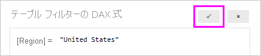

## <a name="define-roles-and-rules-in-power-bi-desktop"></a>Power BI Desktop 内でロールとルールを定義する
Power BI Desktop 内でロールとルールを定義できます。 Power BI に発行するとき、ロールの定義も発行されます。

セキュリティ ロールを定義するには、次の手順に従います。

1. Power BI Desktop レポートにデータをインポートするか、DirectQuery 接続を構成します。
   
   > [!NOTE]
   > Analysis Services ライブ接続の場合、Power BI Desktop 内でロールを定義することはできません。 Analysis Services モデル内で定義する必要があります。
   > 
   > 
2. **[モデリング]** タブから **[ロールの管理]** を選択します。
   
   ![[ロールの管理] を選択する](./media/rls-desktop-define-roles/powerbi-desktop-security.png)
3. **[ロールの管理]** ウィンドウから **[作成]** を選択します。
   
   ![[作成] を選択します](./media/rls-desktop-define-roles/powerbi-desktop-security-create-role.png)
4. **[ロール]** でロールの名前を指定します。 
5. **[テーブル]** で、DAX ルールを適用するテーブルを選択します。
6. **[テーブル フィルターの DAX 式]** ボックスに DAX 式を入力します。 この式からは値として true または false が返されます。 たとえば、```[Entity ID] = “Value”``` です。
      
   ![[ロールの管理] ウィンドウ](./media/rls-desktop-define-roles/powerbi-desktop-security-create-rule.png)

   > [!NOTE]
   > この式の中では *username()* を使用できます。 Power BI Desktop 内では *username()* の形式は *DOMAIN\username* になることにご注意ください。 Power BI サービスと Power BI Report Server 内では、それはユーザーのユーザー プリンシパル名 (UPN) の形式になります。 また、必ずユーザー プリンシパル名 (*username\@contoso.com*) の形式でユーザーを返す *userprincipalname()* を使用することもできます。
   > 
   > 

7. DAX 式を作成した後、式ボックスの上にあるチェックマークを選択し、式を評価します。
      
   
   
   > [!NOTE]
   > この式ボックスでは、コンマを使用して DAX 関数の引数を区切ります。これは、通常はセミコロンが区切り文字として使用されるロケール (フランス語やドイツ語など) にも当てはまります。 
   >
   >
   
8. **[保存]** を選択します。

Power BI Desktop 内でロールにユーザーを割り当てることはできません。 その割り当ては、Power BI サービスで行います。 *username()* または *userprincipalname()* DAX 関数を使用し、適切な関係を構成することで、Power BI Desktop 内で動的セキュリティを有効にできます。 

