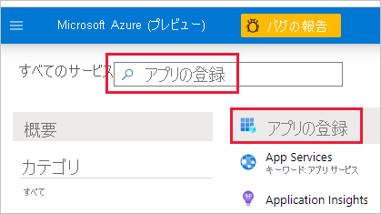
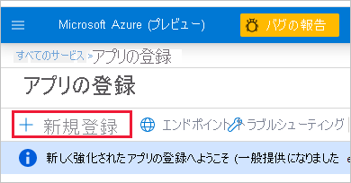

1. [Microsoft Azure](https://ms.portal.azure.com/#allservices) にログインします。

2. **[アプリの登録]** を検索し、 **[アプリの登録]** リンクをクリックします。

    

3. **[新規登録]** をクリックします。

    

4. 必要な情報を入力します。
    * **名前** - 自分のアプリケーションの名前を入力します
    * **サポートされているアカウントの種類** - サポートされているアカウントの種類を選択します
    * (省略可能) **リダイレクト URI** - 必要に応じて URI を入力します

5. **[登録]** をクリックします。

6. 登録した後、 **[概要]** タブで "*アプリケーション ID*" を使用できます。後で使用できるように、"*アプリケーション ID*" をコピーして保存します。

    