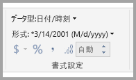
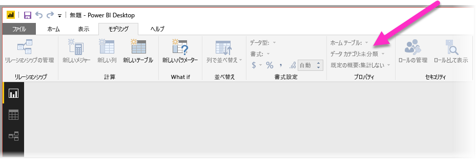

# Power BI の Q&A を最適化するためのベスト プラクティス
データに関する質問に、一般的な語句と自然言語を使用するのは効果的です。 さらに効果的な方法は、データから回答を得ることです。これが、Power BI の Q&A の機能です。

Q&A が回答可能な質問の大規模なコレクションを正常に解釈できるようにするには、Q&A がモデルについてさまざまな推測をする必要があります。 ご使用のモデルの構造がこれらの推測の 1 つ以上に該当しない場合は、モデルを調整する必要があります。 Q&A のこれらの調整は、Q&A を使用するかどうかに関係なく、Power BI のどのモデルに対しても同じ最適化のベスト プラクティスです。

次のセクションでは、Power BI の Q&A でうまく機能するためにモデルを調整する方法について説明します。

## Q&A が行う自動調整

### メジャー テーブル

以前のバージョンの Q&A では、基になるテーブルが切断されるため、メジャー テーブルによって Q&A に混乱が生じていました。 現在、Q&A は、メジャー テーブルで問題なく動作できるようになりました。

### テーブル名と列名の競合

以前のバージョンの Q&A では、テーブルと列が同じ名前である場合、テーブルが優先されていました。 この問題は解決されたため、ご使用のモデルでこの問題を修正する必要はありません。

## Q&A を改善するための手動手順

### 新しい Q&A ツールを使用して質問を修正する

Q&A ツールを使用すると、主要なビジネス用語を Q&A に教えて、エンド ユーザーからの質問を修正することができます。 一部の質問については、データの形が正しくないか、データが欠落しているために、依然として対処できない場合があります。 この場合は、以下の他のセクションを参照して、最適化してください。 詳細については、[Q&A ツール](q-and-a-tooling-intro.md)に関するページを参照してください。

## 欠落しているリレーションシップを追加する

モデルでテーブル間のリレーションシップが欠落している場合、Power BI レポートでも Q&A でも、これらのテーブルを結合する方法を解釈できません。 リレーションシップは、優れたモデルの基礎となります。 たとえば、*orders* (注文) テーブルと *customers* (顧客) テーブルとの間のリレーションシップが欠落している場合、"total sales for Seattle customers" (シアトルの顧客の総売上) という質問をすることはできません。 次の画像では、作業を必要とするモデルと、Q&A の準備ができているモデルを示します。 

**作業が必要**

最初の画像では、Customers (顧客) テーブル、Sales (売上高) テーブル、Products (製品) テーブルの間にリレーションシップはありません。

**Q&A の準備がてきている**

最初の画像では、テーブル間にリレーションシップが定義されています。

## テーブルと列の名前を変更する

テーブルと列の選択は Q&A にとって重要です。 たとえば、ご自身の顧客のリストが含まれる *CustomerSummary* という名前のテーブルがあるとします。 "シカゴの顧客を一覧表示する" ではなく、"シカゴの顧客のサマリーを一覧表示する" などと質問する必要があります。 

Q&A では、いくつかの基本的な単語区切りと複数形の検出は実行できますが、テーブル名と列名がそのコンテンツを正確に反映していることを前提とします。

別の例を見てみましょう。 従業員の氏名と従業員番号が含まれる *Headcount* という名前のテーブルがあるとします。 もう 1 つのテーブルは、従業員番号、ジョブ番号、開始日が含まれる *Employees* という名前のテーブルです。 そのモデルに詳しい人は、この構造を理解できる可能性があります。 誰かが "従業員の数は" と質問すると、"Employees" テーブルからその行の数を取得します。 これは、今まで各従業員が受け持ったことのあるすべてのジョブの数であるため、この結果はおそらく意図していたものではありません。 内容をきちんと反映するようにテーブルの名前を変更することをお勧めします。

**作業が必要**

*StoreInfo*(店舗情報) や *Product List* (製品リスト) などのテーブル名は作業が必要です。

**Q&A の準備がてきている**

*Store* (店舗) および *Products* (製品) という名前のテーブルはより効果的に機能します。

## 不正なデータ型を修正する

インポートされたデータが不正なデータ型の場合があります。 特に、*string* としてインポートされた *date* と *number* の列は、Q&A で date や number として解釈されません。 ご利用の Power BI モデルで正しいデータ型が選択されていることを確認してください。

## 年と識別子の列を [集計しない] にマークする

Power BI は、既定で積極的に数値列を集計するため、"年ごとの総売上" といった質問には、年の総合計とともに、売上の総合計も返される場合があります。 特定の列で Power BI がこのように動作しないようにする必要がある場合は、その列の **[既定の概要]** プロパティを **[集計しない]** に設定します。 **年**、**月**、**日**、および **ID** の列は、よく問題になる列なので、注意してください。 集計しても意味がないその他の列 (*age* (年齢) など) も、 **[既定の集計]** プロパティを **[集計しない]** または **[平均]** に設定しておくとよいでしょう。 この設定は **[モデリング]** タブにあります。

![Q&A の年、月、日などの [集計しない] 列](media/q-and-a-best-practices/desktop-qna-06.png)

## 日付と地理の各列にデータ カテゴリを選択する

**データ カテゴリ**は、データ型以外に、列のコンテンツに関する追加のセマンティック ナレッジを提供します。 たとえば、整数型の列を郵便番号としてマークし、文字列型の列を市区町村、国、地域などとしてマークすることができます。 この情報は、Q&A によって視覚エフェクトの選択と言語の偏りの 2 つの重要な用途で使用されます。

最初に、Q&A は**データ カテゴリ**の情報を使用して、使用するビジュアル表示の種類を選択します。 たとえば、日付または時刻の**データ カテゴリ**の列は、一般的に、線グラフの横軸またはバブル チャートの再生軸に適していると認識します。 また、地理的な**データ カテゴリ**の列を含む結果は、マップでの表示が適していると判断します。

次に、Q&A は、特定の種類の質問を理解するのに役立てるため、ユーザーが日付と地理の列についてどのように話すかについて、経験に基づく推測を行います。 たとえば、"John Smith が入社したのはいつか" の "いつ" は、 日付列にほぼ確実にマップされ、"ブラウンの顧客をカウントする" の "ブラウン" は、髪の色よりも都市にマップされる可能性がより高くなります。

## 関連する列に [列で並べ替え] を選択する

**[列で並べ替え]** プロパティは、1 つの列を並べ替えることで、代わりに別の列を自動的に並べ替えることができます。 たとえば、"シャツのサイズで顧客を並べ替える" という場合は、シャツのサイズの列をアルファベット順 (L、M、S、XL、XS) ではなく、基になるサイズ番号 (XS、S、M、L、XL) で並べ替えることができます。

![Q&A に適した [列で並べ替え] を選択する](media/q-and-a-best-practices/desktop-qna-08.png)

## モデルの正規化

ご利用のモデル全体を作り直す必要があると提案しているわけではないので、安心してください。 ただし、各構造は非常に難しく、Q&A で適切に処理されないことがあります。 モデルの構造の基本的な正規化をいくつか実行すると、Power BI レポートの使いやすさと、Q&A の結果の精度が大幅に向上します。

次の一般規則に従います。ユーザーが話す一意の "もの" それぞれを 1 つのモデル オブジェクト (テーブルまたは列) で表す必要があります。 そのため、ユーザーが顧客について話す場合は、*顧客*オブジェクトが 1 つ必要です。 また、ユーザーが売上について話す場合は、*売上*オブジェクトが 1 つ必要です。 簡単そうだと思いませんか。 開始しているデータのシェイプによっては、簡単です。 必要な場合は、**クエリ エディター**にさまざまなデータのシェイプ機能が用意されていますが、より単純な変換の多くが、Power BI モデルで単に計算を使用するだけで行うことができます。

次のセクションでは、実行が必要な場合がある一般的な変換のいくつかを紹介します。

### 複数列エンティティ用に新しいテーブルを作成する

大きなテーブル内の 1 つの個別単位として機能する複数の列がある場合、それらの列を分割して、独自のテーブルにする必要があります。 たとえば、*Companies* テーブル内に Contact Name (担当者の名前)、Contact Title (担当者の肩書)、Contact Phone (担当者の電話番号) の列があるとします。 Name (名前)、Title (肩書)、Phone (電話番号) が含まれる *Contacts* テーブルを別途作成し、*Companies* テーブルにリンクで戻るほうがより優れた設計です。 連絡先の会社に関する質問とは別に、連絡先に関する質問がしやすくなり、表示の柔軟性も向上します。

**作業が必要**

**Q&A の準備がてきている**

### プロパティ バッグを排除するピボット

モデルに*プロパティ バッグ*がある場合は、プロパティごとに 1 つの列になるように再構成する必要があります。 プロパティ バッグは、多数のプロパティを管理するには便利ですが、Power BI レポートまたは Q&A では対処できない多くの固有の制限に悩まされます。

たとえば、CustomerID (顧客 ID)、Property (プロパティ)、Value (値) の列があり、各行が顧客の異なるプロパティ (年齢、結婚歴、市区町村など) を表す *CustomerDemographics* (顧客層) というテーブルについて考えてみましょう。 Property (プロパティ) 列のコンテンツに基づいて Value (値) 列の意味を多重定義すると、Q&A がそれを参照するほとんどのクエリを解釈できなくなります。 "各顧客の年齢を表示する" などの単純な質問は機能するかもしれません。それは "プロパティが年齢の顧客と顧客層を表示する" と解釈される可能性があるからです。 しかし、このモデルの構造では、"シカゴの顧客の平均年齢" などのもう少し複雑な質問はまったくサポートされません。 Power BI レポートを直接作成しているユーザーは、場合によっては探しているデータを取得する巧妙な方法を見つけることができますが、Q&A は各列に 1 つの意味がある場合にのみ機能します。

**作業が必要**

**Q&A の準備がてきている**

### 結合してパーティション分割を排除する

複数のテーブル間でデータをパーティション分割している場合、または複数の列にまたがるピボット値がある場合、ユーザーにとって多くの一般的な操作が困難になるか、まったく実行できなくなります。 最初に、*Sales2000-2010* テーブルと *Sales2011-2020* テーブルという、一般的なテーブルのパーティション分割を考えてみましょう。 重要なレポートのすべてが特定の 10 年間に限定されている場合は、Power BI レポート用にこのまま残しておくことができます。 しかし、Q&A の柔軟性を高めることにより、ユーザーは "total sales by year" (年別の総売上) などの質問に対する回答を期待できるようになります。 このクエリが機能するには、データを 1 つの Power BI モデル テーブルに結合する必要があります。

同様に、一般的なピボット値の列を考えてみましょう。*BookTour* テーブルには、Author (著者)、Book (書籍)、City1 (市区町村1)、City2 (市区町村2)、および City3 (市区町村3) の列が含まれています。 このような構造では、"市区町村ごとの書籍をカウントする" といった単純な質問でも、正しく解釈できません。 このクエリを機能させるには、City の値を 1 つの列に結合した *BookTourCities* テーブルを個別に作成します。

**作業が必要**

**Q&A の準備がてきている**

### 書式設定された列の分割

書式設定された列がデータのインポート元に含まれている場合、Power BI レポート (および Q&A) は列内に到達できず、そのコンテンツを解析できません。 そのため、たとえば、Address (番地)、City (市区町村)、Country (国) を含む **Full Address** (完全な住所) 列がある場合、それも Address (番地)、City (市区町村)、Country (国) の列に分割して、ユーザーがそれらに対して個別に照会できるようにします。

**作業が必要**

**Q&A の準備がてきている**

同様に、人のフルネームの列がある場合、ユーザーが名前の一部を使用して質問したい場合に備えて、**First Name** (姓) と**Last Name** (名) の列を追加します。 

### 複数値の列用に新しいテーブルを作成する

データのインポート元に複数値の列が含まれている場合も同様に、Power BI レポート (および Q&A) は列内に到達できず、その内容を解析できません。 そのため、たとえば、1 つの曲に対して複数の作曲家の名前を含む Composer (作曲家) 列がある場合、それを別の *Composer* テーブルの複数の行に分割する必要があります。

**作業が必要**

**Q&A の準備がてきている**

### 非正規化して非アクティブなリレーションシップを削除する

"正規化の方が適している"という規則の 1 つの例外は、あるテーブルから別のテーブルに到達するために複数のパスがある場合です。 たとえば、それぞれが *Cities* (都市) テーブルに関連付けられている SourceCityID (出発地 ID) 列と DestinationCityID (目的地 ID) 列の両方がある *Flights* (フライト) テーブルがあるとします。 これらのリレーションシップの 1 つを非アクティブとしてマークする必要があります。 Q&A ではアクティブなリレーションシップしか使用できないため、選択に応じて、出発地または目的地のいずれかに関する質問ができません。 代わりに、都市名の列を *Flights* (フライト) テーブルに非正規化すると、"出発地がシアトルで目的地がサンフランシスコの明日のフライトを一覧表示する" といった質問ができます。

**作業が必要**

**Q&A の準備がてきている**

### テーブルと列にシノニムを追加する

この手順は、特に Q&A に適用され、Power BI レポートには通常適用されません。 たとえば、総売上高、正味売上高、正味総売上高のように、同じものを指すのにさまざまな用語を使用することがよくあります。 これらのシノニムを Power BI モデルのテーブルおよび列に追加できます。 

この手順は重要である場合があります。 テーブル名や列名が単純であっても、Q&A のユーザーは、最初に思いついたボキャブラリを使用して質問をします。 ユーザーは、定義済みの列の一覧から選択することはありません。 より実際的なシノニムを追加するほど、レポートでのユーザーのエクスペリエンスが向上します。 シノニムを追加するには、Power BI Desktop で [モデル] ビューに移動して、[モデリング] タブを選択し、フィールドまたはテーブルを選択します。 [プロパティ] ペインに **[シノニム]** ボックスが表示されます。このボックスでシノニムを追加できます。

![Q&A の [プロパティ] ペインの [シノニム] ボックス](media/qna-modelling-pane-synonyms.png)

 シノニムを追加する場合は注意が必要です。 同じシノニムを複数の列またはテーブルに追加すると、あいまいさが生じます。 Q&A は、あいまいなシノニムの中から選択できる場合はコンテキストを使用しますが、すべての質問に十分なコンテキストがあるとは限りません。 たとえば、ユーザーが "count the customers" (顧客をカウントする) と質問した場合、モデル内に "customer" (顧客) のシノニムが 3 つある場合、ユーザーが探している回答を取得できない可能性があります。 このような場合、プライマリ シノニムが一意になっていることを確認します。それがテキスト表示で使用されます。 これにより、ユーザーにあいまいさを警告して、別の言い方 (たとえば、"アーカイブされた顧客レコードの数を表示する" といった言い換え) で質問できる可能性を示唆することができます。
