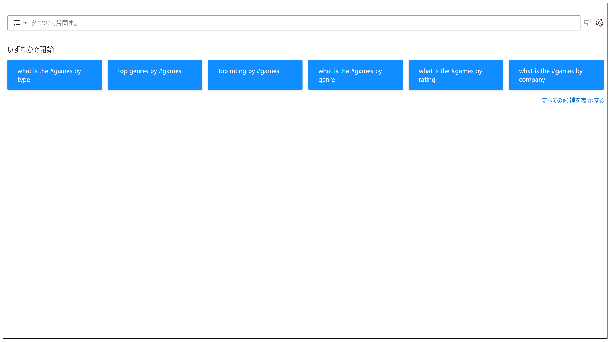
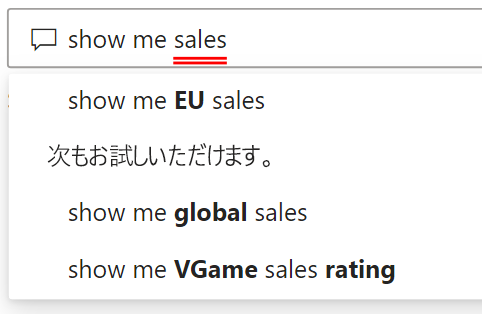
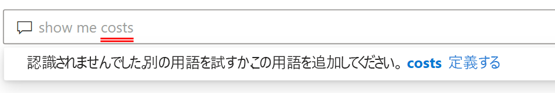
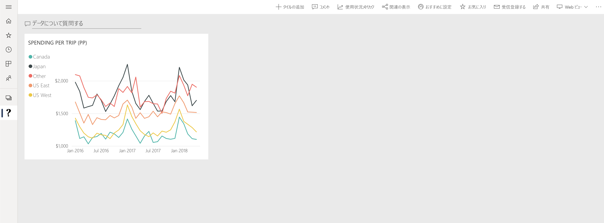

# Power BI Q&A の概要

場合によって、自分のデータから回答を得る最も速い方法は、自然言語を使用してデータを検索することです。 Power BI の Q&A 機能では、自然言語を使用して自分の言葉で自分のデータを探索することができます。 Q&A は対話型で、楽しく行えます。 視覚化によってさらに調べるべき点が見つかるため、多くの場合は 1 つの質問が他の質問につながります。 質問をすることは、始まりにすぎません。 自分のデータを探索する場合は、質問を調整または拡張したり、新しい情報を明らかにしたり、詳しい情報に的を絞ったり、ズームアウトしてより広い視野を得たりすることができます。 エクスペリエンスは対話型で高速であり、メモリ内ストレージが利用されています。 

Power BI Q&A は無料で、すべてのユーザーが利用できます。 Power BI Desktop では、レポート デザイナーは Q&A を使用してデータを探索し、視覚エフェクトを作成できます。 Power BI サービスでは、すべてのユーザーが Q&A を使用して自分のデータを探索できます。 ダッシュボードまたはレポートを編集するためのアクセス許可を持っている場合は、自分の Q&A の結果をピン留めすることもできます。

## Q&A の使用法

入力を開始する前に、Q & A で質問を作るときに役立つ情報が新しい画面に表示されます。 提案された質問のいずれかから開始するか、または独自の質問を入力します。 Q&A では、次のような (ただし、これに限定されない) 幅広い質問がサポートされています。

- **自然な質問をする** どの売上が最も高い収益を上げていますか?
- **相対日付フィルターを使用する** 過去 1 年間の売上を表示
- **上位 N 件のみを返す** 売上高上位 10 の製品
- **フィルターを指定する** 米国での売上を表示
- **複雑な条件を指定する** 製品カテゴリがカテゴリ 1 またはカテゴリ 2 の売上を表示
- **特定のビジュアルを返す** 製品別の売上を円グラフとして表示してください
- **複雑な集計を使用する** 製品別の売上の中央値を表示
- **結果を並べ替える** 売上高上位 10 か国を国コードで並べ替えて表示
- **データを比較する** 売上合計と総コストの日付を表示
- **傾向を表示する** 時間の経過と共に売上を表示

### オートコンプリート

質問を入力すると、Power BI によって Q&A に関連する文脈上の提案が表示されるため、自然言語ですぐに生産性を高めることができます。 入力すると、すぐにフィードバックと結果が得られます。 このエクスペリエンスは、検索エンジンでの入力に似ています。

### 赤/青の下線

Q&A では、下線付きの単語が表示されるので、システムが認識した単語または認識しなかった単語を容易に確認できます。 青い実線の下線は、システムによってデータモデル内のフィールドまたは値と単語が正常に照合されたことを示します。 次の例は、*EU Sales* という単語が Q&A によって認識されたことを示しています。

多くの場合、Q&A に単語を入力すると、赤い下線でマークされます。 赤い下線は、潜在的な 2 つの問題のいずれかを示している可能性があります。 1 番目の種類の問題は、"*低信頼度*" として分類されます。 不明瞭な、またはあいまいな単語を入力すると、フィールドに赤色の下線が表示されます。 例として、"Sales" という単語が挙げられます。 複数のフィールドに "Sales" という語が含まれている可能性があるので、赤い下線が表示され、目的のフィールドを選択するようにシステムから求められます。 低信頼度の別の例として、"area" という単語を入力しても、一致する列が "region" である場合が挙げられます。 Bing および Office との統合により、Power BI Q&A では、同じことを意味する単語も認識されます。 Q&A によって単語に赤の下線が付けられているので、直接一致していないことがわかります。

2 番目の種類の問題は、Q&A によって単語がまったく認識されない場合です。 データのどこにも記述されていないドメイン固有の用語を使用したり、データ フィールドの名前が間違っていたりすると、この問題が発生する可能性があります。 例として、データ内のどこにも存在しない "Costs" という言葉を使用した場合が挙げられます。 この単語は英語の辞書に載っていますが、Q&A ではこの用語に赤い下線が付けられます。

> [!NOTE]
> 青/赤の下線の色は、Q&A の **[Visual formatting]\(ビジュアルの書式設定\)** ウィンドウでカスタマイズできます。 また、[Q&A ツール](q-and-a-tooling-teach-q-and-a.md)に関する記事には、Q&A で認識されなかった用語を定義する場合に使用する "*Q&A トレーニング*" について説明されています。

### 視覚化の結果

質問を入力すると、Q&A では即座に回答を解釈して視覚化することが試みられます。 最新の更新の一環として、Q&A では質問を解釈し、フィールドを適切な軸に自動的にプロットすることが試みられるようになりました。 たとえば、「Sales by year」(年間売上) と入力すると、Q&A では year が日付フィールドであることが検出され、このフィールドを X 軸に配置することが常に優先されます。 視覚エフェクトの種類を変更する場合は、質問の後に「as *chart type*」(グラフの種類として) と入力します。 Q&A では、現在、次の種類の視覚エフェクトがサポートされています。

- 折れ線グラフ
- 横棒グラフ
- マトリックス
- Table
- カード
- 面
- 円グラフ
- 散布図/バブル チャート
 

## Q&A をレポートに追加する

Power BI Desktop または Power BI サービスでは次の 2 通りの方法でレポートに Q&A を追加できます。

- Q&A ビジュアルを追加します。
- Q&A ボタンを追加します。

Q&A ビジュアルをレポートに追加するには、新しい **Q&A** アイコンを選択し、[視覚化] ウィンドウで新しい Q&A ビジュアルを選択します。 あるいは、レポート キャンバス上の任意の場所をダブルクリックして、Q&A ビジュアルを挿入します。

ボタンを追加するには、 **[ホーム]** リボンで、 **[ボタン]**  >  **[Q&A]** の順に選択します。Q&A ボタン イメージは完全にカスタマイズできます。

> [!NOTE]
> ボタンから Q&A を起動すると、古い Q&A が引き続き使用されます。 Power BI の後続のリリースでは、それが変更される予定です。

## ダッシュボードに Q&A を使用する

既定では、Q&A はダッシュボードの上部にあります。 Q&A を使用するには、 **[Ask a question on your data]\(データについて質問する\)** ボックスに入力します。

## 次のステップ

自然言語は、自分のレポートにさまざまな方法で統合できます。 詳細については、次の記事を参照してください。

* [Q&A ビジュアル](../visuals/power-bi-visualization-q-and-a.md)
* [Q&A ベスト プラクティス](q-and-a-best-practices.md)
