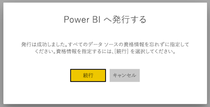
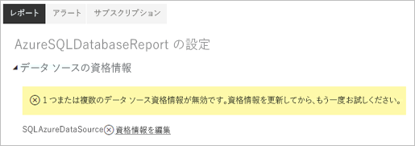
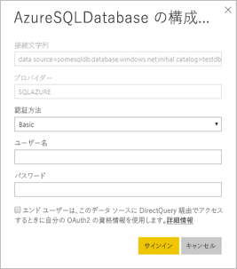

# Power BI のページ分割されたレポートでサポートされるデータ ソース

この記事では、Power BI サービスのページ分割されたレポートでサポートされるデータ ソースについて、および Azure SQL Database データ ソースに接続する方法について詳しく説明します。 一部のデータ ソースはネイティブでサポートされています。 データ ゲートウェイを介してその他に接続することができます。

## ネイティブでサポートされているデータ ソース

ページ分割されたレポートでは、次のデータ ソースの一覧をネイティブでサポートします。

| データ ソース | 認証 | ノート |
| --- | --- | --- |
| Azure SQL Database  Azure SQL Data Warehouse | 基本、シングル サインオン (SSO)、OAuth2 |   |
| Azure SQL Managed Instance | 基本 | Azure SQL Database 拡張機能を使用したパブリック エンドポイント経由  |
| Azure Analysis Services | SSO、OAuth2 |   |
| Power BI データセット | SSO | Premium と Premium 以外の Power BI データセット |
| Premium Power BI データセット (XMLA) | SSO |   |
| データの入力 | 該当なし | データはレポートに埋め込まれます。 |

Azure SQL Database を除き、データ ソースはすべて、Power BI サービスにレポートをアップロードした後に使用できるようになります。 データ ソースは、既定でシングル サインオン (SSO) を使用するように設定されています (該当する場合)。 Azure Analysis Services では、認証の種類を OAuth2 に変更できます。

Azure SQL Database データ ソースについては、「[Azure SQL Database Authentication](#azure-sql-database-authentication)」(Azure SQL Database 認証) セクションで説明されているように、詳細情報を指定する必要があります。

## その他のデータ ソース

上記のネイティブでサポートされているデータ ソースに加えて、[Power BI データ ゲートウェイ](service-gateway-onprem.md)を介して次のデータ ソースにアクセスできます。

- SQL Server
- SQL Server Analysis Services
- Oracle
- Teradata

ページ分割されたレポートでは、現在、Azure SQL Database と Azure Analysis Services には、Power BI データ ゲートウェイを介してアクセスできます。

## Azure SQL Database 認証

Azure SQL Database データ ソースの場合は、レポートを実行する前に、認証の種類を設定する必要があります。 これは、ワークスペースで最初にデータ ソースを使用するときにのみ適用されます。 最初に、次のメッセージが表示されます。

資格情報を指定しない場合、レポートの実行時にエラーが発生します。 **[続行]** を選択して、アップロードしたレポートの **[データ ソースの資格情報]** ページに移動します。

特定のデータ ソースの **[資格情報の編集]** リンクを選択すると、 **[構成]** ダイアログ ボックスが表示されます。

Azure SQL Database データ ソースの場合、サポートされている認証の種類は次のとおりです。

- 基本 (ユーザー名とパスワード)
- SSO (シングル サインオン)
- OAuth2 (格納された AAD トークン)

SSO と OAuth2 を正常に機能させるには、データ ソースが接続している Azure SQL Database サーバーで [AAD 認証サポートを有効にする](https://docs.microsoft.com/azure/sql-database/sql-database-aad-authentication-configure)必要があります。 OAuth2 認証方法では、AAD によってトークンが生成され、今後のデータ ソース アクセスのために格納されます。 代わりに [SSO 認証方法](https://docs.microsoft.com/power-bi/service-azure-sql-database-with-direct-connect#single-sign-on)を使用するには、そのすぐ下の SSO オプション **[エンド ユーザーは、このデータ ソースに DirectQuery 経由でアクセスするときに、独自の OAuth2 資格情報を使用します。]** を選択します。
  
## 次の手順

[ページ分割されたレポートを Power BI サービスで表示する](paginated-reports-view-power-bi-service.md)

他にわからないことがある場合は、 [Power BI コミュニティを利用してください](http://community.powerbi.com/)。
