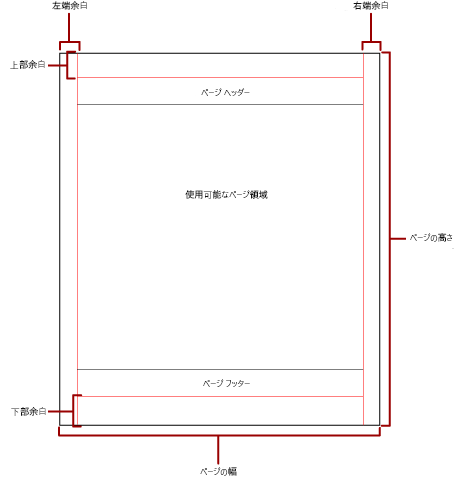
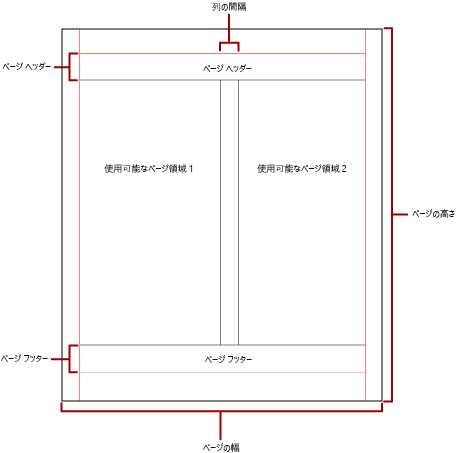

# Power BI のページ分割されたレポートでの改ページ

 改ページは、レポート内のページ数と、これらのページでのレポート アイテムの配置方法を表します。 Power BI のページ分割されたレポートの改ページは、レポートの表示と配信に使用する表示拡張機能によって異なります。 レポート サーバーでレポートを実行すると、レポートには HTML レンダラーが使用されます。 HTML には、特定の改ページ規則のセットが適用されます。 たとえば、同じレポートを PDF にエクスポートすると、PDF レンダラーが使用され、別の規則セットが適用されます。そのため、レポートは異なる方法で改ページされます。 レポートの配信に使用しようとしているレンダラー用に最適化された、ユーザーにとって読みやすいレポートをデザインするには、Power BI のページ分割されたレポートで改ページを制御するための規則を理解しておく必要があります。  
  
 このトピックでは、強制改ページ レンダラーによるレポートのレンダリング方法に対する、物理ページ サイズとレポート レイアウトの影響について説明します。 プロパティを設定することで、物理ページ サイズと余白を変更したり、レポートを列に分割したりできます。これには、 **[レポートのプロパティ]** ペイン、 **[プロパティ]** ペイン、または **[ページ設定]** ダイアログ ボックスを使用します。 **[レポートのプロパティ]** ペインにアクセスするには、レポート本文の外側の青い領域をクリックします。 **[ページ設定]** ダイアログ ボックスにアクセスするには、[ホーム] タブの **[実行]** をクリックし、[実行] タブの **[ページ設定]** をクリックします。  
  
> [!NOTE]  
>  レポートを 1 ページの幅になるようにデザインしたのに、そのレポートが複数のページにわたって表示される場合は、余白を含めたレポート本文の幅が、物理ページ サイズの幅よりも大きくないことを確認してください。 空のページがレポートに追加されないようにするには、コンテナーの隅を左にドラッグして、コンテナーのサイズを小さくします。  

## レポート本文  
 レポート本文は、デザイン画面上に空白として表示される四角形のコンテナーです。 その中に含まれるレポート アイテムに合わせて拡大したり縮小したりすることができます。 レポート本文に物理ページ サイズは反映されません。実際、レポート本文は、物理ページ サイズの境界を越えて、複数のレポート ページにまたがることがあります。 Microsoft Excel、Word、HTML、MHTML など、一部のレンダラーでは、ページの内容に応じて拡大または縮小するレポートがレンダリングされます。 これらの形式でレンダリングされるレポートは、画面ベースでの (たとえば Web ブラウザーでの) 表示用に最適化されています。 これらのレンダラーでは、必要に応じて垂直方向の改ページが追加されます。  
  
 レポート本文の書式を設定するには、罫線の色、罫線のスタイル、および罫線の幅を指定します。 背景色と背景画像を追加することもできます。  
  
## 物理ページ  
 物理ページ サイズとは、用紙サイズです。 レポートに対して指定した用紙サイズによって、レポートのレンダリング方法が制御されます。 強制改ページ形式でレンダリングされるレポートには、物理ページ サイズに基づいて水平方向および垂直方向に改ページが挿入されるため、強制改ページ ファイル形式で印刷または表示されたときに、読みやすさが最適化されます。 ソフト改ページ形式でレンダリングされるレポートでは、Web ブラウザーで表示したときに読みやすさが最適化されるように、物理サイズに基づいて水平方向に改ページが挿入されます。  
  
 既定では、ページ サイズは 8.5 x 11 インチですが、このサイズは、 **[レポートのプロパティ]** ペインまたは **[ページ設定]** ダイアログ ボックスで、または **[プロパティ]** ペインで PageHeight プロパティと PageWidth プロパティを変更することで、変更できます。 ページ サイズは、レポート本文の内容に合わせて拡大または縮小されません。 レポートを 1 ページに表示されるようにする場合は、レポート本文のすべての内容が物理ページ内に収まる必要があります。 収まらない場合、強制改ページ形式を使用すると、レポートに追加のページが必要になります。 レポート本文が物理ページの右端からはみ出た場合、水平方向に改ページが挿入されます。 レポート本文が物理ページの下端からはみ出た場合、垂直方向に改ページが挿入されます。  
  
 レポートに定義されている物理ページ サイズをオーバーライドする場合は、レポートのエクスポートに使用している特定のレンダラーの [デバイス情報] 設定を使用して、物理ページ サイズを指定できます。 完全な一覧については、SQL Server Reporting Services ドキュメントの「[表示拡張機能のデバイス情報設定](https://docs.microsoft.com/sql/reporting-services/device-information-settings-for-rendering-extensions-reporting-services?view=sql-server-2017)」を参照してください。  
  
### 余白

 余白は、物理ページ寸法の端から内側に、指定した余白設定まで描画されます。 レポート アイテムが余白領域にはみ出した場合は、余白に重なった領域がレンダリングされないようにクリッピングされます。 ページの水平方向または垂直方向の幅がゼロになるように余白のサイズを指定した場合、余白の設定は既定で 0 に設定されます。 余白は、 **[レポートのプロパティ]** ペインまたは **[ページ設定]** ダイアログボックスで指定するか、 **[プロパティ]** ペインで TopMargin、BottomMargin、LeftMargin、RightMargin の各プロパティを変更して指定します。 レポートに定義されている余白サイズをオーバーライドする場合は、レポートのエクスポートに使用している特定のレンダラーのデバイス情報設定を使用して、余白サイズを指定できます。  
  
 余白、列の間隔、およびページ ヘッダーとページ フッターの領域が割り当てられた後に残っている物理ページの領域は、"*使用可能なページ領域*" と呼ばれます。 余白は、強制改ページ レンダラー形式でレポートをレンダリングおよび印刷する場合にのみ適用されます。 次の図は、物理ページの余白と使用可能なページ領域を示しています。  
  
 
  
### ニュースレター形式の列  

 新聞の列のように、レポートを複数の列に分割することができます。 列は、同じ "*論理*" ページ上にレンダリングされる "*物理*" ページとして扱われます。 これらは左から右、上から下に配置され、各列の間は空白で区切られます。 レポートが複数の列に分割されている場合は、各物理ページが垂直方向の列に分割され、各列が論理ページと見なされます。 たとえば、物理ページに 2 つの列があるとします。 レポートの内容が最初の列に入力され、次に 2 番目の列に入力されます。 レポート全体が最初の 2 つの列に収まらない場合は、次のページの最初の列と 2 番目の列にレポートが入力されます。 すべてのレポート アイテムがレンダリングされるまで、列は左から右、上から下に入力されていきます。 水平方向または垂直方向の幅が 0 になるように列のサイズを指定した場合、列の間隔は既定で 0 に設定されます。  
  
 列は、 **[レポートのプロパティ]** ペインまたは **[ページ設定]** ダイアログ ボックスで指定するか、 **[プロパティ]** ペインで TopMargin、BottomMargin、LeftMargin、RightMargin の各プロパティを変更して指定します。 定義されていない余白サイズを使用する場合は、レポートのエクスポート先である特定のレンダラーの [デバイス情報] 設定を使用して、余白サイズを指定できます。 列が適用されるのは、レポートを PDF 形式または画像形式でレンダリングおよび印刷する場合のみです。 次の図は、列を含むページの使用可能なページ領域を示しています。  
  

  
## 改ページとページ名

 レポートにページ名を付けると、レポートがさらに読みやすくなり、データの監査とエクスポートが容易になります。 Reporting Services には、レポートのためのプロパティが用意されています。テーブル、マトリックス、リストのデータ領域、グループ、レポート内の四角形を使用して、改ページ位置の自動修正、ページ番号のリセット、および改ページでの新しいレポート ページ名の指定を行うことができます。 これらの機能を使用すると、レポートの表示形式に関係なくレポートを強化できますが、Excel ブックにレポートをエクスポートする場合は特に便利です。

> [!NOTE]
> テーブル、マトリックス、およびリストの各データ領域はすべて、実際は *Tablix* という同じ種類のデータ領域です。 そのため、その名前を目にする場合があります。 

 InitialPageName プロパティでは、レポートの最初のページ名を指定します。 レポートに改ページのページ名が含まれていない場合は、改ページによって作成されるすべての新しいページに最初のページ名が使用されます。 必ずしも最初のページ名を使用する必要はありません。  
  
 レンダリングされたレポートで改ページによって発生する新しいページに、新しいページ名を指定できます。 ページ名を指定するには、テーブル、マトリックス、リスト、グループ、または四角形の PageName プロパティを設定します。 改ページでページ名を指定することは、必ずしも必要ではありません。 それをしなかった場合、InitialPageName の値が代わりに使用されます。 InitialPageName も空白の場合、新しいページには名前がありません。  
  
 テーブル、マトリックス、およびリストのデータ領域、グループ、四角形では、改ページがサポートされています。  
  
 改ページには、次のプロパティが含まれています。  
  
- **BreakLocation** では、改ページが有効なレポート要素の改ページ位置 (先頭、末尾、または先頭と末尾) を指定します。 グループでは、BreakLocation をグループ間に配置できます。  
  
- **Disabled** では、改ページをレポート要素に適用するかどうかを示します。 このプロパティが True に評価された場合、改ページは無視されます。 このプロパティは、レポートの実行時に、改ページを式に基づいて動的に無効にするために使用されます。  
  
- **ResetPageNumber** では、改ページが発生したときにページ番号を 1 にリセットするかどうかを示します。 このプロパティが True に評価された場合、ページ番号はリセットされます。  
  
 BreakLocation プロパティは **[Tablix のプロパティ]** 、 **[四角形のプロパティ]** 、または **[グループのプロパティ]** ダイアログ ボックスで設定できますが、Disabled、ResetPageNumber、PageName の各プロパティは、レポート ビルダーの [プロパティ] ペインで設定する必要があります。 [プロパティ] ペインのプロパティがカテゴリ別に分類されている場合、これらのプロパティは、 **[PageBreak]** カテゴリに表示されます。 グループの場合、 **[PageBreak]** カテゴリは **[Group]** カテゴリ内にあります。  
  
 定数と単純な式または複雑な式を使用して、Disabled プロパティと ResetPageNumber プロパティの値を設定できます。 ただし、式を BreakLocation プロパティと共に使用することはできません。 式の記述と使用の詳細については、「[Power BI レポート ビルダーでの式](report-builder-expressions.md)」を参照してください。  
  
 レポートでは、**Globals** コレクションを使用して、現在のページ名またはページ番号を参照する式を作成できます。 詳細については、レポート ビルダーと Reporting Services のドキュメントで「[組み込み Globals および Users 参照](https://docs.microsoft.com/sql/reporting-services/report-design/built-in-collections-built-in-globals-and-users-references-report-builder?view=sql-server-2017)」を参照してください。
  
### Excel ワークシート タブの名前付け

 これらのプロパティは、Excel ブックにレポートをエクスポートするときに便利です。 レポートをエクスポートするときにワークシート タブ名の既定の名前を指定するには、InitialPage プロパティを使用します。また、各ワークシートに異なる名前を指定するには、改ページと PageName プロパティを使用します。 改ページによって定義された新しい各レポート ページは、PageName プロパティの値によって名前が指定された別のワークシートにエクスポートされます。 PageName が空白でも、レポートに最初のページ名がある場合、Excel ブックのすべてのワークシートで同じ名前 (最初のページ名) が使用されます。  
  
 レポートを Excel にエクスポートするときのこれらのプロパティの動作の詳細については、レポート ビルダーと Reporting Services のドキュメントで「[Microsoft Excel へのエクスポート](https://docs.microsoft.com/sql/reporting-services/report-builder/exporting-to-microsoft-excel-report-builder-and-ssrs?view=sql-server-2017)」を参照してください。  
  
## 次の手順

[ページ分割されたレポートを Power BI サービスで表示する](paginated-reports-view-power-bi-service.md)

他にわからないことがある場合は、 [Power BI コミュニティを利用してください](http://community.powerbi.com/)。
