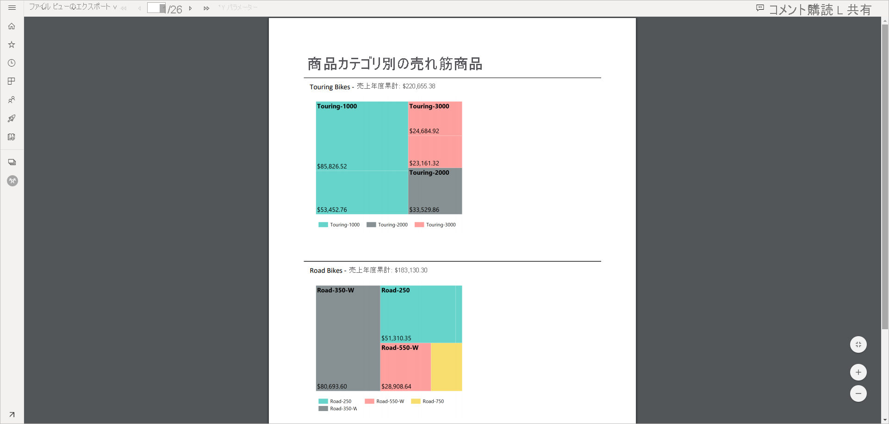
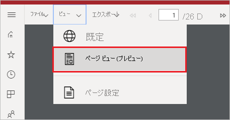

# Power BI サービスでページ分割されたレポートのレポート ビューを設定する

Power BI サービスでページ分割されたレポートを表示する場合、既定のビューは HTML ベースで対話型になります。 PDF などの固定されたページ形式のためのもう一つのレポート ビューは、新しいページ ビュー オプションです。

**既定の対話型ビュー**

**ページ ビュー**

ページ ビューでは、表示されたレポートが既定のビューとは異なる外観になります。 ページ分割されたレポートの一部のプロパティと概念は、固定ページにのみ適用されます。 このビューは、レポートが印刷またはエクスポートされた場合と似ています。 パラメーター値など、一部の要素を引き続き変更できますが、列の並べ替えや切り替えなど、その他の対話機能は使用できません。

ページ ビューでは、拡大、縮小、ページに合わせるなど、ブラウザーの PDF ビューアーでサポートされているすべての機能がサポートされています。

## ページ ビューに切り替える

ページ分割されたレポートを開くと、既定では対話型ビューで表示されます。 レポートにパラメーターが含まれている場合は、パラメーターを選択してからレポートを表示します。

1. ツール バーで **[ビュー]** > **[ページ ビュー]** の順に選択します。

    

2. ページ ビューの設定を変更するには、ツール バーの **[ビュー]** メニューから **[ページ設定]** を選択します。 

    ![[ページ設定] を選択する](media/page-view/power-bi-paginated-page-settings-dropdown.png)
    
    **[ページ設定]** ダイアログ ボックスには、ページ ビューの**ページ サイズ**と**向き**を設定するためのオプションが含まれています。 ページ設定を適用すると、後でそのページを印刷するときにも同じオプションが適用されます。
   
    ![[ページ設定] ダイアログ ボックス](media/page-view/power-bi-paginated-page-settings-dialog.png)

3. 対話型ビューに戻るには、 **[ビュー]** ドロップダウン ボックスから **[既定値]** を選択します。

## ブラウザーのサポート

ページ ビューは Google Chrome と Microsoft Edge ブラウザーでサポートされています。 ブラウザーで PDF の表示が有効になっていることを確認してください。 これは、これらのブラウザーの既定の設定です。

ページ ビューは Internet Explorer と Safari ではサポートされていないため、このオプションは無効になります。 また、これはモバイル デバイスのブラウザーや、ネイティブな Power BI モバイル アプリでもサポートされていません。  

## 次の手順

- [ページ分割されたレポートを Power BI サービスで表示する](../consumer/paginated-reports-view-power-bi-service.md)
- [Power BI Premium のページ分割されたレポートとは](paginated-reports-report-builder-power-bi.md)
