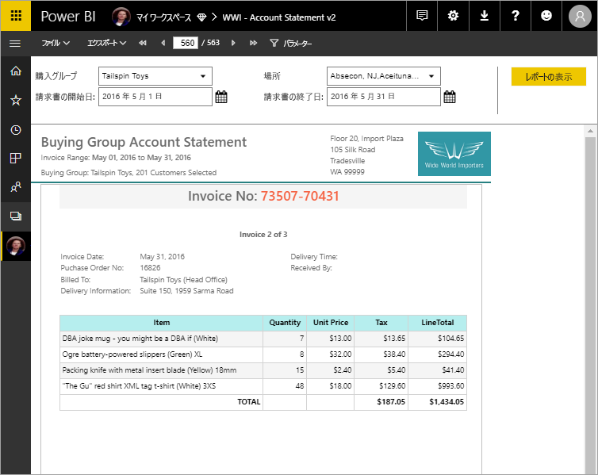

# Power BI Premium のページ分割されたレポートとは

ページ分割されたレポート (SQL Server Reporting Services での標準レポート形式) を、Power BI サービスで使用できるようになりました。 これらのレポートは印刷または共有できます。 これらは、1 ページにちょうど収まるように設定されているため "ページ分割された" と呼ばれます。 テーブルが複数のページにまたがる場合でも、テーブルのすべてのデータが表示されます。 レポート ページのレイアウトを厳密に制御できるため、"ピクセル単位で完璧" と呼ばれることもあります。 ページ分割されたレポートは、SQL Server Reporting Services の RDL レポート テクノロジに基づいています。 レポート ビルダーは、ページ分割されたレポートを作成するためのスタンドアロン ツールです。 

ページ分割されたレポートは、多くのページを含むことができます。 たとえば、このレポートは 563 ページです。 請求書ごとに 1 ページが使用されて、ヘッダーとフッターが繰り返されるように、各ページが正確にレイアウトされています。

「[ハンズオン ラボ: Microsoft Power BI のページ分割されたレポートを作成する](https://www.microsoft.com/handsonlabs/selfpacedlabs/details/SQ00208)」をお試しください。

レポート ビルダーでレポートをプレビューした後、Power BI サービス (https://app.powerbi.com ) に発行することができます。 サービスにレポートを発行するには、Power BI Pro ライセンスが必要です。 ワークスペースが Power BI Premium 容量に存在する限り、マイ ワークスペースまたはワークスペースにページ分割されたレポートを発行して共有できます。 また、Power BI 管理者は、Power BI 管理ポータルの [Premium 容量セクション](../service-admin-premium-workloads.md#paginated-reports)で、ページ分割されたレポートを有効にする必要があります。 

## Power BI レポート ビルダーでレポートを作成する

ページ分割されたレポートには、専用のデザイン ツールである Power BI レポート ビルダーがあります。 それは新しいツールで、Power BI Report Server または SQL Server Reporting Services (SSRS) のページ分割されたレポートの作成にこれまで使われていたツールと同じ基盤を共有します。 実際、SSRS 2016 や 2017 または Power BI Report Server オンプレミス用に作成したページ分割されたレポートは、Power BI サービスと互換性があります。 Power BI サービスは下位互換性が維持されているので、レポートを上位バージョンに移行でき、以前のバージョンのページ分割されたレポートをアップグレードすることができます。 起動時は一部のレポート機能が利用できません。 詳細については、この記事の「[制限事項と考慮事項](#limitations-and-considerations)」を参照してください。
     
## さまざまなデータ ソースからのレポート

1 つのページ分割されたレポートで、さまざまな異なるデータ ソースを使用できます。 Power BI レポートとは異なり、基になるデータ モデルはありません。 Power BI サービスでのページ分割されたレポートの初期リリースでは、レポート自体にデータ ソースとデータセットを埋め込みます。 現在のところ、共有データ ソースと共有データセットは使用できません。 ローカル コンピューター上のレポート ビルダーでレポートを作成します。 レポートでオンプレミスのデータに接続する場合は、レポートを Power BI サービスにアップロードした後、ゲートウェイを作成し、データ接続をリダイレクトする必要があります。 現時点で接続できるデータ ソースは次のとおりです。

- Azure SQL Database と Data Warehouse (Basic と oAuth 経由)
- Azure Analysis Services (SSO 経由)
- ゲートウェイ経由の SQL Server
- ゲートウェイ経由の SQL Server Analysis Services
- Power BI データセット
- Oracle
- Teradata

## レポートをデザインする  

### マトリックス、グラフ、および自由形式レイアウトでページ分割されたレポートを作成する

テーブル形式のレポートは、列ベースのデータで有効です。 クロス集計レポートやピボット テーブル レポートなどのマトリックス形式のレポートは、概要データに適しています。 グラフ形式のレポートはデータをグラフィカル形式で表示し、自由形式の "*リスト*" レポートは請求書などその他ほぼすべてのものを表示できます。 
  
いずれかのレポート ビルダー ウィザードを使用して始めることができます。 テーブル、マトリックス、およびグラフのウィザードでは、埋め込みデータ ソース接続と埋め込みデータセットを作成する手順が示されます。 その後、フィールドをドラッグ アンド ドロップしてデータセット クエリを作成し、レイアウトとスタイルを選択して、レポートをカスタマイズします。  
  
マップ ウィザードでは、地図や幾何図形を背景として集計データを表示するレポートを作成します。 マップ データには、Transact-SQL クエリまたは Environmental Systems Research Institute, Inc.(ESRI) シェープファイルの空間データを使用できます。 Microsoft Bing マップ タイルの背景を追加することもできます。  

### レポートにさらに追加する

データのフィルター処理、グループ化、並べ替えを行って、または数式や式を追加して、データを変更します。 グラフ、ゲージ、スパークライン、インジケーターを追加して、データをビジュアル形式でまとめます。  パラメーターとフィルターを使用し、データをフィルター処理してビューをカスタマイズします。 外部コンテンツなど、画像や他のリソースを埋め込んだり参照したりします。  

レポート自体からすべてのテキスト ボックス、画像、テーブル、グラフまで、ページ分割されたレポート内のすべてのものには、レポートの外観を意図したとおりに設定できる一連のプロパティがあります。

## レポート定義の作成

ページ分割されたレポートを設計するとき、実際には "*レポート定義*" を作成します。 それにデータは含まれません。 それでは、データを取得する場所、取得するデータ、データを表示する方法を指定します。 レポートを実行すると、指定したレポート定義がレポート プロセッサによって取得されて、データが取得され、レポートのレイアウトと組み合わせることでレポートが生成されます。 レポート定義は、Power BI サービス https://app.powerbi.com のマイ ワークスペースまたは同僚と共有しているワークスペースにアップロードします。 レポート データ ソースがオンプレミスにある場合は、レポートをアップロードした後、ゲートウェイを経由するようにデータ ソース接続をリダイレクトします。 

## ページ分割されたレポートを表示する
ページ分割されたレポートは、ブラウザーの Power BI サービスまたは Power BI モバイル アプリで表示します。 Power BI サービスから、HTML、MHTML、PDF、XML、CSV、TIFF、Word、Excel など、さまざまな形式にレポートをエクスポートできます。 他のユーザーと共有することもできます。  

## レポートへのサブスクリプションを作成する

Power BI サービスのページ分割されたレポートに対して自分および他のユーザー用の電子メール サブスクリプションを設定できるようになりました。 一般に、Power BI サービスのレポートおよびダッシュ ボードをサブスクライブする場合とプロセスは同じです。 サブスクリプションの設定時には、メールの受信頻度を次の中から選択します: 毎日、毎週、1 時間ごと。 サブスクリプションには、レポート出力全体の PDF 添付ファイルが含まれます。

詳しくは、記事「[Power BI サービスのページ分割されたレポートを自分および他のユーザーがサブスクライブする](../consumer/paginated-reports-subscriptions.md)」をご覧ください。 

## 制限事項と考慮事項

最初のリリースでは、次のような他のいくつかの機能がサポートされていません。

- レポート ページまたはビジュアルの Power BI ダッシュボードへのピン留め。 Power BI Report Server または Reporting Services のレポート サーバー上のオンプレミスのページ分割されたレポートから視覚エフェクトを Power BI ダッシュボードにピン留めすることは引き続き可能です。 詳しくは、[Reporting Services のアイテムの Power BI ダッシュボードへのピン留め](https://docs.microsoft.com/sql/reporting-services/pin-reporting-services-items-to-power-bi-dashboards)に関するページをご覧ください。
- ドキュメント マップ。
- サブレポートとドリルスルー レポート。  ただし、ドリルスルー シナリオを実現する目的で、URL パラメーターとページ分割されたレポートを使用することを検討できます。
- 共有データ ソースと共有データセット。

 
## 次の手順

- [Microsoft ダウンロード センターから Power BI レポート ビルダーをインストールする](https://go.microsoft.com/fwlink/?linkid=2086513)
- [チュートリアル: ページ分割されたレポートを作成する](paginated-reports-quickstart-aw.md)
- [ページ分割されたレポートに直接データを入力する](paginated-reports-enter-data.md)
- [ハンズオン ラボ: Microsoft Power BI のページ分割されたレポートを作成する](https://www.microsoft.com/handsonlabs/selfpacedlabs/details/SQ00208)
- [チュートリアル: 顧客向けのアプリケーションに Power BI のページ分割されたレポートを埋め込む](../developer/embed-paginated-reports-customers.md)。